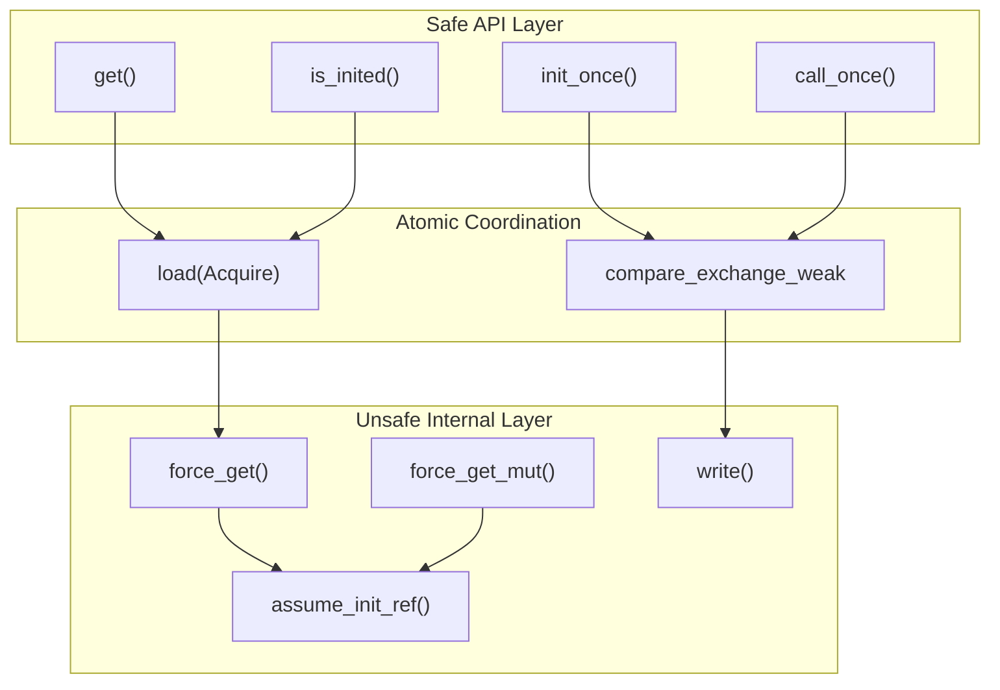
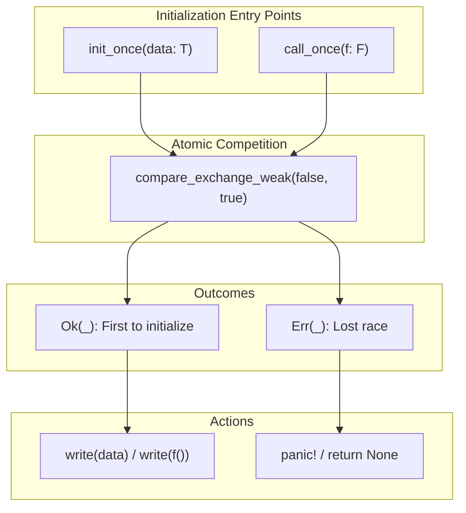
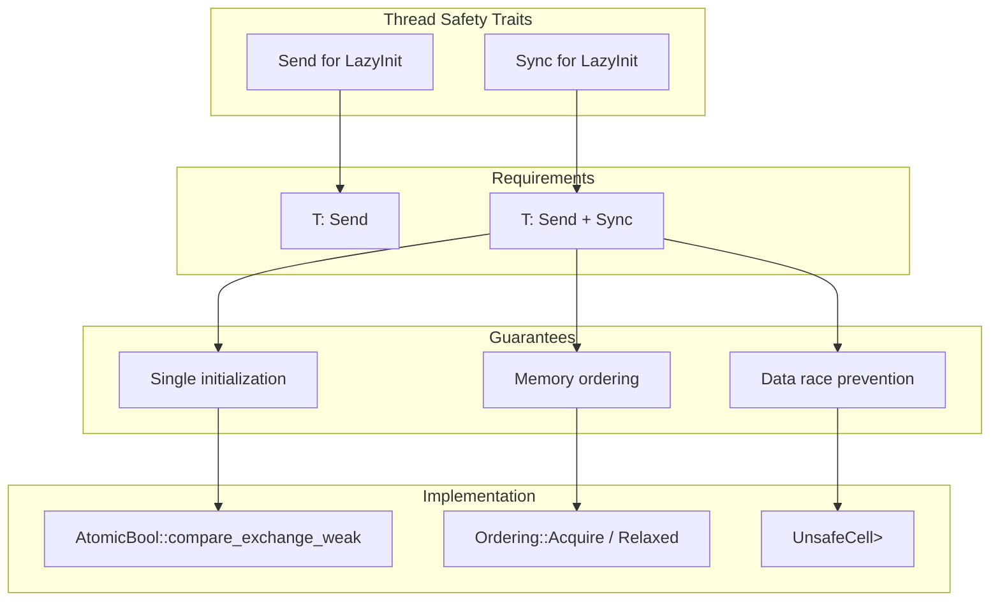
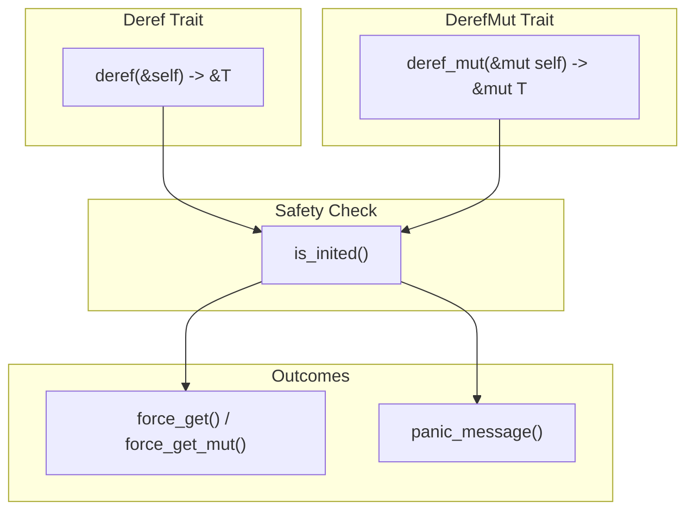
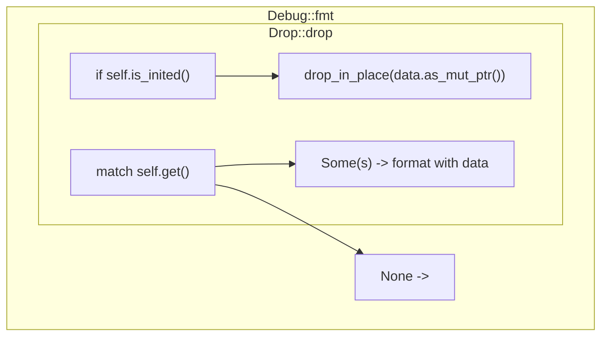

# LazyInit Implementation

> **Relevant source files**
> * [README.md](https://github.com/arceos-org/lazyinit/blob/380d6b07/README.md)
> * [src/lib.rs](https://github.com/arceos-org/lazyinit/blob/380d6b07/src/lib.rs)

This document provides a comprehensive analysis of the `LazyInit<T>` struct implementation, covering its internal architecture, state management, and the mechanisms that enable thread-safe lazy initialization. This page focuses on the core implementation details and design decisions.

For specific API documentation and method signatures, see [API Reference](/arceos-org/lazyinit/2.1-api-reference). For detailed thread safety mechanisms and memory ordering, see [Thread Safety & Memory Model](/arceos-org/lazyinit/2.2-thread-safety-and-memory-model). For practical usage examples and patterns, see [Usage Patterns & Examples](/arceos-org/lazyinit/2.3-usage-patterns-and-examples).

## Core Architecture

The `LazyInit<T>` struct implements thread-safe lazy initialization through a two-field design that separates state tracking from data storage. The implementation leverages atomic operations and unsafe memory management to achieve both safety and performance.

### Struct Layout

```mermaid
flowchart TD
subgraph subGraph2["Data Storage"]
    E["MaybeUninit<T>::uninit()"]
    F["MaybeUninit<T>::init(value)"]
end
subgraph subGraph1["State Tracking"]
    C["false = Uninitialized"]
    D["true = Initialized"]
end
subgraph LazyInit&lt;T&gt;["LazyInit<T>"]
    A["inited: AtomicBool"]
    B["data: UnsafeCell<MaybeUninit<T>>"]
end

A --> C
A --> D
B --> E
B --> F
C --> D
E --> F
```

The `inited` field serves as the synchronization point for all threads, while `data` provides the actual storage location. This separation allows atomic state transitions independent of the data type `T`.

**Sources:** [src/lib.rs(L14 - L17)&emsp;](https://github.com/arceos-org/lazyinit/blob/380d6b07/src/lib.rs#L14-L17)

### Memory Safety Guarantees

The implementation achieves memory safety through careful coordination of atomic operations and unsafe memory access:



All unsafe operations are gated behind atomic checks that ensure the data has been properly initialized before access.

**Sources:** [src/lib.rs(L36 - L47)&emsp;](https://github.com/arceos-org/lazyinit/blob/380d6b07/src/lib.rs#L36-L47) [src/lib.rs(L53 - L67)&emsp;](https://github.com/arceos-org/lazyinit/blob/380d6b07/src/lib.rs#L53-L67) [src/lib.rs(L77 - L83)&emsp;](https://github.com/arceos-org/lazyinit/blob/380d6b07/src/lib.rs#L77-L83) [src/lib.rs(L118 - L126)&emsp;](https://github.com/arceos-org/lazyinit/blob/380d6b07/src/lib.rs#L118-L126)

## State Machine

The `LazyInit<T>` implementation follows a simple but robust state machine with three logical states:

```mermaid
stateDiagram-v2
[*] --> Uninitialized : "new()"
Uninitialized --> InitInProgress : "init_once() / call_once()"
InitInProgress --> Initialized : "compare_exchange success"
InitInProgress --> Uninitialized : "compare_exchange failure"
Initialized --> [*] : "drop()"
note left of Uninitialized : ['inited = false<br>data = MaybeUninit::uninit()']
note left of InitInProgress : ['Transient state during<br>compare_exchange_weak operation']
note left of Initialized : ['inited = true<br>data = valid T instance']
```

The state machine ensures that once initialization succeeds, the instance remains in the `Initialized` state for its entire lifetime. The transient `InitInProgress` state handles race conditions between multiple initializing threads.

**Sources:** [src/lib.rs(L24 - L29)&emsp;](https://github.com/arceos-org/lazyinit/blob/380d6b07/src/lib.rs#L24-L29) [src/lib.rs(L37 - L39)&emsp;](https://github.com/arceos-org/lazyinit/blob/380d6b07/src/lib.rs#L37-L39) [src/lib.rs(L57 - L59)&emsp;](https://github.com/arceos-org/lazyinit/blob/380d6b07/src/lib.rs#L57-L59) [src/lib.rs(L177 - L181)&emsp;](https://github.com/arceos-org/lazyinit/blob/380d6b07/src/lib.rs#L177-L181)

## Method Categories

The `LazyInit<T>` API is organized into distinct categories based on functionality and safety guarantees:

|Category|Methods|Safety|Purpose|
| --- | --- | --- | --- |
|Construction|new(),default()|Safe|Create uninitialized instances|
|Initialization|init_once(),call_once()|Safe|Perform one-time initialization|
|State Inspection|is_inited()|Safe|Check initialization status|
|Safe Access|get(),get_mut()|Safe|Access with runtime checks|
|Direct Access|deref(),deref_mut()|Safe but panics|Transparent access toT|
|Unsafe Access|get_unchecked(),get_mut_unchecked()|Unsafe|Performance-critical access|
|Internal|force_get(),force_get_mut()|Private unsafe|Implementation details|

### Initialization Methods



Both initialization methods use the same atomic compare-exchange operation but handle initialization failure differently - `init_once()` panics while `call_once()` returns `None`.

**Sources:** [src/lib.rs(L36 - L47)&emsp;](https://github.com/arceos-org/lazyinit/blob/380d6b07/src/lib.rs#L36-L47) [src/lib.rs(L53 - L67)&emsp;](https://github.com/arceos-org/lazyinit/blob/380d6b07/src/lib.rs#L53-L67)

## Thread Safety Implementation

The thread safety of `LazyInit<T>` relies on the atomic `inited` flag and proper memory ordering:



The `unsafe impl` blocks for `Send` and `Sync` establish the thread safety contract, requiring appropriate bounds on the contained type `T`.

**Sources:** [src/lib.rs(L19 - L20)&emsp;](https://github.com/arceos-org/lazyinit/blob/380d6b07/src/lib.rs#L19-L20) [src/lib.rs(L37 - L39)&emsp;](https://github.com/arceos-org/lazyinit/blob/380d6b07/src/lib.rs#L37-L39) [src/lib.rs(L70 - L72)&emsp;](https://github.com/arceos-org/lazyinit/blob/380d6b07/src/lib.rs#L70-L72)

## Trait Implementations

The `LazyInit<T>` struct implements several standard traits to provide ergonomic usage:

### Deref and DerefMut Implementation



The `Deref` implementations enable transparent access to the wrapped value using the `*` operator, with runtime panics for uninitialized access.

**Sources:** [src/lib.rs(L153 - L174)&emsp;](https://github.com/arceos-org/lazyinit/blob/380d6b07/src/lib.rs#L153-L174) [src/lib.rs(L128 - L133)&emsp;](https://github.com/arceos-org/lazyinit/blob/380d6b07/src/lib.rs#L128-L133)

### Debug and Drop Implementation

The `Debug` implementation provides meaningful output for both initialized and uninitialized states, while `Drop` ensures proper cleanup of initialized values:



**Sources:** [src/lib.rs(L136 - L144)&emsp;](https://github.com/arceos-org/lazyinit/blob/380d6b07/src/lib.rs#L136-L144) [src/lib.rs(L176 - L182)&emsp;](https://github.com/arceos-org/lazyinit/blob/380d6b07/src/lib.rs#L176-L182)

## Performance Considerations

The implementation includes several performance optimizations:

1. **`compare_exchange_weak`** - Uses the weak variant for better performance on architectures where it matters
2. **Inline annotations** - Critical path methods are marked `#[inline]` for optimization
3. **Minimal overhead** - Only two words of storage overhead regardless of `T`
4. **Fast path optimization** - Post-initialization access is a simple atomic load followed by unsafe dereference

The `get_unchecked()` methods provide a performance escape hatch for scenarios where the initialization state is guaranteed by external logic.

**Sources:** [src/lib.rs(L37 - L39)&emsp;](https://github.com/arceos-org/lazyinit/blob/380d6b07/src/lib.rs#L37-L39) [src/lib.rs(L101 - L105)&emsp;](https://github.com/arceos-org/lazyinit/blob/380d6b07/src/lib.rs#L101-L105) [src/lib.rs(L112 - L116)&emsp;](https://github.com/arceos-org/lazyinit/blob/380d6b07/src/lib.rs#L112-L116) [src/lib.rs(L118 - L126)&emsp;](https://github.com/arceos-org/lazyinit/blob/380d6b07/src/lib.rs#L118-L126)