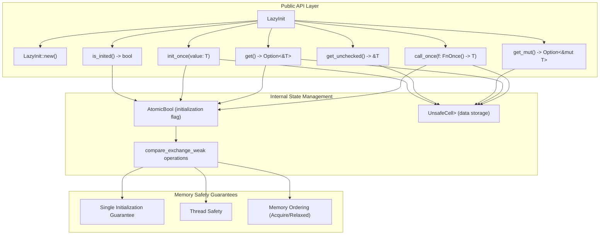
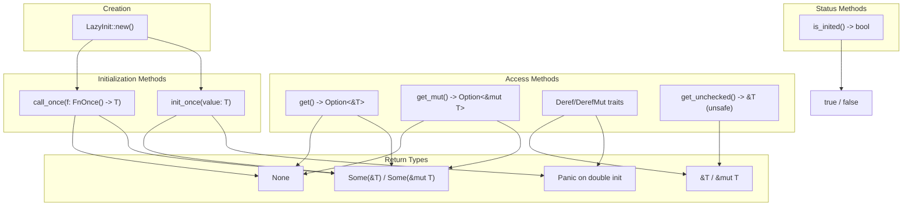

# Overview

> **Relevant source files**
> * [Cargo.toml](https://github.com/arceos-org/lazyinit/blob/380d6b07/Cargo.toml)
> * [README.md](https://github.com/arceos-org/lazyinit/blob/380d6b07/README.md)

## Purpose and Scope

This document provides an overview of the `lazyinit` crate, a Rust library that enables thread-safe lazy initialization of static values. The material covers the crate's core purpose, key features, architecture, and usage patterns. For detailed implementation specifics of the `LazyInit<T>` struct, see [LazyInit Implementation](/arceos-org/lazyinit/2-lazyinitlesstgreater-implementation). For API documentation and method details, see [API Reference](/arceos-org/lazyinit/2.1-api-reference). For project configuration and dependencies, see [Project Configuration](/arceos-org/lazyinit/3-project-configuration).

## What is LazyInit

The `lazyinit` crate provides the `LazyInit<T>` type for initializing static values lazily in a thread-safe manner. Unlike compile-time initialization or macro-based solutions like `lazy_static`, `LazyInit<T>` allows runtime initialization with arbitrary logic while guaranteeing that initialization occurs exactly once across all threads.

The core abstraction is the `LazyInit<T>` struct, which wraps a value of type `T` and manages its initialization state through atomic operations. The value remains uninitialized until the first call to `init_once` or `call_once`, at which point it becomes permanently initialized and accessible.

Sources: [README.md(L7 - L11)&emsp;](https://github.com/arceos-org/lazyinit/blob/380d6b07/README.md#L7-L11) [Cargo.toml(L6)&emsp;](https://github.com/arceos-org/lazyinit/blob/380d6b07/Cargo.toml#L6-L6)

## Key Features and Capabilities

|Feature|Description|Methods|
| --- | --- | --- |
|Thread-Safe Initialization|Guarantees exactly one initialization across multiple threads|init_once,call_once|
|Flexible Initialization|Supports both direct value initialization and closure-based initialization|init_once(value), `call_once(|
|Safe Access Patterns|Provides both safe and unsafe access methods|get(),get_mut(),get_unchecked()|
|State Inspection|Allows checking initialization status without accessing the value|is_inited()|
|Direct Access|ImplementsDerefandDerefMutfor transparent access after initialization|*VALUE,&mut *VALUE|
|No-std Compatibility|Works in embedded and kernel environments without standard library|No external dependencies|

Sources: [README.md(L15 - L57)&emsp;](https://github.com/arceos-org/lazyinit/blob/380d6b07/README.md#L15-L57) [Cargo.toml(L12)&emsp;](https://github.com/arceos-org/lazyinit/blob/380d6b07/Cargo.toml#L12-L12)

## Core Architecture

The following diagram illustrates the relationship between the main components and their roles in the codebase:

**LazyInit Core Components and Relationships**

Sources: [README.md(L16 - L28)&emsp;](https://github.com/arceos-org/lazyinit/blob/380d6b07/README.md#L16-L28) [README.md(L32 - L57)&emsp;](https://github.com/arceos-org/lazyinit/blob/380d6b07/README.md#L32-L57)

## API Surface Overview

The following diagram shows the complete API surface and usage patterns supported by `LazyInit<T>`:

**LazyInit API Methods and Usage Patterns**

Sources: [README.md(L18 - L27)&emsp;](https://github.com/arceos-org/lazyinit/blob/380d6b07/README.md#L18-L27) [README.md(L39 - L56)&emsp;](https://github.com/arceos-org/lazyinit/blob/380d6b07/README.md#L39-L56)

## Use Cases and When to Use LazyInit

`LazyInit<T>` is designed for scenarios where you need lazy initialization with these characteristics:

### Primary Use Cases

1. **Static Variables with Runtime Initialization**: When you need a static variable that requires runtime computation or I/O to initialize
2. **Expensive Computations**: When initialization is costly and should only occur if the value is actually needed
3. **Resource Initialization**: When initializing system resources, file handles, or network connections that should be shared globally
4. **Multi-threaded Environments**: When multiple threads might attempt to initialize the same static value concurrently

### Advantages Over Alternatives

* **vs. `lazy_static!`**: Provides more flexible initialization patterns and doesn't require macro-based declaration
* **vs. `std::sync::Once`**: Combines synchronization with storage, providing a more ergonomic API
* **vs. `std::cell::OnceCell`**: Offers thread-safe initialization for static contexts

Sources: [README.md(L9 - L11)&emsp;](https://github.com/arceos-org/lazyinit/blob/380d6b07/README.md#L9-L11) [Cargo.toml(L11)&emsp;](https://github.com/arceos-org/lazyinit/blob/380d6b07/Cargo.toml#L11-L11)

## Project Characteristics

### No-std Compatibility

The crate is designed for `no-std` environments, making it suitable for:

* Embedded systems
* Kernel-level code
* WebAssembly targets
* Bare metal programming

### Licensing and Distribution

|Aspect|Details|
| --- | --- |
|Licenses|Triple-licensed: GPL-3.0-or-later, Apache-2.0, MulanPSL-2.0|
|Categories|no-std,rust-patterns|
|Keywords|lazy,initialization,static|
|Dependencies|None (pure Rust implementation)|

### Supported Targets

The crate supports multiple target architectures through CI validation, including both hosted and bare-metal targets.

Sources: [Cargo.toml(L1 - L15)&emsp;](https://github.com/arceos-org/lazyinit/blob/380d6b07/Cargo.toml#L1-L15)