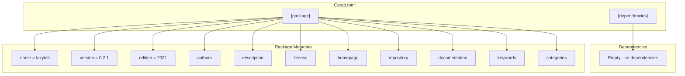
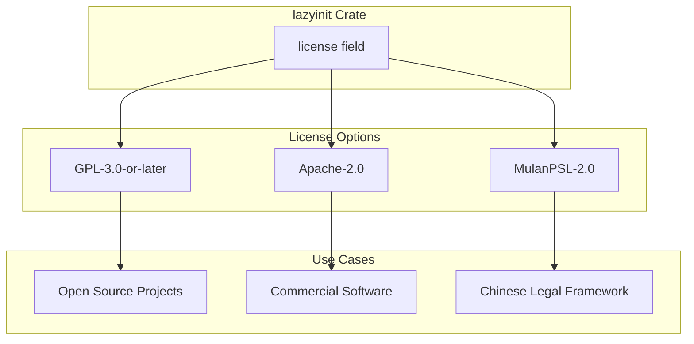
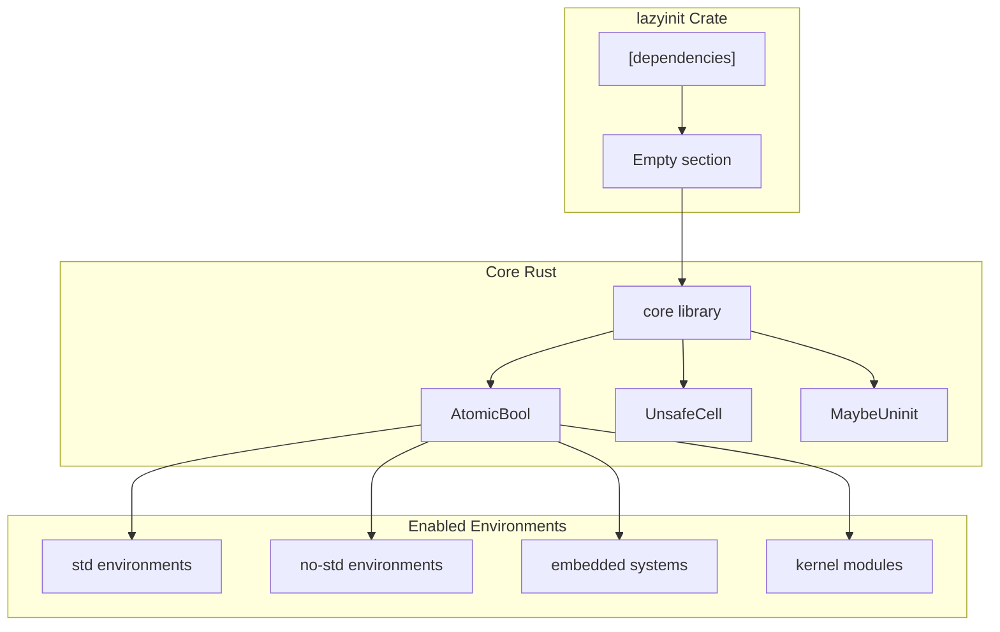

# Project Configuration

> **Relevant source files**
> * [Cargo.toml](https://github.com/arceos-org/lazyinit/blob/380d6b07/Cargo.toml)

This document covers the project configuration of the `lazyinit` crate, focusing on package metadata, licensing strategy, dependency management, and no-std compatibility. The configuration is primarily defined in `Cargo.toml` and establishes the crate's minimal design philosophy and broad compatibility requirements.

For information about the core implementation details, see [LazyInit Implementation](/arceos-org/lazyinit/2-lazyinitlesstgreater-implementation). For development tooling and CI configuration, see [Development & Contributing](/arceos-org/lazyinit/4-development-and-contributing).

## Configuration Structure

The project configuration follows a minimal approach with clear separation of concerns between package metadata, dependencies, and build targets.

### Package Configuration Hierarchy

Sources: [Cargo.toml(L1 - L15)&emsp;](https://github.com/arceos-org/lazyinit/blob/380d6b07/Cargo.toml#L1-L15)

## Package Metadata

The package metadata defines the crate's identity, versioning, and discoverability characteristics.

|Field|Value|Purpose|
| --- | --- | --- |
|name|lazyinit|Crate identifier on crates.io|
|version|0.2.1|Semantic version following SemVer|
|edition|2021|Rust edition compatibility|
|authors|Yuekai Jia <equation618@gmail.com>|Primary maintainer|
|description|Initialize a static value lazily.|Brief functionality summary|
|homepage|https://github.com/arceos-org/arceos|Parent project reference|
|repository|https://github.com/arceos-org/lazyinit|Source code location|
|documentation|https://docs.rs/lazyinit|Generated API documentation|

Sources: [Cargo.toml(L1 - L12)&emsp;](https://github.com/arceos-org/lazyinit/blob/380d6b07/Cargo.toml#L1-L12)

### Keywords and Categories

The crate is tagged with specific keywords and categories that indicate its purpose and compatibility:

* **Keywords**: `lazy`, `initialization`, `static`
* **Categories**: `no-std`, `rust-patterns`

These classifications signal the crate's focus on lazy initialization patterns and its compatibility with `no-std` environments.

Sources: [Cargo.toml(L11 - L12)&emsp;](https://github.com/arceos-org/lazyinit/blob/380d6b07/Cargo.toml#L11-L12)

## Licensing Strategy

The project employs a tri-license approach providing flexibility for different use cases and legal requirements.

### Multi-License Configuration

The license string `GPL-3.0-or-later OR Apache-2.0 OR MulanPSL-2.0` allows users to choose the most appropriate license for their specific requirements:

* **GPL-3.0-or-later**: Copyleft license for open source projects
* **Apache-2.0**: Permissive license suitable for commercial use
* **MulanPSL-2.0**: License compatible with Chinese legal frameworks

Sources: [Cargo.toml(L7)&emsp;](https://github.com/arceos-org/lazyinit/blob/380d6b07/Cargo.toml#L7-L7)

## No-std Compatibility

The configuration explicitly supports `no-std` environments through strategic design choices.

### Zero-Dependency Architecture

The empty `[dependencies]` section indicates that the crate relies exclusively on Rust's `core` library, enabling usage in:

* Embedded systems without heap allocation
* Kernel modules and OS development
* WebAssembly environments
* Any `no-std` compatible Rust project

Sources: [Cargo.toml(L14 - L15)&emsp;](https://github.com/arceos-org/lazyinit/blob/380d6b07/Cargo.toml#L14-L15)

## Build Target Compatibility

The configuration supports the crate's multi-target compatibility strategy, as evidenced by the CI pipeline testing multiple architectures.

### Target Architecture Support

|Target|Environment|Purpose|
| --- | --- | --- |
|x86_64-unknown-linux-gnu|Standard Linux|General development and testing|
|x86_64-unknown-none|Bare metal x86_64|OS development and embedded|
|riscv64gc-unknown-none-elf|RISC-V bare metal|RISC-V embedded systems|
|aarch64-unknown-none-softfloat|ARM64 bare metal|ARM embedded systems|

The configuration's minimal dependencies and `no-std` categorization enable this broad target support without requiring target-specific conditional compilation.

Sources: [Cargo.toml(L12)&emsp;](https://github.com/arceos-org/lazyinit/blob/380d6b07/Cargo.toml#L12-L12)

## Configuration Philosophy

The project configuration reflects several key design principles:

1. **Minimalism**: Zero external dependencies reduce attack surface and compatibility issues
2. **Flexibility**: Multi-licensing accommodates diverse legal requirements
3. **Universality**: No-std compatibility enables use across all Rust environments
4. **Clarity**: Explicit categorization and keywords aid discoverability

This configuration strategy aligns with the crate's role as a fundamental building block for lazy initialization patterns across the Rust ecosystem.

Sources: [Cargo.toml(L1 - L15)&emsp;](https://github.com/arceos-org/lazyinit/blob/380d6b07/Cargo.toml#L1-L15)