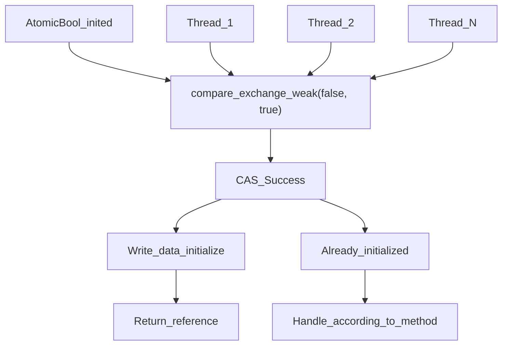
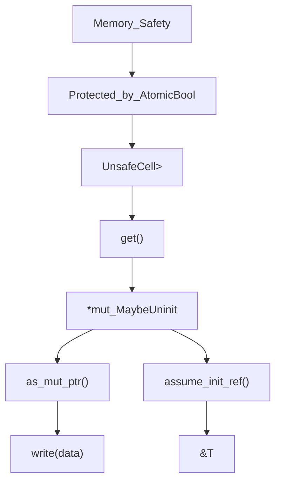
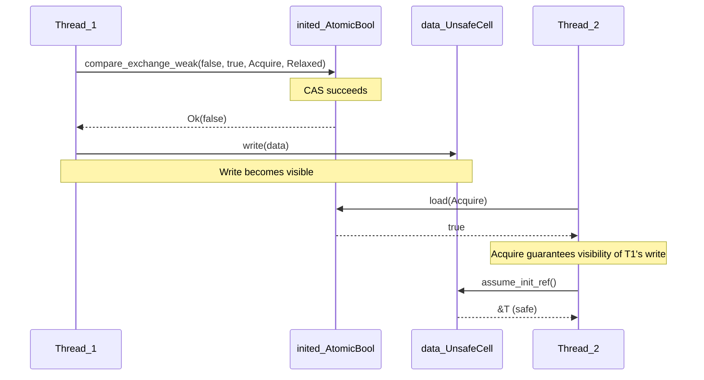
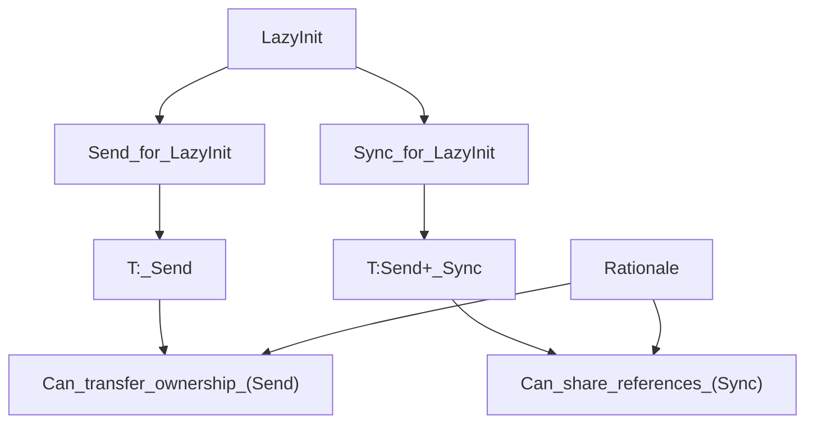
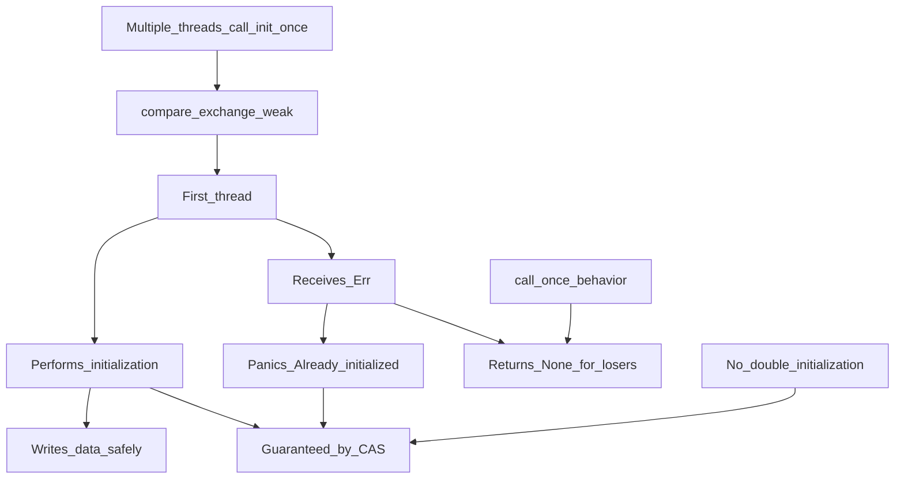
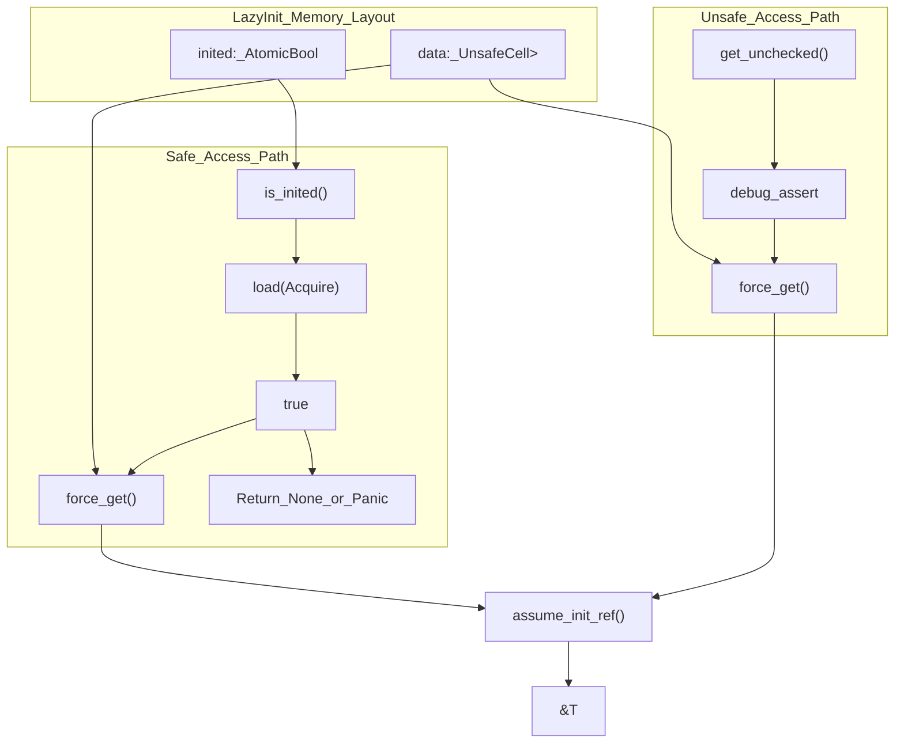
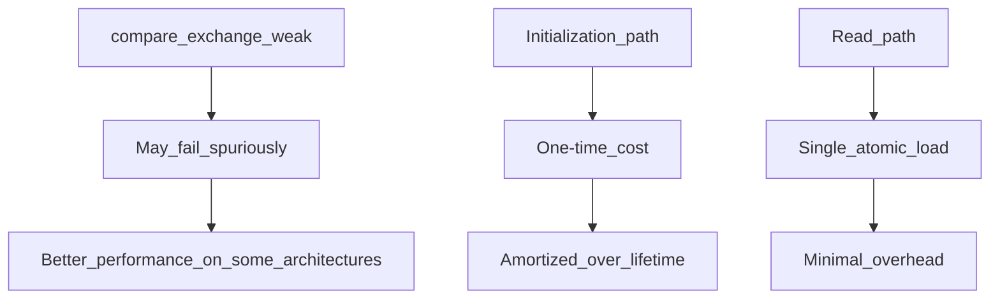

# Thread Safety & Memory Model

> **Relevant source files**
> * [src/lib.rs](https://github.com/arceos-org/lazyinit/blob/380d6b07/src/lib.rs)

This document explains the synchronization mechanisms, atomic operations, and memory ordering guarantees that make `LazyInit<T>` thread-safe. It covers the low-level implementation details of how concurrent access is coordinated and memory safety is maintained across multiple threads.

For information about the high-level API and usage patterns, see [API Reference](/arceos-org/lazyinit/2.1-api-reference) and [Usage Patterns & Examples](/arceos-org/lazyinit/2.3-usage-patterns-and-examples).

## Synchronization Primitives

The `LazyInit<T>` implementation relies on two core synchronization primitives to achieve thread safety:

|Component|Type|Purpose|
| --- | --- | --- |
|inited|AtomicBool|Tracks initialization state atomically|
|data|UnsafeCell<MaybeUninit<T>>|Provides interior mutability for the stored value|

### Atomic State Management

The initialization state is tracked using an `AtomicBool` that serves as the primary coordination mechanism between threads. This atomic variable ensures that only one thread can successfully transition from the uninitialized to initialized state.

**Atomic State Coordination Diagram**
Sources: [src/lib.rs(L15 - L16)&emsp;](https://github.com/arceos-org/lazyinit/blob/380d6b07/src/lib.rs#L15-L16) [src/lib.rs(L37 - L46)&emsp;](https://github.com/arceos-org/lazyinit/blob/380d6b07/src/lib.rs#L37-L46) [src/lib.rs(L57 - L66)&emsp;](https://github.com/arceos-org/lazyinit/blob/380d6b07/src/lib.rs#L57-L66)

### Interior Mutability Pattern

The `UnsafeCell<MaybeUninit<T>>` provides the necessary interior mutability to allow initialization through shared references while maintaining memory safety through careful synchronization.

**Interior Mutability and Memory Safety**
Sources: [src/lib.rs(L16)&emsp;](https://github.com/arceos-org/lazyinit/blob/380d6b07/src/lib.rs#L16-L16) [src/lib.rs(L42)&emsp;](https://github.com/arceos-org/lazyinit/blob/380d6b07/src/lib.rs#L42-L42) [src/lib.rs(L119 - L120)&emsp;](https://github.com/arceos-org/lazyinit/blob/380d6b07/src/lib.rs#L119-L120)

## Memory Ordering Semantics

The implementation uses specific memory ordering guarantees to ensure correct synchronization across threads while maintaining performance.

### Ordering Strategy

|Operation|Success Ordering|Failure Ordering|Purpose|
| --- | --- | --- | --- |
|compare_exchange_weak|Ordering::Acquire|Ordering::Relaxed|Synchronize initialization|
|loadoperations|Ordering::Acquire|N/A|Ensure visibility of writes|

### Acquire-Release Semantics

**Memory Ordering Synchronization**
Sources: [src/lib.rs(L38 - L39)&emsp;](https://github.com/arceos-org/lazyinit/blob/380d6b07/src/lib.rs#L38-L39) [src/lib.rs(L58 - L59)&emsp;](https://github.com/arceos-org/lazyinit/blob/380d6b07/src/lib.rs#L58-L59) [src/lib.rs(L71)&emsp;](https://github.com/arceos-org/lazyinit/blob/380d6b07/src/lib.rs#L71-L71)

## Thread Safety Implementation

### Send and Sync Bounds

The trait implementations provide precise thread safety guarantees:

**Thread Safety Trait Bounds**
Sources: [src/lib.rs(L19 - L20)&emsp;](https://github.com/arceos-org/lazyinit/blob/380d6b07/src/lib.rs#L19-L20)

The bounds ensure that:

* `Send` is implemented when `T: Send`, allowing transfer of ownership across threads
* `Sync` is implemented when `T: Send + Sync`, allowing shared access from multiple threads

### Race Condition Prevention

The implementation prevents common race conditions through atomic compare-and-swap operations:

**Race Condition Prevention Mechanisms**
Sources: [src/lib.rs(L36 - L46)&emsp;](https://github.com/arceos-org/lazyinit/blob/380d6b07/src/lib.rs#L36-L46) [src/lib.rs(L53 - L66)&emsp;](https://github.com/arceos-org/lazyinit/blob/380d6b07/src/lib.rs#L53-L66)

## Memory Safety Guarantees

### Initialization State Tracking

The atomic boolean serves as a guard that prevents access to uninitialized memory:

|Method|Check Mechanism|Safety Level|
| --- | --- | --- |
|get()|is_inited()check|Safe - returnsOption<&T>|
|deref()|is_inited()check|Panic on uninitialized|
|get_unchecked()|Debug assertion only|Unsafe - caller responsibility|

### Memory Layout and Access Patterns

**Memory Access Safety Mechanisms**
Sources: [src/lib.rs(L77 - L83)&emsp;](https://github.com/arceos-org/lazyinit/blob/380d6b07/src/lib.rs#L77-L83) [src/lib.rs(L102 - L105)&emsp;](https://github.com/arceos-org/lazyinit/blob/380d6b07/src/lib.rs#L102-L105) [src/lib.rs(L119 - L120)&emsp;](https://github.com/arceos-org/lazyinit/blob/380d6b07/src/lib.rs#L119-L120)

## Performance Characteristics

### Fast Path Optimization

Once initialized, access to the value follows a fast path with minimal overhead:

1. **Single atomic load** - `is_inited()` performs one `Ordering::Acquire` load
2. **Direct memory access** - `force_get()` uses `assume_init_ref()` without additional checks
3. **No contention** - Post-initialization reads don't modify atomic state

### Compare-Exchange Optimization

The use of `compare_exchange_weak` instead of `compare_exchange` provides better performance on architectures where weak CAS can fail spuriously but retry efficiently.

**Performance Optimization Strategy**
Sources: [src/lib.rs(L38 - L39)&emsp;](https://github.com/arceos-org/lazyinit/blob/380d6b07/src/lib.rs#L38-L39) [src/lib.rs(L58 - L59)&emsp;](https://github.com/arceos-org/lazyinit/blob/380d6b07/src/lib.rs#L58-L59) [src/lib.rs(L71)&emsp;](https://github.com/arceos-org/lazyinit/blob/380d6b07/src/lib.rs#L71-L71)

The memory model ensures that the expensive synchronization cost is paid only once during initialization, while subsequent accesses benefit from the acquire-release semantics without additional synchronization overhead.

Sources: [src/lib.rs(L1 - L183)&emsp;](https://github.com/arceos-org/lazyinit/blob/380d6b07/src/lib.rs#L1-L183)