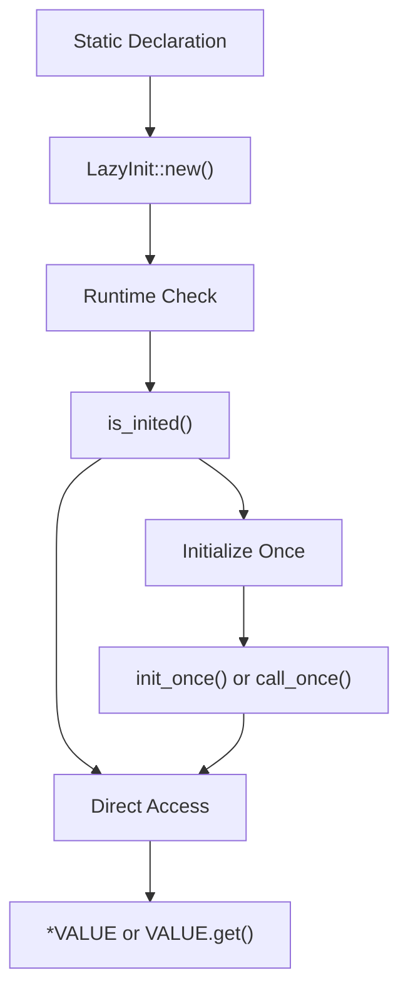
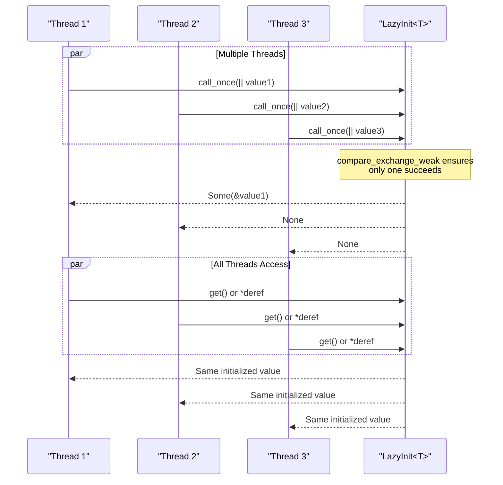
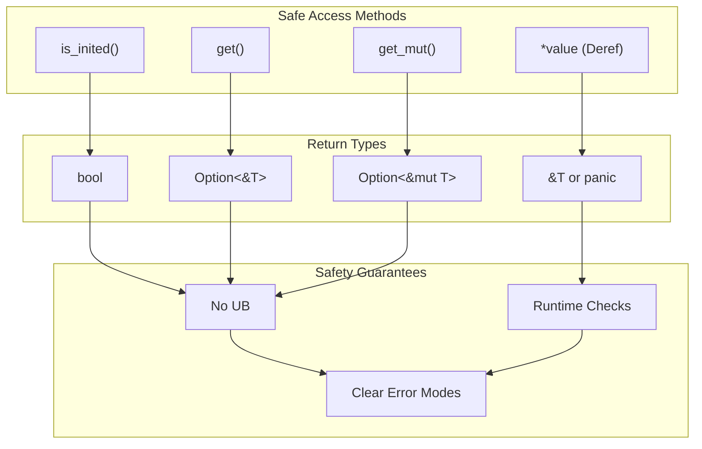
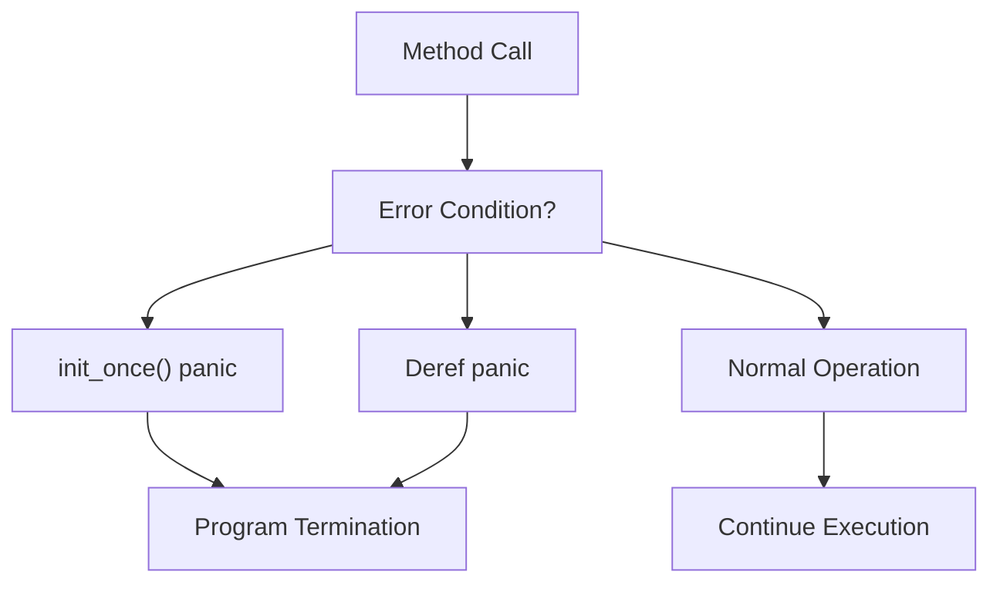
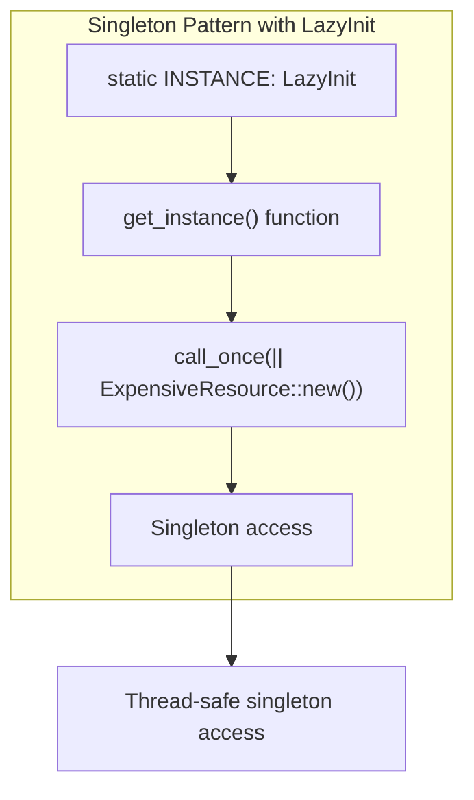
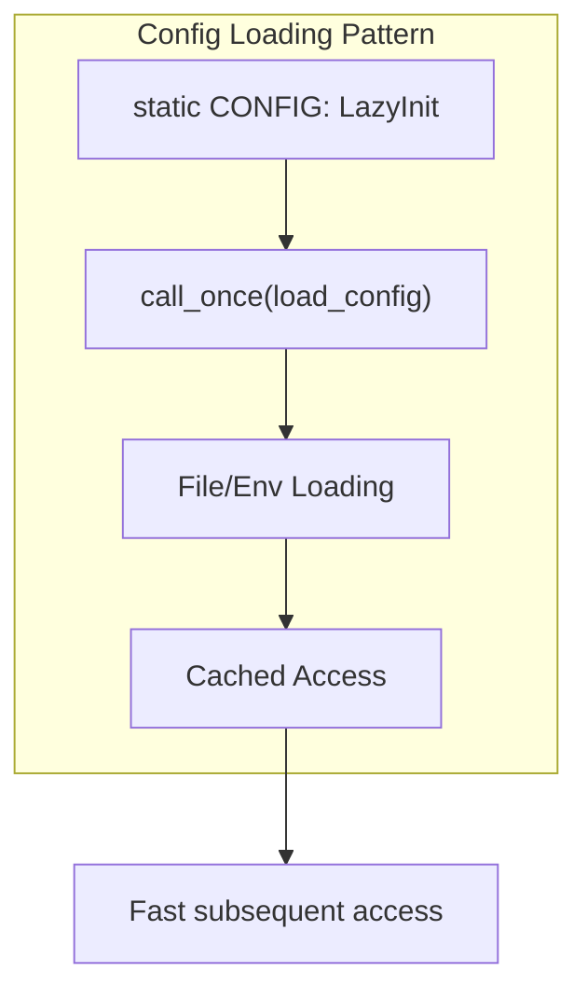

# Usage Patterns & Examples

> **Relevant source files**
> * [README.md](https://github.com/arceos-org/lazyinit/blob/380d6b07/README.md)
> * [src/lib.rs](https://github.com/arceos-org/lazyinit/blob/380d6b07/src/lib.rs)

This document covers common usage patterns, practical examples, and best practices for using the `LazyInit<T>` type. It demonstrates how to effectively leverage thread-safe lazy initialization in various scenarios, from simple static variables to complex multi-threaded applications.

For detailed API documentation, see [API Reference](/arceos-org/lazyinit/2.1-api-reference). For information about the underlying thread safety mechanisms, see [Thread Safety & Memory Model](/arceos-org/lazyinit/2.2-thread-safety-and-memory-model).

## Core Usage Patterns

The `LazyInit<T>` type supports several distinct usage patterns, each optimized for different scenarios and requirements.

### Static Variable Initialization Pattern

The most common pattern involves declaring static variables that are initialized lazily at runtime:

**Static Variable Initialization Flow**

This pattern leverages the `const fn new()` method to create compile-time initialized but runtime-lazy static variables.

Sources: [src/lib.rs(L24 - L29)&emsp;](https://github.com/arceos-org/lazyinit/blob/380d6b07/src/lib.rs#L24-L29) [README.md(L15 - L28)&emsp;](https://github.com/arceos-org/lazyinit/blob/380d6b07/README.md#L15-L28)

### Thread-Safe Initialization Pattern

For multi-threaded scenarios, `LazyInit<T>` provides race-condition-free initialization:

**Multi-threaded Initialization Sequence**

The atomic `compare_exchange_weak` operation ensures exactly one thread succeeds in initialization, while others receive `None` from `call_once`.

Sources: [src/lib.rs(L53 - L67)&emsp;](https://github.com/arceos-org/lazyinit/blob/380d6b07/src/lib.rs#L53-L67) [src/lib.rs(L37 - L47)&emsp;](https://github.com/arceos-org/lazyinit/blob/380d6b07/src/lib.rs#L37-L47) [README.md(L30 - L57)&emsp;](https://github.com/arceos-org/lazyinit/blob/380d6b07/README.md#L30-L57)

## Initialization Method Patterns

### Direct Value Initialization withinit_once

The `init_once` method is used when you have a concrete value ready for initialization:

|Characteristic|Behavior|
| --- | --- |
|Input|Direct value of typeT|
|Return|Reference to initialized value|
|Error Handling|Panics if already initialized|
|Use Case|Static initialization with known values|

This pattern is ideal for scenarios where initialization failure should be treated as a programming error.

Sources: [src/lib.rs(L31 - L47)&emsp;](https://github.com/arceos-org/lazyinit/blob/380d6b07/src/lib.rs#L31-L47)

### Closure-Based Initialization withcall_once

The `call_once` method enables lazy evaluation and graceful handling of race conditions:

|Characteristic|Behavior|
| --- | --- |
|Input|ClosureFnOnce() -> T|
|Return|Option<&T>|
|Error Handling|ReturnsNoneif already initialized|
|Use Case|Thread-safe lazy evaluation|

This pattern provides more flexibility for complex initialization logic and better composability in concurrent contexts.

Sources: [src/lib.rs(L49 - L67)&emsp;](https://github.com/arceos-org/lazyinit/blob/380d6b07/src/lib.rs#L49-L67)

## Access Pattern Categories

### Safe Access Patterns

**Safe Access Method Categories**

Safe access methods provide runtime checks and clear error semantics at the cost of slight performance overhead.

Sources: [src/lib.rs(L69 - L83)&emsp;](https://github.com/arceos-org/lazyinit/blob/380d6b07/src/lib.rs#L69-L83) [src/lib.rs(L85 - L94)&emsp;](https://github.com/arceos-org/lazyinit/blob/380d6b07/src/lib.rs#L85-L94) [src/lib.rs(L153 - L174)&emsp;](https://github.com/arceos-org/lazyinit/blob/380d6b07/src/lib.rs#L153-L174)

### Performance-Critical Access Patterns

For performance-critical code paths, unsafe methods bypass runtime checks:

|Method|Safety Requirement|Performance Benefit|
| --- | --- | --- |
|get_unchecked()|Must be called after initialization|Eliminates bounds checking|
|get_mut_unchecked()|Must be called after initialization|Eliminates bounds checking|
|Directforce_get()|Internal use only|Maximum performance|

These methods include `debug_assert!` checks in debug builds while providing zero-cost access in release builds.

Sources: [src/lib.rs(L96 - L116)&emsp;](https://github.com/arceos-org/lazyinit/blob/380d6b07/src/lib.rs#L96-L116) [src/lib.rs(L118 - L126)&emsp;](https://github.com/arceos-org/lazyinit/blob/380d6b07/src/lib.rs#L118-L126)

## Error Handling Strategies

### Panic-Based Error Handling

**Panic-Based Error Flow**

The `init_once` method and `Deref` implementations use panics to indicate programming errors that should not occur in correct code.

Sources: [src/lib.rs(L35)&emsp;](https://github.com/arceos-org/lazyinit/blob/380d6b07/src/lib.rs#L35-L35) [src/lib.rs(L45)&emsp;](https://github.com/arceos-org/lazyinit/blob/380d6b07/src/lib.rs#L45-L45) [src/lib.rs(L160)&emsp;](https://github.com/arceos-org/lazyinit/blob/380d6b07/src/lib.rs#L160-L160) [src/lib.rs(L128 - L133)&emsp;](https://github.com/arceos-org/lazyinit/blob/380d6b07/src/lib.rs#L128-L133)

### Option-Based Error Handling

The `call_once` and `get` methods use `Option` types for graceful error handling in scenarios where races or uninitialized access might be expected.

|Scenario|Method|Return Value|
| --- | --- | --- |
|Successful initialization|call_once(f)|Some(&T)|
|Lost initialization race|call_once(f)|None|
|Access to initialized value|get()|Some(&T)|
|Access to uninitialized value|get()|None|

Sources: [src/lib.rs(L53)&emsp;](https://github.com/arceos-org/lazyinit/blob/380d6b07/src/lib.rs#L53-L53) [src/lib.rs(L77)&emsp;](https://github.com/arceos-org/lazyinit/blob/380d6b07/src/lib.rs#L77-L77)

## Common Implementation Patterns

### Singleton Pattern Implementation

Static `LazyInit` variables can implement thread-safe singletons:

**Singleton Pattern Flow**

This pattern ensures expensive resources are created only once and shared safely across threads.

Sources: [src/lib.rs(L24 - L29)&emsp;](https://github.com/arceos-org/lazyinit/blob/380d6b07/src/lib.rs#L24-L29) [src/lib.rs(L53 - L67)&emsp;](https://github.com/arceos-org/lazyinit/blob/380d6b07/src/lib.rs#L53-L67)

### Configuration Loading Pattern

Lazy initialization of configuration data that may be loaded from files or environment variables:

**Configuration Loading Flow**

This pattern delays expensive I/O operations until the configuration is actually needed.

Sources: [src/lib.rs(L53 - L67)&emsp;](https://github.com/arceos-org/lazyinit/blob/380d6b07/src/lib.rs#L53-L67) [README.md(L39 - L46)&emsp;](https://github.com/arceos-org/lazyinit/blob/380d6b07/README.md#L39-L46)

## Performance Considerations

### Initialization Cost vs Access Cost

|Phase|Cost|Frequency|Optimization Strategy|
| --- | --- | --- | --- |
|Initialization|High (one-time)|Once|Usecall_oncefor lazy evaluation|
|Access (Safe)|Low|Frequent|Useget()for most cases|
|Access (Unsafe)|Minimal|Critical path|Useget_unchecked()when proven safe|

The `compare_exchange_weak` operation provides optimal performance for the initialization phase by reducing spurious failures compared to `compare_exchange`.

Sources: [src/lib.rs(L38 - L39)&emsp;](https://github.com/arceos-org/lazyinit/blob/380d6b07/src/lib.rs#L38-L39) [src/lib.rs(L58 - L59)&emsp;](https://github.com/arceos-org/lazyinit/blob/380d6b07/src/lib.rs#L58-L59) [src/lib.rs(L102 - L105)&emsp;](https://github.com/arceos-org/lazyinit/blob/380d6b07/src/lib.rs#L102-L105)

### Memory Overhead Analysis

The `LazyInit<T>` wrapper adds minimal overhead:

* `AtomicBool inited`: 1 byte + padding
* `UnsafeCell<MaybeUninit<T>>`: Same size as `T`
* Total overhead: Typically 8 bytes on 64-bit systems due to alignment

Sources: [src/lib.rs(L14 - L17)&emsp;](https://github.com/arceos-org/lazyinit/blob/380d6b07/src/lib.rs#L14-L17)