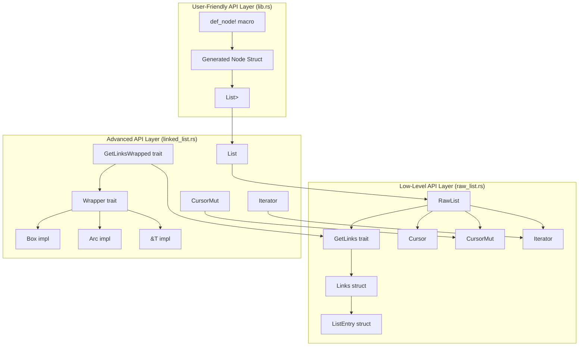
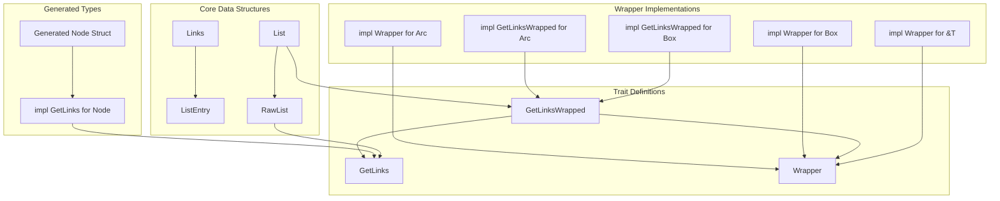

# API Reference

> **Relevant source files**
> * [src/lib.rs](https://github.com/arceos-org/linked_list_r4l/blob/353828c1/src/lib.rs)
> * [src/linked_list.rs](https://github.com/arceos-org/linked_list_r4l/blob/353828c1/src/linked_list.rs)
> * [src/raw_list.rs](https://github.com/arceos-org/linked_list_r4l/blob/353828c1/src/raw_list.rs)

This document provides comprehensive documentation of all public APIs in the `linked_list_r4l` crate, organized by abstraction level. The crate provides three distinct API layers: a user-friendly macro-based interface for typical usage, an advanced ownership management interface for complex scenarios, and a low-level unsafe interface for maximum performance.

For conceptual information about memory management and thread safety, see [Core Concepts](/arceos-org/linked_list_r4l/5-core-concepts). For practical usage examples, see [Quick Start Guide](/arceos-org/linked_list_r4l/2-quick-start-guide).

## API Architecture Overview

The following diagram illustrates the complete API structure and relationships between the three abstraction layers:



Sources: [src/lib.rs(L1 - L179)&emsp;](https://github.com/arceos-org/linked_list_r4l/blob/353828c1/src/lib.rs#L1-L179) [src/linked_list.rs(L1 - L355)&emsp;](https://github.com/arceos-org/linked_list_r4l/blob/353828c1/src/linked_list.rs#L1-L355) [src/raw_list.rs(L1 - L596)&emsp;](https://github.com/arceos-org/linked_list_r4l/blob/353828c1/src/raw_list.rs#L1-L596)

## Core Type Hierarchy and Trait System

This diagram shows the relationships between the main traits and types, mapping directly to code entities:



Sources: [src/raw_list.rs(L23 - L29)&emsp;](https://github.com/arceos-org/linked_list_r4l/blob/353828c1/src/raw_list.rs#L23-L29) [src/linked_list.rs(L18 - L89)&emsp;](https://github.com/arceos-org/linked_list_r4l/blob/353828c1/src/linked_list.rs#L18-L89) [src/lib.rs(L11 - L107)&emsp;](https://github.com/arceos-org/linked_list_r4l/blob/353828c1/src/lib.rs#L11-L107)

## User-Friendly API

### def_node!Macro

The `def_node!` macro generates complete node types suitable for use in linked lists.

**Syntax:**

```
def_node! {
    /// Optional documentation
    [visibility] struct NodeName(inner_type);
    /// Generic version
    [visibility] struct GenericNode<T>(T);
}
```

**Generated Interface:**
Each generated node type includes:

|Method|Description|Return Type|
| --- | --- | --- |
|new(inner: T)|Constructs a new node|Self|
|inner(&self)|Returns reference to wrapped value|&T|
|into_inner(self)|Consumes node, returns wrapped value|T|

The macro also implements `GetLinks`, `Deref`, and provides embedded `Links<Self>` for list operations.

Sources: [src/lib.rs(L109 - L178)&emsp;](https://github.com/arceos-org/linked_list_r4l/blob/353828c1/src/lib.rs#L109-L178) [src/lib.rs(L11 - L107)&emsp;](https://github.com/arceos-org/linked_list_r4l/blob/353828c1/src/lib.rs#L11-L107)

### Simple List Type

For basic usage with generated nodes, the crate re-exports `List` from the advanced API:

```
pub use linked_list::List;
```

This allows simple usage patterns like `List<Box<MyNode>>` without requiring knowledge of the underlying trait system.

Sources: [src/lib.rs(L6)&emsp;](https://github.com/arceos-org/linked_list_r4l/blob/353828c1/src/lib.rs#L6-L6)

## Advanced API

### Wrapper<T>Trait

The `Wrapper<T>` trait abstracts over different ownership models, enabling the same list implementation to work with `Box<T>`, `Arc<T>`, and `&T`.

```rust
pub trait Wrapper<T: ?Sized> {
    fn into_pointer(self) -> NonNull<T>;
    unsafe fn from_pointer(ptr: NonNull<T>) -> Self;
    fn as_ref(&self) -> &T;
}
```

**Implementations:**

|Type|into_pointer|from_pointer|as_ref|
| --- | --- | --- | --- |
|Box<T>|Box::into_raw|Box::from_raw|AsRef::as_ref|
|Arc<T>|Arc::into_raw|Arc::from_raw|AsRef::as_ref|
|&T|NonNull::from|Dereference pointer|Identity|

Sources: [src/linked_list.rs(L18 - L83)&emsp;](https://github.com/arceos-org/linked_list_r4l/blob/353828c1/src/linked_list.rs#L18-L83)

### GetLinksWrappedTrait

The `GetLinksWrapped` trait combines `GetLinks` functionality with wrapper ownership management:

```css
pub trait GetLinksWrapped: GetLinks {
    type Wrapped: Wrapper<Self::EntryType>;
}
```

This trait is automatically implemented for `Box<T>` and `Arc<T>` when `T` implements `GetLinks`.

Sources: [src/linked_list.rs(L86 - L121)&emsp;](https://github.com/arceos-org/linked_list_r4l/blob/353828c1/src/linked_list.rs#L86-L121)

### List<G: GetLinksWrapped>

The main list type that manages owned elements through the wrapper system.

**Core Methods:**

|Method|Description|Safety Requirements|
| --- | --- | --- |
|new()|Creates empty list|None|
|is_empty()|Checks if list is empty|None|
|push_back(data)|Adds element to end|None|
|push_front(data)|Adds element to beginning|None|
|pop_front()|Removes and returns first element|None|
|insert_after(existing, data)|Inserts after existing element|existingmust be on this list|
|remove(data)|Removes specific element|datamust be on this list or no list|
|iter()|Returns iterator|None|
|cursor_front_mut()|Returns mutable cursor|None|

Sources: [src/linked_list.rs(L127 - L223)&emsp;](https://github.com/arceos-org/linked_list_r4l/blob/353828c1/src/linked_list.rs#L127-L223)

### CursorMut<'a, G>

Provides mutable cursor functionality for advanced list manipulation:

|Method|Description|
| --- | --- |
|current()|Returns mutable reference to current element|
|remove_current()|Removes current element and advances cursor|
|peek_next()|Returns reference to next element|
|peek_prev()|Returns reference to previous element|
|move_next()|Advances cursor to next element|

Sources: [src/linked_list.rs(L238 - L276)&emsp;](https://github.com/arceos-org/linked_list_r4l/blob/353828c1/src/linked_list.rs#L238-L276)

### Iterator<'a, G>

Standard iterator implementation supporting both forward and backward iteration:

* Implements `Iterator` with `Item = &'a G::EntryType`
* Implements `DoubleEndedIterator` for reverse iteration

Sources: [src/linked_list.rs(L279 - L303)&emsp;](https://github.com/arceos-org/linked_list_r4l/blob/353828c1/src/linked_list.rs#L279-L303)

## Low-Level API

### GetLinksTrait

The fundamental trait that allows any type to be stored in a linked list:

```rust
pub trait GetLinks {
    type EntryType: ?Sized;
    fn get_links(data: &Self::EntryType) -> &Links<Self::EntryType>;
}
```

Types implementing this trait must provide access to embedded `Links<T>` for list management.

Sources: [src/raw_list.rs(L23 - L29)&emsp;](https://github.com/arceos-org/linked_list_r4l/blob/353828c1/src/raw_list.rs#L23-L29)

### Links<T>Structure

The core structure embedded in list elements, managing insertion state and list pointers:

```css
pub struct Links<T: ?Sized> {
    inserted: AtomicBool,
    entry: UnsafeCell<ListEntry<T>>,
}
```

**Key Methods:**

|Method|Visibility|Purpose|
| --- | --- | --- |
|new()|Public|Creates new uninserted Links|
|acquire_for_insertion()|Private|Atomically marks as inserted|
|release_after_removal()|Private|Atomically marks as not inserted|

The `AtomicBool` ensures thread-safe insertion tracking, while `UnsafeCell<ListEntry<T>>` holds the actual list pointers.

Sources: [src/raw_list.rs(L35 - L72)&emsp;](https://github.com/arceos-org/linked_list_r4l/blob/353828c1/src/raw_list.rs#L35-L72)

### ListEntry<T>Structure

Internal structure containing the actual linked list pointers:

```css
struct ListEntry<T: ?Sized> {
    next: Option<NonNull<T>>,
    prev: Option<NonNull<T>>,
}
```

This structure is private and managed entirely by the `RawList` implementation.

Sources: [src/raw_list.rs(L74 - L86)&emsp;](https://github.com/arceos-org/linked_list_r4l/blob/353828c1/src/raw_list.rs#L74-L86)

### RawList<G: GetLinks>

The low-level unsafe list implementation providing maximum performance:

**Core Operations:**

|Method|Safety Requirements|Returns|
| --- | --- | --- |
|new()|None|Empty list|
|is_empty()|None|bool|
|push_back(entry)|Entry must be valid and live longer than list|bool(insertion success)|
|push_front(entry)|Entry must be valid and live longer than list|bool(insertion success)|
|insert_after(existing, new)|Both entries must be valid, existing must be on list|bool(insertion success)|
|remove(entry)|Entry must be on this list or no list|bool(removal success)|
|pop_front()|None|Option<NonNull<G::EntryType>>|

Sources: [src/raw_list.rs(L93 - L284)&emsp;](https://github.com/arceos-org/linked_list_r4l/blob/353828c1/src/raw_list.rs#L93-L284)

### Low-Level Cursors and Iterators

The raw list provides cursor and iterator types for traversal:

**`Cursor<'a, G>`** (read-only):

* `current()` - Returns current element reference
* `move_next()` - Advances to next element
* `move_prev()` - Moves to previous element

**`CursorMut<'a, G>`** (mutable):

* `current()` - Returns mutable reference to current element
* `remove_current()` - Removes current element and advances
* `peek_next()` / `peek_prev()` - Look at adjacent elements
* `move_next()` - Advances cursor

**`Iterator<'a, G>`**:

* Implements standard `Iterator` and `DoubleEndedIterator` traits
* Used by higher-level list types

Sources: [src/raw_list.rs(L340 - L464)&emsp;](https://github.com/arceos-org/linked_list_r4l/blob/353828c1/src/raw_list.rs#L340-L464)

### Thread Safety Characteristics

All types implement `Send` and `Sync` conditionally based on their entry types:

* `RawList<G>` is `Send + Sync` when `G::EntryType: Send + Sync`
* `Links<T>` is `Send + Sync` when `T: Send + Sync`
* Atomic operations in `Links<T>` ensure safe concurrent access

Sources: [src/raw_list.rs(L40 - L46)&emsp;](https://github.com/arceos-org/linked_list_r4l/blob/353828c1/src/raw_list.rs#L40-L46) [src/raw_list.rs(L331 - L337)&emsp;](https://github.com/arceos-org/linked_list_r4l/blob/353828c1/src/raw_list.rs#L331-L337)