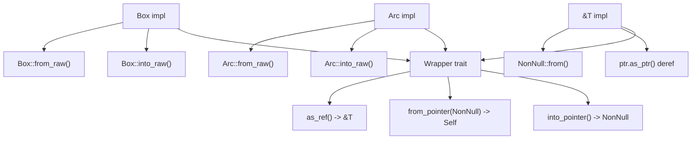
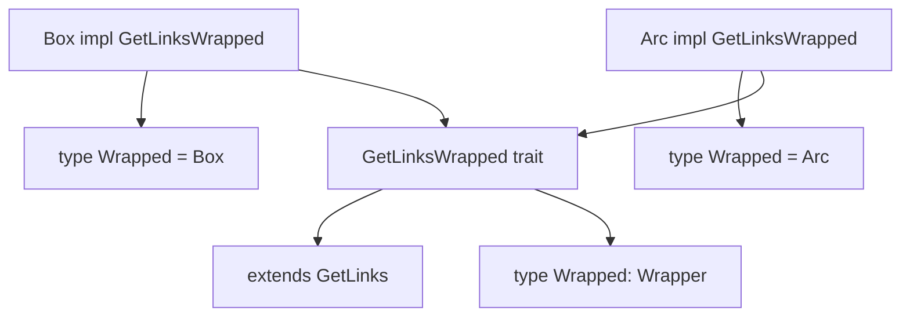
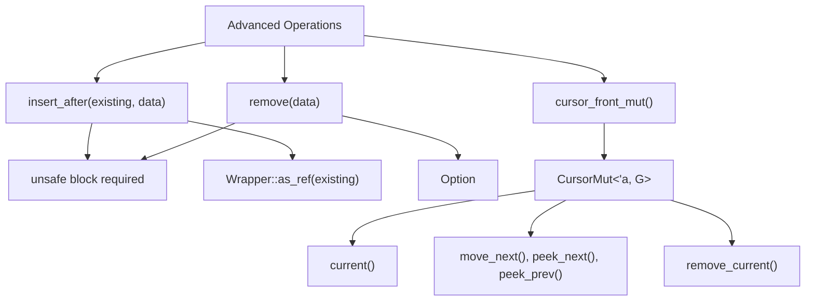
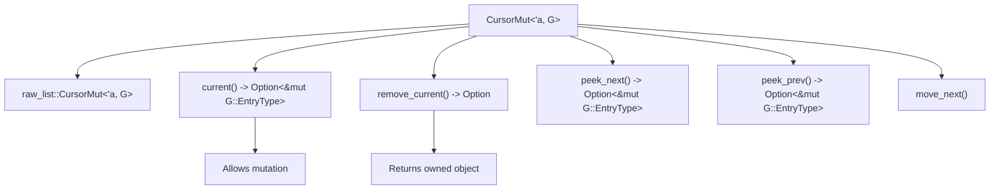
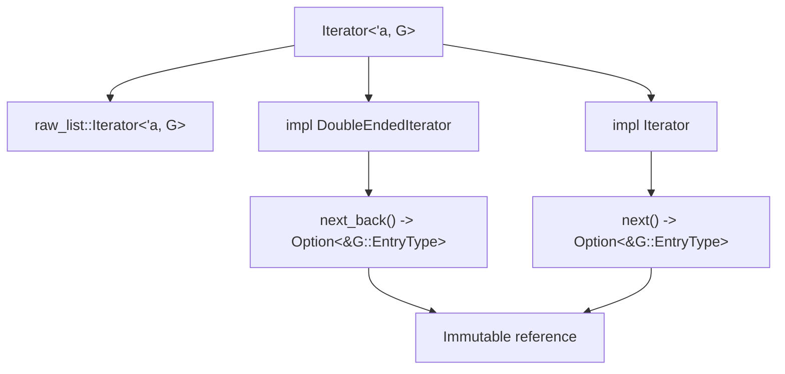
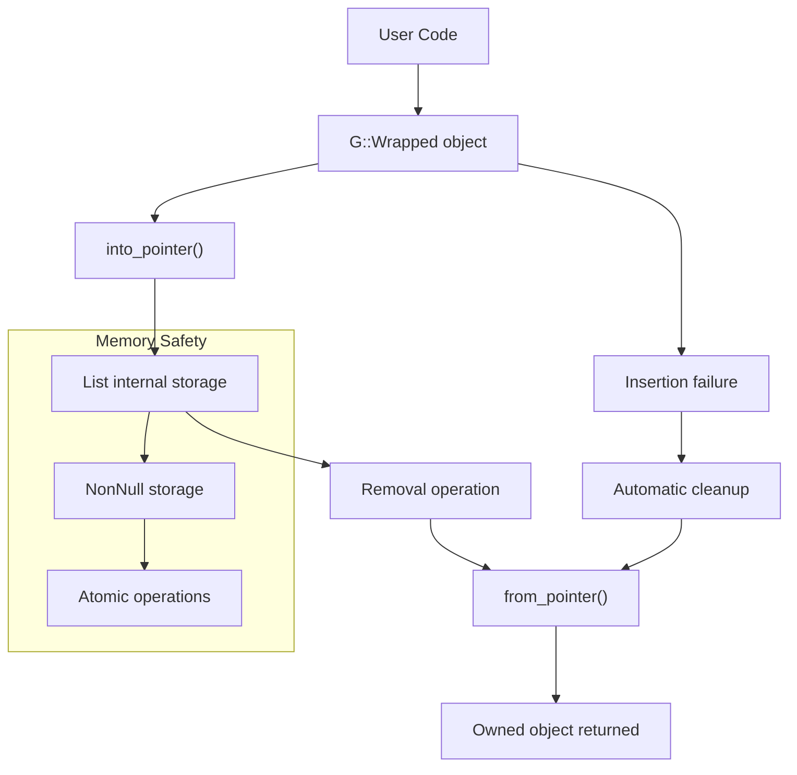
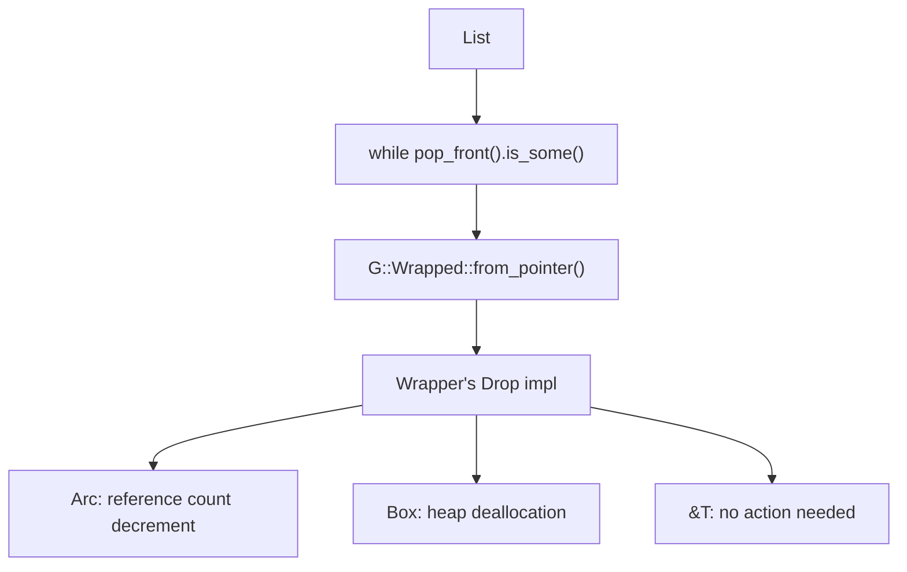

# Advanced API

> **Relevant source files**
> * [src/linked_list.rs](https://github.com/arceos-org/linked_list_r4l/blob/353828c1/src/linked_list.rs)

This document covers the advanced API layer of the linked_list_r4l crate, which provides safe ownership management and flexible pointer wrapping capabilities. This API sits between the user-friendly interface (see [User-Friendly API](/arceos-org/linked_list_r4l/4.1-user-friendly-api)) and the low-level unsafe operations (see [Low-Level API](/arceos-org/linked_list_r4l/4.3-low-level-api)).

The advanced API is designed for users who need control over memory ownership models while maintaining memory safety guarantees. It centers around the `List<G: GetLinksWrapped>` type and the `Wrapper` trait system that abstracts over different pointer types like `Box<T>`, `Arc<T>`, and `&T`.

## Core Trait System

The advanced API is built on two key traits that work together to provide type-safe ownership management:

### Wrapper Trait

The `Wrapper<T>` trait abstracts over different pointer types and ownership models, providing a uniform interface for converting between owned objects and raw pointers.



**Wrapper Trait Implementations**

The trait is implemented for three fundamental pointer types:

|Type|Ownership Model|Use Case|
| --- | --- | --- |
|Box<T>|Unique ownership|Single-threaded owned data|
|Arc<T>|Shared ownership|Multi-threaded reference counting|
|&T|Borrowed reference|Temporary list membership|

Sources: [src/linked_list.rs(L18 - L83)&emsp;](https://github.com/arceos-org/linked_list_r4l/blob/353828c1/src/linked_list.rs#L18-L83)

### GetLinksWrapped Trait

The `GetLinksWrapped` trait extends `GetLinks` to specify which wrapper type should be used for list elements:



Sources: [src/linked_list.rs(L85 - L121)&emsp;](https://github.com/arceos-org/linked_list_r4l/blob/353828c1/src/linked_list.rs#L85-L121)

## List<G: GetLinksWrapped> Interface

The `List<G: GetLinksWrapped>` struct provides the main interface for ownership-managed linked lists. It wraps the lower-level `RawList<G>` and handles ownership transfer automatically.

### Core Operations

```

```

**List Creation and Basic Operations**

|Method|Purpose|Safety|
| --- | --- | --- |
|new()|Create empty list|Safe|
|push_back(data)|Add to end|Safe, auto-cleanup on failure|
|push_front(data)|Add to beginning|Safe, auto-cleanup on failure|
|pop_front()|Remove from beginning|Safe, returns ownership|
|is_empty()|Check if empty|Safe|

Sources: [src/linked_list.rs(L131 - L147)&emsp;](https://github.com/arceos-org/linked_list_r4l/blob/353828c1/src/linked_list.rs#L131-L147) [src/linked_list.rs(L149 - L177)&emsp;](https://github.com/arceos-org/linked_list_r4l/blob/353828c1/src/linked_list.rs#L149-L177) [src/linked_list.rs(L210 - L217)&emsp;](https://github.com/arceos-org/linked_list_r4l/blob/353828c1/src/linked_list.rs#L210-L217)

### Advanced Operations

The interface also provides more sophisticated operations for precise list manipulation:



**Unsafe Operations Requirements**

|Method|Safety Requirement|
| --- | --- |
|insert_after(existing, data)|existingmust be valid entry on this list|
|remove(data)|datamust be on this list or no list|

Sources: [src/linked_list.rs(L178 - L208)&emsp;](https://github.com/arceos-org/linked_list_r4l/blob/353828c1/src/linked_list.rs#L178-L208)

## Cursors and Iterators

The advanced API provides two mechanisms for list traversal with different capabilities:

### CursorMut

The `CursorMut<'a, G>` provides mutable access and modification capabilities during traversal:



Sources: [src/linked_list.rs(L237 - L276)&emsp;](https://github.com/arceos-org/linked_list_r4l/blob/353828c1/src/linked_list.rs#L237-L276)

### Iterator

The `Iterator<'a, G>` provides immutable forward and backward traversal:



Sources: [src/linked_list.rs(L278 - L303)&emsp;](https://github.com/arceos-org/linked_list_r4l/blob/353828c1/src/linked_list.rs#L278-L303)

## Ownership Management

The advanced API's key strength is its automatic ownership management across different pointer types:

### Ownership Transfer Flow



**Ownership Transfer Guarantees**

|Scenario|Behavior|Memory Safety|
| --- | --- | --- |
|Successful insertion|Ownership transferred to list|Guaranteed byinto_pointer()|
|Failed insertion|Object automatically reconstructed|Ensured byfrom_pointer()call|
|Successful removal|Ownership returned to caller|Guaranteed byfrom_pointer()|
|List drop|All elements properly dropped|Handled byDropimplementation|

Sources: [src/linked_list.rs(L153 - L162)&emsp;](https://github.com/arceos-org/linked_list_r4l/blob/353828c1/src/linked_list.rs#L153-L162) [src/linked_list.rs(L168 - L176)&emsp;](https://github.com/arceos-org/linked_list_r4l/blob/353828c1/src/linked_list.rs#L168-L176) [src/linked_list.rs(L231 - L235)&emsp;](https://github.com/arceos-org/linked_list_r4l/blob/353828c1/src/linked_list.rs#L231-L235)

### Drop Behavior

The `List<G>` implements `Drop` to ensure all remaining elements are properly cleaned up:



Sources: [src/linked_list.rs(L231 - L235)&emsp;](https://github.com/arceos-org/linked_list_r4l/blob/353828c1/src/linked_list.rs#L231-L235)

## Thread Safety Considerations

While the advanced API provides memory safety guarantees, thread safety depends on the underlying `RawList` implementation and the specific wrapper type used:

|Wrapper Type|Thread Safety Notes|
| --- | --- |
|Box<T>|Single-threaded ownership, no inherent thread safety|
|Arc<T>|Reference counting is thread-safe, but list operations are not|
|&T|Depends on the referenced data's thread safety|

For multi-threaded usage, external synchronization (e.g., `Mutex`, `RwLock`) around the `List<G>` is required.

Sources: [src/linked_list.rs(L50 - L66)&emsp;](https://github.com/arceos-org/linked_list_r4l/blob/353828c1/src/linked_list.rs#L50-L66)