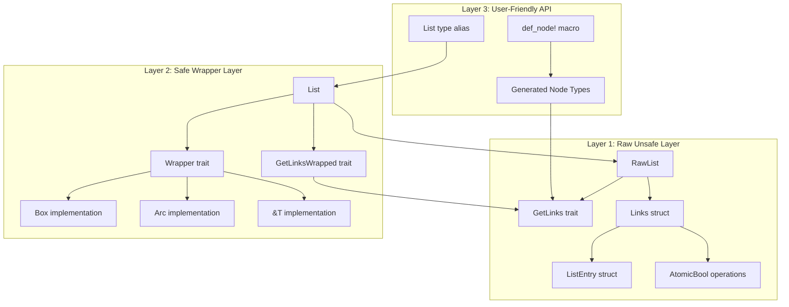
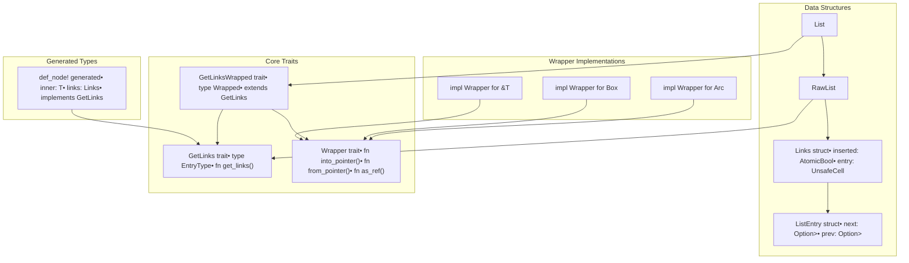
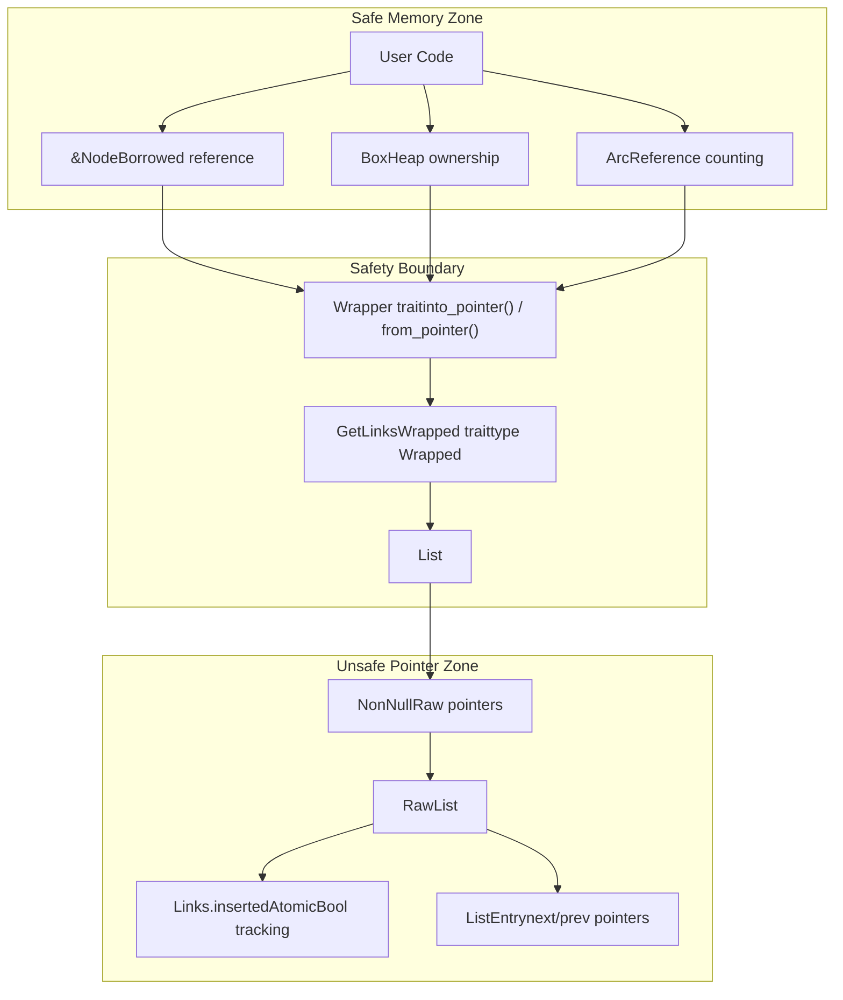
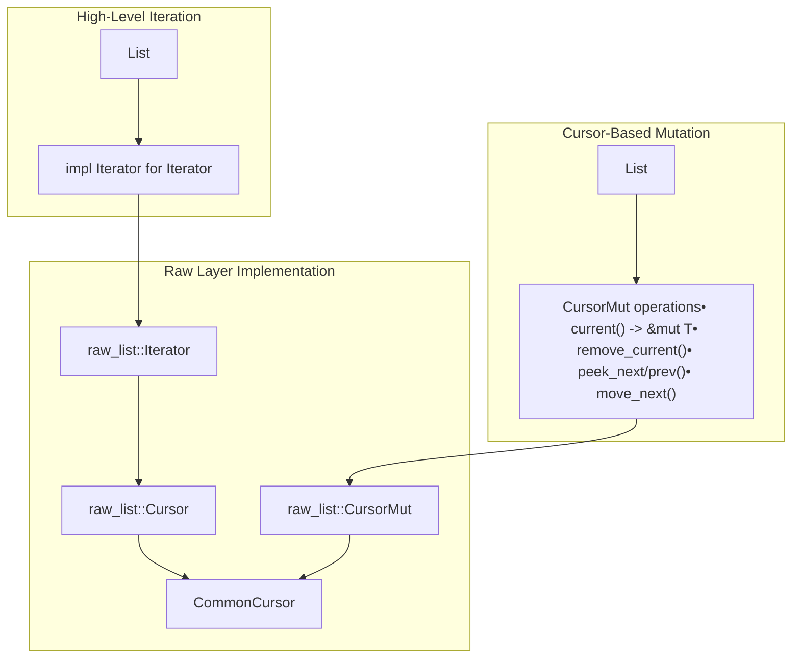

# Architecture Overview

> **Relevant source files**
> * [src/lib.rs](https://github.com/arceos-org/linked_list_r4l/blob/353828c1/src/lib.rs)
> * [src/linked_list.rs](https://github.com/arceos-org/linked_list_r4l/blob/353828c1/src/linked_list.rs)
> * [src/raw_list.rs](https://github.com/arceos-org/linked_list_r4l/blob/353828c1/src/raw_list.rs)

This document explains the three-layer architecture of the `linked_list_r4l` crate, detailing how the unsafe raw list implementation, safe wrapper layer, and user-friendly API work together to provide constant-time arbitrary removal with memory safety guarantees.

For specific API usage examples, see [Quick Start Guide](/arceos-org/linked_list_r4l/2-quick-start-guide). For detailed trait and struct documentation, see [API Reference](/arceos-org/linked_list_r4l/4-api-reference). For memory safety and thread safety concepts, see [Core Concepts](/arceos-org/linked_list_r4l/5-core-concepts).

## Three-Layer Architecture

The `linked_list_r4l` crate implements a sophisticated three-layer architecture that separates concerns between performance, safety, and usability:



**Layer 1 (Raw Unsafe)**: Provides maximum performance through direct pointer manipulation and atomic operations. The `RawList<G: GetLinks>` struct handles all unsafe linked list operations.

**Layer 2 (Safe Wrapper)**: Manages memory ownership and provides safe abstractions over the raw layer. The `List<G: GetLinksWrapped>` struct ensures memory safety through the `Wrapper<T>` trait.

**Layer 3 (User-Friendly)**: Offers convenient APIs and code generation. The `def_node!` macro automatically generates node types that implement required traits.

Sources: [src/lib.rs(L1 - L179)&emsp;](https://github.com/arceos-org/linked_list_r4l/blob/353828c1/src/lib.rs#L1-L179) [src/linked_list.rs(L1 - L355)&emsp;](https://github.com/arceos-org/linked_list_r4l/blob/353828c1/src/linked_list.rs#L1-L355) [src/raw_list.rs(L1 - L596)&emsp;](https://github.com/arceos-org/linked_list_r4l/blob/353828c1/src/raw_list.rs#L1-L596)

## Type System and Trait Architecture

The crate's type system uses traits to enable flexibility while maintaining type safety:



The `GetLinks` trait ([src/raw_list.rs(L23 - L29)&emsp;](https://github.com/arceos-org/linked_list_r4l/blob/353828c1/src/raw_list.rs#L23-L29)) allows any type to participate in linked lists by providing access to embedded `Links<T>`. The `Wrapper<T>` trait ([src/linked_list.rs(L18 - L31)&emsp;](https://github.com/arceos-org/linked_list_r4l/blob/353828c1/src/linked_list.rs#L18-L31)) abstracts over different ownership models, enabling the same list implementation to work with `Box<T>`, `Arc<T>`, and `&T`.

Sources: [src/raw_list.rs(L23 - L29)&emsp;](https://github.com/arceos-org/linked_list_r4l/blob/353828c1/src/raw_list.rs#L23-L29) [src/linked_list.rs(L18 - L31)&emsp;](https://github.com/arceos-org/linked_list_r4l/blob/353828c1/src/linked_list.rs#L18-L31) [src/linked_list.rs(L85 - L121)&emsp;](https://github.com/arceos-org/linked_list_r4l/blob/353828c1/src/linked_list.rs#L85-L121) [src/lib.rs(L11 - L107)&emsp;](https://github.com/arceos-org/linked_list_r4l/blob/353828c1/src/lib.rs#L11-L107)

## Memory Management Architecture

The crate implements a controlled boundary between safe and unsafe code to manage memory ownership:



The safety boundary ensures that:

* Owned objects are converted to raw pointers only when inserted
* Raw pointers are converted back to owned objects when removed
* Atomic tracking prevents double-insertion and use-after-free
* Memory lifetime is managed by the wrapper type

Sources: [src/linked_list.rs(L33 - L83)&emsp;](https://github.com/arceos-org/linked_list_r4l/blob/353828c1/src/linked_list.rs#L33-L83) [src/raw_list.rs(L35 - L66)&emsp;](https://github.com/arceos-org/linked_list_r4l/blob/353828c1/src/raw_list.rs#L35-L66) [src/raw_list.rs(L74 - L86)&emsp;](https://github.com/arceos-org/linked_list_r4l/blob/353828c1/src/raw_list.rs#L74-L86)

## Data Flow and Operation Architecture

Operations flow through the abstraction layers with ownership transformations at each boundary:

```

```

The data flow demonstrates how:

1. The macro generates boilerplate `GetLinks` implementations
2. Ownership transfers happen at wrapper boundaries
3. Atomic operations ensure thread-safe insertion tracking
4. Constant-time removal works through direct pointer manipulation

Sources: [src/lib.rs(L11 - L107)&emsp;](https://github.com/arceos-org/linked_list_r4l/blob/353828c1/src/lib.rs#L11-L107) [src/linked_list.rs(L153 - L162)&emsp;](https://github.com/arceos-org/linked_list_r4l/blob/353828c1/src/linked_list.rs#L153-L162) [src/linked_list.rs(L201 - L208)&emsp;](https://github.com/arceos-org/linked_list_r4l/blob/353828c1/src/linked_list.rs#L201-L208) [src/raw_list.rs(L57 - L65)&emsp;](https://github.com/arceos-org/linked_list_r4l/blob/353828c1/src/raw_list.rs#L57-L65) [src/raw_list.rs(L199 - L235)&emsp;](https://github.com/arceos-org/linked_list_r4l/blob/353828c1/src/raw_list.rs#L199-L235)

## Cursor and Iterator Architecture

The crate provides both immutable iteration and mutable cursor-based traversal:



Cursors enable safe mutable access to list elements while maintaining the linked list invariants. The `CursorMut<G>` ([src/linked_list.rs(L238 - L276)&emsp;](https://github.com/arceos-org/linked_list_r4l/blob/353828c1/src/linked_list.rs#L238-L276)) provides ownership-aware removal that properly converts raw pointers back to owned objects.

Sources: [src/linked_list.rs(L139 - L142)&emsp;](https://github.com/arceos-org/linked_list_r4l/blob/353828c1/src/linked_list.rs#L139-L142) [src/linked_list.rs(L220 - L276)&emsp;](https://github.com/arceos-org/linked_list_r4l/blob/353828c1/src/linked_list.rs#L220-L276) [src/raw_list.rs(L104 - L106)&emsp;](https://github.com/arceos-org/linked_list_r4l/blob/353828c1/src/raw_list.rs#L104-L106) [src/raw_list.rs(L270 - L423)&emsp;](https://github.com/arceos-org/linked_list_r4l/blob/353828c1/src/raw_list.rs#L270-L423) [src/raw_list.rs(L433 - L464)&emsp;](https://github.com/arceos-org/linked_list_r4l/blob/353828c1/src/raw_list.rs#L433-L464)