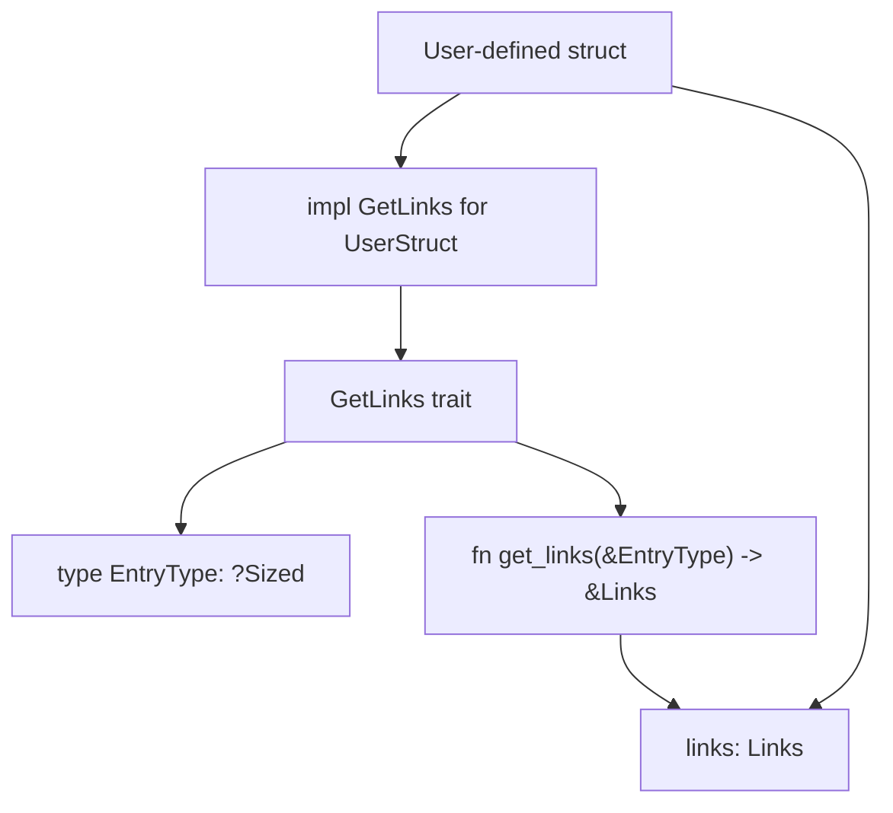
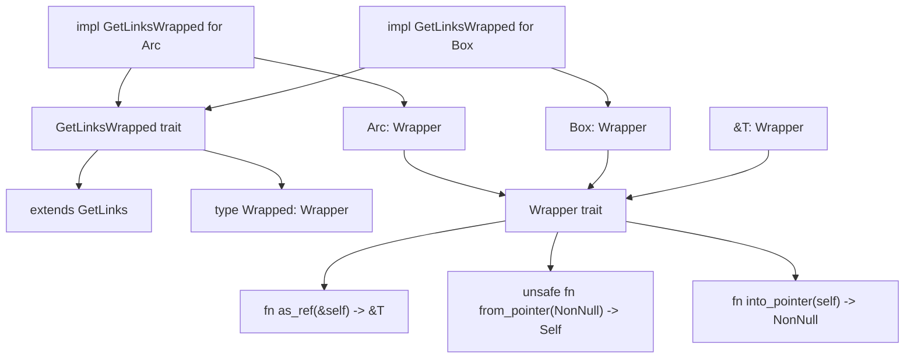
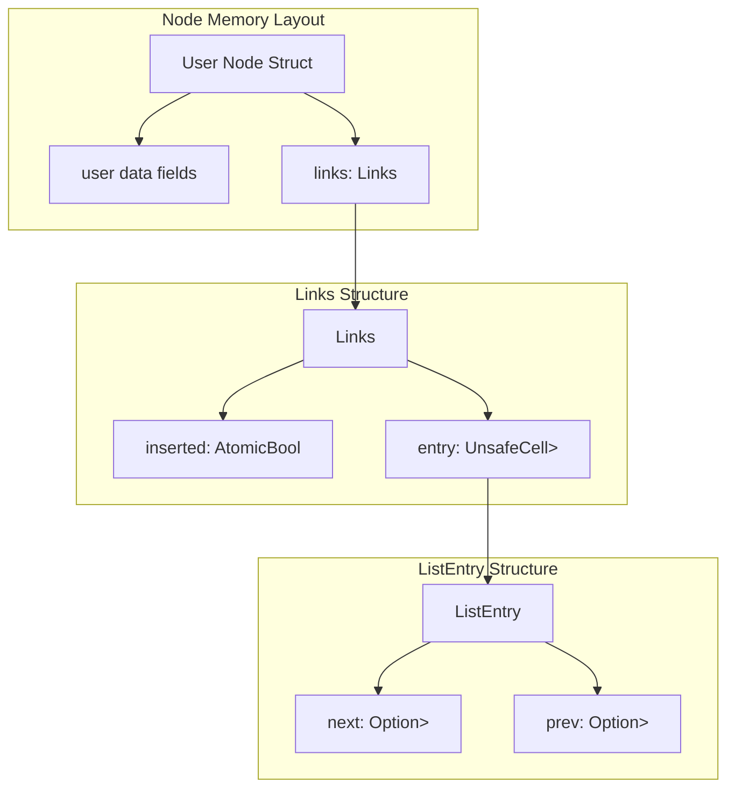
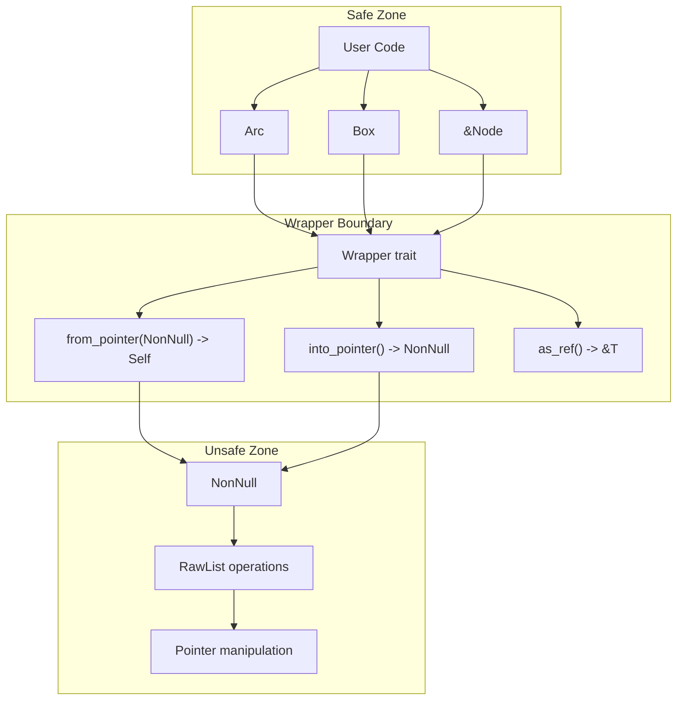
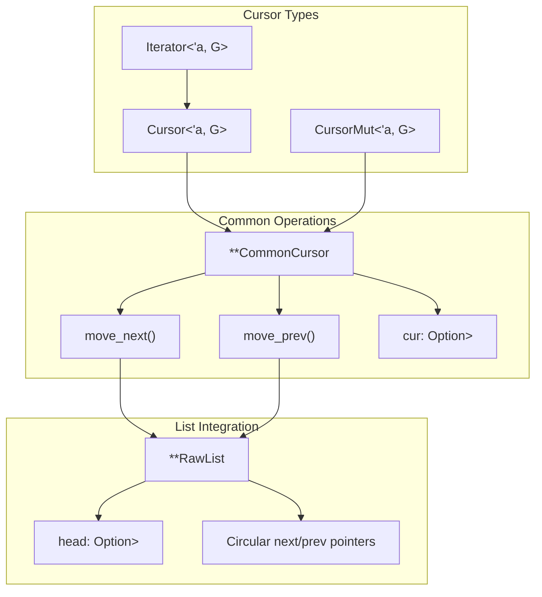

# Core Concepts

> **Relevant source files**
> * [src/linked_list.rs](https://github.com/arceos-org/linked_list_r4l/blob/353828c1/src/linked_list.rs)
> * [src/raw_list.rs](https://github.com/arceos-org/linked_list_r4l/blob/353828c1/src/raw_list.rs)

This page provides a deep dive into the fundamental concepts that enable the linked_list_r4l crate to provide intrusive linked lists with constant-time arbitrary removal and thread safety. It covers the trait system, memory layout, atomic operations, and safety architecture that form the foundation of the library.

For basic usage patterns, see [Quick Start Guide](/arceos-org/linked_list_r4l/2-quick-start-guide). For detailed API documentation, see [API Reference](/arceos-org/linked_list_r4l/4-api-reference). For memory management specifics, see [Memory Management](/arceos-org/linked_list_r4l/5.1-memory-management). For thread safety implementation details, see [Thread Safety](/arceos-org/linked_list_r4l/5.2-thread-safety).

## The GetLinks Trait System

The core of the linked list architecture is built around two key traits that enable intrusive linking while maintaining type safety and flexible ownership models.

### GetLinks Trait

The `GetLinks` trait is the fundamental abstraction that allows any type to participate in a linked list by providing access to embedded linking metadata.



**GetLinks Trait Definition and Usage**

The trait defines two essential components:

* `EntryType`: The type of objects that will be stored in the list
* `get_links()`: A function that returns a reference to the `Links` struct embedded in the entry

This design enables a type to be in multiple different lists simultaneously by implementing `GetLinks` multiple times with different associated types.

### GetLinksWrapped Trait

The `GetLinksWrapped` trait extends `GetLinks` to add ownership management through the `Wrapper` trait, enabling safe memory management across different allocation strategies.



**Trait Relationship and Implementation**

Sources: [src/raw_list.rs(L23 - L29)&emsp;](https://github.com/arceos-org/linked_list_r4l/blob/353828c1/src/raw_list.rs#L23-L29) [src/linked_list.rs(L86 - L96)&emsp;](https://github.com/arceos-org/linked_list_r4l/blob/353828c1/src/linked_list.rs#L86-L96) [src/linked_list.rs(L18 - L31)&emsp;](https://github.com/arceos-org/linked_list_r4l/blob/353828c1/src/linked_list.rs#L18-L31)

## Links and ListEntry Structure

The `Links` struct contains the core linking infrastructure that enables intrusive list membership with atomic insertion tracking.

### Memory Layout and Components



**Links Structure Components**

The `Links<T>` struct contains two critical fields:

1. **`inserted: AtomicBool`** - Atomic flag tracking whether the node is currently inserted in any list
2. **`entry: UnsafeCell<ListEntry<T>>`** - Contains the actual next/prev pointers wrapped in `UnsafeCell` for interior mutability

The `ListEntry<T>` struct contains the doubly-linked list pointers:

* **`next: Option<NonNull<T>>`** - Pointer to the next node in the list
* **`prev: Option<NonNull<T>>`** - Pointer to the previous node in the list

### Atomic Insertion Tracking

The atomic insertion flag provides thread-safe tracking of list membership and prevents double-insertion:

|Operation|Atomic Operation|Memory Ordering|
| --- | --- | --- |
|Insertion|compare_exchange(false, true, Acquire, Relaxed)|Acquire on success|
|Removal|store(false, Release)|Release|
|Check|load(Relaxed)|Relaxed|

Sources: [src/raw_list.rs(L35 - L66)&emsp;](https://github.com/arceos-org/linked_list_r4l/blob/353828c1/src/raw_list.rs#L35-L66) [src/raw_list.rs(L74 - L86)&emsp;](https://github.com/arceos-org/linked_list_r4l/blob/353828c1/src/raw_list.rs#L74-L86)

## Constant-Time Arbitrary Removal

The intrusive design enables O(1) removal of any node from the list without requiring traversal to find the node's neighbors.

### Removal Algorithm

```

```

**Key Algorithmic Properties**

1. **No Traversal Required**: Because each node contains its own links, removal requires no list traversal
2. **Atomic Safety**: The `inserted` flag prevents concurrent modifications during removal
3. **Neighbor Updates**: Only the immediate neighbors need pointer updates
4. **Head Management**: Special handling when removing the head node

The algorithm handles three cases:

* **Single node**: Set `head = None`
* **Head node**: Update `head` to point to next node
* **Interior node**: Update neighbor pointers only

### Insertion Tracking and Race Prevention

```

```

**Race Condition Prevention**

The atomic `inserted` flag prevents several race conditions:

* **Double insertion**: Only one thread can successfully set `inserted` from `false` to `true`
* **Insertion during removal**: Removal always succeeds once a node is inserted
* **Memory ordering**: `Acquire` on insertion synchronizes with `Release` on removal

Sources: [src/raw_list.rs(L57 - L65)&emsp;](https://github.com/arceos-org/linked_list_r4l/blob/353828c1/src/raw_list.rs#L57-L65) [src/raw_list.rs(L199 - L235)&emsp;](https://github.com/arceos-org/linked_list_r4l/blob/353828c1/src/raw_list.rs#L199-L235) [src/raw_list.rs(L140 - L151)&emsp;](https://github.com/arceos-org/linked_list_r4l/blob/353828c1/src/raw_list.rs#L140-L151)

## Memory Safety Architecture

The library implements a layered safety model that transitions from safe ownership management to unsafe pointer operations.

### Safety Boundary and Wrapper Abstraction



**Ownership Model Abstraction**

The `Wrapper` trait abstracts over different ownership models:

|Wrapper Type|Ownership Model|Use Case|
| --- | --- | --- |
|Box<T>|Unique ownership|Single-threaded exclusive access|
|Arc<T>|Shared ownership|Multi-threaded shared access|
|&T|Borrowed reference|Stack-allocated or external lifetime management|

### Safe-to-Unsafe Transition

The transition from safe to unsafe code follows a specific protocol:

1. **Entry**: Safe wrapper objects are converted to raw pointers via `into_pointer()`
2. **Operation**: Unsafe `RawList` operations manipulate the raw pointers
3. **Exit**: Raw pointers are converted back to safe wrappers via `from_pointer()`

This ensures that:

* Memory safety is maintained at the boundaries
* Ownership transfer is explicit and controlled
* Unsafe operations are isolated to the core implementation

Sources: [src/linked_list.rs(L18 - L83)&emsp;](https://github.com/arceos-org/linked_list_r4l/blob/353828c1/src/linked_list.rs#L18-L83) [src/linked_list.rs(L86 - L89)&emsp;](https://github.com/arceos-org/linked_list_r4l/blob/353828c1/src/linked_list.rs#L86-L89) [src/linked_list.rs(L127 - L162)&emsp;](https://github.com/arceos-org/linked_list_r4l/blob/353828c1/src/linked_list.rs#L127-L162)

## Cursors and Iteration

The library provides cursor-based iteration that enables both inspection and mutation of list elements during traversal.

### Cursor Implementation Architecture



**Cursor Navigation Logic**

Cursors navigate the circular list structure by:

1. **Forward movement**: Follow `next` pointers until reaching the head again
2. **Backward movement**: Follow `prev` pointers until reaching the head again
3. **Boundary detection**: Stop iteration when returning to the starting position

The circular structure simplifies navigation logic and eliminates special cases for list boundaries.

### Mutable Cursor Operations

`CursorMut` provides additional operations for list modification during iteration:

|Operation|Description|Safety Requirements|
| --- | --- | --- |
|current()|Get mutable reference to current element|Element must remain valid|
|remove_current()|Remove current element and advance cursor|Returns ownership of removed element|
|peek_next()|Get mutable reference to next element|No cursor advancement|
|peek_prev()|Get mutable reference to previous element|No cursor advancement|

Sources: [src/raw_list.rs(L286 - L329)&emsp;](https://github.com/arceos-org/linked_list_r4l/blob/353828c1/src/raw_list.rs#L286-L329) [src/raw_list.rs(L339 - L423)&emsp;](https://github.com/arceos-org/linked_list_r4l/blob/353828c1/src/raw_list.rs#L339-L423) [src/raw_list.rs(L433 - L464)&emsp;](https://github.com/arceos-org/linked_list_r4l/blob/353828c1/src/raw_list.rs#L433-L464)