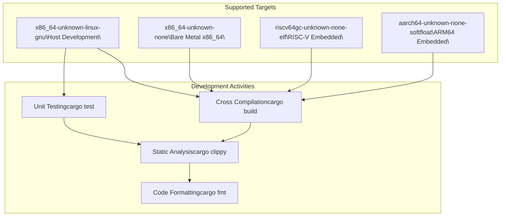
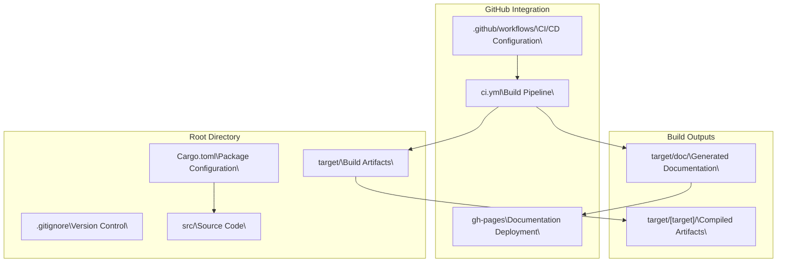
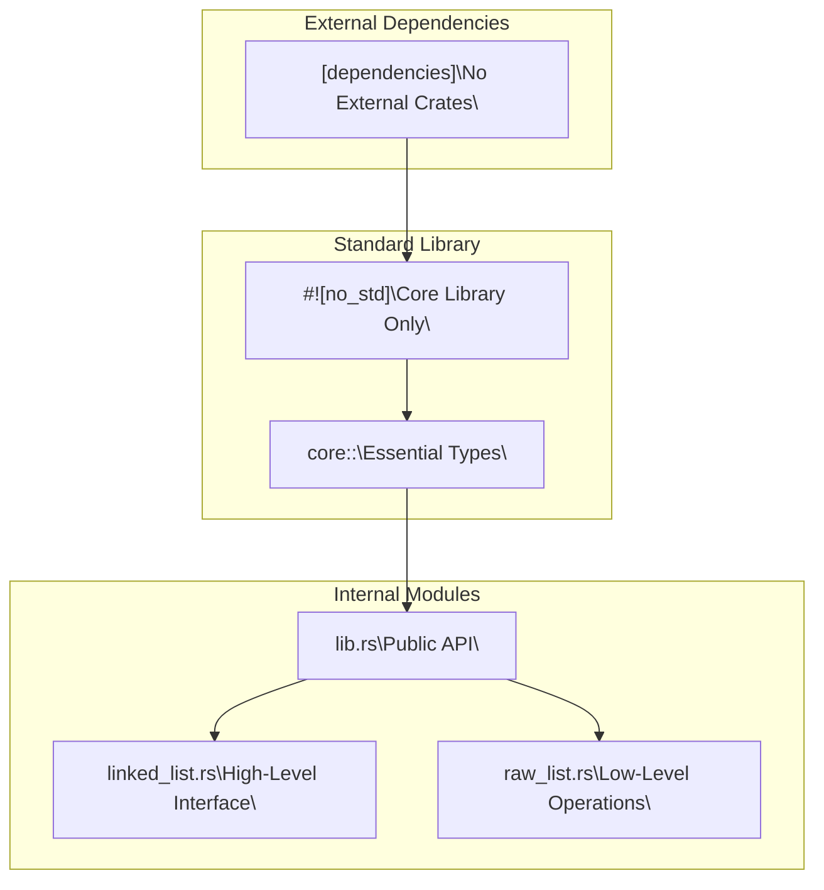
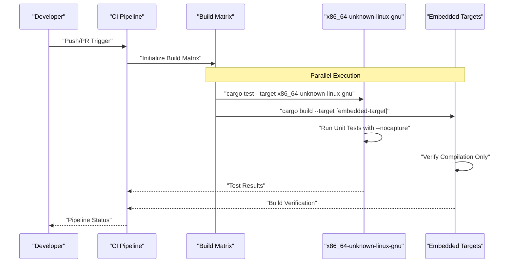
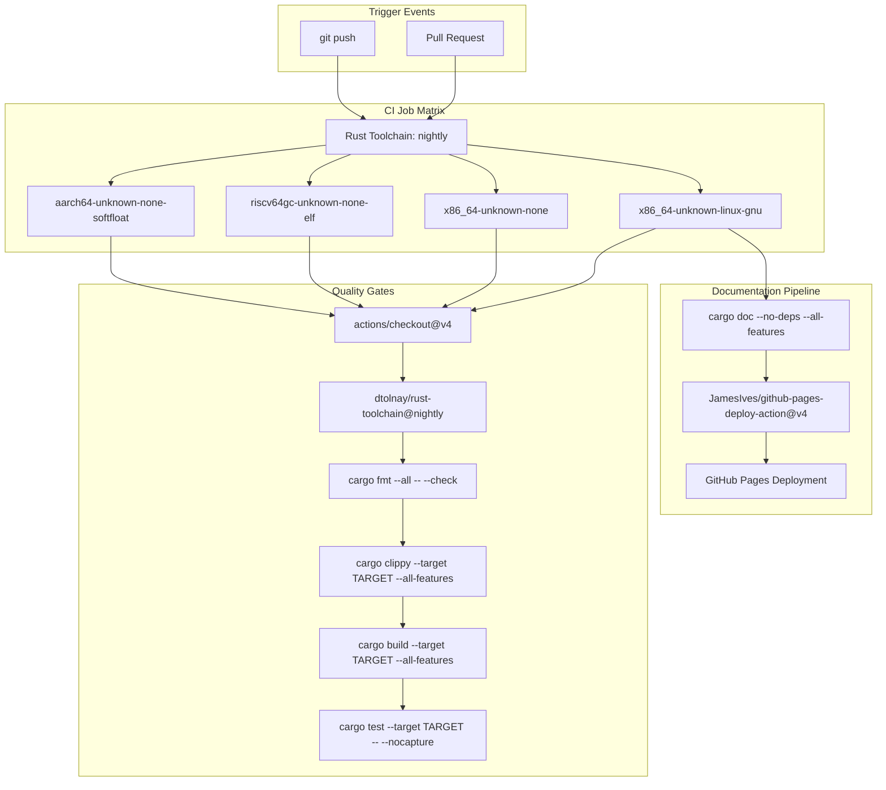
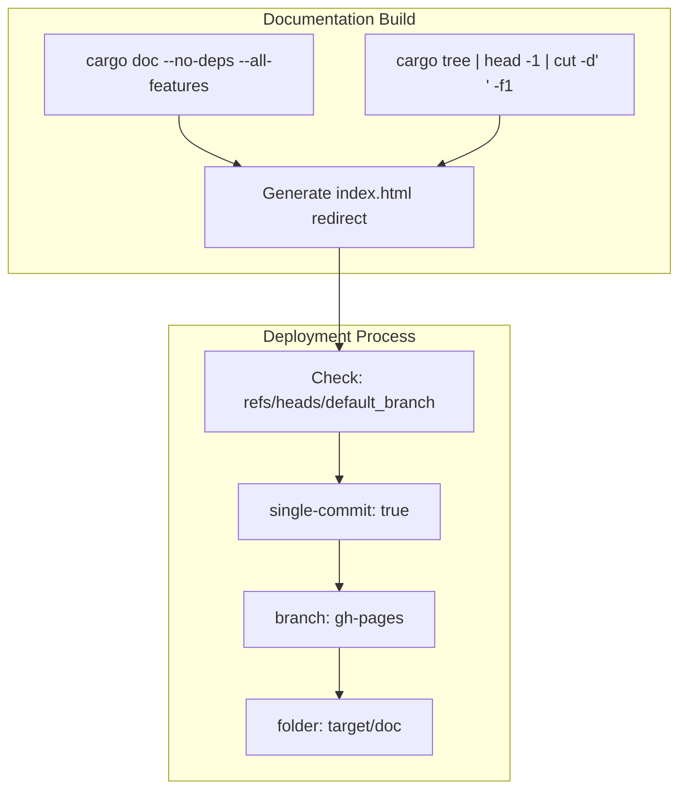

# Development Guide

> **Relevant source files**
> * [.github/workflows/ci.yml](https://github.com/arceos-org/linked_list_r4l/blob/353828c1/.github/workflows/ci.yml)
> * [.gitignore](https://github.com/arceos-org/linked_list_r4l/blob/353828c1/.gitignore)
> * [Cargo.toml](https://github.com/arceos-org/linked_list_r4l/blob/353828c1/Cargo.toml)

## Purpose and Scope

This guide provides essential information for developers contributing to the `linked_list_r4l` crate. It covers build setup, testing procedures, CI/CD pipeline configuration, and project structure. For information about the library's APIs and usage patterns, see [API Reference](/arceos-org/linked_list_r4l/4-api-reference). For architectural concepts and design principles, see [Architecture Overview](/arceos-org/linked_list_r4l/3-architecture-overview) and [Core Concepts](/arceos-org/linked_list_r4l/5-core-concepts).

## Prerequisites and Environment Setup

The `linked_list_r4l` crate requires specific toolchain components and supports multiple target architectures for embedded and systems programming use cases.

### Required Toolchain

|Component|Version|Purpose|
| --- | --- | --- |
|Rust Toolchain|nightly|Required for advanced features|
|rust-src|Latest|Source code for cross-compilation|
|clippy|Latest|Linting and code analysis|
|rustfmt|Latest|Code formatting|

### Supported Target Architectures

The project supports multiple target architectures as defined in the CI pipeline:



Sources: [.github/workflows/ci.yml(L12)&emsp;](https://github.com/arceos-org/linked_list_r4l/blob/353828c1/.github/workflows/ci.yml#L12-L12) [.github/workflows/ci.yml(L15 - L19)&emsp;](https://github.com/arceos-org/linked_list_r4l/blob/353828c1/.github/workflows/ci.yml#L15-L19)

## Project Structure

The `linked_list_r4l` crate follows a standard Rust library structure with specialized CI/CD configuration for embedded systems development.

### Repository Layout



Sources: [Cargo.toml(L1 - L15)&emsp;](https://github.com/arceos-org/linked_list_r4l/blob/353828c1/Cargo.toml#L1-L15) [.gitignore(L1 - L5)&emsp;](https://github.com/arceos-org/linked_list_r4l/blob/353828c1/.gitignore#L1-L5) [.github/workflows/ci.yml(L1)&emsp;](https://github.com/arceos-org/linked_list_r4l/blob/353828c1/.github/workflows/ci.yml#L1-L1)

## Build System Configuration

The crate is configured as a `no-std` library with no external dependencies, making it suitable for embedded environments.

### Package Metadata

The project configuration emphasizes systems programming and embedded compatibility:

|Property|Value|Significance|
| --- | --- | --- |
|name|linked_list_r4l|Crate identifier|
|version|0.2.1|Current release version|
|edition|2021|Rust edition with latest features|
|categories|["no-std", "rust-patterns"]|Embedded and pattern library|
|license|GPL-2.0-or-later|Open source license|

### Dependency Management



Sources: [Cargo.toml(L14 - L15)&emsp;](https://github.com/arceos-org/linked_list_r4l/blob/353828c1/Cargo.toml#L14-L15) [Cargo.toml(L12)&emsp;](https://github.com/arceos-org/linked_list_r4l/blob/353828c1/Cargo.toml#L12-L12)

## Testing Framework

The testing infrastructure supports both unit testing and cross-compilation verification across multiple target architectures.

### Test Execution Strategy



### Test Configuration

Unit tests are executed only on the host target (`x86_64-unknown-linux-gnu`) while other targets verify compilation compatibility:

```markdown
# Host target with unit tests
cargo test --target x86_64-unknown-linux-gnu -- --nocapture

# Cross-compilation verification
cargo build --target x86_64-unknown-none --all-features
cargo build --target riscv64gc-unknown-none-elf --all-features  
cargo build --target aarch64-unknown-none-softfloat --all-features
```

Sources: [.github/workflows/ci.yml(L28 - L30)&emsp;](https://github.com/arceos-org/linked_list_r4l/blob/353828c1/.github/workflows/ci.yml#L28-L30) [.github/workflows/ci.yml(L26 - L27)&emsp;](https://github.com/arceos-org/linked_list_r4l/blob/353828c1/.github/workflows/ci.yml#L26-L27)

## CI/CD Pipeline Architecture

The continuous integration system implements a comprehensive quality assurance workflow with parallel job execution and automated documentation deployment.

### Pipeline Workflow



### Pipeline Configuration Details

|Stage|Command|Target Filter|Purpose|
| --- | --- | --- | --- |
|Format Check|cargo fmt --all -- --check|All targets|Code style consistency|
|Linting|cargo clippy --target TARGET --all-features|All targets|Static analysis|
|Build|cargo build --target TARGET --all-features|All targets|Compilation verification|
|Testing|cargo test --target TARGET -- --nocapture|Host only|Unit test execution|
|Documentation|cargo doc --no-deps --all-features|Default|API documentation|

Sources: [.github/workflows/ci.yml(L5 - L31)&emsp;](https://github.com/arceos-org/linked_list_r4l/blob/353828c1/.github/workflows/ci.yml#L5-L31) [.github/workflows/ci.yml(L32 - L55)&emsp;](https://github.com/arceos-org/linked_list_r4l/blob/353828c1/.github/workflows/ci.yml#L32-L55)

## Code Quality Standards

The project enforces strict code quality standards through automated tooling and custom configuration.

### Linting Configuration

The clippy configuration includes specific allowances for library design patterns:

```
cargo clippy --target TARGET --all-features -- -A clippy::new_without_default
```

This configuration allows constructors that don't implement `Default`, which is appropriate for specialized data structures like linked lists.

### Documentation Standards

Documentation generation includes strict validation:

```
RUSTDOCFLAGS="-D rustdoc::broken_intra_doc_links -D missing-docs"
```

This configuration:

* Treats broken documentation links as compilation errors (`-D rustdoc::broken_intra_doc_links`)
* Requires documentation for all public APIs (`-D missing-docs`)

### Documentation Deployment



Sources: [.github/workflows/ci.yml(L25)&emsp;](https://github.com/arceos-org/linked_list_r4l/blob/353828c1/.github/workflows/ci.yml#L25-L25) [.github/workflows/ci.yml(L40)&emsp;](https://github.com/arceos-org/linked_list_r4l/blob/353828c1/.github/workflows/ci.yml#L40-L40) [.github/workflows/ci.yml(L44 - L55)&emsp;](https://github.com/arceos-org/linked_list_r4l/blob/353828c1/.github/workflows/ci.yml#L44-L55)

## Contributing Workflow

### Development Environment Setup

1. **Install Rust Nightly Toolchain**

```
rustup toolchain install nightly
rustup component add rust-src clippy rustfmt
```
2. **Add Target Architectures**

```
rustup target add x86_64-unknown-none
rustup target add riscv64gc-unknown-none-elf
rustup target add aarch64-unknown-none-softfloat
```
3. **Verify Installation**

```
rustc --version --verbose
```

### Pre-commit Validation

Before submitting changes, run the complete validation suite locally:

```markdown
# Format check
cargo fmt --all -- --check

# Linting
cargo clippy --all-features -- -A clippy::new_without_default

# Cross-compilation verification
cargo build --target x86_64-unknown-none --all-features
cargo build --target riscv64gc-unknown-none-elf --all-features
cargo build --target aarch64-unknown-none-softfloat --all-features

# Unit tests
cargo test -- --nocapture

# Documentation build
cargo doc --no-deps --all-features
```

This local validation mirrors the CI pipeline and helps catch issues before pushing to the repository.

Sources: [.github/workflows/ci.yml(L20 - L30)&emsp;](https://github.com/arceos-org/linked_list_r4l/blob/353828c1/.github/workflows/ci.yml#L20-L30) [.github/workflows/ci.yml(L44 - L47)&emsp;](https://github.com/arceos-org/linked_list_r4l/blob/353828c1/.github/workflows/ci.yml#L44-L47)