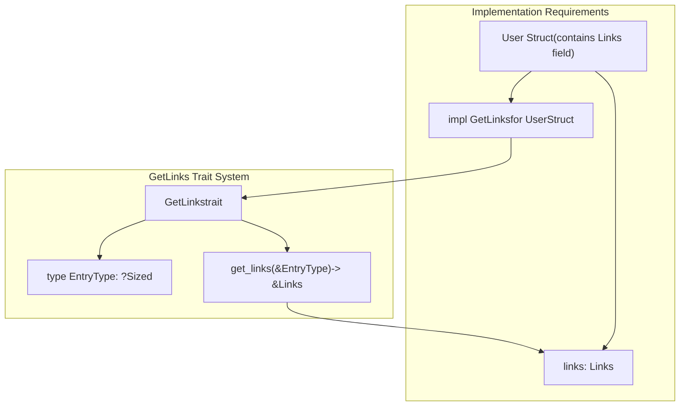
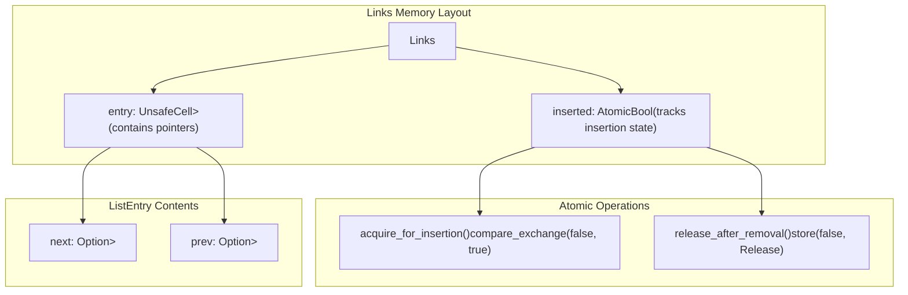
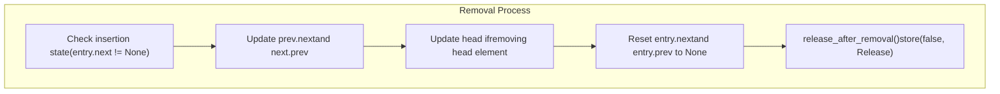
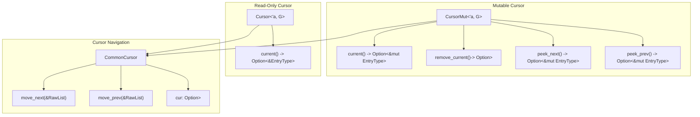
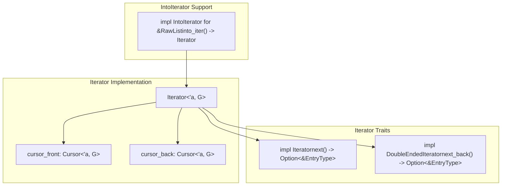
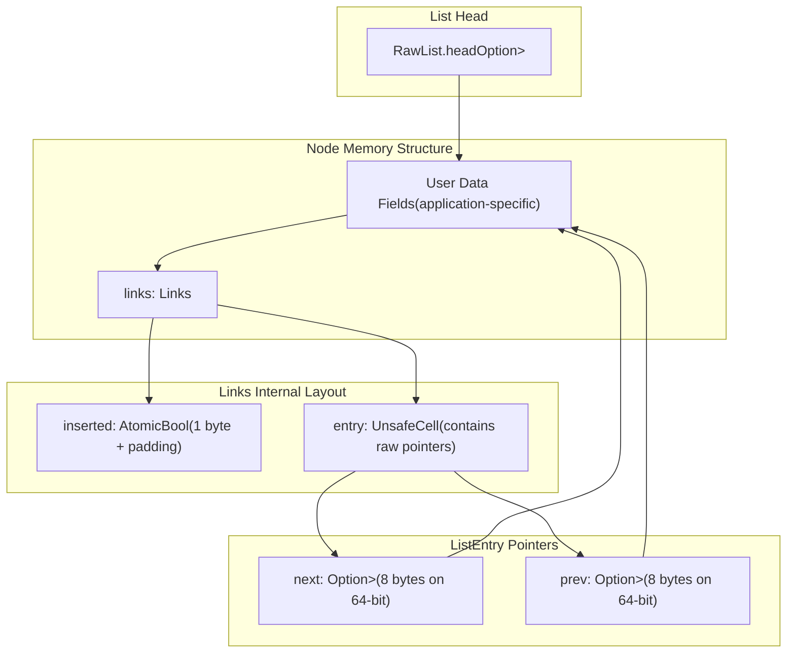

# Low-Level API

> **Relevant source files**
> * [src/raw_list.rs](https://github.com/arceos-org/linked_list_r4l/blob/353828c1/src/raw_list.rs)

This page documents the unsafe, low-level API provided by the `RawList<G: GetLinks>` interface for advanced users who need direct control over memory management and performance-critical operations. This layer operates with raw pointers and requires careful attention to memory safety invariants.

For safe ownership management and wrapper abstractions, see [Advanced API](/arceos-org/linked_list_r4l/4.2-advanced-api). For the user-friendly macro-generated interface, see [User-Friendly API](/arceos-org/linked_list_r4l/4.1-user-friendly-api).

## Core Types and Traits

The low-level API is built around three primary types that work together to provide intrusive linked list functionality.

### GetLinks Trait

The `GetLinks` trait serves as the fundamental abstraction that allows any type to be stored in a linked list by providing access to embedded link fields.

**Core GetLinks Implementation Pattern**

The trait defines two key components: an associated type `EntryType` that represents the type of objects stored in the list, and a method `get_links()` that returns a reference to the embedded `Links<T>` structure.

Sources: [src/raw_list.rs(L23 - L29)&emsp;](https://github.com/arceos-org/linked_list_r4l/blob/353828c1/src/raw_list.rs#L23-L29)

### Links Structure

The `Links<T>` structure contains the actual linked list pointers and provides atomic insertion tracking to prevent double-insertion and enable constant-time removal.

**Atomic Insertion Tracking**

The `inserted` field uses atomic compare-and-swap operations to ensure thread-safe insertion tracking. The `acquire_for_insertion()` method attempts to atomically change the state from `false` to `true`, preventing double-insertion.

Sources: [src/raw_list.rs(L35 - L66)&emsp;](https://github.com/arceos-org/linked_list_r4l/blob/353828c1/src/raw_list.rs#L35-L66) [src/raw_list.rs(L74 - L86)&emsp;](https://github.com/arceos-org/linked_list_r4l/blob/353828c1/src/raw_list.rs#L74-L86)

### RawList Structure

```mermaid
flowchart TD
subgraph subGraph3["Iteration Support"]
    Iter["iter() -> Iterator"]
    CursorFront["cursor_front_mut()-> CursorMut"]
end
subgraph subGraph2["Query Operations"]
    IsEmpty["is_empty() -> bool"]
    Front["front() -> Option>"]
    Back["back() -> Option>"]
end
subgraph subGraph1["Primary Operations"]
    PushBack["push_back(&EntryType)-> bool"]
    PushFront["push_front(&EntryType)-> bool"]
    Remove["remove(&EntryType)-> bool"]
    PopFront["pop_front()-> Option>"]
    InsertAfter["insert_after(&existing, &new)-> bool"]
end
subgraph subGraph0["RawList"]
    RawListStruct["RawList"]
    HeadPtr["head: Option>"]
end

RawListStruct --> Back
RawListStruct --> CursorFront
RawListStruct --> Front
RawListStruct --> HeadPtr
RawListStruct --> InsertAfter
RawListStruct --> IsEmpty
RawListStruct --> Iter
RawListStruct --> PopFront
RawListStruct --> PushBack
RawListStruct --> PushFront
RawListStruct --> Remove
```

The `RawList<G: GetLinks>` provides the core linked list operations using raw pointer manipulation.

Sources: [src/raw_list.rs(L88 - L284)&emsp;](https://github.com/arceos-org/linked_list_r4l/blob/353828c1/src/raw_list.rs#L88-L284)

## List Operations

### Insertion Operations

The RawList provides several insertion methods that work with raw references and return boolean values indicating success or failure.

|Operation|Method|Safety Requirements|Return Value|
| --- | --- | --- | --- |
|Back Insertion|push_back(&EntryType)|Reference must remain valid while on list|bool- true if inserted, false if already on list|
|Front Insertion|push_front(&EntryType)|Reference must remain valid while on list|bool- true if inserted, false if already on list|
|Positional Insertion|insert_after(&existing, &new)|Both references valid, existing must be on list|bool- true if inserted, false if new already on list|

**Insertion Safety Model**

All insertion operations use the atomic `acquire_for_insertion()` mechanism to prevent double-insertion. The operations are marked `unsafe` because the caller must ensure reference validity for the lifetime of list membership.

Sources: [src/raw_list.rs(L153 - L197)&emsp;](https://github.com/arceos-org/linked_list_r4l/blob/353828c1/src/raw_list.rs#L153-L197) [src/raw_list.rs(L135 - L151)&emsp;](https://github.com/arceos-org/linked_list_r4l/blob/353828c1/src/raw_list.rs#L135-L151)

### Removal Operations

Removal operations provide constant-time complexity by updating surrounding pointers directly without traversal.

**Constant-Time Removal Implementation**

The `remove_internal()` method achieves O(1) complexity by directly accessing the target element's links rather than traversing the list. The atomic release operation ensures thread-safe state management.

Sources: [src/raw_list.rs(L199 - L245)&emsp;](https://github.com/arceos-org/linked_list_r4l/blob/353828c1/src/raw_list.rs#L199-L245) [src/raw_list.rs(L247 - L257)&emsp;](https://github.com/arceos-org/linked_list_r4l/blob/353828c1/src/raw_list.rs#L247-L257)

## Cursor System

The cursor system provides controlled traversal and modification capabilities for the linked list.

### Cursor Types

|Cursor Type|Mutability|Capabilities|
| --- | --- | --- |
|Cursor<'a, G>|Immutable|Read-only traversal, element inspection|
|CursorMut<'a, G>|Mutable|Traversal, element modification, removal|

### Cursor Operations

**Cursor Safety Model**

Cursors maintain lifetime relationships with the underlying list to prevent use-after-free scenarios. The mutable cursor provides safe removal operations that automatically advance the cursor position.

Sources: [src/raw_list.rs(L339 - L423)&emsp;](https://github.com/arceos-org/linked_list_r4l/blob/353828c1/src/raw_list.rs#L339-L423) [src/raw_list.rs(L286 - L329)&emsp;](https://github.com/arceos-org/linked_list_r4l/blob/353828c1/src/raw_list.rs#L286-L329)

## Iterator Implementation

The iterator system provides both forward and backward traversal capabilities.

### Iterator Structure

**Bidirectional Iteration**

The iterator uses two cursors to enable efficient bidirectional traversal, supporting both `Iterator` and `DoubleEndedIterator` traits for compatibility with standard Rust iteration patterns.

Sources: [src/raw_list.rs(L434 - L464)&emsp;](https://github.com/arceos-org/linked_list_r4l/blob/353828c1/src/raw_list.rs#L434-L464) [src/raw_list.rs(L425 - L431)&emsp;](https://github.com/arceos-org/linked_list_r4l/blob/353828c1/src/raw_list.rs#L425-L431)

## Memory Layout and Safety Invariants

### Thread Safety Model

The RawList implements thread safety through atomic operations and careful ordering constraints.

|Component|Thread Safety Mechanism|Ordering|
| --- | --- | --- |
|Insertion Tracking|AtomicBoolwith compare-exchange|Acquireon insert,Relaxedon failure|
|Removal State|AtomicBoolstore operation|Releaseordering|
|Pointer Access|UnsafeCellwith controlled access|Synchronized through insertion state|

**Safety Invariants**

1. **Link Ownership**: Once successfully inserted, the list owns the links until removal
2. **Reference Validity**: Callers must ensure references remain valid while on the list
3. **Single List Membership**: An element can only be on one list at a time (enforced by atomic insertion tracking)
4. **Removal Safety**: Only elements currently on the list may be removed

Sources: [src/raw_list.rs(L40 - L46)&emsp;](https://github.com/arceos-org/linked_list_r4l/blob/353828c1/src/raw_list.rs#L40-L46) [src/raw_list.rs(L331 - L337)&emsp;](https://github.com/arceos-org/linked_list_r4l/blob/353828c1/src/raw_list.rs#L331-L337)

### Memory Layout Diagram

Sources: [src/raw_list.rs(L35 - L38)&emsp;](https://github.com/arceos-org/linked_list_r4l/blob/353828c1/src/raw_list.rs#L35-L38) [src/raw_list.rs(L74 - L77)&emsp;](https://github.com/arceos-org/linked_list_r4l/blob/353828c1/src/raw_list.rs#L74-L77) [src/raw_list.rs(L93 - L95)&emsp;](https://github.com/arceos-org/linked_list_r4l/blob/353828c1/src/raw_list.rs#L93-L95)