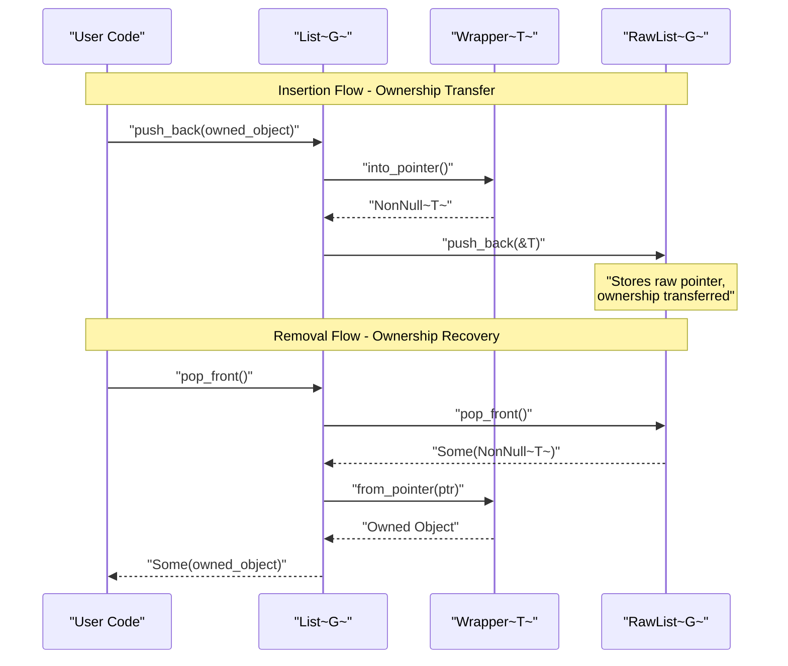
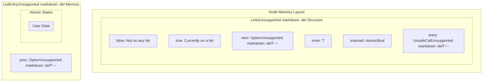
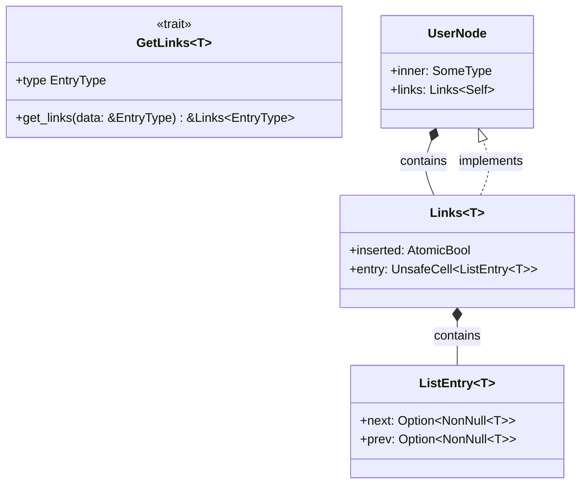
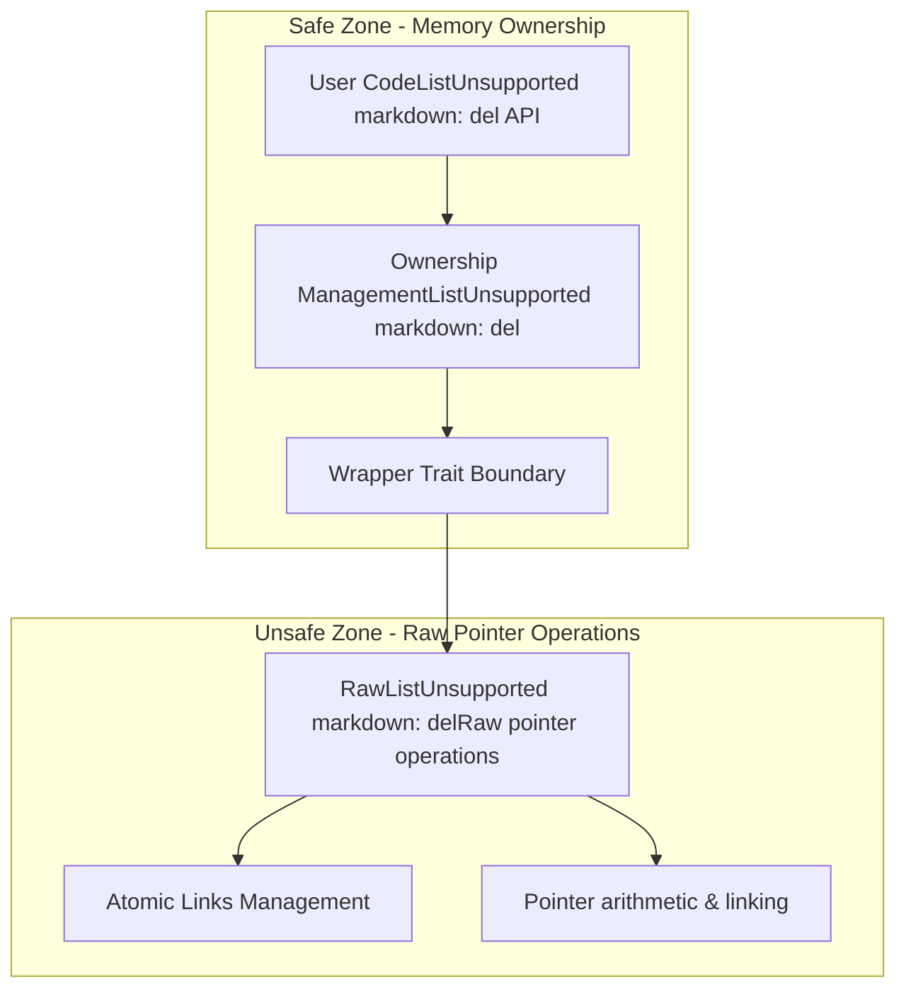

# Memory Management

> **Relevant source files**
> * [src/linked_list.rs](https://github.com/arceos-org/linked_list_r4l/blob/353828c1/src/linked_list.rs)
> * [src/raw_list.rs](https://github.com/arceos-org/linked_list_r4l/blob/353828c1/src/raw_list.rs)

This document explains how the `linked_list_r4l` crate manages memory safety, ownership models, and the boundary between safe and unsafe code. It covers the ownership abstraction through the `Wrapper` trait, atomic memory operations, and the embedded links structure that enables constant-time removal. For information about thread safety and atomic operations, see [Thread Safety](/arceos-org/linked_list_r4l/5.2-thread-safety).

## Ownership Models and the Wrapper Trait

The library supports multiple ownership models through the `Wrapper<T>` trait, which abstracts over different ways of managing object lifetime. This allows the same linked list implementation to work with heap-allocated objects, reference-counted objects, and borrowed references.

### Wrapper Trait Implementation

```mermaid
classDiagram
class Wrapper~T~ {
    <<trait>>
    
    +into_pointer() NonNull~T~
    +from_pointer(NonNull~T~) Self
    +as_ref() &T
}

class BoxUnsupported markdown: del {
    
    +into_pointer() NonNull~T~
    +from_pointer(NonNull~T~) Box~T~
    +as_ref() &T
}

class ArcUnsupported markdown: del {
    
    +into_pointer() NonNull~T~
    +from_pointer(NonNull~T~) Arc~T~
    +as_ref() &T
}

class &T {
    
    +into_pointer() NonNull~T~
    +from_pointer(NonNull~T~) &T
    +as_ref() &T
}

Wrapper  ..|>  Wrapper
Wrapper  ..|>  Wrapper
Wrapper  ..|>  Wrapper
```

The `Wrapper<T>` trait provides three key operations:

* `into_pointer()` converts owned objects to raw pointers for list storage
* `from_pointer()` reconstructs ownership when removing from the list
* `as_ref()` provides safe access without transferring ownership

**Sources:** [src/linked_list.rs(L18 - L31)&emsp;](https://github.com/arceos-org/linked_list_r4l/blob/353828c1/src/linked_list.rs#L18-L31) [src/linked_list.rs(L33 - L83)&emsp;](https://github.com/arceos-org/linked_list_r4l/blob/353828c1/src/linked_list.rs#L33-L83)

### Ownership Transfer Flow



This flow ensures that ownership is properly transferred to the list during insertion and recovered during removal, preventing memory leaks and use-after-free errors.

**Sources:** [src/linked_list.rs(L153 - L162)&emsp;](https://github.com/arceos-org/linked_list_r4l/blob/353828c1/src/linked_list.rs#L153-L162) [src/linked_list.rs(L213 - L217)&emsp;](https://github.com/arceos-org/linked_list_r4l/blob/353828c1/src/linked_list.rs#L213-L217)

## Memory Layout and Links Structure

Each node in the linked list contains an embedded `Links<T>` structure that manages the actual list pointers and insertion state. This design enables constant-time arbitrary removal without requiring traversal.

### Node Memory Layout



The `Links<T>` structure contains:

* `inserted`: An `AtomicBool` tracking whether the node is currently on a list
* `entry`: An `UnsafeCell<ListEntry<T>>` containing the actual forward/backward pointers

**Sources:** [src/raw_list.rs(L35 - L38)&emsp;](https://github.com/arceos-org/linked_list_r4l/blob/353828c1/src/raw_list.rs#L35-L38) [src/raw_list.rs(L74 - L86)&emsp;](https://github.com/arceos-org/linked_list_r4l/blob/353828c1/src/raw_list.rs#L74-L86)

### GetLinks Trait Integration

The `GetLinks` trait provides access to the embedded `Links<T>` structure within user-defined types:



**Sources:** [src/raw_list.rs(L23 - L29)&emsp;](https://github.com/arceos-org/linked_list_r4l/blob/353828c1/src/raw_list.rs#L23-L29) [src/raw_list.rs(L35 - L55)&emsp;](https://github.com/arceos-org/linked_list_r4l/blob/353828c1/src/raw_list.rs#L35-L55)

## Safety Boundaries and Abstraction Layers

The library maintains memory safety through a carefully designed abstraction hierarchy that isolates unsafe operations to the lowest layer.

### Safety Layer Architecture



### Memory Safety Guarantees

The safety boundaries provide these guarantees:

|Layer|Safety Mechanism|Guarantees|
| --- | --- | --- |
|User API|Rust ownership system|No use-after-free, no double-free|
|Wrapper Boundary|Controlled pointer conversion|Ownership tracking across boundaries|
|Raw Operations|Unsafe blocks with invariants|Pointer validity maintained|
|Atomic Operations|Memory ordering constraints|Thread-safe state transitions|

**Sources:** [src/linked_list.rs(L127 - L235)&emsp;](https://github.com/arceos-org/linked_list_r4l/blob/353828c1/src/linked_list.rs#L127-L235) [src/raw_list.rs(L97 - L284)&emsp;](https://github.com/arceos-org/linked_list_r4l/blob/353828c1/src/raw_list.rs#L97-L284)

## Atomic Memory Management

The `Links<T>` structure uses atomic operations to prevent double-insertion and ensure thread-safe state transitions.

### Atomic Insertion Protocol

```

```

The atomic protocol ensures:

* Only one thread can successfully insert a node at a time
* Nodes cannot be inserted twice without being removed first
* Memory ordering prevents reordering of pointer updates

**Sources:** [src/raw_list.rs(L57 - L65)&emsp;](https://github.com/arceos-org/linked_list_r4l/blob/353828c1/src/raw_list.rs#L57-L65)

### Atomic Operations Implementation

The key atomic methods in `Links<T>`:

```rust
// From src/raw_list.rs:57-65
fn acquire_for_insertion(&self) -> bool {
    self.inserted
        .compare_exchange(false, true, Ordering::Acquire, Ordering::Relaxed)
        .is_ok()
}

fn release_after_removal(&self) {
    self.inserted.store(false, Ordering::Release);
}
```

* `acquire_for_insertion()` uses compare-and-swap with `Acquire` ordering
* `release_after_removal()` uses `Release` ordering for proper synchronization
* Failed insertion attempts indicate the node is already on a list

**Sources:** [src/raw_list.rs(L57 - L65)&emsp;](https://github.com/arceos-org/linked_list_r4l/blob/353828c1/src/raw_list.rs#L57-L65)

## Raw Pointer Operations and Memory Invariants

The `RawList<G>` layer performs all raw pointer manipulation while maintaining critical memory safety invariants.

### RawList Memory Invariants

```

```

### Critical Memory Operations

The most complex memory operations involve updating multiple pointers atomically:

|Operation|Memory Updates|Safety Requirements|
| --- | --- | --- |
|push_back()|Update head, link new node|Node not already inserted|
|insert_after()|Update 3 nodes' pointers|Existing node on this list|
|remove()|Update 2 neighbors, reset node|Node on this list|
|pop_front()|Update head, unlink node|List not empty|

Each operation maintains the circular doubly-linked structure while ensuring that partially-updated states are never visible to other threads.

**Sources:** [src/raw_list.rs(L113 - L284)&emsp;](https://github.com/arceos-org/linked_list_r4l/blob/353828c1/src/raw_list.rs#L113-L284)