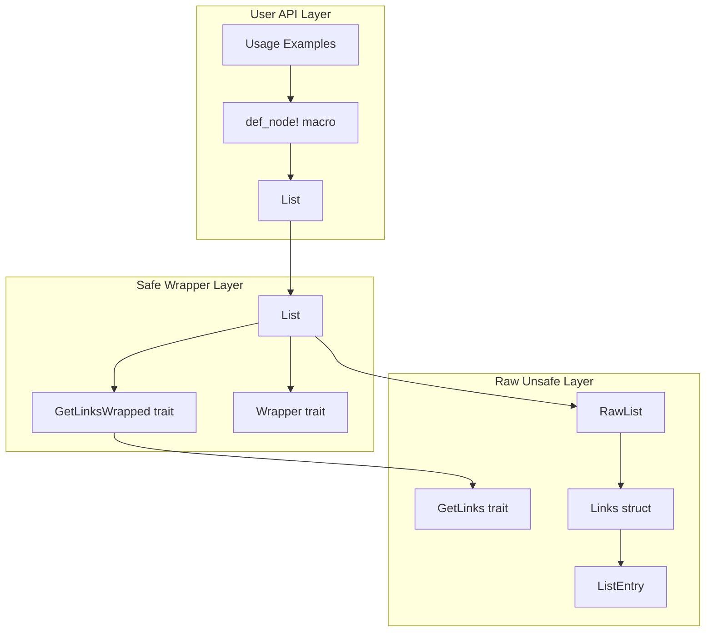
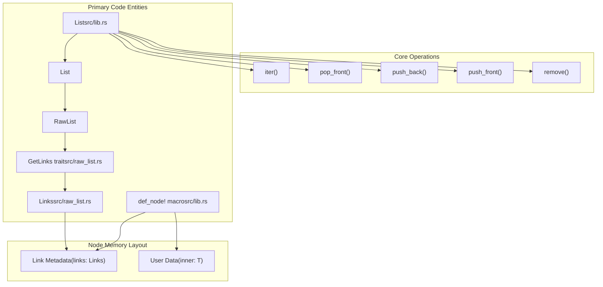

# Overview

> **Relevant source files**
> * [Cargo.toml](https://github.com/arceos-org/linked_list_r4l/blob/353828c1/Cargo.toml)
> * [README.md](https://github.com/arceos-org/linked_list_r4l/blob/353828c1/README.md)

This document provides an overview of the `linked_list_r4l` crate, a Rust library that implements intrusive linked lists with constant-time arbitrary removal capabilities. It covers the crate's purpose, key features, architecture, and position within the ArceOS ecosystem.

For detailed usage examples, see [Quick Start Guide](/arceos-org/linked_list_r4l/2-quick-start-guide). For comprehensive API documentation, see [API Reference](/arceos-org/linked_list_r4l/4-api-reference). For advanced concepts like memory management and thread safety, see [Core Concepts](/arceos-org/linked_list_r4l/5-core-concepts).

## Purpose and Scope

The `linked_list_r4l` crate provides linked lists that support arbitrary removal of nodes in constant time O(1), regardless of the node's position in the list. This capability is achieved through an intrusive design where list metadata is embedded directly within the nodes themselves, eliminating the need to traverse the list to find and remove specific elements.

The library is designed for systems programming contexts where performance predictability is critical, particularly in kernel and embedded environments. It originated from the Rust-for-Linux project and has been adapted for use in the ArceOS operating system kernel.

**Sources:** [Cargo.toml(L6)&emsp;](https://github.com/arceos-org/linked_list_r4l/blob/353828c1/Cargo.toml#L6-L6) [README.md(L7 - L11)&emsp;](https://github.com/arceos-org/linked_list_r4l/blob/353828c1/README.md#L7-L11)

## Key Features

|Feature|Description|Benefit|
| --- | --- | --- |
|Constant-time removal|Remove any node in O(1) time|Predictable performance for real-time systems|
|Thread safety|Atomic operations with insertion tracking|Safe concurrent access patterns|
|Multiple ownership models|Support forBox<T>,Arc<T>, and&T|Flexible memory management strategies|
|Zero-cost abstractions|Compile-time polymorphism via traits|No runtime overhead|
|no-stdcompatible|Works in embedded and kernel contexts|Suitable for constrained environments|

**Sources:** [Cargo.toml(L6 - L12)&emsp;](https://github.com/arceos-org/linked_list_r4l/blob/353828c1/Cargo.toml#L6-L12) [README.md(L7)&emsp;](https://github.com/arceos-org/linked_list_r4l/blob/353828c1/README.md#L7-L7)

## Architecture Overview

The crate implements a three-layer architecture that balances safety, performance, and usability:

**Three-Layer Architecture**

* **User API Layer**: Provides convenient macros and simple interfaces for common use cases
* **Safe Wrapper Layer**: Manages memory ownership and provides safe abstractions over raw operations
* **Raw Unsafe Layer**: Implements core linked list algorithms using unsafe pointer operations

**Sources:** Architecture diagrams, [README.md(L15 - L62)&emsp;](https://github.com/arceos-org/linked_list_r4l/blob/353828c1/README.md#L15-L62)

## Core Components and Code Entities

The following diagram maps the main system concepts to their corresponding code entities:

**Key Code Entities:**

* **`Links<T>`**: Contains the intrusive link metadata embedded in each node
* **`GetLinks` trait**: Provides access to a type's embedded `Links<T>` instance
* **`RawList<G>`**: Implements core unsafe linked list operations
* **`List<G>` (linked_list.rs)**: Safe wrapper managing ownership via `Wrapper` trait
* **`List<T>` (lib.rs)**: User-friendly API for common cases
* **`def_node!` macro**: Generates node structs with embedded links

**Sources:** [README.md(L16 - L31)&emsp;](https://github.com/arceos-org/linked_list_r4l/blob/353828c1/README.md#L16-L31) Architecture diagrams

## Position in ArceOS Ecosystem

The `linked_list_r4l` crate serves as a foundational data structure within the ArceOS operating system kernel. Its constant-time removal capability makes it suitable for:

* **Task scheduling**: Efficient manipulation of process/thread queues
* **Memory management**: Managing free block lists with predictable performance
* **Device drivers**: Maintaining I/O request queues with guaranteed latency bounds
* **Interrupt handling**: Time-critical data structure operations

The crate's `no-std` compatibility and zero-cost abstractions align with ArceOS's goals of providing a high-performance, safe kernel implementation.

**Sources:** [Cargo.toml(L8 - L12)&emsp;](https://github.com/arceos-org/linked_list_r4l/blob/353828c1/Cargo.toml#L8-L12) [README.md(L9 - L11)&emsp;](https://github.com/arceos-org/linked_list_r4l/blob/353828c1/README.md#L9-L11)

## Getting Started

To begin using this crate:

1. **Basic usage**: See [Quick Start Guide](/arceos-org/linked_list_r4l/2-quick-start-guide) for immediate examples
2. **API details**: Consult [API Reference](/arceos-org/linked_list_r4l/4-api-reference) for comprehensive interface documentation
3. **Advanced topics**: Review [Core Concepts](/arceos-org/linked_list_r4l/5-core-concepts) for memory management and thread safety patterns
4. **Development**: See [Development Guide](/arceos-org/linked_list_r4l/6-development-guide) for contribution guidelines

The typical usage pattern involves defining nodes with the `def_node!` macro, creating a `List<T>` instance, and performing standard list operations with the guarantee of constant-time arbitrary removal.

**Sources:** [README.md(L13 - L62)&emsp;](https://github.com/arceos-org/linked_list_r4l/blob/353828c1/README.md#L13-L62)