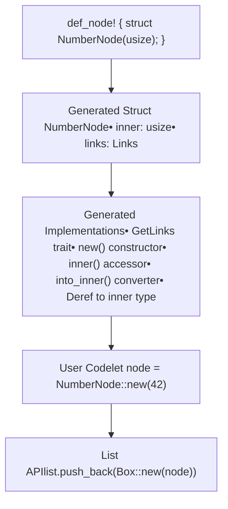
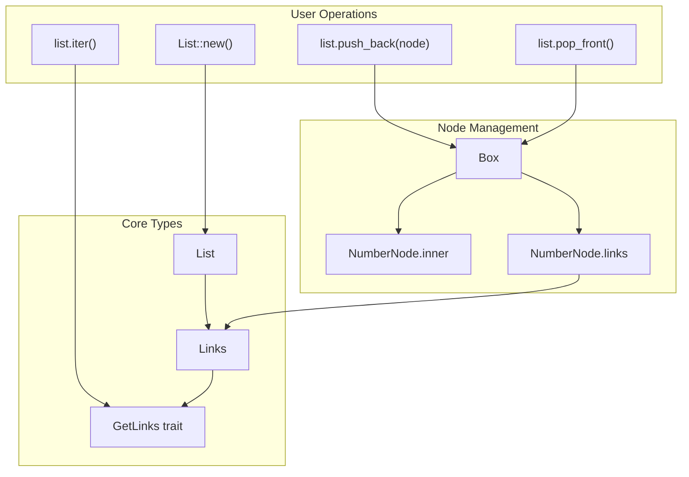

# Quick Start Guide

> **Relevant source files**
> * [README.md](https://github.com/arceos-org/linked_list_r4l/blob/353828c1/README.md)
> * [src/lib.rs](https://github.com/arceos-org/linked_list_r4l/blob/353828c1/src/lib.rs)

This guide covers the essential steps to start using the `linked_list_r4l` crate for basic linked list operations. It demonstrates node creation using the `def_node!` macro and common list operations like insertion, removal, and iteration. For detailed architecture information, see [Architecture Overview](/arceos-org/linked_list_r4l/3-architecture-overview). For comprehensive API documentation, see [API Reference](/arceos-org/linked_list_r4l/4-api-reference).

## Prerequisites and Setup

Add the crate to your `Cargo.toml`:

```
[dependencies]
linked_list_r4l = "0.1"
```

The library provides two main approaches for creating list nodes:

1. **Recommended**: Using the `def_node!` macro for automatic code generation
2. **Manual**: Implementing the `GetLinks` trait manually

## Creating Nodes with def_node! Macro

The `def_node!` macro is the primary way to create node types. It automatically generates the required structure and trait implementations.

### Basic Node Definition

```css
use linked_list_r4l::{def_node, List};

def_node! {
    /// A simple node containing a usize value
    struct NumberNode(usize);
    
    /// A public node with generic type
    pub struct GenericNode<T>(T);
}
```

The macro generates a struct with two fields: `inner` containing your data and `links` for list management. It also implements the `GetLinks` trait and provides helper methods.

**Sources:** [src/lib.rs(L109 - L178)&emsp;](https://github.com/arceos-org/linked_list_r4l/blob/353828c1/src/lib.rs#L109-L178)

### Node Creation and Basic Operations

```javascript
// Create nodes
let node1 = Box::new(NumberNode::new(42));
let node2 = Box::new(NumberNode::new(100));

// Create list
let mut list = List::<Box<NumberNode>>::new();

// Add nodes
list.push_back(node1);
list.push_back(node2);

// Access data
for node in list.iter() {
    println!("Value: {}", *node.inner());
}

// Remove nodes
let first = list.pop_front().unwrap();
assert_eq!(first.into_inner(), 42);
```

**Sources:** [src/lib.rs(L136 - L165)&emsp;](https://github.com/arceos-org/linked_list_r4l/blob/353828c1/src/lib.rs#L136-L165)

### Generated Node Structure

When you use `def_node!`, the following structure is generated:



**Sources:** [src/lib.rs(L12 - L58)&emsp;](https://github.com/arceos-org/linked_list_r4l/blob/353828c1/src/lib.rs#L12-L58) [src/lib.rs(L60 - L107)&emsp;](https://github.com/arceos-org/linked_list_r4l/blob/353828c1/src/lib.rs#L60-L107)

## List Operations Flow

The following diagram shows how common list operations map to code entities:



**Sources:** [src/lib.rs(L6)&emsp;](https://github.com/arceos-org/linked_list_r4l/blob/353828c1/src/lib.rs#L6-L6) [src/lib.rs(L7)&emsp;](https://github.com/arceos-org/linked_list_r4l/blob/353828c1/src/lib.rs#L7-L7) [src/lib.rs(L19 - L26)&emsp;](https://github.com/arceos-org/linked_list_r4l/blob/353828c1/src/lib.rs#L19-L26)

## Complete Example

Here's a comprehensive example showing typical usage patterns:

```javascript
use linked_list_r4l::{def_node, List};

def_node! {
    /// Task node for a simple scheduler
    pub struct TaskNode(String);
    
    /// Priority task with generic data
    pub struct PriorityTask<T>(T);
}

fn main() {
    // Create task list
    let mut task_queue = List::<Box<TaskNode>>::new();
    
    // Add tasks
    task_queue.push_back(Box::new(TaskNode::new("initialize".to_string())));
    task_queue.push_back(Box::new(TaskNode::new("process".to_string())));
    task_queue.push_back(Box::new(TaskNode::new("cleanup".to_string())));
    
    // Process tasks
    while let Some(task) = task_queue.pop_front() {
        println!("Processing: {}", task.inner());
        // Task is automatically dropped here
    }
    
    // Generic example
    let mut numbers = List::<Box<PriorityTask<i32>>>::new();
    numbers.push_back(Box::new(PriorityTask::new(1)));
    numbers.push_back(Box::new(PriorityTask::new(2)));
    
    // Iterate without removing
    for (index, task) in numbers.iter().enumerate() {
        println!("Task {}: {}", index, task.inner());
    }
}
```

**Sources:** [src/lib.rs(L125 - L165)&emsp;](https://github.com/arceos-org/linked_list_r4l/blob/353828c1/src/lib.rs#L125-L165)

## Memory Management

The library uses `Box<T>` for heap allocation by default, but supports other ownership models:

|Wrapper Type|Use Case|Example|
| --- | --- | --- |
|Box<Node>|Single ownership, heap allocated|List::<Box<MyNode>>::new()|
|Arc<Node>|Shared ownership, reference counted|List::<Arc<MyNode>>::new()|
|&Node|Borrowed references|List::<&MyNode>::new()|

**Sources:** [src/lib.rs(L6)&emsp;](https://github.com/arceos-org/linked_list_r4l/blob/353828c1/src/lib.rs#L6-L6)

## Manual Node Implementation (Alternative)

For advanced use cases, you can implement the `GetLinks` trait manually instead of using the macro:

```rust
use linked_list_r4l::{GetLinks, Links, List};

pub struct CustomNode {
    pub data: String,
    links: Links<Self>,
}

impl GetLinks for CustomNode {
    type EntryType = Self;
    
    fn get_links(t: &Self) -> &Links<Self> {
        &t.links
    }
}

impl CustomNode {
    fn new(data: String) -> Self {
        Self {
            data,
            links: Links::new(),
        }
    }
}
```

**Sources:** [README.md(L15 - L44)&emsp;](https://github.com/arceos-org/linked_list_r4l/blob/353828c1/README.md#L15-L44)

## Next Steps

* For understanding the library's architecture, see [Architecture Overview](/arceos-org/linked_list_r4l/3-architecture-overview)
* For advanced ownership patterns, see [Advanced API](/arceos-org/linked_list_r4l/4.2-advanced-api)
* For thread safety considerations, see [Thread Safety](/arceos-org/linked_list_r4l/5.2-thread-safety)
* For contributing to the project, see [Development Guide](/arceos-org/linked_list_r4l/6-development-guide)