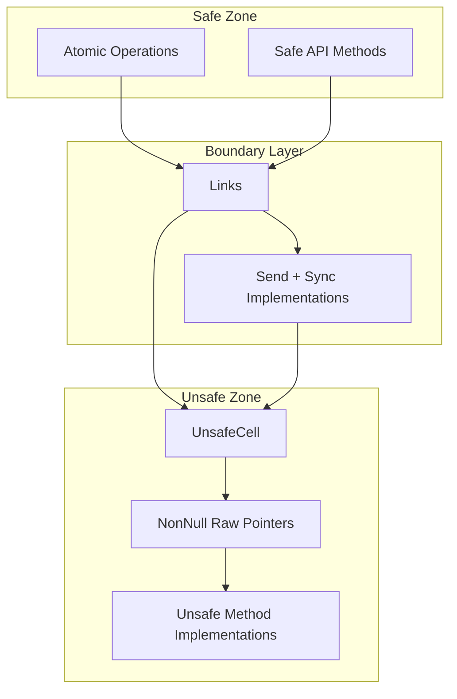
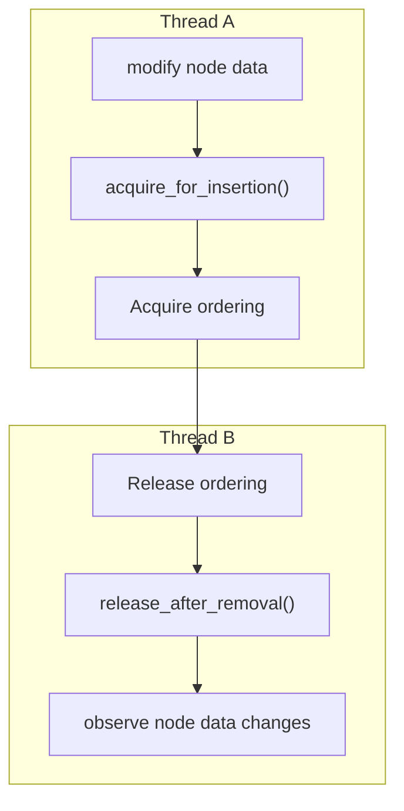

# Thread Safety

> **Relevant source files**
> * [src/raw_list.rs](https://github.com/arceos-org/linked_list_r4l/blob/353828c1/src/raw_list.rs)

This document covers the thread safety mechanisms, atomic operations, and concurrent access patterns implemented by the linked_list_r4l library. The focus is on how the library uses atomic operations to ensure safe concurrent insertion and removal operations while maintaining performance.

For information about memory management and ownership models, see [Memory Management](/arceos-org/linked_list_r4l/5.1-memory-management). For details about the overall architecture and abstraction layers, see [Architecture Overview](/arceos-org/linked_list_r4l/3-architecture-overview).

## Atomic Insertion Tracking

The core thread safety mechanism in linked_list_r4l is the atomic insertion tracking system implemented in the `Links<T>` struct. This system prevents data races when multiple threads attempt to insert or remove the same node concurrently.

### Insertion State Management

The `Links<T>` struct contains an `AtomicBool inserted` field that tracks whether a node is currently inserted in any list:

```

```

**Atomic State Transitions in Links**

The insertion tracking prevents double-insertion and ensures that only one thread can successfully insert a node at a time. The `acquire_for_insertion()` method uses compare-and-swap semantics to atomically transition from `false` to `true`, while `release_after_removal()` unconditionally sets the state back to `false`.

Sources: [src/raw_list.rs(L35 - L66)&emsp;](https://github.com/arceos-org/linked_list_r4l/blob/353828c1/src/raw_list.rs#L35-L66)

### Compare-and-Swap Operations

The atomic operations use specific memory ordering to ensure correctness:

|Operation|Memory Ordering|Purpose|
| --- | --- | --- |
|compare_exchange(false, true, Acquire, Relaxed)|Acquire|Synchronizes with release operations from other threads|
|store(false, Release)|Release|Ensures all preceding writes are visible to other threads|

The `Acquire` ordering on successful insertion ensures that any subsequent operations on the node happen-after the insertion completes. The `Release` ordering on removal ensures that all modifications to the node's links are visible before the node becomes available for re-insertion.

Sources: [src/raw_list.rs(L57 - L65)&emsp;](https://github.com/arceos-org/linked_list_r4l/blob/353828c1/src/raw_list.rs#L57-L65)

## Thread Safety Boundaries

The library implements thread safety through a layered approach with explicit unsafe boundaries:



**Thread Safety Architecture**

The `Links<T>` struct serves as the boundary between safe atomic operations and unsafe raw pointer manipulation. The `UnsafeCell<ListEntry<T>>` provides interior mutability for the actual linked list pointers while the atomic boolean provides synchronization.

Sources: [src/raw_list.rs(L35 - L46)&emsp;](https://github.com/arceos-org/linked_list_r4l/blob/353828c1/src/raw_list.rs#L35-L46) [src/raw_list.rs(L331 - L337)&emsp;](https://github.com/arceos-org/linked_list_r4l/blob/353828c1/src/raw_list.rs#L331-L337)

## Send and Sync Implementations

The library provides conditional `Send` and `Sync` implementations that propagate thread safety requirements:

### Links Thread Safety

```python
// SAFETY: Links can be safely sent to other threads but we restrict it to being Send
// only when the list entries it points to are also Send.
unsafe impl<T: ?Sized> Send for Links<T> {}

// SAFETY: Links is usable from other threads via references but we restrict it to being Sync  
// only when the list entries it points to are also Sync.
unsafe impl<T: ?Sized> Sync for Links<T> {}
```

### RawList Thread Safety

```python
// SAFETY: The list is itself can be safely sent to other threads but we restrict it to being Send
// only when its entries are also Send.
unsafe impl<G: GetLinks> Send for RawList<G> where G::EntryType: Send {}

// SAFETY: The list is itself usable from other threads via references but we restrict it to being Sync
// only when its entries are also Sync.
unsafe impl<G: GetLinks> Sync for RawList<G> where G::EntryType: Sync {}
```

These implementations ensure that thread safety is only available when the contained data types are themselves thread-safe, following Rust's standard library patterns.

Sources: [src/raw_list.rs(L40 - L46)&emsp;](https://github.com/arceos-org/linked_list_r4l/blob/353828c1/src/raw_list.rs#L40-L46) [src/raw_list.rs(L331 - L337)&emsp;](https://github.com/arceos-org/linked_list_r4l/blob/353828c1/src/raw_list.rs#L331-L337)

## Concurrent Access Patterns

### Safe Concurrent Operations

```

```

**Concurrent Insertion Protocol**

The atomic insertion tracking ensures that even if multiple threads attempt to insert the same node simultaneously, only one will succeed. The losing threads receive a `false` return value and can handle the case appropriately.

Sources: [src/raw_list.rs(L140 - L151)&emsp;](https://github.com/arceos-org/linked_list_r4l/blob/353828c1/src/raw_list.rs#L140-L151) [src/raw_list.rs(L153 - L179)&emsp;](https://github.com/arceos-org/linked_list_r4l/blob/353828c1/src/raw_list.rs#L153-L179)

### Unsafe Raw Pointer Operations

While the insertion tracking is thread-safe, the actual pointer manipulation within `RawList` operations is not thread-safe. The library relies on the caller to ensure exclusive access to the list structure during modifications:

|Method|Thread Safety|Requirements|
| --- | --- | --- |
|push_back()|Not thread-safe|Requires exclusive access to&mut RawList<G>|
|remove()|Not thread-safe|Requires exclusive access to&mut RawList<G>|
|iter()|Thread-safe|Can be called with shared reference&RawList<G>|

The mutable reference requirement (`&mut RawList<G>`) for modification operations provides compile-time guarantees that no other thread can access the list structure during modifications.

Sources: [src/raw_list.rs(L186 - L197)&emsp;](https://github.com/arceos-org/linked_list_r4l/blob/353828c1/src/raw_list.rs#L186-L197) [src/raw_list.rs(L243 - L245)&emsp;](https://github.com/arceos-org/linked_list_r4l/blob/353828c1/src/raw_list.rs#L243-L245)

## Memory Ordering Guarantees

The library uses acquire-release semantics to establish happens-before relationships:



**Memory Ordering Relationships**

The acquire ordering on insertion ensures that any writes to the node data that occurred before the insertion become visible to threads that subsequently observe the insertion. The release ordering on removal ensures that all modifications to the node are visible before the node becomes available for re-use.

Sources: [src/raw_list.rs(L57 - L65)&emsp;](https://github.com/arceos-org/linked_list_r4l/blob/353828c1/src/raw_list.rs#L57-L65)

## Safety Invariants

### Insertion Tracking Invariants

1. **Single Insertion**: A node with `inserted == true` is guaranteed to be in exactly one list
2. **Atomic Transitions**: State changes between inserted/not-inserted are atomic and visible to all threads
3. **Exclusive Modification**: Only the thread that successfully acquires for insertion can modify the node's list links

### Raw Pointer Safety

1. **Validity Duration**: Raw pointers in `ListEntry<T>` are valid only while the corresponding nodes remain in the list
2. **Exclusive List Access**: Modification operations require exclusive access to prevent data races on the list structure
3. **Node Lifetime**: Nodes must outlive their presence in the list to prevent use-after-free

Sources: [src/raw_list.rs(L88 - L95)&emsp;](https://github.com/arceos-org/linked_list_r4l/blob/353828c1/src/raw_list.rs#L88-L95) [src/raw_list.rs(L199 - L235)&emsp;](https://github.com/arceos-org/linked_list_r4l/blob/353828c1/src/raw_list.rs#L199-L235)

The thread safety model of linked_list_r4l provides atomic insertion tracking while requiring higher-level synchronization for list structure modifications. This design enables efficient constant-time removal while maintaining memory safety in concurrent environments.