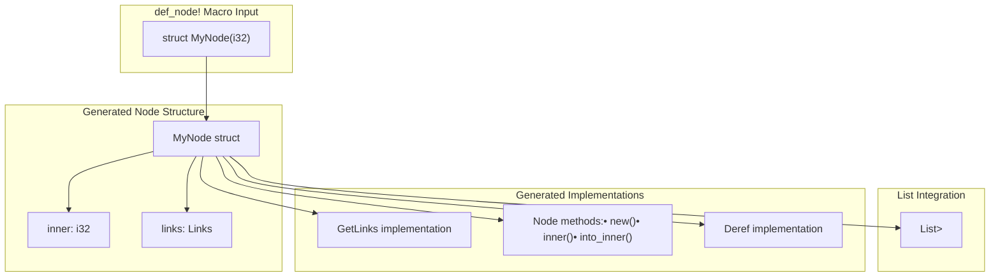
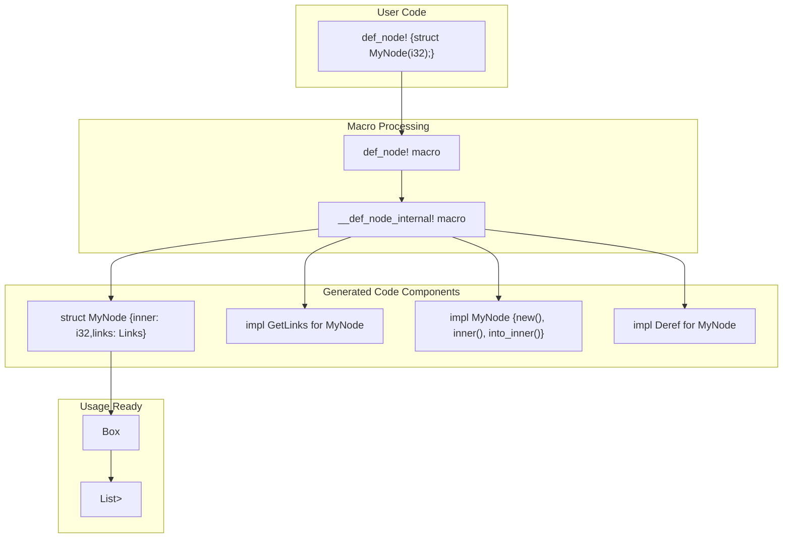

# User-Friendly API

> **Relevant source files**
> * [README.md](https://github.com/arceos-org/linked_list_r4l/blob/353828c1/README.md)
> * [src/lib.rs](https://github.com/arceos-org/linked_list_r4l/blob/353828c1/src/lib.rs)

This page documents the user-friendly API layer of the linked_list_r4l crate, which provides the simplest interface for typical usage scenarios. This layer consists of the `def_node!` macro for automatic node generation and the simple `List<T>` interface for basic list operations.

For advanced ownership management and custom wrapper types, see [Advanced API](/arceos-org/linked_list_r4l/4.2-advanced-api). For low-level unsafe operations and performance-critical usage, see [Low-Level API](/arceos-org/linked_list_r4l/4.3-low-level-api).

## The def_node! Macro

The `def_node!` macro is the primary entry point for users to create list-compatible node types. It automatically generates the necessary boilerplate code to make any type work with the linked list system.

### Macro Syntax

The macro supports two syntax forms:

|Form|Example|Use Case|
| --- | --- | --- |
|Simple struct|struct NodeName(inner_type);|Non-generic wrapped types|
|Generic struct|struct NodeName<T>(inner_type);|Generic wrapped types|

### Generated Node Structure

When you invoke `def_node!`, it generates a complete node structure with the following components:



Sources: [src/lib.rs(L11 - L107)&emsp;](https://github.com/arceos-org/linked_list_r4l/blob/353828c1/src/lib.rs#L11-L107) [src/lib.rs(L168 - L178)&emsp;](https://github.com/arceos-org/linked_list_r4l/blob/353828c1/src/lib.rs#L168-L178)

### Node Methods

Each generated node provides these essential methods:

|Method|Signature|Purpose|
| --- | --- | --- |
|new()|pub const fn new(inner: T) -> Self|Creates a new node wrapping the inner value|
|inner()|pub const fn inner(&self) -> &T|Returns a reference to the wrapped value|
|into_inner()|pub fn into_inner(self) -> T|Consumes the node and returns the wrapped value|

The generated nodes also implement `Deref`, allowing direct access to the inner type's methods through the node.

Sources: [src/lib.rs(L28 - L48)&emsp;](https://github.com/arceos-org/linked_list_r4l/blob/353828c1/src/lib.rs#L28-L48) [src/lib.rs(L76 - L96)&emsp;](https://github.com/arceos-org/linked_list_r4l/blob/353828c1/src/lib.rs#L76-L96) [src/lib.rs(L50 - L57)&emsp;](https://github.com/arceos-org/linked_list_r4l/blob/353828c1/src/lib.rs#L50-L57) [src/lib.rs(L98 - L105)&emsp;](https://github.com/arceos-org/linked_list_r4l/blob/353828c1/src/lib.rs#L98-L105)

## Code Generation Flow

The macro expansion process transforms user declarations into fully functional list nodes:



Sources: [src/lib.rs(L168 - L178)&emsp;](https://github.com/arceos-org/linked_list_r4l/blob/353828c1/src/lib.rs#L168-L178) [src/lib.rs(L11 - L107)&emsp;](https://github.com/arceos-org/linked_list_r4l/blob/353828c1/src/lib.rs#L11-L107)

## Simple List Interface

The user-friendly API provides a straightforward `List<T>` interface that works with any boxed node type generated by `def_node!`.

### Basic Operations

The simple list interface supports these fundamental operations:

|Operation|Method|Description|
| --- | --- | --- |
|Creation|List::new()|Creates an empty list|
|Insertion|push_back(node),push_front(node)|Adds nodes to the list|
|Removal|pop_back(),pop_front()|Removes and returns nodes|
|Iteration|iter()|Provides iterator over list elements|

### Typical Usage Pattern

Here's the standard workflow for using the user-friendly API:

```

```

Sources: [src/lib.rs(L124 - L165)&emsp;](https://github.com/arceos-org/linked_list_r4l/blob/353828c1/src/lib.rs#L124-L165) [README.md(L15 - L62)&emsp;](https://github.com/arceos-org/linked_list_r4l/blob/353828c1/README.md#L15-L62)

## Complete Usage Example

The macro documentation includes a comprehensive example showing both simple and generic node usage:

1. **Node Definition**: Using `def_node!` to create various node types with different visibility modifiers
2. **List Creation**: Instantiating typed lists for specific node types
3. **List Operations**: Adding, iterating, and removing nodes
4. **Value Access**: Using `inner()` to access wrapped values and `into_inner()` to extract them

The example demonstrates the seamless integration between the macro-generated nodes and the list operations, showing how the user-friendly API hides the complexity of the underlying link management.

Sources: [src/lib.rs(L124 - L165)&emsp;](https://github.com/arceos-org/linked_list_r4l/blob/353828c1/src/lib.rs#L124-L165) [README.md(L46 - L61)&emsp;](https://github.com/arceos-org/linked_list_r4l/blob/353828c1/README.md#L46-L61)

## Integration with Type System

The user-friendly API integrates cleanly with Rust's type system:

* **Ownership**: Nodes are typically owned through `Box<T>` for heap allocation
* **Type Safety**: The list type `List<Box<NodeType>>` ensures only compatible nodes can be inserted
* **Generic Support**: Both the nodes and lists can be generic over inner types
* **Deref Coercion**: Nodes automatically dereference to their inner type for convenient method access

This design allows users to work with linked lists using familiar Rust patterns while benefiting from the high-performance constant-time removal capabilities of the underlying implementation.

Sources: [src/lib.rs(L6)&emsp;](https://github.com/arceos-org/linked_list_r4l/blob/353828c1/src/lib.rs#L6-L6) [src/lib.rs(L50 - L57)&emsp;](https://github.com/arceos-org/linked_list_r4l/blob/353828c1/src/lib.rs#L50-L57) [src/lib.rs(L98 - L105)&emsp;](https://github.com/arceos-org/linked_list_r4l/blob/353828c1/src/lib.rs#L98-L105)