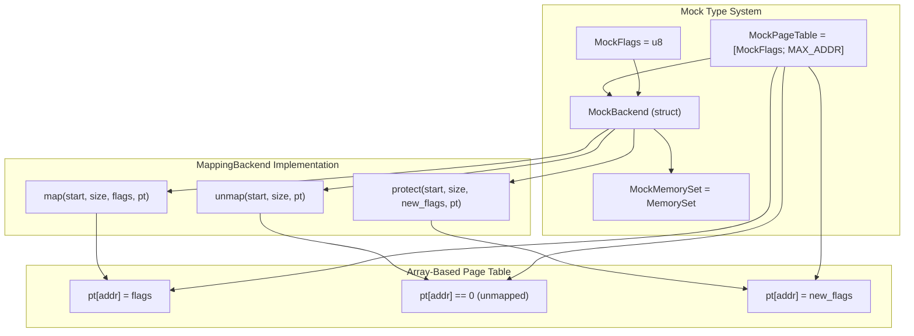
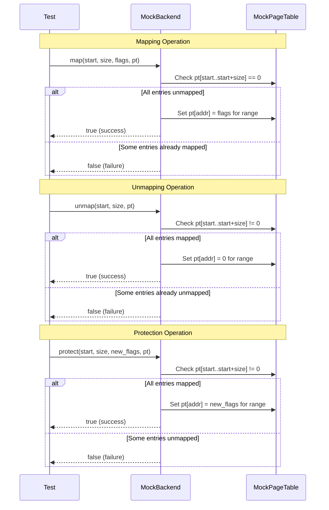
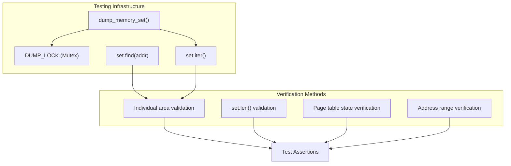
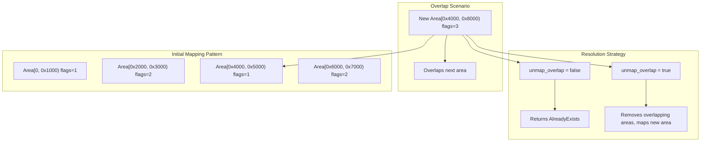
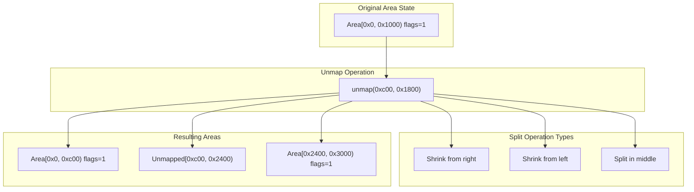
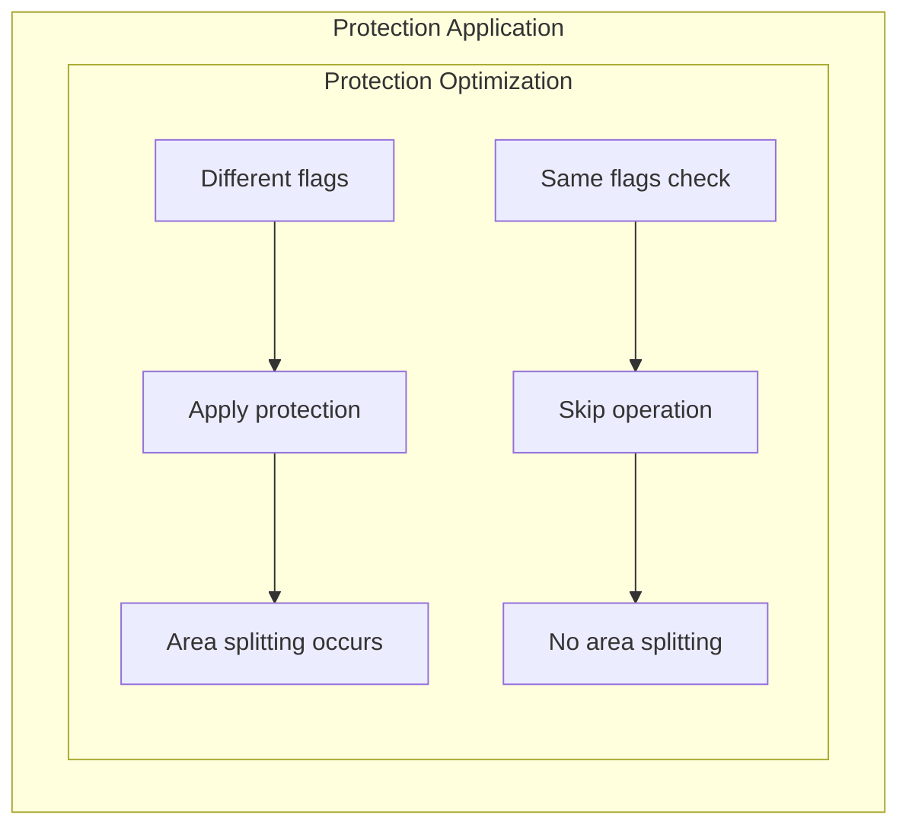
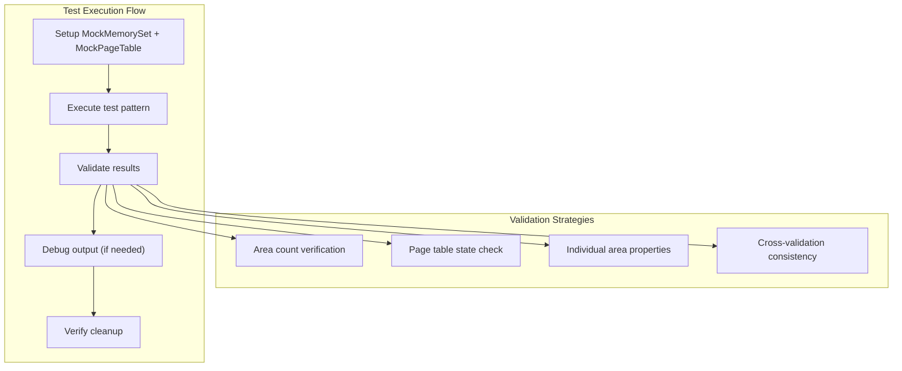

# Advanced Examples and Testing

> **Relevant source files**
> * [src/tests.rs](https://github.com/arceos-org/memory_set/blob/73b51e2b/src/tests.rs)

This page covers advanced usage patterns, comprehensive testing strategies, and the MockBackend implementation that demonstrates the full capabilities of the memory_set crate. It focuses on complex memory management scenarios, sophisticated testing patterns, and how to implement custom backends for specialized use cases.

For basic usage patterns and simple examples, see [Basic Usage Patterns](/arceos-org/memory_set/3.1-basic-usage-patterns). For implementation details of the core types, see [Implementation Details](/arceos-org/memory_set/2-implementation-details).

## MockBackend Implementation Pattern

The memory_set crate includes a comprehensive mock implementation that serves both as a testing framework and as an example of how to implement the `MappingBackend` trait for custom use cases.

### Mock Type Definitions

The testing framework defines simplified types that demonstrate the generic nature of the memory management system:



**MockBackend Implementation Strategy**

The `MockBackend` uses a simple array where each index represents a virtual address and the value represents the mapping flags. This approach enables:

* Direct address-to-flag mapping for O(1) lookups
* Simple validation of mapping state
* Easy verification of operations in tests

Sources: [src/tests.rs(L5 - L13)&emsp;](https://github.com/arceos-org/memory_set/blob/73b51e2b/src/tests.rs#L5-L13) [src/tests.rs(L15 - L51)&emsp;](https://github.com/arceos-org/memory_set/blob/73b51e2b/src/tests.rs#L15-L51)

### Backend Operation Implementation

The mock implementation demonstrates the three core operations required by the `MappingBackend` trait:



**Key Implementation Details:**

* **Validation First**: Each operation validates the current state before making changes
* **Atomic Failure**: Operations fail completely if any part of the range is in an invalid state
* **Simple State Model**: Uses 0 for unmapped, non-zero for mapped with specific flags

Sources: [src/tests.rs(L16 - L24)&emsp;](https://github.com/arceos-org/memory_set/blob/73b51e2b/src/tests.rs#L16-L24) [src/tests.rs(L26 - L34)&emsp;](https://github.com/arceos-org/memory_set/blob/73b51e2b/src/tests.rs#L26-L34) [src/tests.rs(L36 - L50)&emsp;](https://github.com/arceos-org/memory_set/blob/73b51e2b/src/tests.rs#L36-L50)

## Testing Utilities and Assertion Framework

The test suite includes specialized utilities for testing memory management operations:

### Custom Assertion Macros

|Macro|Purpose|Usage Pattern|
| --- | --- | --- |
|assert_ok!|Verify operation success|assert_ok!(set.map(area, &mut pt, false))|
|assert_err!|Verify operation failure|assert_err!(operation, ExpectedError)|

### Debug and Inspection Tools



**Debug Output Pattern:**
The `dump_memory_set` function provides synchronized debug output showing the current state of all memory areas, which is essential for understanding complex test scenarios involving area splitting and merging.

Sources: [src/tests.rs(L53 - L66)&emsp;](https://github.com/arceos-org/memory_set/blob/73b51e2b/src/tests.rs#L53-L66) [src/tests.rs(L68 - L77)&emsp;](https://github.com/arceos-org/memory_set/blob/73b51e2b/src/tests.rs#L68-L77)

## Complex Memory Management Testing

### Overlapping Area Management

The test suite demonstrates sophisticated overlap handling scenarios:



**Test Coverage Includes:**

* **Overlap Detection**: Testing how the system identifies conflicting memory areas
* **Forced Unmapping**: Using `unmap_overlap=true` to resolve conflicts automatically
* **Area Consolidation**: Verifying that overlapping areas are properly removed and replaced

Sources: [src/tests.rs(L113 - L138)&emsp;](https://github.com/arceos-org/memory_set/blob/73b51e2b/src/tests.rs#L113-L138)

### Advanced Unmapping and Area Splitting

The most complex testing scenarios involve partial unmapping operations that split existing areas:



**Complex Splitting Scenarios:**

* **Boundary Shrinking**: Areas shrink when unmapping occurs at boundaries
* **Middle Splitting**: Areas split into two when unmapping occurs in the middle
* **Cross-Boundary Operations**: Unmapping spans multiple areas with different behaviors

Sources: [src/tests.rs(L152 - L226)&emsp;](https://github.com/arceos-org/memory_set/blob/73b51e2b/src/tests.rs#L152-L226)

## Protection and Flag Management Testing

### Dynamic Protection Changes

The protection testing demonstrates how memory areas adapt to changing access permissions:

```mermaid
stateDiagram-v2
[*] --> init : Map areas with flags=0x7
init : Initial Areas
init : Areas with flags=0x7
init --> protect1 : protect(addr, size, update_flags(0x1))
init : Initial Areas
init : Areas with flags=0x7
protect1 : After First Protect
protect1 : Split areas with flags=0x7,0x1
protect1 --> protect2 : protect(addr, size, update_flags(0x13))
protect1 : After First Protect
protect1 : Split areas with flags=0x7,0x1
protect2 : After Second Protect
protect2 : Further split with flags=0x7,0x1,0x3
protect2 --> [*] : unmap(0, MAX_ADDR)
protect2 : After Second Protect
protect2 : Further split with flags=0x7,0x1,0x3
note left of protect1 : ['Areas split at protection boundaries<br>Original: 8 areas<br>Result: 23 areas']
protect1 : After First Protect
protect1 : Split areas with flags=0x7,0x1
note left of protect2 : ['Further splitting on nested protection<br>Result: 39 areas']
protect2 : After Second Protect
protect2 : Further split with flags=0x7,0x1,0x3
```

**Protection Update Function Pattern:**
The tests use a closure-based approach for flag updates, allowing complex flag transformation logic while preserving other flag bits:

```javascript
let update_flags = |new_flags: MockFlags| {
    move |old_flags: MockFlags| -> Option<MockFlags> {
        // Complex flag transformation logic
    }
};
```

Sources: [src/tests.rs(L228 - L324)&emsp;](https://github.com/arceos-org/memory_set/blob/73b51e2b/src/tests.rs#L228-L324)

### Protection Optimization Testing



**Optimization Strategy:**
The protection system includes optimization to avoid unnecessary operations when the new flags would be identical to existing flags, preventing unnecessary area splitting.

Sources: [src/tests.rs(L312 - L316)&emsp;](https://github.com/arceos-org/memory_set/blob/73b51e2b/src/tests.rs#L312-L316)

## Test Scenario Architecture

### Comprehensive Test Coverage Matrix

|Test Category|Operations Tested|Area Behavior|Validation Focus|
| --- | --- | --- | --- |
|test_map_unmap|Map, Find, Forced Map, Unmap|Overlap handling, Area replacement|Page table consistency, Area count|
|test_unmap_split|Partial Unmap, Boundary operations|Area shrinking, Middle splitting|Split correctness, Gap verification|
|test_protect|Protection changes, Flag updates|Protection-based splitting|Flag transformation, Optimization|

### Testing Pattern Integration



**Testing Integration Points:**

* **State Verification**: Each test verifies both the MemorySet state and the MockPageTable state
* **Debug Integration**: Debug output is synchronized and can be enabled for complex test debugging
* **Cleanup Validation**: Tests ensure complete cleanup to verify the unmapping functionality

Sources: [src/tests.rs(L79 - L149)&emsp;](https://github.com/arceos-org/memory_set/blob/73b51e2b/src/tests.rs#L79-L149) [src/tests.rs(L151 - L226)&emsp;](https://github.com/arceos-org/memory_set/blob/73b51e2b/src/tests.rs#L151-L226) [src/tests.rs(L228 - L324)&emsp;](https://github.com/arceos-org/memory_set/blob/73b51e2b/src/tests.rs#L228-L324)