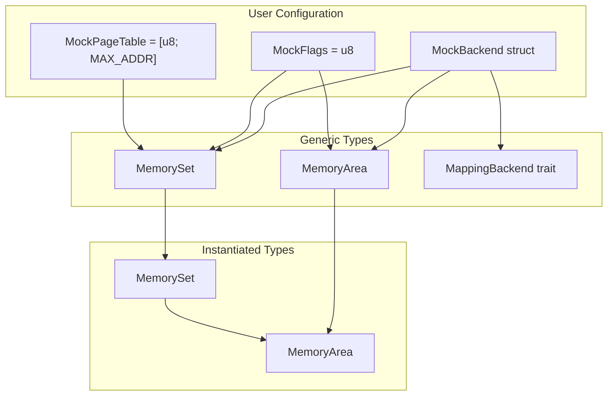
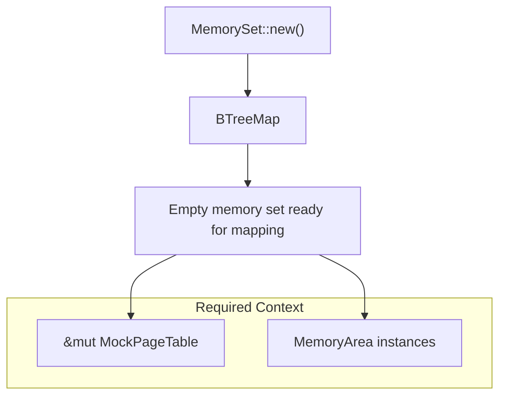
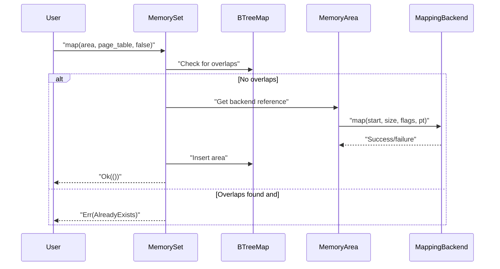
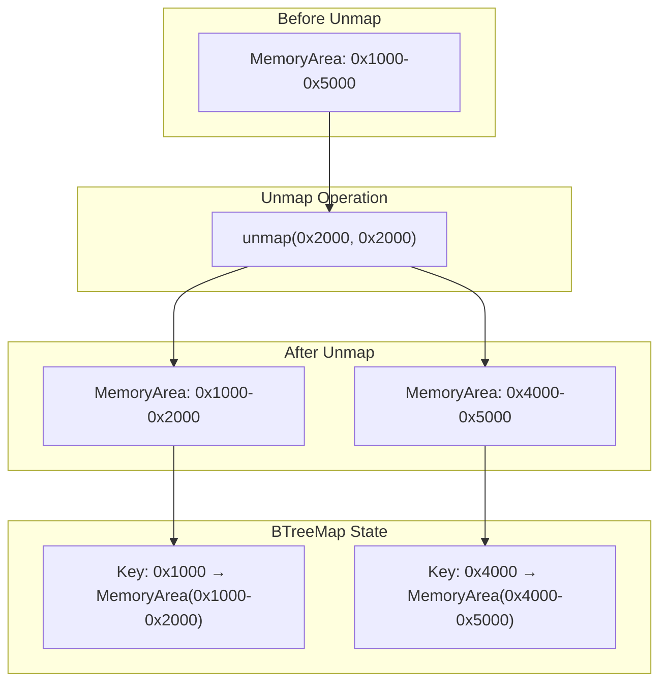
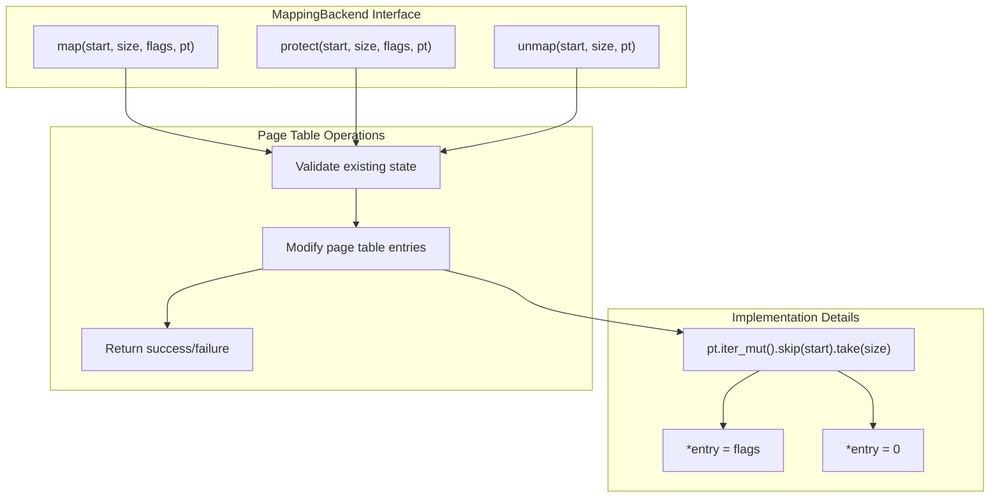
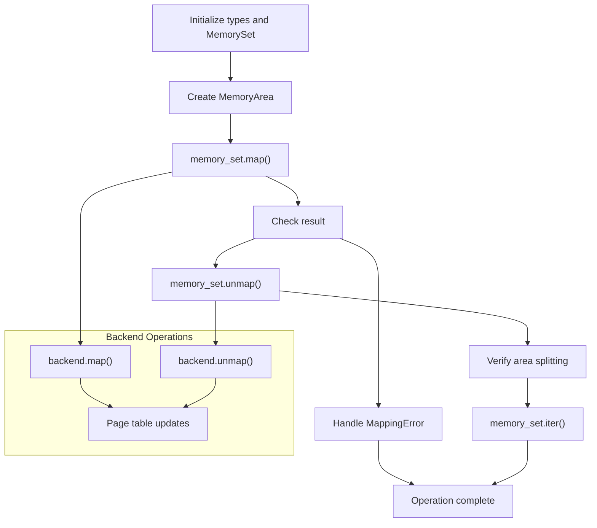

# Basic Usage Patterns

> **Relevant source files**
> * [README.md](https://github.com/arceos-org/memory_set/blob/73b51e2b/README.md)

This document demonstrates the fundamental usage patterns for the memory_set crate, showing how to create and configure `MemorySet`, `MemoryArea`, and implement `MappingBackend` for typical memory management scenarios. The examples here focus on the core API usage and basic operations like mapping, unmapping, and memory protection.

For detailed implementation internals, see [Implementation Details](/arceos-org/memory_set/2-implementation-details). For advanced usage scenarios and testing patterns, see [Advanced Examples and Testing](/arceos-org/memory_set/3.2-advanced-examples-and-testing).

## Setting Up Types and Backend

The memory_set crate uses a generic type system that requires three type parameters to be specified. The typical pattern involves creating type aliases and implementing a backend that handles the actual memory operations.

### Type Configuration Pattern

|Component|Purpose|Example Type|
| --- | --- | --- |
|F(Flags)|Memory protection flags|u8, custom bitflags|
|PT(Page Table)|Page table representation|Array, actual page table struct|
|B(Backend)|Memory mapping implementation|Custom struct implementingMappingBackend|

The basic setup pattern follows this structure:

```
type MockFlags = u8;
type MockPageTable = [MockFlags; MAX_ADDR];
struct MockBackend;
```

**Core Type Relationships**



Sources: [README.md(L22 - L31)&emsp;](https://github.com/arceos-org/memory_set/blob/73b51e2b/README.md#L22-L31)

## Creating and Initializing MemorySet

The basic pattern for creating a `MemorySet` involves calling the `new()` constructor with appropriate type parameters:

```javascript
let mut memory_set = MemorySet::<MockFlags, MockPageTable, MockBackend>::new();
```

The `MemorySet` maintains an internal `BTreeMap` that organizes memory areas by their starting virtual addresses, enabling efficient overlap detection and range queries.

**MemorySet Initialization Flow**



Sources: [README.md(L34)&emsp;](https://github.com/arceos-org/memory_set/blob/73b51e2b/README.md#L34-L34)

## Mapping Memory Areas

The fundamental mapping operation involves creating a `MemoryArea` and adding it to the `MemorySet`. The pattern requires specifying the virtual address range, flags, and backend implementation.

### Basic Mapping Pattern

```yaml
memory_set.map(
    MemoryArea::new(va!(0x1000), 0x4000, flags, MockBackend),
    &mut page_table,
    unmap_overlap_flag,
)
```

### MemoryArea Construction Parameters

|Parameter|Type|Purpose|
| --- | --- | --- |
|start|VirtAddr|Starting virtual address|
|size|usize|Size in bytes|
|flags|F|Memory protection flags|
|backend|B|Backend implementation|

**Memory Mapping Operation Flow**



Sources: [README.md(L36 - L41)&emsp;](https://github.com/arceos-org/memory_set/blob/73b51e2b/README.md#L36-L41)

## Unmapping and Area Management

Unmapping operations can result in area splitting when the unmapped region falls within an existing area's boundaries. This demonstrates the sophisticated area management capabilities.

### Unmapping Pattern

```
memory_set.unmap(start_addr, size, &mut page_table)
```

The unmap operation handles three scenarios:

* **Complete removal**: Area fully contained within unmap range
* **Area splitting**: Unmap range falls within area boundaries
* **Partial removal**: Unmap range overlaps area boundaries

**Area Splitting During Unmap**



Sources: [README.md(L42 - L48)&emsp;](https://github.com/arceos-org/memory_set/blob/73b51e2b/README.md#L42-L48)

## Implementing MappingBackend

The `MappingBackend` trait defines the interface for actual memory operations. Implementations must provide three core methods that manipulate the underlying page table or memory management structure.

### Required Methods

|Method|Purpose|Return Type|
| --- | --- | --- |
|map|Establish new mappings|bool(success/failure)|
|unmap|Remove existing mappings|bool(success/failure)|
|protect|Change mapping permissions|bool(success/failure)|

### Implementation Pattern

The typical pattern involves checking existing state and modifying page table entries:

```rust
impl MappingBackend<MockFlags, MockPageTable> for MockBackend {
    fn map(&self, start: VirtAddr, size: usize, flags: MockFlags, pt: &mut MockPageTable) -> bool {
        // Check for conflicts, then set entries
    }
    
    fn unmap(&self, start: VirtAddr, size: usize, pt: &mut MockPageTable) -> bool {
        // Verify mappings exist, then clear entries
    }
    
    fn protect(&self, start: VirtAddr, size: usize, new_flags: MockFlags, pt: &mut MockPageTable) -> bool {
        // Verify mappings exist, then update flags
    }
}
```

**MappingBackend Method Responsibilities**



Sources: [README.md(L51 - L87)&emsp;](https://github.com/arceos-org/memory_set/blob/73b51e2b/README.md#L51-L87)

## Complete Usage Flow

The following demonstrates a complete usage pattern that combines all the basic operations:

### Initialization and Setup

1. Define type aliases for flags, page table, and backend
2. Create page table instance
3. Initialize empty `MemorySet`

### Memory Operations

1. Create `MemoryArea` with desired parameters
2. Map area using `MemorySet::map()`
3. Perform unmapping operations that may split areas
4. Iterate over resulting areas to verify state

### Error Handling

All operations return `MappingResult<T>` which wraps either success values or `MappingError` variants for proper error handling.

**Complete Operation Sequence**



Sources: [README.md(L18 - L88)&emsp;](https://github.com/arceos-org/memory_set/blob/73b51e2b/README.md#L18-L88)