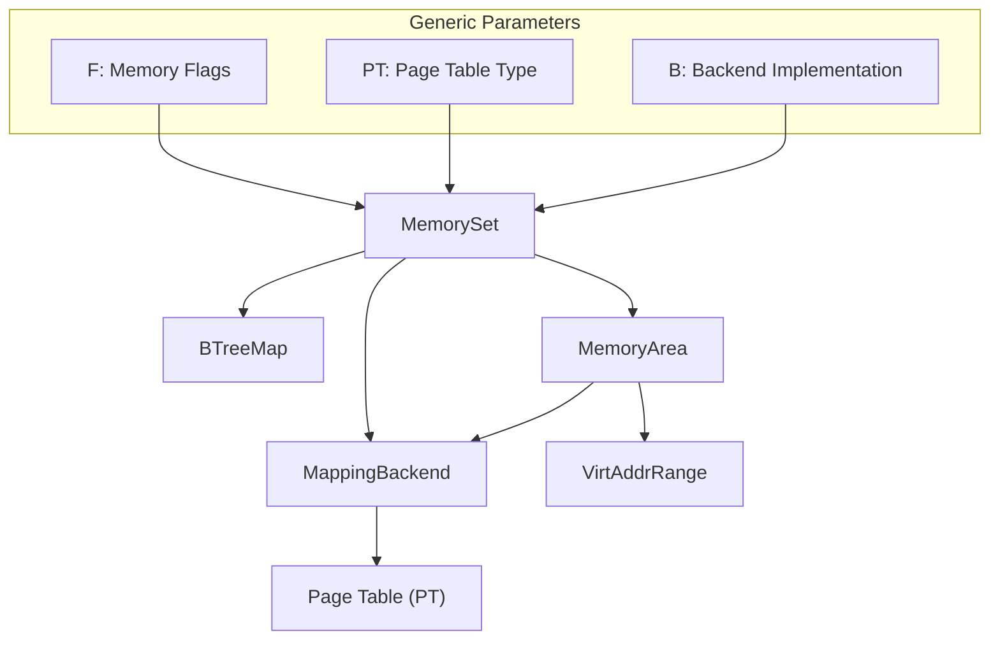
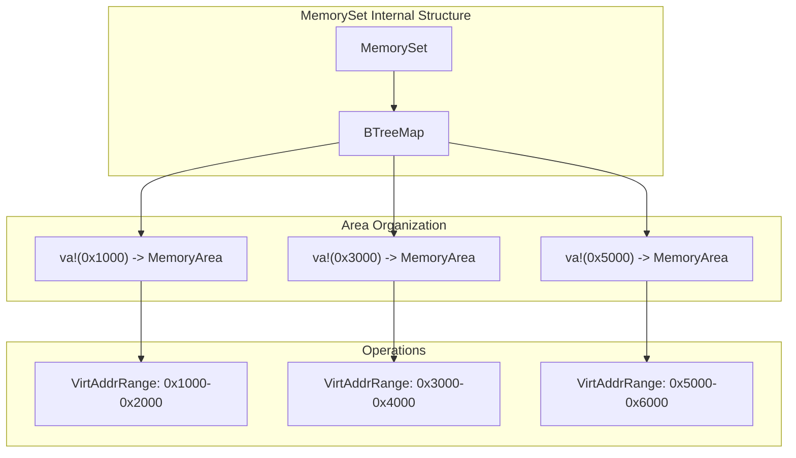
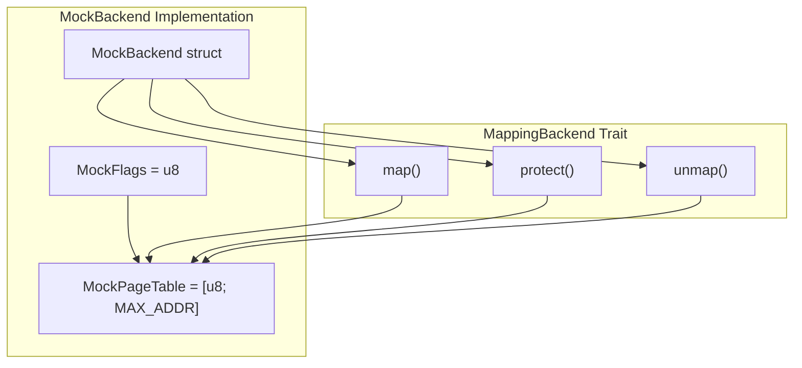
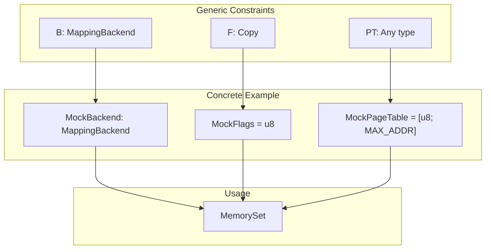
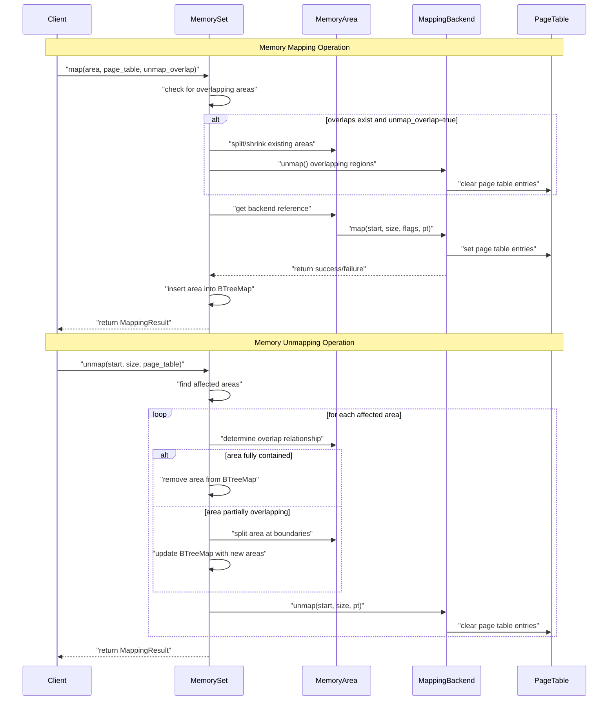

# Core Concepts

> **Relevant source files**
> * [README.md](https://github.com/arceos-org/memory_set/blob/73b51e2b/README.md)

This document explains the fundamental building blocks of the memory_set crate: `MemorySet`, `MemoryArea`, and `MappingBackend`. These three types work together to provide a flexible abstraction for memory mapping operations similar to `mmap`, `munmap`, and `mprotect` system calls.

For detailed implementation specifics, see [Implementation Details](/arceos-org/memory_set/2-implementation-details). For practical usage examples, see [Basic Usage Patterns](/arceos-org/memory_set/3.1-basic-usage-patterns).

## The Three Core Types

The memory_set crate is built around three primary abstractions that work together to manage memory mappings:



Sources: [README.md(L18 - L41)&emsp;](https://github.com/arceos-org/memory_set/blob/73b51e2b/README.md#L18-L41)

## MemorySet: Collection Management

`MemorySet<F, PT, B>` serves as the primary interface for managing collections of memory areas. It maintains a sorted collection of non-overlapping memory regions and provides high-level operations for mapping, unmapping, and protecting memory.

### Key Responsibilities

|Operation|Description|Overlap Handling|
| --- | --- | --- |
|map()|Add new memory area|Can split/remove existing areas|
|unmap()|Remove memory regions|Automatically splits affected areas|
|protect()|Change permissions|Updates flags for matching areas|
|iter()|Enumerate areas|Provides ordered traversal|

The `MemorySet` uses a `BTreeMap<VirtAddr, MemoryArea>` internally to maintain areas sorted by their starting virtual address, enabling efficient overlap detection and range queries.



Sources: [README.md(L34 - L48)&emsp;](https://github.com/arceos-org/memory_set/blob/73b51e2b/README.md#L34-L48)

## MemoryArea: Individual Memory Regions

`MemoryArea<F, B>` represents a contiguous region of virtual memory with specific properties including address range, permissions flags, and an associated backend for page table operations.

### Core Properties

Each `MemoryArea` encapsulates:

* **Virtual Address Range**: Start address and size defining the memory region
* **Flags**: Memory permissions (read, write, execute, etc.)
* **Backend**: Implementation for actual page table manipulation

### Area Lifecycle Operations

```

```

Sources: [README.md(L37 - L38)&emsp;](https://github.com/arceos-org/memory_set/blob/73b51e2b/README.md#L37-L38)

## MappingBackend: Page Table Interface

The `MappingBackend<F, PT>` trait defines the interface between memory areas and the underlying page table implementation. This abstraction allows the memory_set crate to work with different page table formats and memory management systems.

### Required Operations

All backends must implement three core operations:

|Method|Parameters|Purpose|
| --- | --- | --- |
|map()|start: VirtAddr, size: usize, flags: F, pt: &mut PT|Establish new memory mappings|
|unmap()|start: VirtAddr, size: usize, pt: &mut PT|Remove existing mappings|
|protect()|start: VirtAddr, size: usize, new_flags: F, pt: &mut PT|Change mapping permissions|

### Example Implementation Pattern

The mock backend demonstrates the interface pattern:



Sources: [README.md(L51 - L87)&emsp;](https://github.com/arceos-org/memory_set/blob/73b51e2b/README.md#L51-L87)

## Generic Type System

The memory_set crate uses a sophisticated generic type system to provide flexibility while maintaining type safety:

### Type Parameters

* **F**: Memory flags type (must implement `Copy`)
* **PT**: Page table type (can be any structure)
* **B**: Backend implementation (must implement `MappingBackend<F, PT>`)

This design allows the crate to work with different:

* Flag representations (bitfields, enums, integers)
* Page table formats (arrays, trees, hardware tables)
* Backend strategies (direct manipulation, system calls, simulation)



Sources: [README.md(L24 - L31)&emsp;](https://github.com/arceos-org/memory_set/blob/73b51e2b/README.md#L24-L31)

## Coordinated Operation Flow

The three core types work together in a coordinated fashion to handle memory management operations:



Sources: [README.md(L42 - L43)&emsp;](https://github.com/arceos-org/memory_set/blob/73b51e2b/README.md#L42-L43)