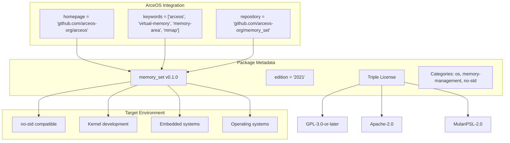
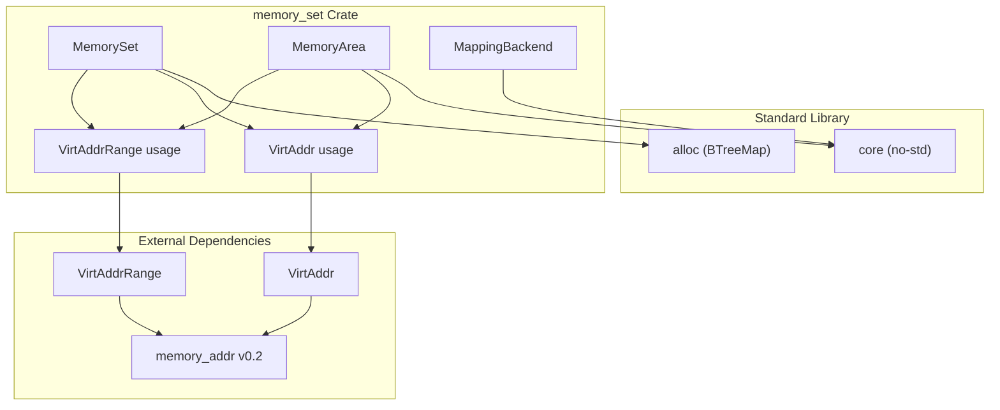
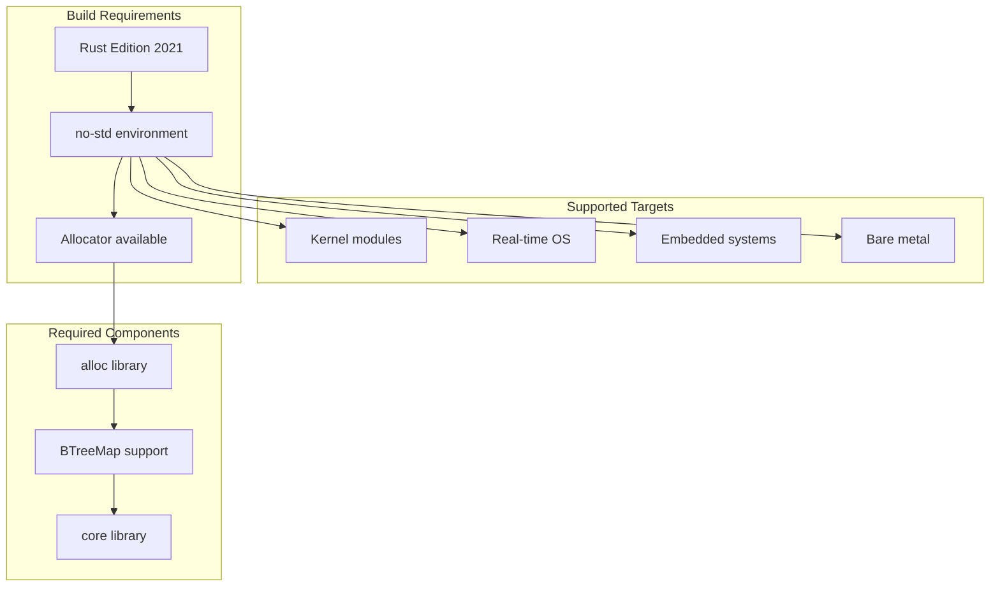

# Dependencies and Configuration

> **Relevant source files**
> * [Cargo.toml](https://github.com/arceos-org/memory_set/blob/73b51e2b/Cargo.toml)

This document covers the project dependencies, build configuration, and integration aspects of the `memory_set` crate within the broader ArceOS ecosystem. It provides essential information for developers who need to understand how to build, configure, and integrate this memory management library.

For information about the actual usage patterns and API details, see [Basic Usage Patterns](/arceos-org/memory_set/3.1-basic-usage-patterns). For development workflow and testing setup, see [Development Workflow](/arceos-org/memory_set/4.2-development-workflow).

## Package Configuration

The `memory_set` crate is configured as a foundational memory management library designed specifically for operating system development. The package configuration reflects its role as a core component in the ArceOS ecosystem.

### Crate Metadata

|Configuration|Value|
| --- | --- |
|Package Name|memory_set|
|Version|0.1.0|
|Rust Edition|2021|
|License|Triple licensed: GPL-3.0-or-later OR Apache-2.0 OR MulanPSL-2.0|
|Categories|os,memory-management,no-std|

The crate is explicitly designed for `no-std` environments, making it suitable for kernel-level and embedded development where the standard library is not available.

**Crate Package Configuration Structure**

Sources: [Cargo.toml(L1 - L13)&emsp;](https://github.com/arceos-org/memory_set/blob/73b51e2b/Cargo.toml#L1-L13)

## Dependencies

The `memory_set` crate maintains a minimal dependency footprint with only one external dependency, reflecting its design philosophy of being a lightweight, foundational library.

### External Dependencies

The crate depends on a single external library:

* **`memory_addr = "0.2"`** - Provides core address types and utilities for virtual memory management

This dependency provides the fundamental `VirtAddr` and `VirtAddrRange` types that are used throughout the memory management system.

**Dependency Graph and Type Flow**

### Internal Standard Library Usage

While the crate is `no-std` compatible, it uses specific components from the Rust standard library:

* **`core`** - Fundamental types and traits (available in `no-std`)
* **`alloc`** - For `BTreeMap` collection used in `MemorySet` (requires allocator)

The use of `BTreeMap` indicates that while the crate is `no-std`, it requires an allocator to be available in the target environment.

Sources: [Cargo.toml(L14 - L15)&emsp;](https://github.com/arceos-org/memory_set/blob/73b51e2b/Cargo.toml#L14-L15)

## Build Configuration

### Rust Edition and Compiler Features

The crate uses Rust Edition 2021, which provides access to modern Rust language features while maintaining compatibility with `no-std` environments.

Key build characteristics:

* **No standard library dependency** - Suitable for kernel and embedded development
* **Allocator requirement** - Uses `BTreeMap` which requires heap allocation
* **Generic-heavy design** - Relies on Rust's zero-cost abstractions

### Target Environment Compatibility

**Build Environment and Target Compatibility**

Sources: [Cargo.toml(L4)&emsp;](https://github.com/arceos-org/memory_set/blob/73b51e2b/Cargo.toml#L4-L4) [Cargo.toml(L12)&emsp;](https://github.com/arceos-org/memory_set/blob/73b51e2b/Cargo.toml#L12-L12)

## ArceOS Ecosystem Integration

The `memory_set` crate is designed as a foundational component within the ArceOS operating system ecosystem. Its configuration reflects this tight integration while maintaining modularity.

### Ecosystem Position

The crate serves as a core memory management building block within ArceOS:

* **Homepage**: Points to the main ArceOS project (`https://github.com/arceos-org/arceos`)
* **Keywords**: Explicitly includes `"arceos"` along with memory management terms
* **Repository**: Maintains separate repository for modular development
* **License**: Uses triple licensing compatible with various OS licensing requirements

### Integration Points

|Aspect|Configuration|Purpose|
| --- | --- | --- |
|Keywords|"arceos", "virtual-memory", "memory-area", "mmap"|Discoverability and categorization|
|Categories|"os", "memory-management", "no-std"|Crate ecosystem positioning|
|Documentation|docs.rs/memory_set|Public API documentation|
|Homepage|ArceOS main project|Ecosystem context|

The triple licensing scheme (GPL-3.0-or-later OR Apache-2.0 OR MulanPSL-2.0) provides flexibility for integration into various operating system projects with different licensing requirements.

Sources: [Cargo.toml(L7 - L12)&emsp;](https://github.com/arceos-org/memory_set/blob/73b51e2b/Cargo.toml#L7-L12)

## Development Environment Setup

### Prerequisites

To work with the `memory_set` crate, developers need:

1. **Rust toolchain** with Edition 2021 support
2. **Target environment** that supports `no-std` and `alloc`
3. **Allocator implementation** for the target platform

### Build Commands

Standard Rust cargo commands apply:

* `cargo build` - Build the library
* `cargo test` - Run tests (requires test environment with allocator)
* `cargo doc` - Generate documentation

The crate's minimal dependency structure ensures fast build times and reduced complexity in integration scenarios.

Sources: [Cargo.toml(L1 - L16)&emsp;](https://github.com/arceos-org/memory_set/blob/73b51e2b/Cargo.toml#L1-L16)