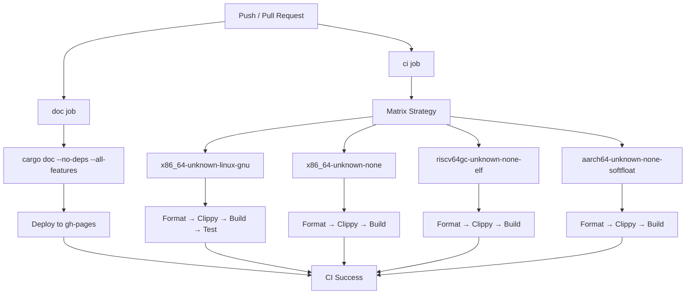
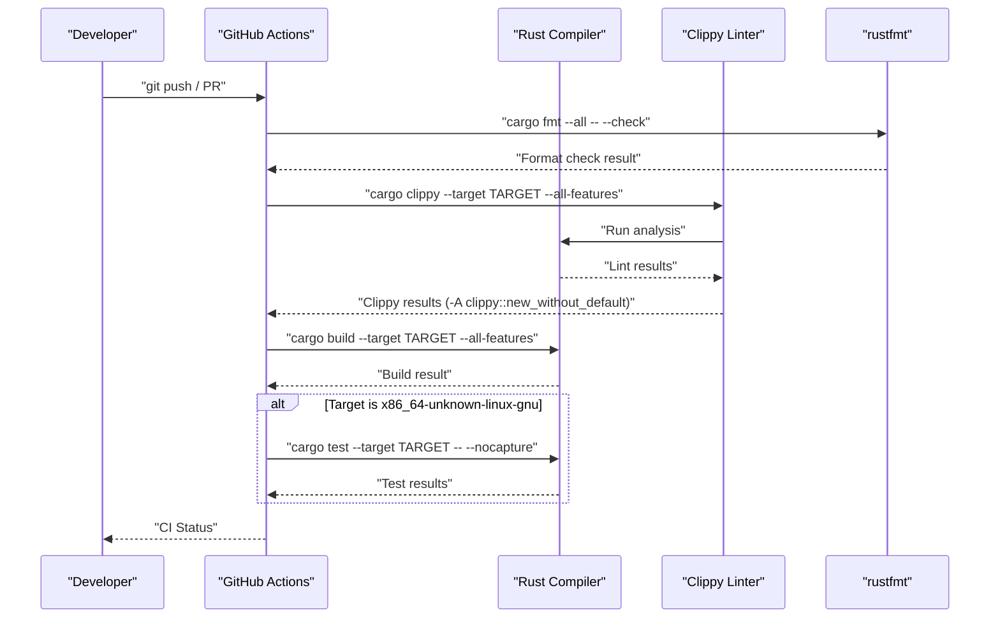
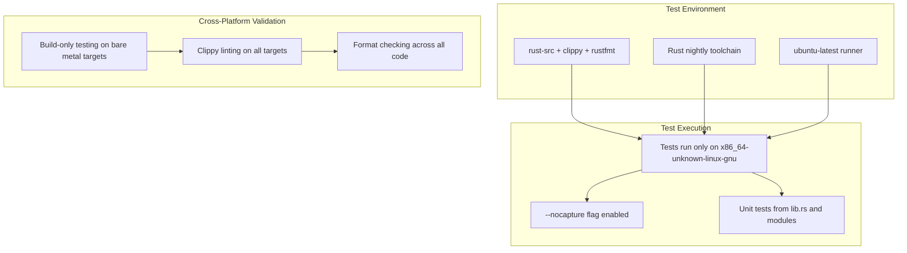
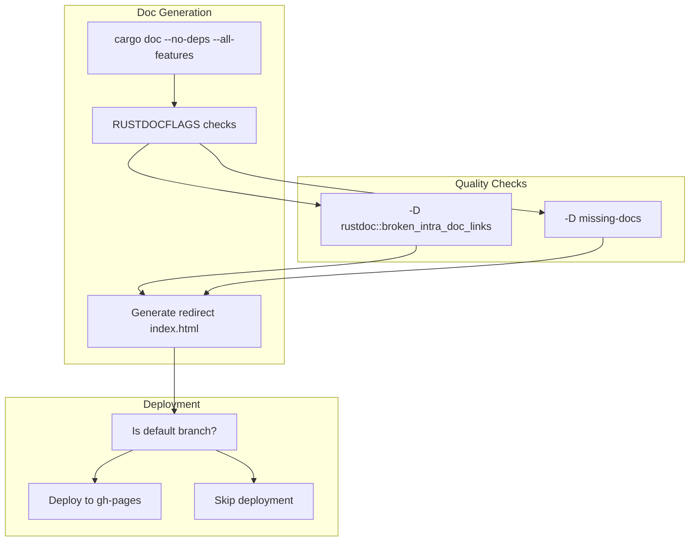

# Development Workflow

> **Relevant source files**
> * [.github/workflows/ci.yml](https://github.com/arceos-org/memory_set/blob/73b51e2b/.github/workflows/ci.yml)
> * [.gitignore](https://github.com/arceos-org/memory_set/blob/73b51e2b/.gitignore)

This document covers the continuous integration setup, testing strategies, and development environment configuration for contributors to the memory_set crate. It explains how code quality is maintained, how testing is automated, and what tools developers need to work effectively with the codebase.

For information about project dependencies and build configuration, see [Dependencies and Configuration](/arceos-org/memory_set/4.1-dependencies-and-configuration). For usage examples and testing patterns, see [Advanced Examples and Testing](/arceos-org/memory_set/3.2-advanced-examples-and-testing).

## CI Pipeline Overview

The memory_set crate uses GitHub Actions for continuous integration, with a comprehensive pipeline that ensures code quality across multiple Rust targets and maintains documentation.

### CI Workflow Structure



**Sources:** [.github/workflows/ci.yml(L1 - L56)&emsp;](https://github.com/arceos-org/memory_set/blob/73b51e2b/.github/workflows/ci.yml#L1-L56)

### Target Platform Matrix

The CI pipeline tests across multiple Rust targets to ensure compatibility with different architectures and environments:

|Target|Purpose|Testing Level|
| --- | --- | --- |
|x86_64-unknown-linux-gnu|Standard Linux development|Full (includes unit tests)|
|x86_64-unknown-none|Bare metal x86_64|Build and lint only|
|riscv64gc-unknown-none-elf|RISC-V bare metal|Build and lint only|
|aarch64-unknown-none-softfloat|ARM64 bare metal|Build and lint only|

**Sources:** [.github/workflows/ci.yml(L11 - L12)&emsp;](https://github.com/arceos-org/memory_set/blob/73b51e2b/.github/workflows/ci.yml#L11-L12)

## Code Quality Pipeline

### Quality Check Sequence



**Sources:** [.github/workflows/ci.yml(L22 - L30)&emsp;](https://github.com/arceos-org/memory_set/blob/73b51e2b/.github/workflows/ci.yml#L22-L30)

### Code Quality Tools Configuration

The CI pipeline enforces several code quality standards:

* **Format Checking**: Uses `cargo fmt --all -- --check` to ensure consistent code formatting
* **Linting**: Runs `cargo clippy` with custom configuration allowing `clippy::new_without_default`
* **Compilation**: Verifies code builds successfully across all target platforms
* **Testing**: Executes unit tests on the primary Linux target with `--nocapture` flag

**Sources:** [.github/workflows/ci.yml(L22 - L30)&emsp;](https://github.com/arceos-org/memory_set/blob/73b51e2b/.github/workflows/ci.yml#L22-L30)

## Testing Strategy

### Test Execution Environment



**Sources:** [.github/workflows/ci.yml(L28 - L30)&emsp;](https://github.com/arceos-org/memory_set/blob/73b51e2b/.github/workflows/ci.yml#L28-L30) [.github/workflows/ci.yml(L11 - L19)&emsp;](https://github.com/arceos-org/memory_set/blob/73b51e2b/.github/workflows/ci.yml#L11-L19)

### Testing Limitations and Strategy

The testing strategy reflects the embedded/systems programming nature of the memory_set crate:

* **Full Testing**: Only performed on `x86_64-unknown-linux-gnu` where standard library features are available
* **Build Verification**: All bare metal targets are compiled to ensure cross-platform compatibility
* **Mock Testing**: The crate includes `MockBackend` implementation for testing without real page tables

**Sources:** [.github/workflows/ci.yml(L29 - L30)&emsp;](https://github.com/arceos-org/memory_set/blob/73b51e2b/.github/workflows/ci.yml#L29-L30)

## Documentation Workflow

### Documentation Build and Deployment



**Sources:** [.github/workflows/ci.yml(L32 - L56)&emsp;](https://github.com/arceos-org/memory_set/blob/73b51e2b/.github/workflows/ci.yml#L32-L56)

### Documentation Quality Standards

The documentation workflow enforces strict quality standards:

* **Broken Link Detection**: `-D rustdoc::broken_intra_doc_links` fails build on broken documentation links
* **Missing Documentation**: `-D missing-docs` requires all public APIs to have documentation
* **Automatic Deployment**: Documentation is automatically deployed to GitHub Pages on default branch updates

**Sources:** [.github/workflows/ci.yml(L40)&emsp;](https://github.com/arceos-org/memory_set/blob/73b51e2b/.github/workflows/ci.yml#L40-L40) [.github/workflows/ci.yml(L44 - L55)&emsp;](https://github.com/arceos-org/memory_set/blob/73b51e2b/.github/workflows/ci.yml#L44-L55)

## Development Environment Setup

### Required Toolchain Components

For local development, contributors need:

```markdown
# Install nightly Rust toolchain
rustup toolchain install nightly

# Add required components
rustup component add rust-src clippy rustfmt

# Add target platforms for cross-compilation testing
rustup target add x86_64-unknown-none
rustup target add riscv64gc-unknown-none-elf  
rustup target add aarch64-unknown-none-softfloat
```

**Sources:** [.github/workflows/ci.yml(L15 - L19)&emsp;](https://github.com/arceos-org/memory_set/blob/73b51e2b/.github/workflows/ci.yml#L15-L19)

### Local Development Commands

To replicate CI checks locally:

```markdown
# Format check
cargo fmt --all -- --check

# Linting  
cargo clippy --all-features -- -A clippy::new_without_default

# Build for different targets
cargo build --target x86_64-unknown-linux-gnu --all-features
cargo build --target x86_64-unknown-none --all-features

# Run tests
cargo test -- --nocapture

# Generate documentation
cargo doc --no-deps --all-features
```

**Sources:** [.github/workflows/ci.yml(L22 - L30)&emsp;](https://github.com/arceos-org/memory_set/blob/73b51e2b/.github/workflows/ci.yml#L22-L30) [.github/workflows/ci.yml(L47)&emsp;](https://github.com/arceos-org/memory_set/blob/73b51e2b/.github/workflows/ci.yml#L47-L47)

### Git Configuration

The project maintains a standard `.gitignore` configuration:

* `/target` - Rust build artifacts
* `/.vscode` - IDE configuration files
* `.DS_Store` - macOS system files
* `Cargo.lock` - Dependency lock file (excluded for libraries)

**Sources:** [.gitignore(L1 - L5)&emsp;](https://github.com/arceos-org/memory_set/blob/73b51e2b/.gitignore#L1-L5)