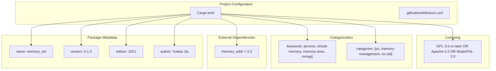
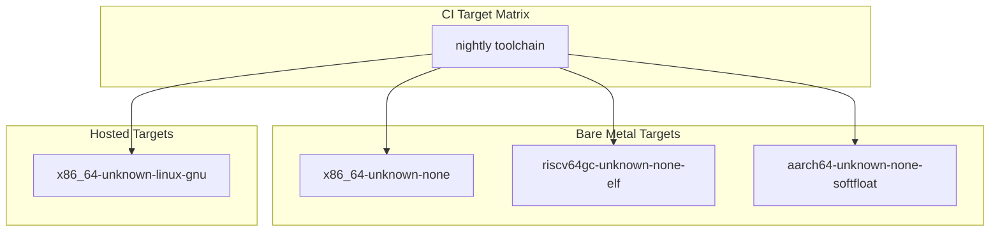
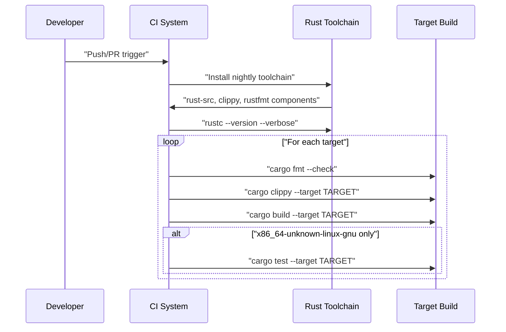
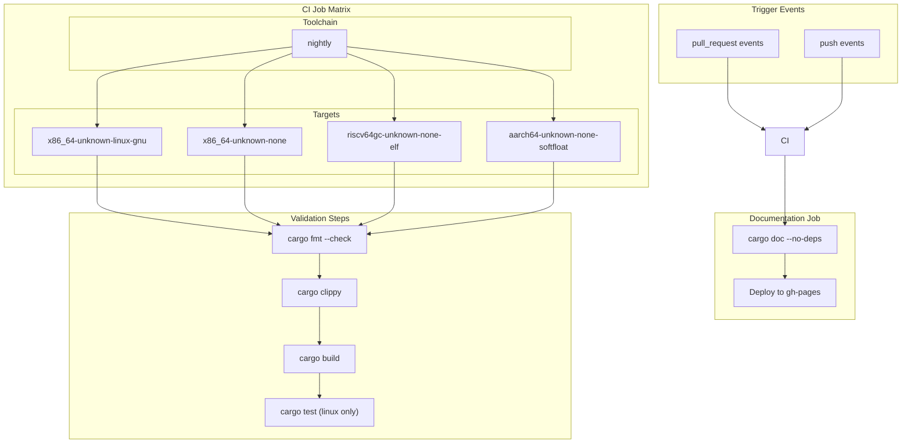
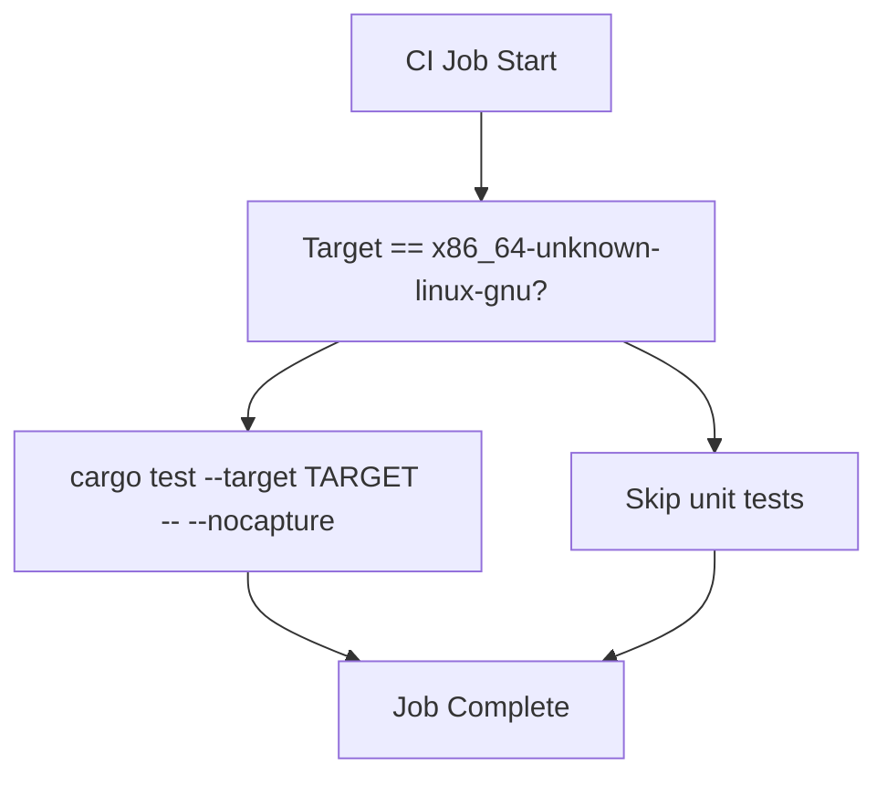

# Development and Project Setup

> **Relevant source files**
> * [.github/workflows/ci.yml](https://github.com/arceos-org/memory_set/blob/73b51e2b/.github/workflows/ci.yml)
> * [Cargo.toml](https://github.com/arceos-org/memory_set/blob/73b51e2b/Cargo.toml)

This document provides essential information for developers working on or with the `memory_set` crate, covering project dependencies, build configuration, supported targets, and development workflows. For implementation details and API usage, see [Implementation Details](/arceos-org/memory_set/2-implementation-details) and [Usage and Examples](/arceos-org/memory_set/3-usage-and-examples).

## Project Overview and Structure

The `memory_set` crate is designed as a foundational component within the ArceOS ecosystem, providing `no_std` compatible memory mapping management capabilities. The project follows standard Rust conventions with additional considerations for embedded and OS development environments.

**Project Structure and Dependencies**

Sources: [Cargo.toml(L1 - L16)&emsp;](https://github.com/arceos-org/memory_set/blob/73b51e2b/Cargo.toml#L1-L16)

The crate maintains minimal external dependencies, requiring only the `memory_addr` crate for address type definitions. This design choice supports the `no_std` environment requirement and reduces compilation complexity.

|Configuration|Value|Purpose|
| --- | --- | --- |
|Edition|2021|Modern Rust language features|
|Categories|os,memory-management,no-std|Ecosystem positioning|
|License|Triple-licensed|Compatibility with various projects|
|Repository|github.com/arceos-org/memory_set|Source code location|
|Documentation|docs.rs/memory_set|API documentation|

Sources: [Cargo.toml(L1 - L16)&emsp;](https://github.com/arceos-org/memory_set/blob/73b51e2b/Cargo.toml#L1-L16)

## Build Configuration and Target Support

The project supports multiple target architectures, reflecting its intended use in diverse embedded and OS development scenarios. The build configuration accommodates both hosted and bare-metal environments.

**Supported Target Architectures**

Sources: [.github/workflows/ci.yml(L11 - L12)&emsp;](https://github.com/arceos-org/memory_set/blob/73b51e2b/.github/workflows/ci.yml#L11-L12)

The build process includes several validation steps:

|Step|Command|Purpose|
| --- | --- | --- |
|Format Check|cargo fmt --all -- --check|Code style enforcement|
|Linting|cargo clippy --target TARGET --all-features|Static analysis|
|Build|cargo build --target TARGET --all-features|Compilation verification|
|Testing|cargo test --target TARGET|Unit test execution|

Sources: [.github/workflows/ci.yml(L23 - L30)&emsp;](https://github.com/arceos-org/memory_set/blob/73b51e2b/.github/workflows/ci.yml#L23-L30)

### Toolchain Requirements

The project requires the nightly Rust toolchain with specific components:

* `rust-src`: Required for no_std target compilation
* `clippy`: Static analysis and linting
* `rustfmt`: Code formatting enforcement

**Toolchain Setup Process**

Sources: [.github/workflows/ci.yml(L14 - L30)&emsp;](https://github.com/arceos-org/memory_set/blob/73b51e2b/.github/workflows/ci.yml#L14-L30)

## Development Workflow and CI Pipeline

The continuous integration system enforces code quality standards and validates functionality across all supported targets. The workflow is designed to catch issues early and maintain consistency.

### CI Job Configuration

The CI pipeline consists of two primary jobs:

1. **Main CI Job** (`ci`): Validates code across all target architectures
2. **Documentation Job** (`doc`): Builds and deploys API documentation

**CI Pipeline Architecture**

Sources: [.github/workflows/ci.yml(L1 - L56)&emsp;](https://github.com/arceos-org/memory_set/blob/73b51e2b/.github/workflows/ci.yml#L1-L56)

### Documentation Generation

The documentation workflow includes specialized configuration for maintaining high-quality API documentation:

* **RUSTDOCFLAGS**: `-D rustdoc::broken_intra_doc_links -D missing-docs`
* **Deployment**: Automatic GitHub Pages deployment on main branch
* **Index Generation**: Automatic redirect to crate documentation

Sources: [.github/workflows/ci.yml(L40 - L48)&emsp;](https://github.com/arceos-org/memory_set/blob/73b51e2b/.github/workflows/ci.yml#L40-L48)

### Testing Strategy

Testing is performed only on the `x86_64-unknown-linux-gnu` target due to the hosted environment requirements for test execution. The test command includes `--nocapture` to display output from test functions.

**Test Execution Conditions**

Sources: [.github/workflows/ci.yml(L28 - L30)&emsp;](https://github.com/arceos-org/memory_set/blob/73b51e2b/.github/workflows/ci.yml#L28-L30)

## ArceOS Ecosystem Integration

The `memory_set` crate is positioned as a foundational component within the broader ArceOS operating system project. This integration influences several design decisions:

* **Homepage**: Points to the main ArceOS project (`github.com/arceos-org/arceos`)
* **Keywords**: Include `arceos` for discoverability within the ecosystem
* **License**: Triple-licensing supports integration with various ArceOS components
* **No-std Compatibility**: Essential for kernel-level memory management

Sources: [Cargo.toml(L8 - L12)&emsp;](https://github.com/arceos-org/memory_set/blob/73b51e2b/Cargo.toml#L8-L12)

The minimal dependency footprint and broad target support make this crate suitable for integration across different ArceOS configurations and deployment scenarios.