# Implementation Details

> **Relevant source files**
> * [src/area.rs](https://github.com/arceos-org/memory_set/blob/73b51e2b/src/area.rs)
> * [src/set.rs](https://github.com/arceos-org/memory_set/blob/73b51e2b/src/set.rs)

This document provides detailed technical information about the internal implementation of the memory_set crate's core components. It covers the internal data structures, algorithms, and patterns used to implement memory mapping management functionality. For high-level concepts and architecture overview, see [System Architecture](/arceos-org/memory_set/1.2-system-architecture). For usage examples and public API documentation, see [Public API and Error Handling](/arceos-org/memory_set/2.3-public-api-and-error-handling).

## Core Data Structures and Types

The memory_set crate is built around three primary data structures that work together through a carefully designed generic type system.

### MemoryArea Internal Structure

The `MemoryArea` struct serves as the fundamental building block representing a contiguous virtual memory region with uniform properties.

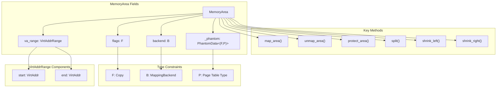

The `MemoryArea` struct maintains both metadata about the virtual address range and a reference to the backend that handles the actual page table manipulation. The `PhantomData` field ensures proper generic type relationships without runtime overhead.

**Sources:** [src/area.rs(L29 - L34)&emsp;](https://github.com/arceos-org/memory_set/blob/73b51e2b/src/area.rs#L29-L34) [src/area.rs(L36 - L76)&emsp;](https://github.com/arceos-org/memory_set/blob/73b51e2b/src/area.rs#L36-L76)

### MappingBackend Trait Implementation

The `MappingBackend` trait defines the interface for different memory mapping strategies, allowing the system to support various page table implementations and mapping policies.

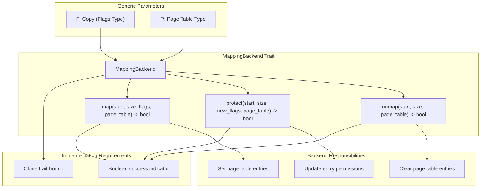

The trait's boolean return values allow backends to signal success or failure, which the higher-level operations convert into proper `MappingResult` types for error handling.

**Sources:** [src/area.rs(L15 - L22)&emsp;](https://github.com/arceos-org/memory_set/blob/73b51e2b/src/area.rs#L15-L22) [src/area.rs(L90 - L110)&emsp;](https://github.com/arceos-org/memory_set/blob/73b51e2b/src/area.rs#L90-L110)

### MemorySet Collection Structure

The `MemorySet` uses a `BTreeMap` to maintain an ordered collection of memory areas, enabling efficient range queries and overlap detection.

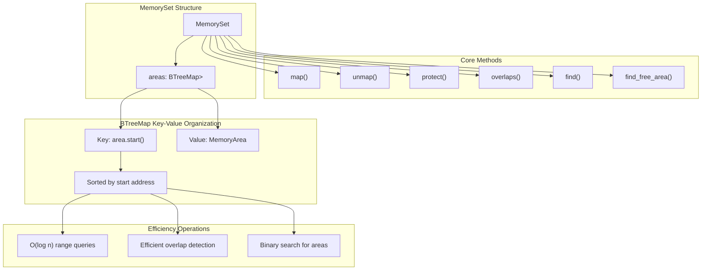

The choice of `VirtAddr` as the key ensures that areas are naturally sorted by their start addresses, which is crucial for the overlap detection and range manipulation algorithms.

**Sources:** [src/set.rs(L9 - L11)&emsp;](https://github.com/arceos-org/memory_set/blob/73b51e2b/src/set.rs#L9-L11) [src/set.rs(L36 - L49)&emsp;](https://github.com/arceos-org/memory_set/blob/73b51e2b/src/set.rs#L36-L49)

## Memory Area Lifecycle Operations

Memory areas support sophisticated lifecycle operations that enable complex memory management patterns while maintaining consistency with the underlying page table.

### Area Splitting Algorithm

The `split()` method implements a critical operation for handling partial unmapping and protection changes. It divides a single memory area into two independent areas at a specified boundary.

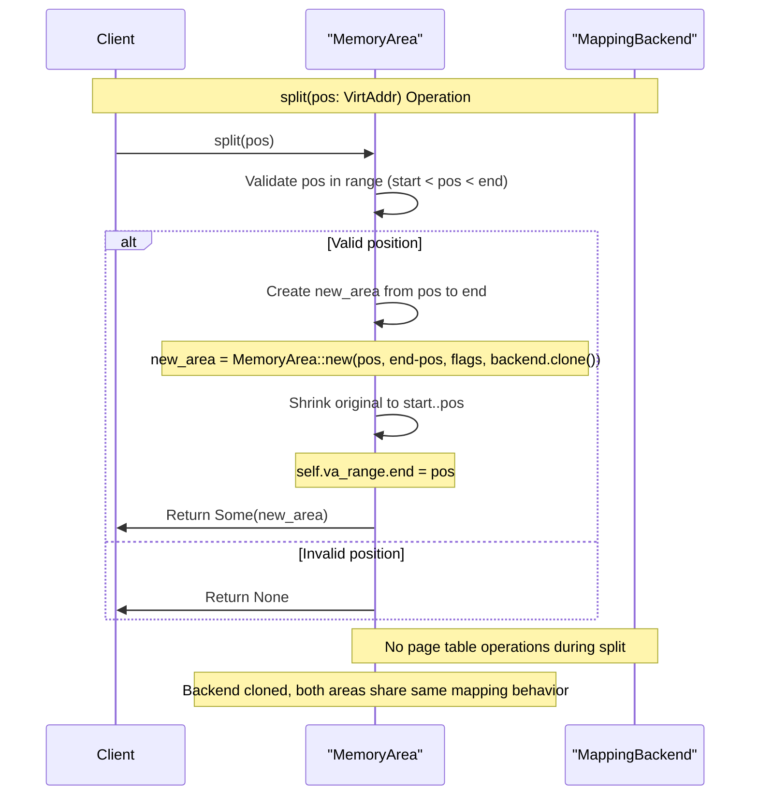

The splitting operation is purely metadata manipulation - it doesn't modify the page table entries. The actual page table changes happen when subsequent operations like `unmap()` or `protect()` are called on the split areas.

**Sources:** [src/area.rs(L148 - L163)&emsp;](https://github.com/arceos-org/memory_set/blob/73b51e2b/src/area.rs#L148-L163)

### Area Shrinking Operations

Memory areas support shrinking from either end, which is essential for handling partial unmapping operations efficiently.

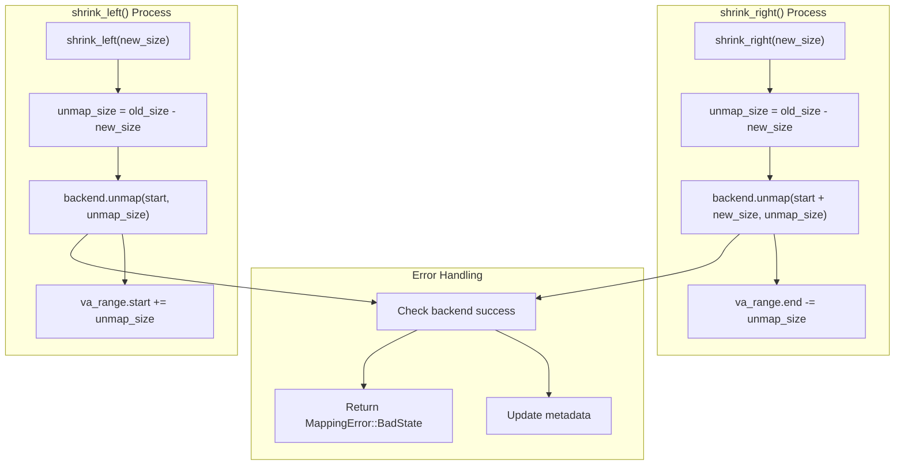

Both shrinking operations immediately update the page table through the backend before modifying the area's metadata, ensuring consistency between the virtual memory layout and page table state.

**Sources:** [src/area.rs(L116 - L139)&emsp;](https://github.com/arceos-org/memory_set/blob/73b51e2b/src/area.rs#L116-L139)

## Collection Management Algorithms

The `MemorySet` implements sophisticated algorithms for managing collections of memory areas, particularly for handling overlapping operations and maintaining area integrity.

### Overlap Detection Strategy

The overlap detection algorithm leverages the `BTreeMap`'s ordered structure to efficiently check for conflicts with minimal tree traversal.

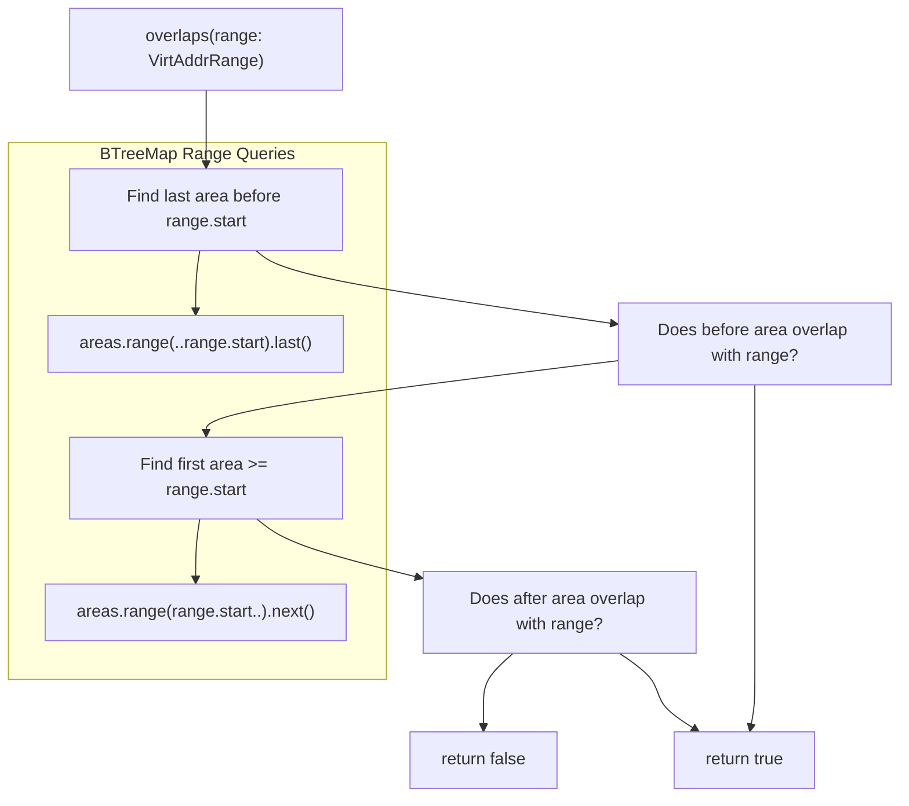

This algorithm achieves O(log n) complexity by examining at most two areas, regardless of the total number of areas in the set.

**Sources:** [src/set.rs(L36 - L49)&emsp;](https://github.com/arceos-org/memory_set/blob/73b51e2b/src/set.rs#L36-L49)

### Complex Unmapping Algorithm

The `unmap()` operation handles the most complex scenario in memory management: removing an arbitrary address range that may affect multiple existing areas in different ways.

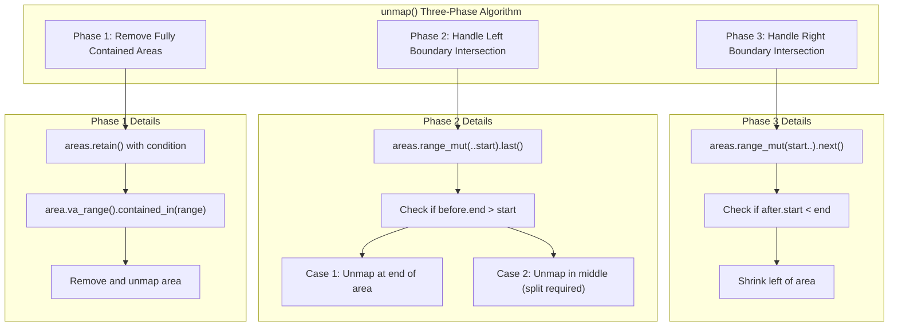

This three-phase approach ensures that all possible area-range relationships are handled correctly, from simple removal to complex splitting scenarios.

**Sources:** [src/set.rs(L122 - L168)&emsp;](https://github.com/arceos-org/memory_set/blob/73b51e2b/src/set.rs#L122-L168)

### Protection Changes with Area Management

The `protect()` operation demonstrates the most sophisticated area manipulation, potentially creating new areas while modifying existing ones.

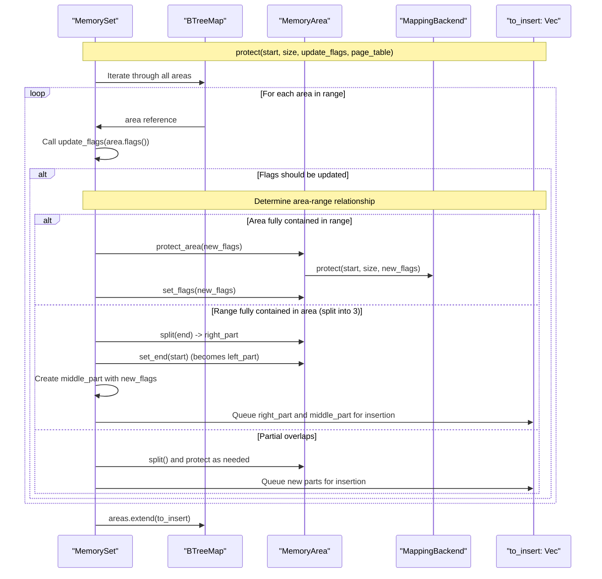

The algorithm defers insertions to avoid iterator invalidation, collecting new areas in a vector and inserting them after the main iteration completes.

**Sources:** [src/set.rs(L189 - L247)&emsp;](https://github.com/arceos-org/memory_set/blob/73b51e2b/src/set.rs#L189-L247)

## Generic Type System Implementation

The crate's generic type system enables flexible memory management while maintaining type safety and zero-cost abstractions.

### Type Parameter Relationships

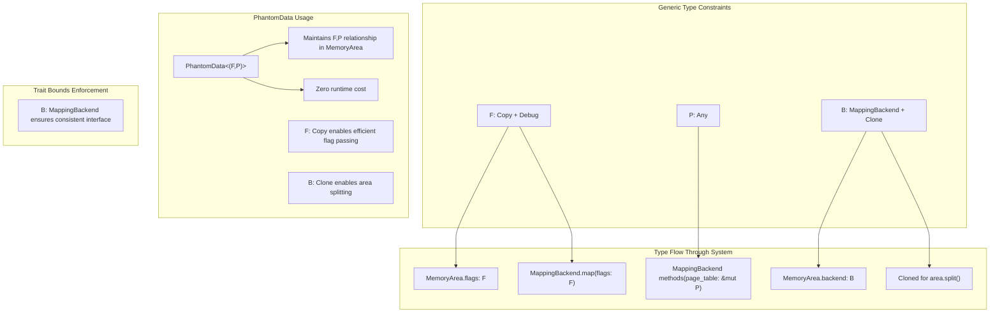

The `PhantomData<(F,P)>` field in `MemoryArea` ensures that the compiler tracks the relationship between flag type `F` and page table type `P` even though `P` is not directly stored in the struct.

**Sources:** [src/area.rs(L29 - L34)&emsp;](https://github.com/arceos-org/memory_set/blob/73b51e2b/src/area.rs#L29-L34) [src/area.rs(L15 - L22)&emsp;](https://github.com/arceos-org/memory_set/blob/73b51e2b/src/area.rs#L15-L22)

## Error Handling Strategy

The crate implements a consistent error handling strategy that propagates failures through the operation chain while maintaining transactional semantics.

### Error Propagation Pattern

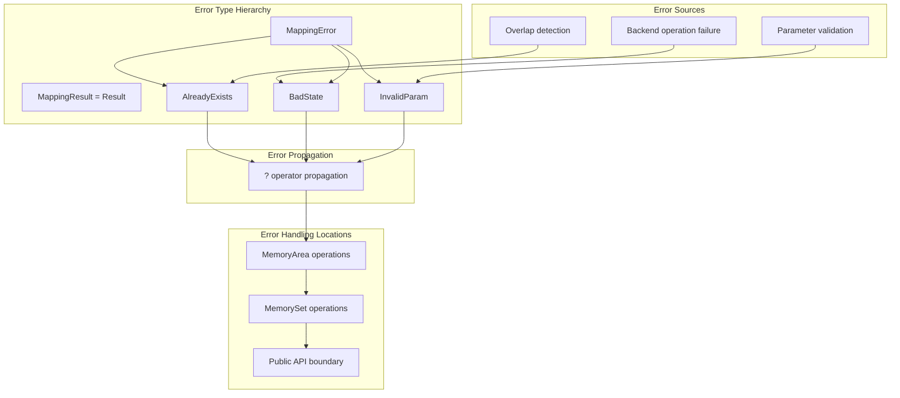

The error handling design ensures that failures at any level (backend, area, or set) are properly propagated to the caller with meaningful error information.

**Sources:** [src/area.rs(L6)&emsp;](https://github.com/arceos-org/memory_set/blob/73b51e2b/src/area.rs#L6-L6) [src/area.rs(L90 - L110)&emsp;](https://github.com/arceos-org/memory_set/blob/73b51e2b/src/area.rs#L90-L110) [src/set.rs(L98 - L114)&emsp;](https://github.com/arceos-org/memory_set/blob/73b51e2b/src/set.rs#L98-L114)

### Backend Error Translation

The system translates boolean failure indicators from backends into structured error types:

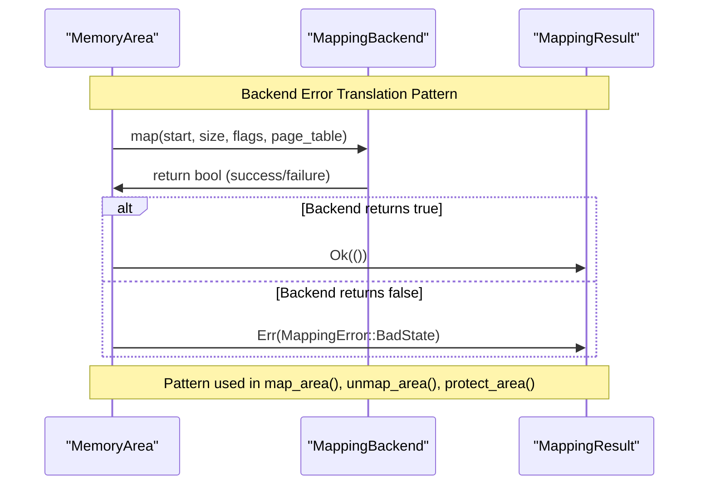

This translation happens in the `MemoryArea` methods that interface with the backend, converting the simple boolean results into the richer `MappingResult` type for higher-level error handling.

**Sources:** [src/area.rs(L90 - L103)&emsp;](https://github.com/arceos-org/memory_set/blob/73b51e2b/src/area.rs#L90-L103) [src/area.rs(L116 - L139)&emsp;](https://github.com/arceos-org/memory_set/blob/73b51e2b/src/area.rs#L116-L139)