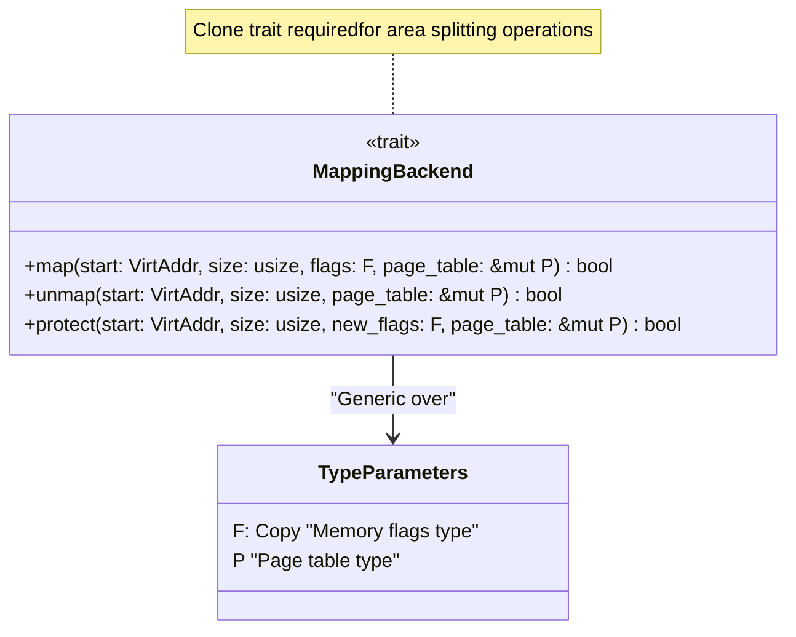
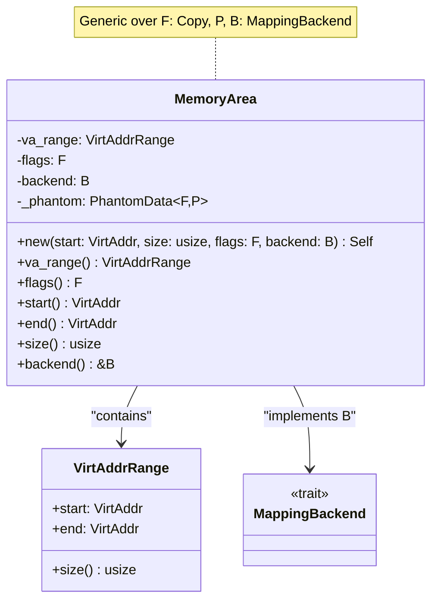
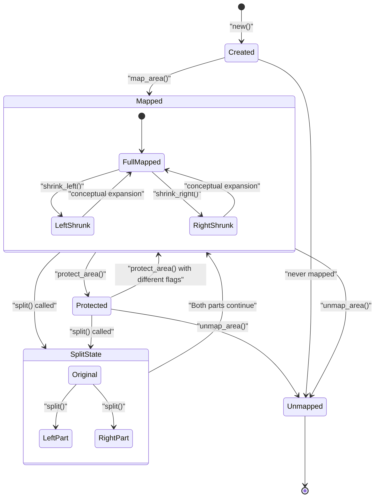
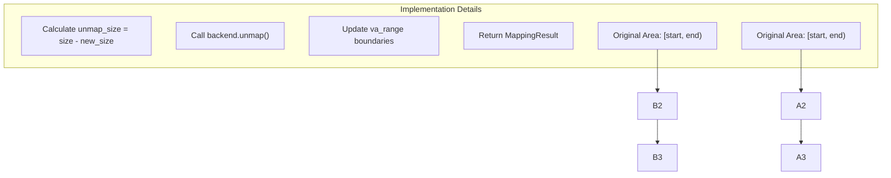
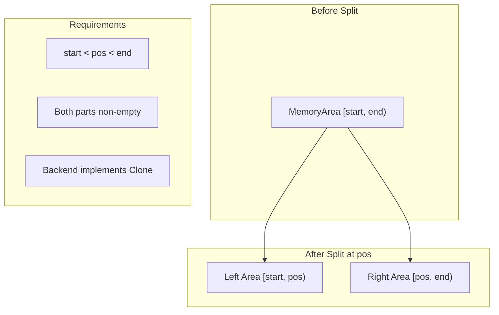
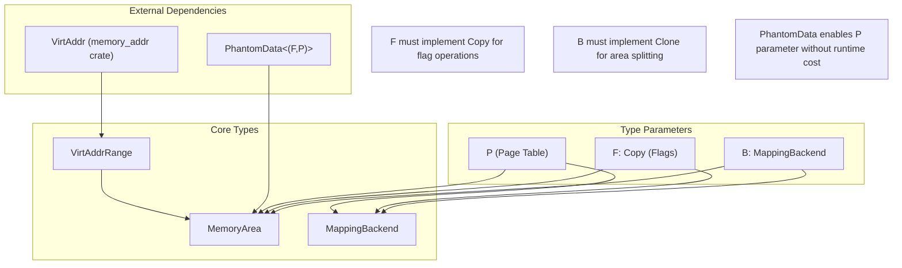

# MemoryArea and MappingBackend

> **Relevant source files**
> * [src/area.rs](https://github.com/arceos-org/memory_set/blob/73b51e2b/src/area.rs)

This page provides detailed technical documentation of the `MemoryArea` struct and `MappingBackend` trait, which form the core building blocks for individual memory region management within the memory_set crate. The `MappingBackend` trait defines the interface for different memory mapping strategies, while `MemoryArea` represents a contiguous virtual memory region with associated flags and backend implementation.

For information about how multiple memory areas are organized and managed as collections, see [2.2](/arceos-org/memory_set/2.2-memoryset-collection-management). For the public API that users interact with, see [2.3](/arceos-org/memory_set/2.3-public-api-and-error-handling).

## MappingBackend Trait

The `MappingBackend` trait defines the fundamental operations required for memory mapping implementations. It serves as an abstraction layer that allows different mapping strategies to be plugged into the memory management system.

### Trait Definition and Contract

The trait requires implementors to handle three core operations:

|Method|Purpose|Return Value|
| --- | --- | --- |
|map|Establish virtual-to-physical mappings|trueon success,falseon failure|
|unmap|Remove existing mappings|trueon success,falseon failure|
|protect|Modify access permissions|trueon success,falseon failure|

**Sources:** [src/area.rs(L8 - L22)&emsp;](https://github.com/arceos-org/memory_set/blob/73b51e2b/src/area.rs#L8-L22)

### Implementation Requirements

The trait imposes several constraints on implementors:

* **Clone Requirement**: Backends must implement `Clone` to support memory area splitting operations
* **Generic Flexibility**: The `F` type parameter allows different flag representations (e.g., bitfields, enums)
* **Page Table Agnostic**: The `P` type parameter enables integration with various page table implementations
* **Boolean Return Convention**: All methods return boolean success indicators

**Sources:** [src/area.rs(L15)&emsp;](https://github.com/arceos-org/memory_set/blob/73b51e2b/src/area.rs#L15-L15)

## MemoryArea Struct

The `MemoryArea` struct represents a contiguous virtual memory region with uniform properties. It combines address range information, access flags, and a backend implementation to provide a complete memory mapping abstraction.

### Structure and Fields

**Core Fields:**

* `va_range`: Defines the virtual address boundaries using `VirtAddrRange`
* `flags`: Stores memory access permissions of type `F`
* `backend`: Contains the mapping implementation of type `B`
* `_phantom`: Enables generic type parameters without runtime overhead

**Sources:** [src/area.rs(L24 - L34)&emsp;](https://github.com/arceos-org/memory_set/blob/73b51e2b/src/area.rs#L24-L34)

### Public Accessor Methods

The struct provides const accessor methods for retrieving area properties:

|Method|Return Type|Description|
| --- | --- | --- |
|va_range()|VirtAddrRange|Complete address range information|
|flags()|F|Current access flags|
|start()|VirtAddr|Starting virtual address|
|end()|VirtAddr|Ending virtual address (exclusive)|
|size()|usize|Size in bytes|
|backend()|&B|Reference to mapping backend|

**Sources:** [src/area.rs(L47 - L75)&emsp;](https://github.com/arceos-org/memory_set/blob/73b51e2b/src/area.rs#L47-L75)

## Core Operations and Lifecycle

Memory areas support a complete lifecycle from creation through mapping, modification, and unmapping operations.

### Area Lifecycle State Machine

**Sources:** [src/area.rs(L89 - L163)&emsp;](https://github.com/arceos-org/memory_set/blob/73b51e2b/src/area.rs#L89-L163)

### Mapping Operations

The area provides three fundamental mapping operations that delegate to the backend:

#### map_area

* **Purpose**: Establishes page table entries for the entire area
* **Implementation**: Calls `backend.map()` with area's start, size, and flags
* **Error Handling**: Returns `MappingError::BadState` on backend failure

#### unmap_area

* **Purpose**: Removes all page table entries for the area
* **Implementation**: Calls `backend.unmap()` with area's start and size
* **Error Handling**: Returns `MappingError::BadState` on backend failure

#### protect_area

* **Purpose**: Modifies access permissions without unmapping
* **Implementation**: Calls `backend.protect()` and updates internal flags
* **Error Handling**: Currently assumes success (returns `Ok(())`)

**Sources:** [src/area.rs(L89 - L110)&emsp;](https://github.com/arceos-org/memory_set/blob/73b51e2b/src/area.rs#L89-L110)

## Area Manipulation Methods

Memory areas support sophisticated manipulation operations that enable complex memory management scenarios.

### Shrinking Operations

**shrink_left Implementation:**

1. Calculates unmap size as `current_size - new_size`
2. Calls `backend.unmap(start, unmap_size, page_table)`
3. Updates `va_range.start` by adding `unmap_size`
4. Returns error if backend operation fails

**shrink_right Implementation:**

1. Calculates unmap size as `current_size - new_size`
2. Calls `backend.unmap(start + new_size, unmap_size, page_table)`
3. Updates `va_range.end` by subtracting `unmap_size`
4. Returns error if backend operation fails

**Sources:** [src/area.rs(L112 - L139)&emsp;](https://github.com/arceos-org/memory_set/blob/73b51e2b/src/area.rs#L112-L139)

### Area Splitting

The `split` method enables dividing a single memory area into two independent areas:

**Split Implementation Details:**

* **Input Validation**: Ensures `start < pos < end` to prevent empty areas
* **Left Area**: Original area with `end` updated to `pos`
* **Right Area**: New area created with `backend.clone()`
* **Return Value**: `Some(new_area)` on success, `None` on invalid position

**Sources:** [src/area.rs(L141 - L163)&emsp;](https://github.com/arceos-org/memory_set/blob/73b51e2b/src/area.rs#L141-L163)

## Type Relationships and Generic Design

The memory area system uses a sophisticated generic design to provide flexibility while maintaining type safety.

### Generic Type Parameter Flow

**Type Parameter Constraints:**

* **F: Copy**: Enables efficient flag copying during operations
* **P**: Unconstrained page table type for maximum flexibility
* **B: MappingBackend<F,P>**: Ensures backend compatibility with flag and page table types

**Key Design Benefits:**

* **Zero-cost abstraction**: PhantomData eliminates runtime overhead
* **Type safety**: Generic constraints prevent mismatched components
* **Flexibility**: Different flag encodings and page table implementations supported

**Sources:** [src/area.rs(L29 - L34)&emsp;](https://github.com/arceos-org/memory_set/blob/73b51e2b/src/area.rs#L29-L34) [src/area.rs(L15)&emsp;](https://github.com/arceos-org/memory_set/blob/73b51e2b/src/area.rs#L15-L15)