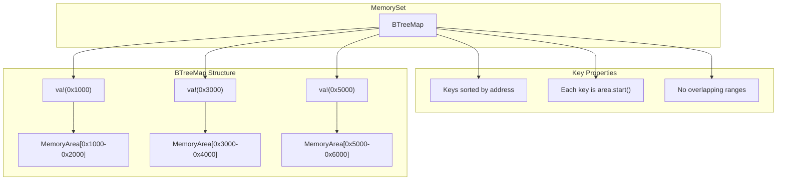
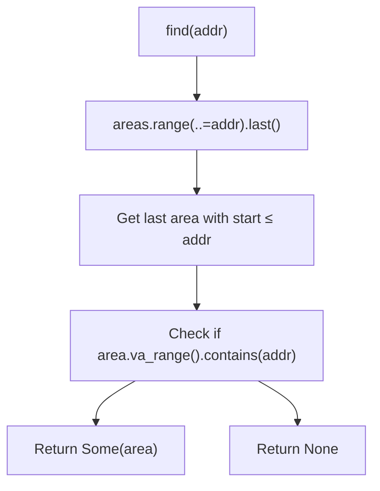
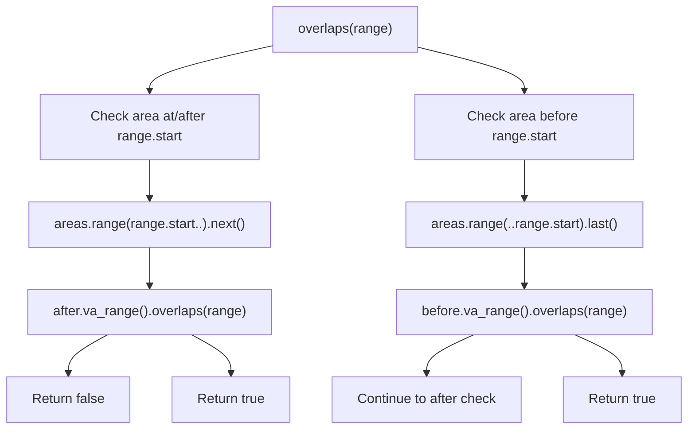
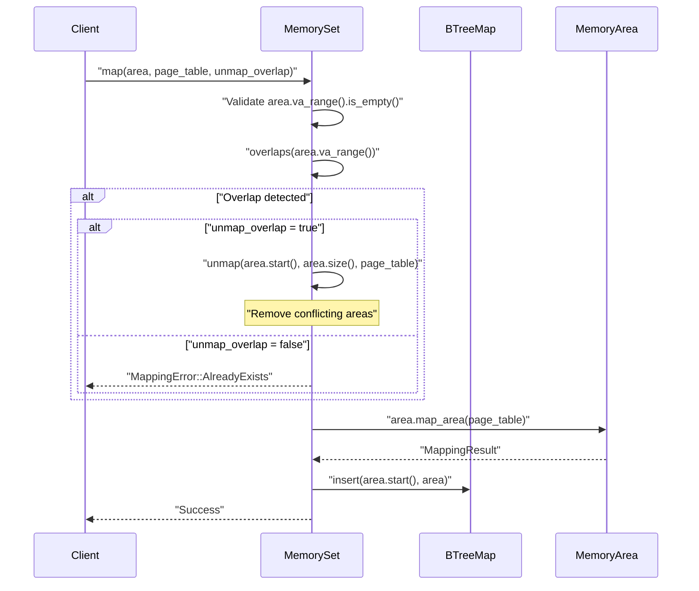
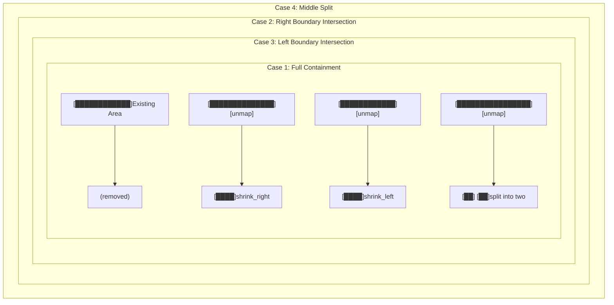
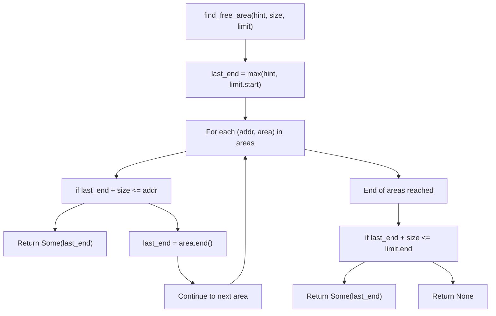

# MemorySet Collection Management

> **Relevant source files**
> * [src/set.rs](https://github.com/arceos-org/memory_set/blob/73b51e2b/src/set.rs)

This document covers the internal collection management mechanisms of `MemorySet`, focusing on how it organizes, tracks, and manipulates collections of memory areas using a `BTreeMap` data structure. It examines overlap detection algorithms, area lifecycle operations, and complex manipulation procedures like splitting and shrinking.

For information about individual `MemoryArea` objects and the `MappingBackend` trait, see [MemoryArea and MappingBackend](/arceos-org/memory_set/2.1-memoryarea-and-mappingbackend). For the public API interface, see [Public API and Error Handling](/arceos-org/memory_set/2.3-public-api-and-error-handling).

## Core Data Structure Organization

The `MemorySet` struct uses a `BTreeMap<VirtAddr, MemoryArea<F, P, B>>` as its primary storage mechanism, where the key is the starting virtual address of each memory area. This design provides efficient logarithmic-time operations for address-based queries and maintains areas in sorted order by their start addresses.

**MemorySet BTreeMap Organization**



**Sources:** [src/set.rs(L9 - L11)&emsp;](https://github.com/arceos-org/memory_set/blob/73b51e2b/src/set.rs#L9-L11)

## Basic Collection Operations

The `MemorySet` provides fundamental collection operations that leverage the `BTreeMap`'s sorted structure:

|Operation|Method|Time Complexity|Purpose|
| --- | --- | --- | --- |
|Count areas|len()|O(1)|Returns number of areas|
|Check emptiness|is_empty()|O(1)|Tests if collection is empty|
|Iterate areas|iter()|O(n)|Provides iterator over all areas|
|Find by address|find(addr)|O(log n)|Locates area containing address|

The `find()` method demonstrates efficient address lookup using range queries on the `BTreeMap`:

**Address Lookup Algorithm**



**Sources:** [src/set.rs(L21 - L55)&emsp;](https://github.com/arceos-org/memory_set/blob/73b51e2b/src/set.rs#L21-L55)

## Overlap Detection and Management

The `overlaps()` method implements efficient overlap detection by checking at most two adjacent areas in the sorted collection, rather than scanning all areas:

**Overlap Detection Strategy**



This algorithm achieves O(log n) complexity by exploiting the sorted nature of the `BTreeMap` and the non-overlapping invariant of stored areas.

**Sources:** [src/set.rs(L36 - L49)&emsp;](https://github.com/arceos-org/memory_set/blob/73b51e2b/src/set.rs#L36-L49)

## Memory Area Addition and Conflict Resolution

The `map()` operation handles the complex process of adding new areas while managing potential conflicts:

**Map Operation Flow**



**Sources:** [src/set.rs(L85 - L114)&emsp;](https://github.com/arceos-org/memory_set/blob/73b51e2b/src/set.rs#L85-L114)

## Complex Area Manipulation Operations

### Unmap Operation with Area Splitting

The `unmap()` operation implements sophisticated area manipulation, including splitting areas when the unmapped region falls in the middle of an existing area:

**Unmap Cases and Transformations**



The implementation handles these cases through a three-phase process:

1. **Full Removal**: Remove areas completely contained in the unmap range using `retain()`
2. **Left Boundary Processing**: Shrink or split areas that intersect the left boundary
3. **Right Boundary Processing**: Shrink areas that intersect the right boundary

**Sources:** [src/set.rs(L116 - L169)&emsp;](https://github.com/arceos-org/memory_set/blob/73b51e2b/src/set.rs#L116-L169)

### Protect Operation with Multi-way Splitting

The `protect()` operation changes memory flags within a range and may require splitting existing areas into multiple parts:

**Protect Operation Area Handling**

```

```

**Sources:** [src/set.rs(L180 - L247)&emsp;](https://github.com/arceos-org/memory_set/blob/73b51e2b/src/set.rs#L180-L247)

## Free Space Management

The `find_free_area()` method locates unallocated address ranges by examining gaps between consecutive areas:

**Free Area Search Algorithm**



**Sources:** [src/set.rs(L57 - L83)&emsp;](https://github.com/arceos-org/memory_set/blob/73b51e2b/src/set.rs#L57-L83)

## Collection Cleanup Operations

The `clear()` method provides atomic cleanup of all memory areas and their underlying mappings:

```python
// Unmaps all areas from the page table, then clears the collection
pub fn clear(&mut self, page_table: &mut P) -> MappingResult
```

This operation iterates through all areas, calls `unmap_area()` on each, and then clears the `BTreeMap` if all unmapping operations succeed.

**Sources:** [src/set.rs(L171 - L178)&emsp;](https://github.com/arceos-org/memory_set/blob/73b51e2b/src/set.rs#L171-L178)