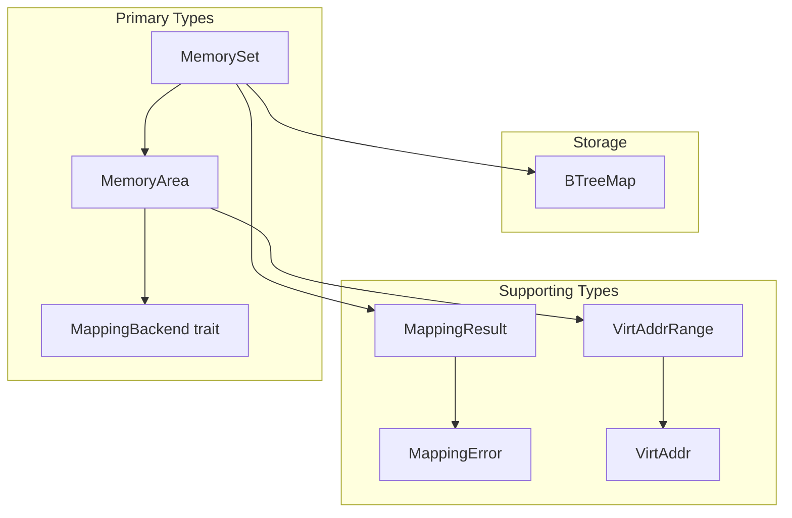
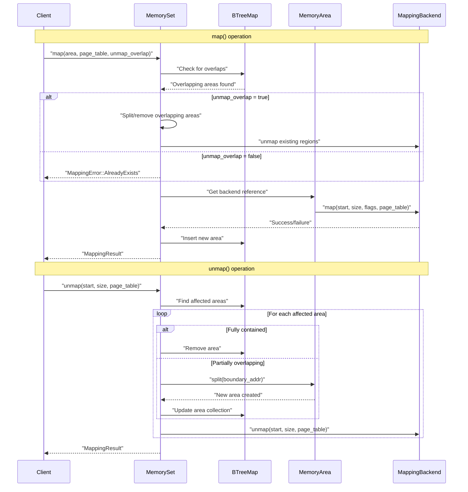
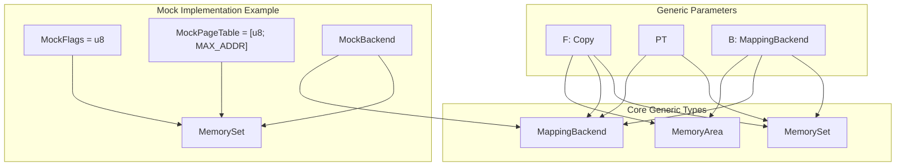

# Overview

> **Relevant source files**
> * [README.md](https://github.com/arceos-org/memory_set/blob/73b51e2b/README.md)
> * [src/lib.rs](https://github.com/arceos-org/memory_set/blob/73b51e2b/src/lib.rs)

The `memory_set` crate provides building blocks for memory mapping management in Rust, offering data structures and operations similar to Unix system calls like `mmap`, `munmap`, and `mprotect`. This document covers the core architecture, components, and design patterns of the memory management system.

**Note**: This repository has been archived and the code has been moved to the [axmm_crates](https://github.com/arceos-org/memory_set/blob/73b51e2b/axmm_crates) repository as indicated in the README.

For detailed implementation specifics of individual components, see [Implementation Details](/arceos-org/memory_set/2-implementation-details). For practical usage examples and patterns, see [Usage and Examples](/arceos-org/memory_set/3-usage-and-examples).

## Core Components and Structure

The `memory_set` crate is built around three primary components that work together to provide flexible memory mapping management:

**Core Components Overview**

Sources: [src/lib.rs(L12 - L13)&emsp;](https://github.com/arceos-org/memory_set/blob/73b51e2b/src/lib.rs#L12-L13) [src/lib.rs(L15 - L27)&emsp;](https://github.com/arceos-org/memory_set/blob/73b51e2b/src/lib.rs#L15-L27) [README.md(L18 - L41)&emsp;](https://github.com/arceos-org/memory_set/blob/73b51e2b/README.md#L18-L41)

The system uses a generic type parameter approach where:

* `F` represents memory flags (must implement `Copy`)
* `PT` represents the page table type
* `B` represents the mapping backend implementation

## System Architecture and Data Flow

The memory management system follows a layered architecture where high-level operations are decomposed into area management and low-level page table manipulation:

**Memory Management Operation Flow**

Sources: [README.md(L36 - L48)&emsp;](https://github.com/arceos-org/memory_set/blob/73b51e2b/README.md#L36-L48) [src/lib.rs(L15 - L27)&emsp;](https://github.com/arceos-org/memory_set/blob/73b51e2b/src/lib.rs#L15-L27)

## Generic Type System Design

The crate achieves flexibility through careful use of Rust generics, allowing different implementations for flags, page tables, and backends while maintaining type safety:

**Generic Type Relationships**

Sources: [README.md(L24 - L34)&emsp;](https://github.com/arceos-org/memory_set/blob/73b51e2b/README.md#L24-L34) [README.md(L51 - L87)&emsp;](https://github.com/arceos-org/memory_set/blob/73b51e2b/README.md#L51-L87) [src/lib.rs(L12 - L13)&emsp;](https://github.com/arceos-org/memory_set/blob/73b51e2b/src/lib.rs#L12-L13)

## Error Handling Strategy

The crate uses a dedicated error type system to handle various failure scenarios in memory operations:

|Error Type|Description|Usage Context|
| --- | --- | --- |
|MappingError::InvalidParam|Invalid parameters likeaddr,size,flags|Input validation|
|MappingError::AlreadyExists|Range overlaps with existing mapping|Overlap detection|
|MappingError::BadState|Backend page table in bad state|Backend operation failures|

The `MappingResult<T>` type alias provides a convenient `Result` type for all memory operations, defaulting to `MappingResult<()>` for operations that return no meaningful data on success.

Sources: [src/lib.rs(L15 - L27)&emsp;](https://github.com/arceos-org/memory_set/blob/73b51e2b/src/lib.rs#L15-L27)

## Key Design Principles

1. **Generic Flexibility**: The system uses three generic type parameters (`F`, `PT`, `B`) to allow customization of flags, page tables, and backend implementations
2. **Area-Based Management**: Memory is managed in discrete areas that can be split, merged, and manipulated independently
3. **Backend Abstraction**: The `MappingBackend` trait abstracts actual page table manipulation, enabling different implementation strategies
4. **Overlap Handling**: Sophisticated overlap detection and resolution with options for automatic unmapping of conflicting regions
5. **Type Safety**: Rust's type system ensures memory safety and prevents common memory management errors

This overview establishes the foundation for understanding the detailed implementation covered in [Implementation Details](/arceos-org/memory_set/2-implementation-details) and the practical usage patterns demonstrated in [Usage and Examples](/arceos-org/memory_set/3-usage-and-examples).

Sources: [README.md(L9 - L14)&emsp;](https://github.com/arceos-org/memory_set/blob/73b51e2b/README.md#L9-L14) [src/lib.rs(L1 - L13)&emsp;](https://github.com/arceos-org/memory_set/blob/73b51e2b/src/lib.rs#L1-L13)