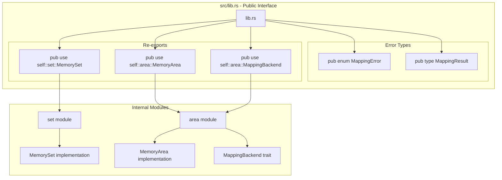
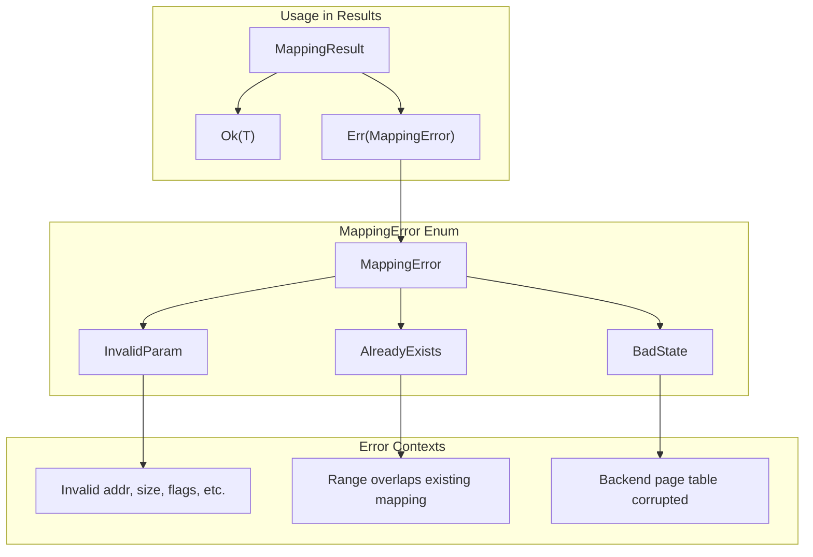
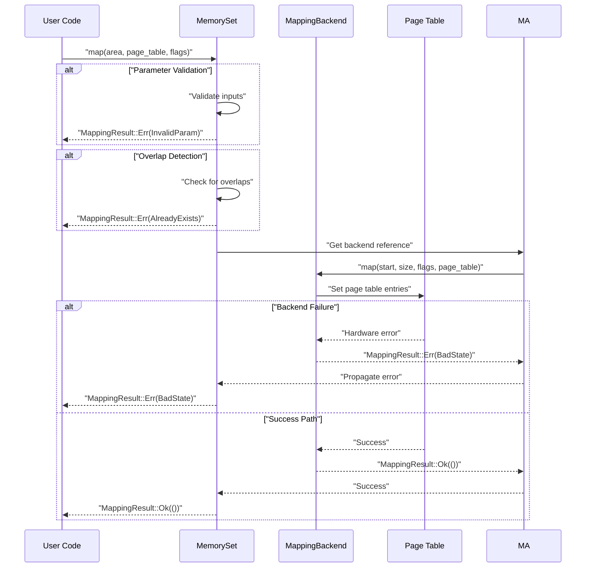
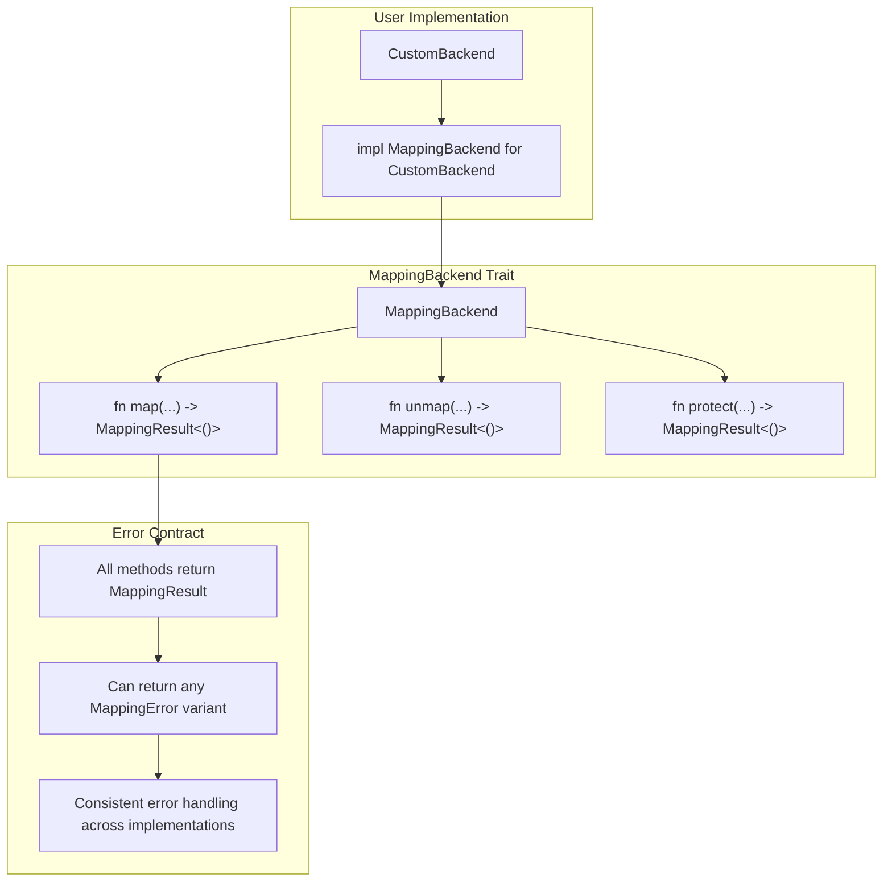

# Public API and Error Handling

> **Relevant source files**
> * [src/lib.rs](https://github.com/arceos-org/memory_set/blob/73b51e2b/src/lib.rs)

This document covers the public interface exposed by the `memory_set` crate and its error handling mechanisms. It focuses on what the library makes available to users and how errors are represented and propagated throughout the system.

For implementation details of the individual components, see [MemoryArea and MappingBackend](/arceos-org/memory_set/2.1-memoryarea-and-mappingbackend) and [MemorySet Collection Management](/arceos-org/memory_set/2.2-memoryset-collection-management). For practical usage examples, see [Basic Usage Patterns](/arceos-org/memory_set/3.1-basic-usage-patterns).

## Public API Structure

The `memory_set` crate exposes a clean public interface consisting of three main components and a structured error handling system. The public API is defined through selective re-exports in the library root.

### Public Components

The library exposes exactly three primary types to users:

|Component|Type|Purpose|
| --- | --- | --- |
|MemorySet<F,PT,B>|Generic struct|Top-level memory management container|
|MemoryArea<F,B>|Generic struct|Individual memory region representation|
|MappingBackend<F,PT>|Trait|Backend interface for page table operations|

**Public API Export Structure**



Sources: [src/lib.rs(L12 - L13)&emsp;](https://github.com/arceos-org/memory_set/blob/73b51e2b/src/lib.rs#L12-L13)

### Generic Type Parameters

All public components use consistent generic type parameters that provide flexibility while maintaining type safety:

* `F: Copy` - Memory flags type (e.g., read/write/execute permissions)
* `PT` - Page table implementation type
* `B: MappingBackend<F,PT>` - Concrete backend implementation

This design allows users to plug in their own flag representations, page table structures, and backend implementations while ensuring type compatibility across the system.

Sources: [src/lib.rs(L1 - L28)&emsp;](https://github.com/arceos-org/memory_set/blob/73b51e2b/src/lib.rs#L1-L28)

## Error Handling System

The library implements a structured error handling approach using a custom error type and result wrapper that provides clear feedback about operation failures.

### MappingError Variants

**Error Type Definition**



The error system defines three specific failure modes:

|Error Variant|Description|Common Causes|
| --- | --- | --- |
|InvalidParam|Invalid operation parameters|Misaligned addresses, zero sizes, invalid flags|
|AlreadyExists|Range conflicts with existing mapping|Overlapping memory regions without unmap permission|
|BadState|Backend page table corruption|Hardware errors, concurrent modification|

Sources: [src/lib.rs(L15 - L24)&emsp;](https://github.com/arceos-org/memory_set/blob/73b51e2b/src/lib.rs#L15-L24)

### Result Type Pattern

The library uses a type alias `MappingResult<T>` that standardizes error handling across all operations:

```
pub type MappingResult<T = ()> = Result<T, MappingError>;
```

This pattern allows operations to return either successful results with typed values or structured error information. The default unit type `()` accommodates operations that succeed without returning data.

Sources: [src/lib.rs(L26 - L27)&emsp;](https://github.com/arceos-org/memory_set/blob/73b51e2b/src/lib.rs#L26-L27)

## API Design Patterns

### Error Propagation Flow

**Error Handling Throughout the System**



Sources: [src/lib.rs(L15 - L27)&emsp;](https://github.com/arceos-org/memory_set/blob/73b51e2b/src/lib.rs#L15-L27)

### Trait-Based Extension

The `MappingBackend` trait allows users to implement custom page table management while maintaining compatibility with the error handling system. All backend implementations must return `MappingResult<T>` values, ensuring consistent error propagation.

**Backend Implementation Requirements**



Sources: [src/lib.rs(L12 - L13)&emsp;](https://github.com/arceos-org/memory_set/blob/73b51e2b/src/lib.rs#L12-L13)

## Usage Interface Characteristics

### Type Safety Guarantees

The public API enforces several compile-time guarantees:

* **Backend Compatibility**: `B: MappingBackend<F,PT>` ensures backends match flag and page table types
* **Flag Consistency**: `F: Copy` requirement enables efficient flag operations
* **Generic Flexibility**: Users can substitute their own types while maintaining safety

### Memory Management Operations

The public interface supports standard memory management operations through the `MemorySet` type:

* **Mapping**: Create new memory regions with specified permissions
* **Unmapping**: Remove existing memory regions
* **Protection**: Modify permissions on existing regions
* **Querying**: Inspect current memory layout and permissions

All operations return `MappingResult<T>` values that must be handled by user code, preventing silent failures and ensuring error visibility.

Sources: [src/lib.rs(L1 - L28)&emsp;](https://github.com/arceos-org/memory_set/blob/73b51e2b/src/lib.rs#L1-L28)