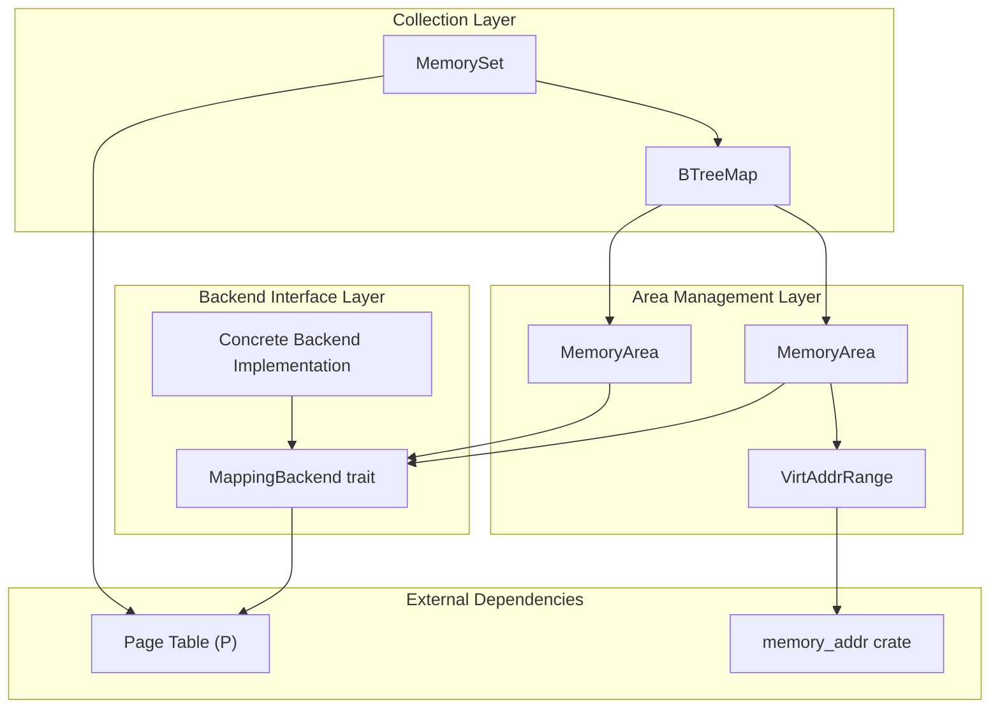
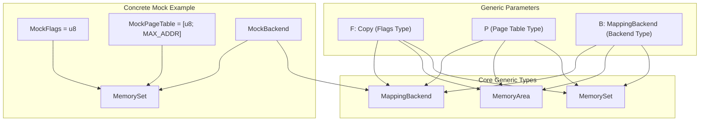
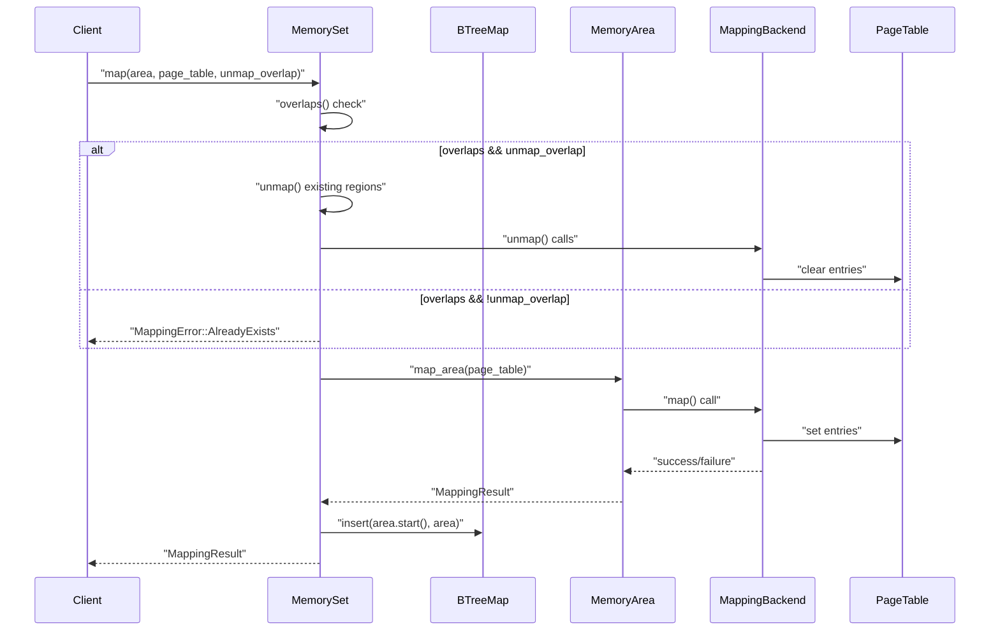
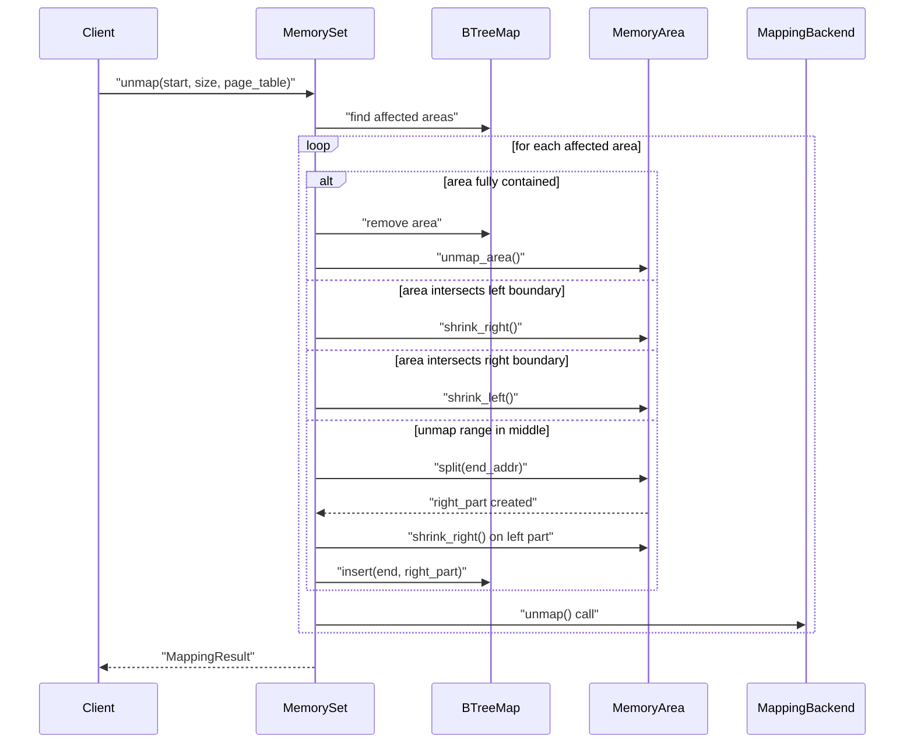
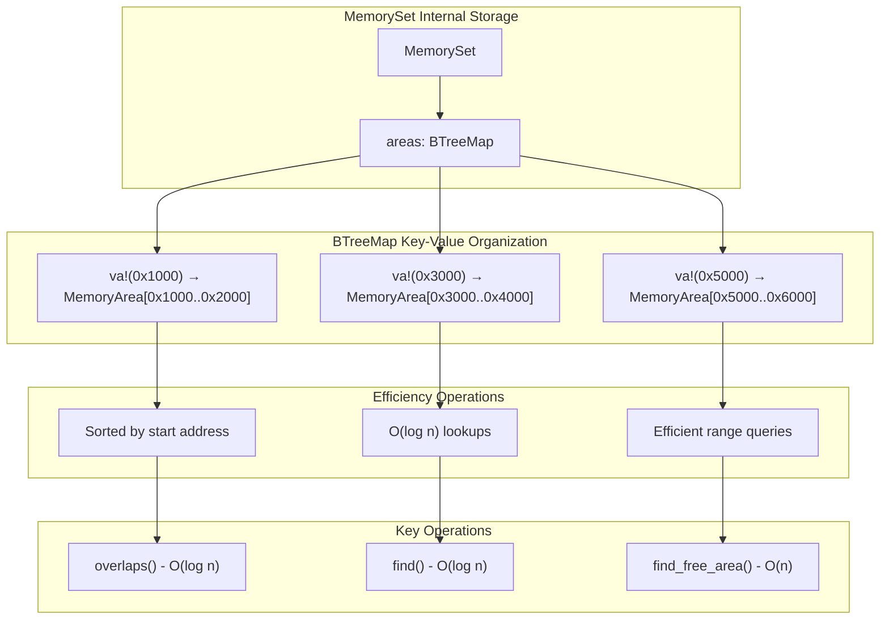
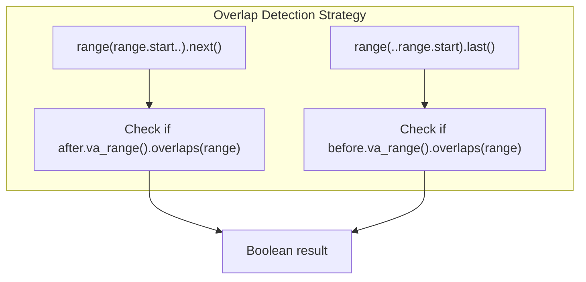

# System Architecture

> **Relevant source files**
> * [README.md](https://github.com/arceos-org/memory_set/blob/73b51e2b/README.md)
> * [src/set.rs](https://github.com/arceos-org/memory_set/blob/73b51e2b/src/set.rs)

This document details the architectural design of the memory_set crate, focusing on how the core components interact, the generic type system design, and the data flow through memory management operations. For an introduction to the fundamental concepts of `MemorySet`, `MemoryArea`, and `MappingBackend`, see [Core Concepts](/arceos-org/memory_set/1.1-core-concepts). For detailed implementation specifics of individual components, see [Implementation Details](/arceos-org/memory_set/2-implementation-details).

## Component Architecture and Interactions

The memory_set crate follows a layered architecture with three primary abstraction levels: the collection layer (`MemorySet`), the area management layer (`MemoryArea`), and the backend interface layer (`MappingBackend`).

**Component Interaction Overview**

The `MemorySet` acts as the orchestrator, managing collections of `MemoryArea` objects through a `BTreeMap` indexed by virtual addresses. Each `MemoryArea` delegates actual page table manipulation to its associated `MappingBackend` implementation.

**Sources:** [src/set.rs(L9 - L11)&emsp;](https://github.com/arceos-org/memory_set/blob/73b51e2b/src/set.rs#L9-L11) [README.md(L18 - L41)&emsp;](https://github.com/arceos-org/memory_set/blob/73b51e2b/README.md#L18-L41)

## Generic Type System Design

The crate achieves flexibility through a carefully designed generic type system that allows different flag types, page table implementations, and backend strategies while maintaining type safety.

**Generic Type Parameter Relationships**

The type parameter `F` represents memory flags and must implement `Copy`. The page table type `P` is completely generic, allowing integration with different page table implementations. The backend type `B` must implement `MappingBackend<F,P>`, creating a three-way constraint that ensures type compatibility across the entire system.

**Sources:** [src/set.rs(L9)&emsp;](https://github.com/arceos-org/memory_set/blob/73b51e2b/src/set.rs#L9-L9) [README.md(L24 - L31)&emsp;](https://github.com/arceos-org/memory_set/blob/73b51e2b/README.md#L24-L31)

## Memory Management Data Flow

Memory management operations follow predictable patterns that involve coordination between all architectural layers. The most complex operations, such as unmapping that splits existing areas, demonstrate the sophisticated interaction patterns.

**Map Operation Data Flow**

**Unmap Operation with Area Splitting**

The unmap operation demonstrates the most complex data flow, involving area splitting, shrinking, and careful coordination with the page table backend to maintain consistency.

**Sources:** [src/set.rs(L93 - L114)&emsp;](https://github.com/arceos-org/memory_set/blob/73b51e2b/src/set.rs#L93-L114) [src/set.rs(L122 - L169)&emsp;](https://github.com/arceos-org/memory_set/blob/73b51e2b/src/set.rs#L122-L169)

## Storage Organization and Efficiency

The `MemorySet` uses a `BTreeMap<VirtAddr, MemoryArea>` as its core storage mechanism, providing efficient operations for the common memory management use cases.

**BTreeMap Storage Structure**

The BTreeMap provides several efficiency advantages:

|Operation|Complexity|Implementation|
| --- | --- | --- |
|overlaps()|O(log n)|Range queries before/after target range|
|find()|O(log n)|Range query up to target address|
|find_free_area()|O(n)|Linear scan between existing areas|
|map()|O(log n)|Insert operation after overlap check|
|unmap()|O(log n + k)|Where k is the number of affected areas|

**Key Algorithm: Overlap Detection**

The overlap detection algorithm uses BTreeMap's range query capabilities to efficiently check for conflicts:

This approach requires at most two BTreeMap lookups regardless of the total number of areas, making it highly efficient even for large memory sets.

**Sources:** [src/set.rs(L10)&emsp;](https://github.com/arceos-org/memory_set/blob/73b51e2b/src/set.rs#L10-L10) [src/set.rs(L37 - L49)&emsp;](https://github.com/arceos-org/memory_set/blob/73b51e2b/src/set.rs#L37-L49) [src/set.rs(L52 - L55)&emsp;](https://github.com/arceos-org/memory_set/blob/73b51e2b/src/set.rs#L52-L55) [src/set.rs(L64 - L83)&emsp;](https://github.com/arceos-org/memory_set/blob/73b51e2b/src/set.rs#L64-L83)