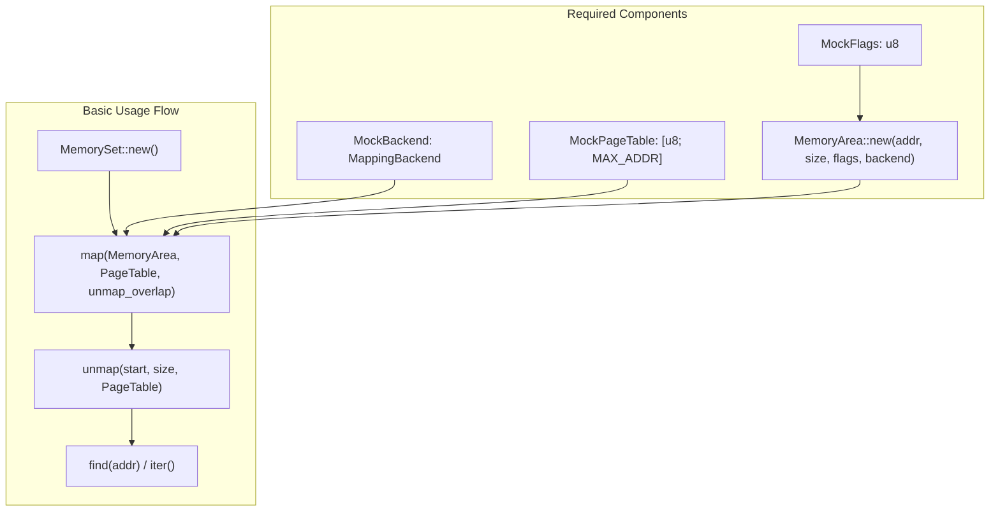
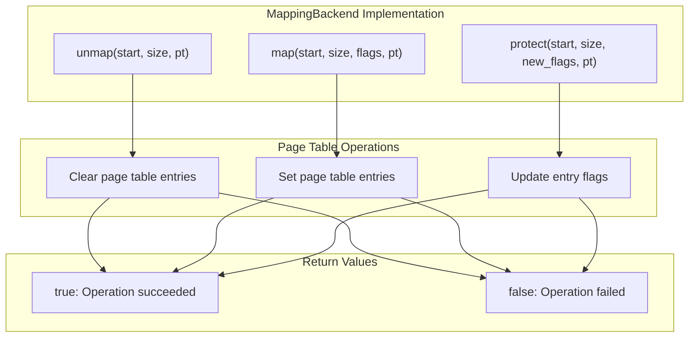
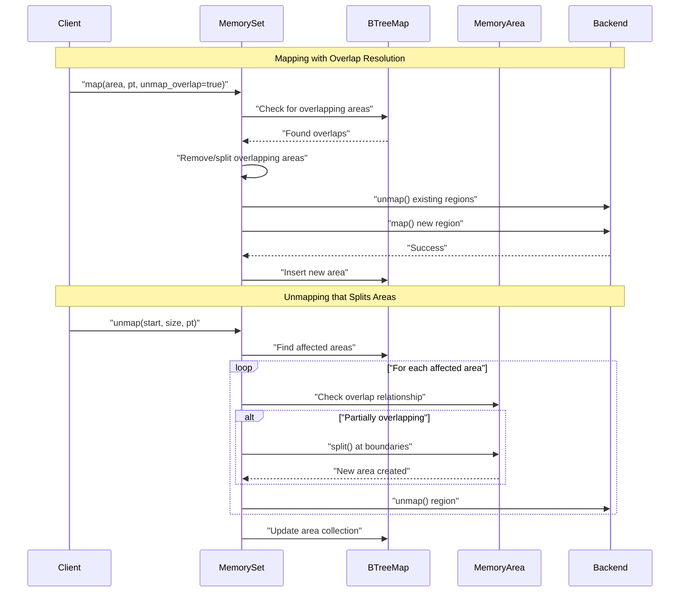
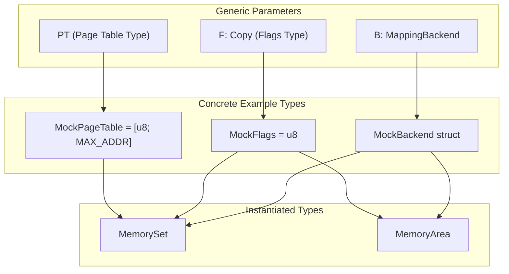

# Usage and Examples

> **Relevant source files**
> * [README.md](https://github.com/arceos-org/memory_set/blob/73b51e2b/README.md)
> * [src/tests.rs](https://github.com/arceos-org/memory_set/blob/73b51e2b/src/tests.rs)

This document provides practical guidance for using the `memory_set` crate, including common usage patterns, complete working examples, and best practices. The examples demonstrate how to create memory mappings, manage overlapping areas, and implement custom backends for different page table systems.

For detailed implementation specifics of the core components, see [Implementation Details](/arceos-org/memory_set/2-implementation-details). For information about project setup and dependencies, see [Development and Project Setup](/arceos-org/memory_set/4-development-and-project-setup).

## Quick Start Example

The most basic usage involves creating a `MemorySet` with a custom backend implementation and using it to manage memory mappings. The following example from the README demonstrates the fundamental operations:

**Basic Usage Pattern Flow**

Sources: [README.md(L18 - L88)&emsp;](https://github.com/arceos-org/memory_set/blob/73b51e2b/README.md#L18-L88)

The core workflow requires implementing the `MappingBackend` trait for your specific page table system, then using `MemorySet` to manage collections of `MemoryArea` objects. Here's the essential pattern from [README.md(L33 - L48)&emsp;](https://github.com/arceos-org/memory_set/blob/73b51e2b/README.md#L33-L48):

|Operation|Purpose|Key Parameters|
| --- | --- | --- |
|MemorySet::new()|Initialize empty memory set|None|
|map()|Add new memory mapping|MemoryArea, page table, overlap handling|
|unmap()|Remove memory mapping|Start address, size, page table|
|find()|Locate area containing address|Virtual address|
|iter()|Enumerate all areas|None|

## Backend Implementation Pattern

Every usage of `memory_set` requires implementing the `MappingBackend` trait. The implementation defines how memory operations interact with your specific page table system:

**Backend Implementation Requirements**

Sources: [README.md(L51 - L87)&emsp;](https://github.com/arceos-org/memory_set/blob/73b51e2b/README.md#L51-L87) [src/tests.rs(L15 - L51)&emsp;](https://github.com/arceos-org/memory_set/blob/73b51e2b/src/tests.rs#L15-L51)

The backend implementation handles the actual page table manipulation. Each method returns `bool` indicating success or failure:

* `map()`: Sets page table entries for the specified range if all entries are currently unmapped
* `unmap()`: Clears page table entries for the specified range if all entries are currently mapped
* `protect()`: Updates flags for page table entries in the specified range if all entries are currently mapped

## Memory Area Management Operations

The `MemorySet` provides sophisticated area management that handles overlaps, splits areas when needed, and maintains sorted order for efficient operations:

**Complex Memory Operations Sequence**

Sources: [src/tests.rs(L152 - L226)&emsp;](https://github.com/arceos-org/memory_set/blob/73b51e2b/src/tests.rs#L152-L226) [README.md(L42 - L48)&emsp;](https://github.com/arceos-org/memory_set/blob/73b51e2b/README.md#L42-L48)

## Common Usage Patterns

Based on the test examples, several common patterns emerge for different memory management scenarios:

### Pattern 1: Basic Mapping and Unmapping

[src/tests.rs(L84 - L104)&emsp;](https://github.com/arceos-org/memory_set/blob/73b51e2b/src/tests.rs#L84-L104) demonstrates mapping non-overlapping areas in a regular pattern, followed by querying operations.

### Pattern 2: Overlap Resolution

[src/tests.rs(L114 - L127)&emsp;](https://github.com/arceos-org/memory_set/blob/73b51e2b/src/tests.rs#L114-L127) shows how to handle mapping conflicts using the `unmap_overlap` parameter to automatically resolve overlaps.

### Pattern 3: Area Splitting

[src/tests.rs(L166 - L192)&emsp;](https://github.com/arceos-org/memory_set/blob/73b51e2b/src/tests.rs#L166-L192) illustrates how unmapping operations can split existing areas into multiple smaller areas when the unmapped region falls within an existing area.

### Pattern 4: Protection Changes

[src/tests.rs(L252 - L285)&emsp;](https://github.com/arceos-org/memory_set/blob/73b51e2b/src/tests.rs#L252-L285) demonstrates using `protect()` operations to change memory permissions, which can also result in area splitting when applied to partial ranges.

## Error Handling Patterns

The crate uses `MappingResult<T>` for error handling, with `MappingError` variants indicating different failure modes:

|Error Type|Cause|Common Resolution|
| --- | --- | --- |
|AlreadyExists|Mapping overlaps existing area|Useunmap_overlap=trueor unmap manually|
|Backend failures|Page table operation failed|Check page table state and permissions|

Sources: [src/tests.rs(L114 - L121)&emsp;](https://github.com/arceos-org/memory_set/blob/73b51e2b/src/tests.rs#L114-L121) [src/tests.rs(L53 - L66)&emsp;](https://github.com/arceos-org/memory_set/blob/73b51e2b/src/tests.rs#L53-L66)

## Type System Usage

The generic type system allows customization for different environments:

**Type System Instantiation Pattern**

Sources: [README.md(L22 - L34)&emsp;](https://github.com/arceos-org/memory_set/blob/73b51e2b/README.md#L22-L34) [src/tests.rs(L5 - L13)&emsp;](https://github.com/arceos-org/memory_set/blob/73b51e2b/src/tests.rs#L5-L13)

The examples use simple types (`u8` for flags, byte array for page table) but the system supports any types that meet the trait bounds. This flexibility allows integration with different operating system kernels, hypervisors, or memory management systems that have varying page table structures and flag representations.