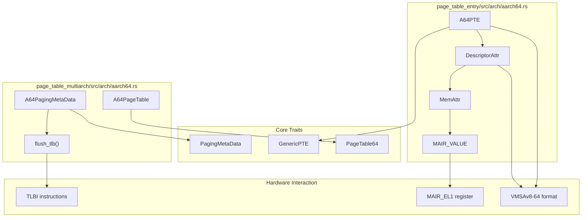
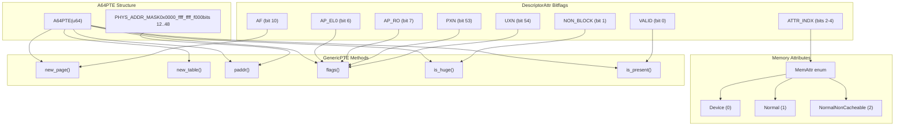
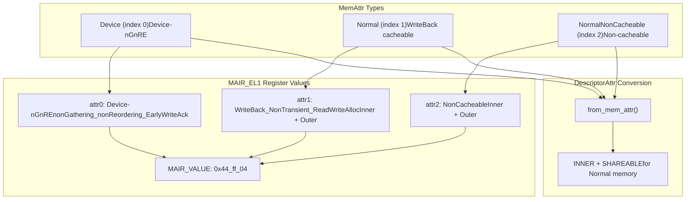
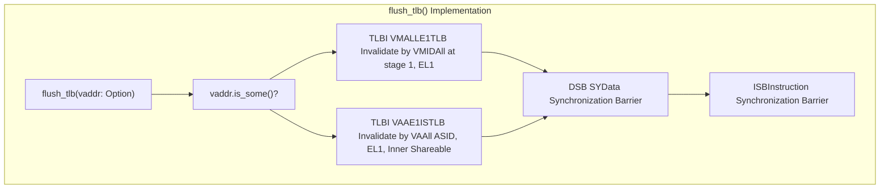

# AArch64 Support

> **Relevant source files**
> * [page_table_entry/src/arch/aarch64.rs](https://github.com/arceos-org/page_table_multiarch/blob/85fb75ef/page_table_entry/src/arch/aarch64.rs)
> * [page_table_multiarch/src/arch/aarch64.rs](https://github.com/arceos-org/page_table_multiarch/blob/85fb75ef/page_table_multiarch/src/arch/aarch64.rs)

This document covers the AArch64 (ARM64) architecture implementation in the page_table_multiarch library, including VMSAv8-64 translation table format support, memory attributes, and AArch64-specific page table operations. For information about other supported architectures, see [Architecture Support](/arceos-org/page_table_multiarch/4-architecture-support).

## Overview

The AArch64 implementation provides support for the VMSAv8-64 translation table format used by ARM64 processors. The implementation consists of two main components: the low-level page table entry definitions in the `page_table_entry` crate and the high-level page table metadata and operations in the `page_table_multiarch` crate.

**AArch64 Implementation Architecture**



Sources: [page_table_multiarch/src/arch/aarch64.rs(L1 - L38)&emsp;](https://github.com/arceos-org/page_table_multiarch/blob/85fb75ef/page_table_multiarch/src/arch/aarch64.rs#L1-L38) [page_table_entry/src/arch/aarch64.rs(L1 - L265)&emsp;](https://github.com/arceos-org/page_table_multiarch/blob/85fb75ef/page_table_entry/src/arch/aarch64.rs#L1-L265)

## Page Table Entry Implementation

The `A64PTE` struct implements the `GenericPTE` trait and represents VMSAv8-64 translation table descriptors. It uses the `DescriptorAttr` bitflags to manage AArch64-specific memory attributes and access permissions.

**AArch64 Page Table Entry Structure**



Sources: [page_table_entry/src/arch/aarch64.rs(L191 - L253)&emsp;](https://github.com/arceos-org/page_table_multiarch/blob/85fb75ef/page_table_entry/src/arch/aarch64.rs#L191-L253) [page_table_entry/src/arch/aarch64.rs(L9 - L58)&emsp;](https://github.com/arceos-org/page_table_multiarch/blob/85fb75ef/page_table_entry/src/arch/aarch64.rs#L9-L58)

### Key Methods and Bit Manipulation

The `A64PTE` implementation provides several key methods for page table entry manipulation:

|Method|Purpose|Physical Address Mask|
| --- | --- | --- |
|new_page()|Creates page descriptor with mapping flags|0x0000_ffff_ffff_f000|
|new_table()|Creates table descriptor for next level|0x0000_ffff_ffff_f000|
|paddr()|Extracts physical address from bits 12-47|0x0000_ffff_ffff_f000|
|is_huge()|Checks if NON_BLOCK bit is clear|N/A|
|is_present()|Checks VALID bit|N/A|

Sources: [page_table_entry/src/arch/aarch64.rs(L200 - L253)&emsp;](https://github.com/arceos-org/page_table_multiarch/blob/85fb75ef/page_table_entry/src/arch/aarch64.rs#L200-L253)

## Memory Attributes and MAIR Configuration

The AArch64 implementation uses the Memory Attribute Indirection Register (MAIR) to define memory types. The `MemAttr` enum defines three memory attribute types that correspond to MAIR indices.

**Memory Attribute Configuration**



Sources: [page_table_entry/src/arch/aarch64.rs(L62 - L112)&emsp;](https://github.com/arceos-org/page_table_multiarch/blob/85fb75ef/page_table_entry/src/arch/aarch64.rs#L62-L112) [page_table_entry/src/arch/aarch64.rs(L73 - L97)&emsp;](https://github.com/arceos-org/page_table_multiarch/blob/85fb75ef/page_table_entry/src/arch/aarch64.rs#L73-L97)

### Flag Conversion

The implementation provides bidirectional conversion between generic `MappingFlags` and AArch64-specific `DescriptorAttr`:

**Flag Mapping Table**

|MappingFlags|DescriptorAttr|Description|
| --- | --- | --- |
|READ|VALID|Entry is valid and readable|
|WRITE|!AP_RO|Write access permitted (when AP_RO is clear)|
|EXECUTE|!PXNor!UXN|Execute permissions based on privilege level|
|USER|AP_EL0|Accessible from EL0 (user space)|
|DEVICE|MemAttr::Device|Device memory with ATTR_INDX = 0|
|UNCACHED|MemAttr::NormalNonCacheable|Non-cacheable normal memory|

Sources: [page_table_entry/src/arch/aarch64.rs(L114 - L189)&emsp;](https://github.com/arceos-org/page_table_multiarch/blob/85fb75ef/page_table_entry/src/arch/aarch64.rs#L114-L189)

## Page Table Metadata

The `A64PagingMetaData` struct implements the `PagingMetaData` trait and defines AArch64-specific constants and operations for the VMSAv8-64 translation scheme.

### Configuration Constants

|Constant|Value|Description|
| --- | --- | --- |
|LEVELS|4|Number of page table levels|
|PA_MAX_BITS|48|Maximum physical address bits|
|VA_MAX_BITS|48|Maximum virtual address bits|

Sources: [page_table_multiarch/src/arch/aarch64.rs(L11 - L15)&emsp;](https://github.com/arceos-org/page_table_multiarch/blob/85fb75ef/page_table_multiarch/src/arch/aarch64.rs#L11-L15)

### Virtual Address Validation

The `vaddr_is_valid()` method implements AArch64's canonical address validation:

```javascript
fn vaddr_is_valid(vaddr: usize) -> bool {
    let top_bits = vaddr >> Self::VA_MAX_BITS;
    top_bits == 0 || top_bits == 0xffff
}
```

This ensures that virtual addresses are either in the lower canonical range (top 16 bits all zeros) or upper canonical range (top 16 bits all ones).

Sources: [page_table_multiarch/src/arch/aarch64.rs(L17 - L20)&emsp;](https://github.com/arceos-org/page_table_multiarch/blob/85fb75ef/page_table_multiarch/src/arch/aarch64.rs#L17-L20)

## TLB Management

The AArch64 implementation provides TLB (Translation Lookaside Buffer) invalidation through assembly instructions in the `flush_tlb()` method.

**TLB Invalidation Operations**



Sources: [page_table_multiarch/src/arch/aarch64.rs(L22 - L34)&emsp;](https://github.com/arceos-org/page_table_multiarch/blob/85fb75ef/page_table_multiarch/src/arch/aarch64.rs#L22-L34)

### TLB Instruction Details

|Operation|Instruction|Scope|Description|
| --- | --- | --- | --- |
|Specific invalidation|tlbi vaae1is, {vaddr}|Single VA|Invalidates TLB entries for specific virtual address across all ASIDs|
|Global invalidation|tlbi vmalle1|All VAs|Invalidates all stage 1 TLB entries for current VMID|
|Memory barrier|dsb sy; isb|System-wide|Ensures TLB operations complete before subsequent instructions|

Sources: [page_table_multiarch/src/arch/aarch64.rs(L24 - L32)&emsp;](https://github.com/arceos-org/page_table_multiarch/blob/85fb75ef/page_table_multiarch/src/arch/aarch64.rs#L24-L32)

## EL2 Support

The implementation includes conditional compilation support for ARM Exception Level 2 (EL2) through the `arm-el2` feature flag. This affects execute permission handling in the flag conversion logic.

### Permission Handling Differences

|Configuration|User Execute|Kernel Execute|Implementation|
| --- | --- | --- | --- |
|Withoutarm-el2|UsesUXNwhenAP_EL0set|UsesPXNfor kernel-only|Separate handling for user/kernel|
|Witharm-el2|UsesUXNonly|UsesUXNonly|Simplified execute control|

Sources: [page_table_entry/src/arch/aarch64.rs(L123 - L186)&emsp;](https://github.com/arceos-org/page_table_multiarch/blob/85fb75ef/page_table_entry/src/arch/aarch64.rs#L123-L186)

## Type Alias and Integration

The `A64PageTable<H>` type alias provides the complete AArch64 page table implementation by combining the metadata, page table entry type, and handler:

```
pub type A64PageTable<H> = PageTable64<A64PagingMetaData, A64PTE, H>;
```

This creates a fully configured page table type that applications can use with their chosen `PagingHandler` implementation.

Sources: [page_table_multiarch/src/arch/aarch64.rs(L37)&emsp;](https://github.com/arceos-org/page_table_multiarch/blob/85fb75ef/page_table_multiarch/src/arch/aarch64.rs#L37-L37)