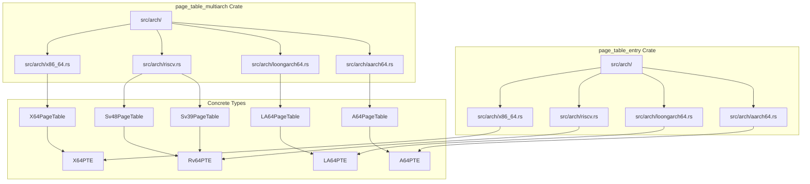
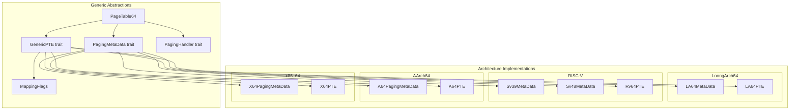
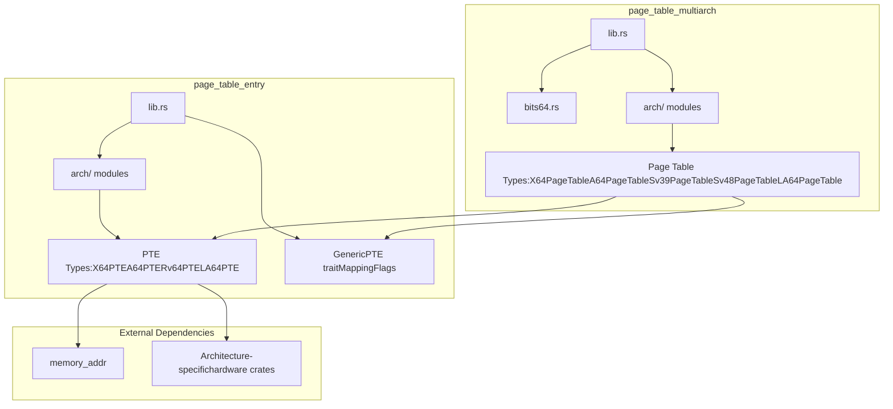

# Architecture Support

> **Relevant source files**
> * [page_table_entry/src/arch/mod.rs](https://github.com/arceos-org/page_table_multiarch/blob/85fb75ef/page_table_entry/src/arch/mod.rs)
> * [page_table_multiarch/src/arch/mod.rs](https://github.com/arceos-org/page_table_multiarch/blob/85fb75ef/page_table_multiarch/src/arch/mod.rs)

This document provides an overview of how the `page_table_multiarch` library supports multiple processor architectures through a unified abstraction layer. It covers the conditional compilation strategy, supported architectures, and the trait-based abstraction mechanism that enables architecture-independent page table management.

For detailed implementation specifics of individual architectures, see [x86_64 Support](/arceos-org/page_table_multiarch/4.1-x86_64-support), [AArch64 Support](/arceos-org/page_table_multiarch/4.2-aarch64-support), [RISC-V Support](/arceos-org/page_table_multiarch/4.3-risc-v-support), and [LoongArch64 Support](/arceos-org/page_table_multiarch/4.4-loongarch64-support).

## Conditional Compilation Strategy

The library uses Rust's conditional compilation features to include only the relevant architecture-specific code for the target platform. This approach minimizes binary size and compile time while maintaining support for multiple architectures in a single codebase.

### Compilation Configuration

The architecture modules are conditionally compiled based on the target architecture:

```

```

Sources: [page_table_entry/src/arch/mod.rs(L1 - L12)&emsp;](https://github.com/arceos-org/page_table_multiarch/blob/85fb75ef/page_table_entry/src/arch/mod.rs#L1-L12) [page_table_multiarch/src/arch/mod.rs(L1 - L12)&emsp;](https://github.com/arceos-org/page_table_multiarch/blob/85fb75ef/page_table_multiarch/src/arch/mod.rs#L1-L12)

The `doc` condition ensures all architecture modules are available during documentation generation, allowing comprehensive API documentation regardless of the build target.

## Supported Architectures Overview

The library supports four major processor architectures, each with distinct paging characteristics and implementations:

|Architecture|Page Table Levels|Virtual Address Width|Physical Address Width|Key Features|
| --- | --- | --- | --- | --- |
|x86_64|4 levels (PML4)|48 bits|52 bits|Legacy support, complex permissions|
|AArch64|4 levels (VMSAv8-64)|48 bits|48 bits|Memory attributes, EL2 support|
|RISC-V|3 levels (Sv39) / 4 levels (Sv48)|39/48 bits|Variable|Multiple page table formats|
|LoongArch64|4 levels|Variable|Variable|Page Walk Controller (PWC)|

### Architecture Module Structure



Sources: [page_table_entry/src/arch/mod.rs(L1 - L12)&emsp;](https://github.com/arceos-org/page_table_multiarch/blob/85fb75ef/page_table_entry/src/arch/mod.rs#L1-L12) [page_table_multiarch/src/arch/mod.rs(L1 - L12)&emsp;](https://github.com/arceos-org/page_table_multiarch/blob/85fb75ef/page_table_multiarch/src/arch/mod.rs#L1-L12)

## Architecture Abstraction Mechanism

The multi-architecture support is achieved through a trait-based abstraction layer that defines common interfaces while allowing architecture-specific implementations.

### Core Abstraction Traits



Sources: [page_table_entry/src/arch/mod.rs(L1 - L12)&emsp;](https://github.com/arceos-org/page_table_multiarch/blob/85fb75ef/page_table_entry/src/arch/mod.rs#L1-L12) [page_table_multiarch/src/arch/mod.rs(L1 - L12)&emsp;](https://github.com/arceos-org/page_table_multiarch/blob/85fb75ef/page_table_multiarch/src/arch/mod.rs#L1-L12)

### Generic Type Parameters

The `PageTable64<M, PTE, H>` type uses three generic parameters to achieve architecture independence:

* **M**: Implements `PagingMetaData` - provides architecture-specific constants like page sizes, address widths, and level counts
* **PTE**: Implements `GenericPTE` - handles page table entry creation, flag conversion, and address extraction
* **H**: Implements `PagingHandler` - manages frame allocation and deallocation through OS-specific interfaces

## Integration Between Crates

The workspace structure separates concerns between high-level page table management and low-level entry manipulation:

### Crate Dependency Flow



Sources: [page_table_entry/src/arch/mod.rs(L1 - L12)&emsp;](https://github.com/arceos-org/page_table_multiarch/blob/85fb75ef/page_table_entry/src/arch/mod.rs#L1-L12) [page_table_multiarch/src/arch/mod.rs(L1 - L12)&emsp;](https://github.com/arceos-org/page_table_multiarch/blob/85fb75ef/page_table_multiarch/src/arch/mod.rs#L1-L12)

This separation allows the `page_table_multiarch` crate to focus on high-level page table operations while `page_table_entry` handles the architecture-specific details of page table entry formats and flag mappings. The conditional compilation ensures that only the necessary code for the target architecture is included in the final binary.