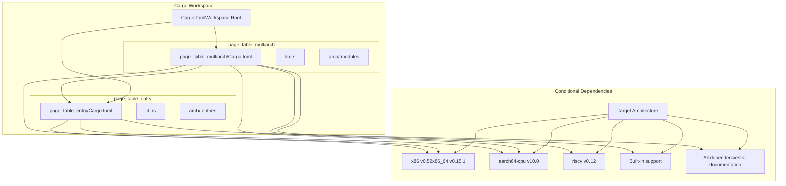
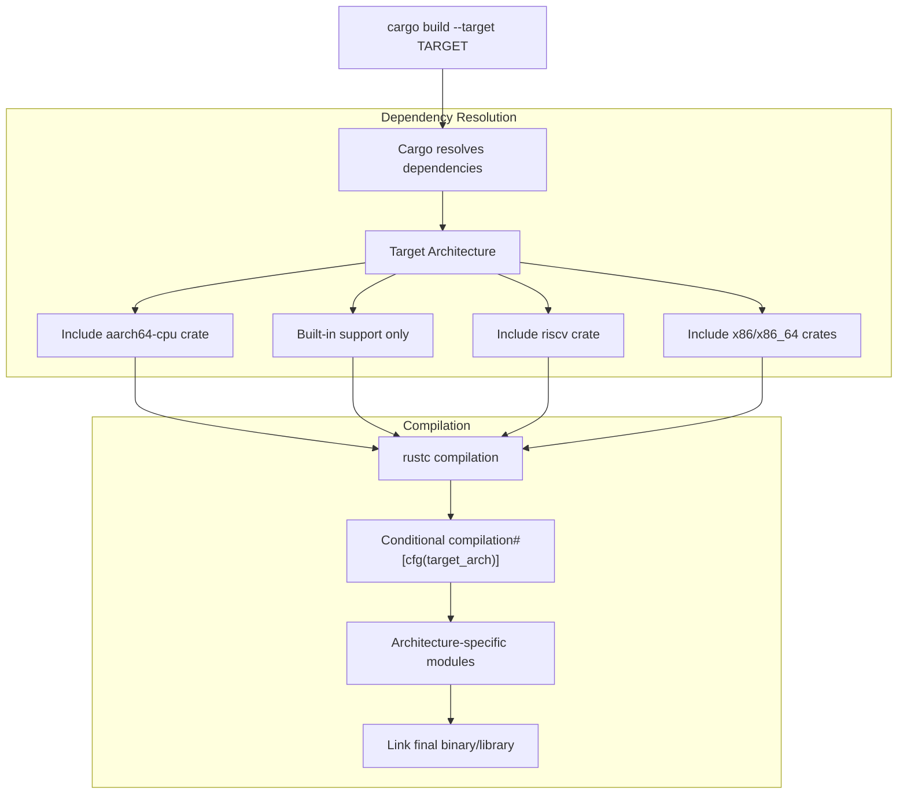
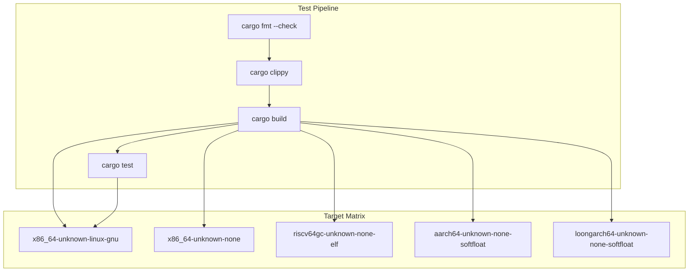
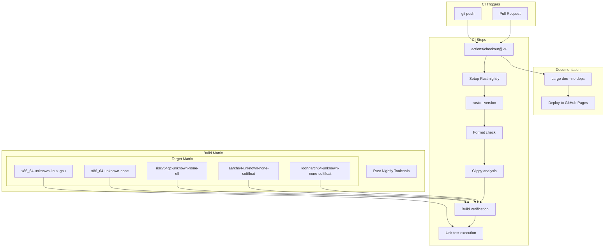
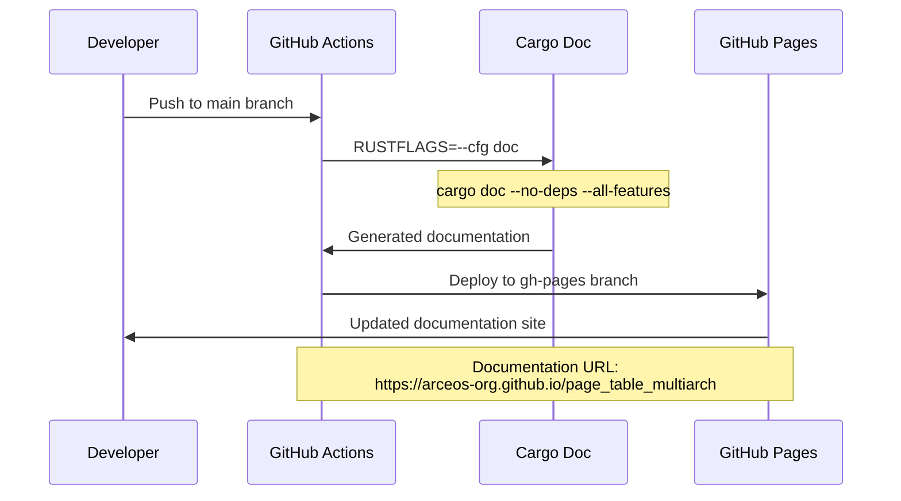

# Building and Testing

> **Relevant source files**
> * [.github/workflows/ci.yml](https://github.com/arceos-org/page_table_multiarch/blob/85fb75ef/.github/workflows/ci.yml)
> * [Cargo.lock](https://github.com/arceos-org/page_table_multiarch/blob/85fb75ef/Cargo.lock)
> * [Cargo.toml](https://github.com/arceos-org/page_table_multiarch/blob/85fb75ef/Cargo.toml)

This page covers the development workflow for building and testing the page_table_multiarch library. It explains the multi-architecture build system, test execution across different targets, and the CI/CD pipeline that ensures code quality across all supported platforms.

For information about contributing code changes, see [Contributing](/arceos-org/page_table_multiarch/5.2-contributing). For architectural details about the supported platforms, see [Supported Platforms](/arceos-org/page_table_multiarch/1.2-supported-platforms).

## Build System Architecture

The project uses a Cargo workspace structure with conditional compilation to support multiple processor architectures. The build system automatically includes only the necessary dependencies and code paths based on the target architecture.

### Workspace Structure



**Architecture-Specific Dependencies**

The build system conditionally includes dependencies based on the compilation target:

|Target Architecture|Dependencies|Purpose|
| --- | --- | --- |
|x86_64|x86 v0.52,x86_64 v0.15.1|x86-specific register and instruction access|
|aarch64|aarch64-cpu v10.0|ARM system register manipulation|
|riscv32/64|riscv v0.12|RISC-V CSR and instruction support|
|loongarch64|Built-in|Native LoongArch64 support|
|Documentation|All dependencies|Complete API documentation|

Sources: [Cargo.toml(L1 - L20)&emsp;](https://github.com/arceos-org/page_table_multiarch/blob/85fb75ef/Cargo.toml#L1-L20) [Cargo.lock(L1 - L150)&emsp;](https://github.com/arceos-org/page_table_multiarch/blob/85fb75ef/Cargo.lock#L1-L150)

## Development Environment Setup

### Prerequisites

The project requires the Rust nightly toolchain with specific components and targets:

```markdown
# Install nightly toolchain with required components
rustup toolchain install nightly
rustup component add --toolchain nightly rust-src clippy rustfmt

# Add target architectures for cross-compilation
rustup target add --toolchain nightly x86_64-unknown-none
rustup target add --toolchain nightly riscv64gc-unknown-none-elf
rustup target add --toolchain nightly aarch64-unknown-none-softfloat
rustup target add --toolchain nightly loongarch64-unknown-none-softfloat
```

### Environment Configuration

For documentation builds and certain tests, set the `doc` configuration flag:

```
export RUSTFLAGS="--cfg doc"
```

This enables all architecture-specific code paths during documentation generation, ensuring complete API coverage.

Sources: [.github/workflows/ci.yml(L15 - L19)&emsp;](https://github.com/arceos-org/page_table_multiarch/blob/85fb75ef/.github/workflows/ci.yml#L15-L19) [.github/workflows/ci.yml(L31 - L32)&emsp;](https://github.com/arceos-org/page_table_multiarch/blob/85fb75ef/.github/workflows/ci.yml#L31-L32) [.github/workflows/ci.yml(L42)&emsp;](https://github.com/arceos-org/page_table_multiarch/blob/85fb75ef/.github/workflows/ci.yml#L42-L42)

## Building the Project

### Basic Build Commands

```markdown
# Build for the host architecture (typically x86_64)
cargo build

# Build with all features enabled
cargo build --all-features

# Cross-compile for specific targets
cargo build --target x86_64-unknown-none --all-features
cargo build --target riscv64gc-unknown-none-elf --all-features
cargo build --target aarch64-unknown-none-softfloat --all-features
cargo build --target loongarch64-unknown-none-softfloat --all-features
```

### Build Process Flow



The build process uses Rust's conditional compilation features to include only the relevant code and dependencies for each target architecture.

Sources: [.github/workflows/ci.yml(L26 - L27)&emsp;](https://github.com/arceos-org/page_table_multiarch/blob/85fb75ef/.github/workflows/ci.yml#L26-L27)

## Running Tests

### Test Execution Matrix

Tests are executed differently based on the target platform due to hardware and emulation constraints:

|Target|Test Type|Execution Environment|
| --- | --- | --- |
|x86_64-unknown-linux-gnu|Unit tests|Native execution|
|x86_64-unknown-none|Build verification|Compile-only|
|riscv64gc-unknown-none-elf|Build verification|Compile-only|
|aarch64-unknown-none-softfloat|Build verification|Compile-only|
|loongarch64-unknown-none-softfloat|Build verification|Compile-only|

### Test Commands

```markdown
# Run all tests (only works on x86_64-unknown-linux-gnu)
cargo test -- --nocapture

# Build verification for embedded targets
cargo build --target x86_64-unknown-none --all-features
cargo build --target riscv64gc-unknown-none-elf --all-features
cargo build --target aarch64-unknown-none-softfloat --all-features
cargo build --target loongarch64-unknown-none-softfloat --all-features

# Code quality checks
cargo fmt --all -- --check
cargo clippy --target TARGET --all-features -- -A clippy::new_without_default
```

### Test Architecture



Unit tests execute only on `x86_64-unknown-linux-gnu` because the embedded targets lack standard library support required for the test harness.

Sources: [.github/workflows/ci.yml(L28 - L32)&emsp;](https://github.com/arceos-org/page_table_multiarch/blob/85fb75ef/.github/workflows/ci.yml#L28-L32) [.github/workflows/ci.yml(L24 - L25)&emsp;](https://github.com/arceos-org/page_table_multiarch/blob/85fb75ef/.github/workflows/ci.yml#L24-L25) [.github/workflows/ci.yml(L22 - L23)&emsp;](https://github.com/arceos-org/page_table_multiarch/blob/85fb75ef/.github/workflows/ci.yml#L22-L23)

## CI/CD Pipeline

### GitHub Actions Workflow

The CI pipeline runs on every push and pull request, executing a comprehensive test matrix across all supported architectures.



### CI Configuration Details

The workflow configuration includes specific settings for multi-architecture support:

|Configuration|Value|Purpose|
| --- | --- | --- |
|fail-fast|false|Continue testing other targets if one fails|
|rust-toolchain|nightly|Required for unstable features|
|components|rust-src, clippy, rustfmt|Development tools and source code|
|RUSTFLAGS|--cfg doc|Enable documentation-specific code paths|
|RUSTDOCFLAGS|-Zunstable-options --enable-index-page|Enhanced documentation features|

Sources: [.github/workflows/ci.yml(L1 - L57)&emsp;](https://github.com/arceos-org/page_table_multiarch/blob/85fb75ef/.github/workflows/ci.yml#L1-L57)

## Documentation Generation

### Local Documentation Build

```markdown
# Build documentation with all features
RUSTFLAGS="--cfg doc" cargo doc --no-deps --all-features

# Open generated documentation
open target/doc/page_table_multiarch/index.html
```

### Documentation Pipeline



The documentation build process uses special configuration flags to ensure all architecture-specific APIs are documented, even when building on a single architecture.

### Documentation Features

* **Index page generation**: Provides a unified entry point for all crates
* **Broken link detection**: Fails build on invalid cross-references
* **Missing documentation warnings**: Ensures comprehensive API coverage
* **All-features documentation**: Includes conditional compilation paths

Sources: [.github/workflows/ci.yml(L34 - L57)&emsp;](https://github.com/arceos-org/page_table_multiarch/blob/85fb75ef/.github/workflows/ci.yml#L34-L57) [.github/workflows/ci.yml(L43)&emsp;](https://github.com/arceos-org/page_table_multiarch/blob/85fb75ef/.github/workflows/ci.yml#L43-L43) [Cargo.toml(L15)&emsp;](https://github.com/arceos-org/page_table_multiarch/blob/85fb75ef/Cargo.toml#L15-L15)