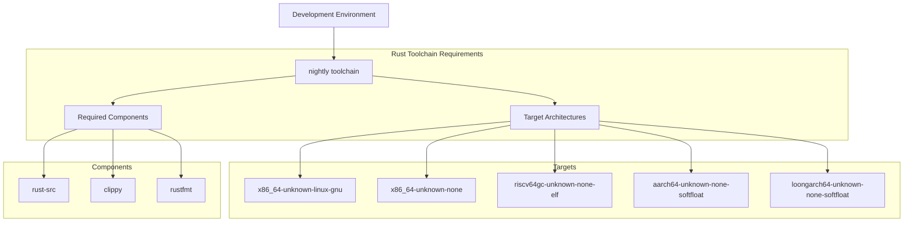
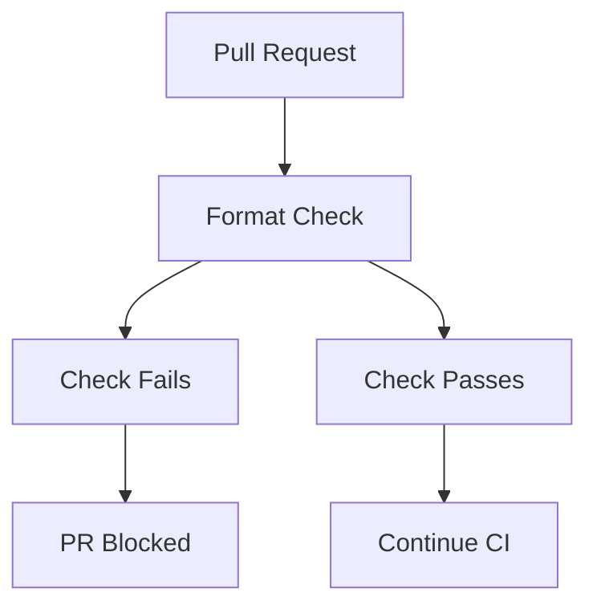
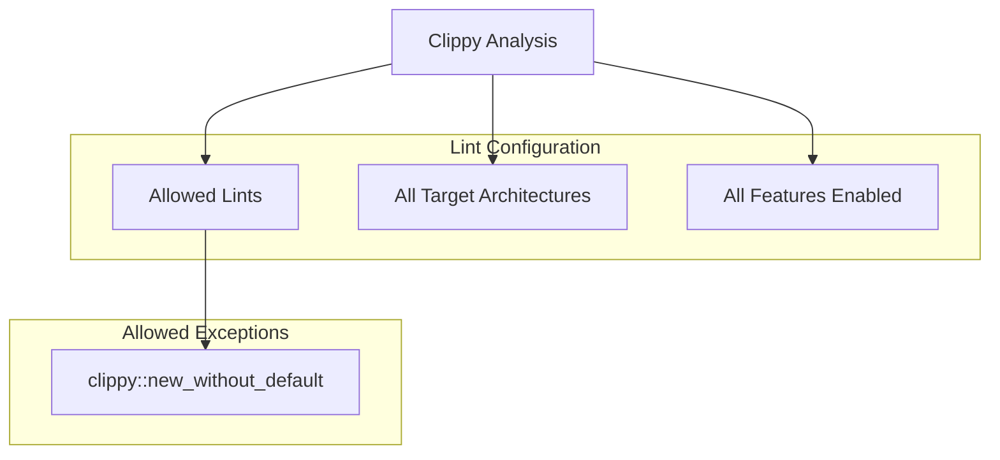
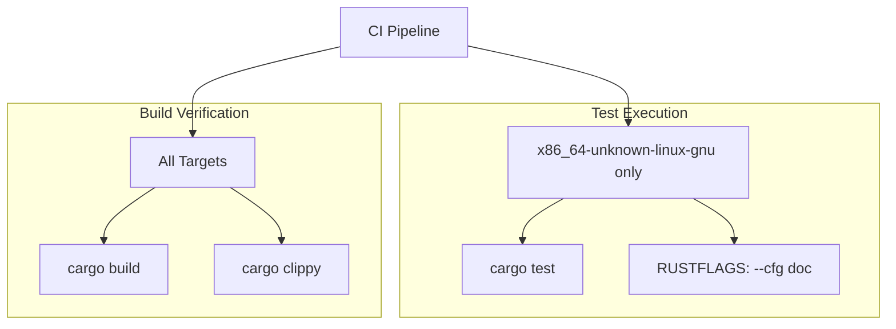
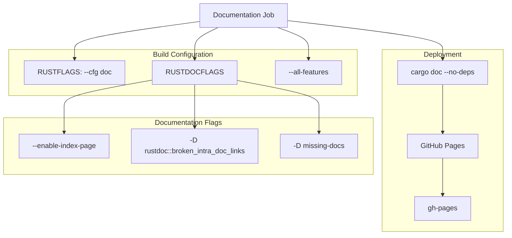
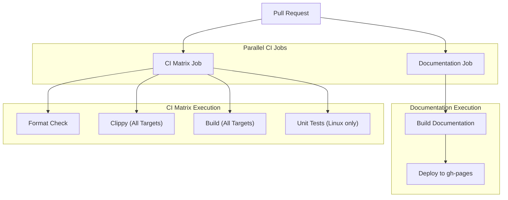

# Contributing

> **Relevant source files**
> * [.github/workflows/ci.yml](https://github.com/arceos-org/page_table_multiarch/blob/85fb75ef/.github/workflows/ci.yml)
> * [.gitignore](https://github.com/arceos-org/page_table_multiarch/blob/85fb75ef/.gitignore)

This document provides guidelines for contributing to the page_table_multiarch project, including development environment setup, code quality standards, testing requirements, and the contribution workflow. For information about building and running tests, see [Building and Testing](/arceos-org/page_table_multiarch/5.1-building-and-testing).

## Development Environment Setup

### Required Tools

The project requires the nightly Rust toolchain with specific components and targets for multi-architecture support.

**Development Environment Setup**

Install the required toolchain components as specified in the CI configuration:

Sources: [.github/workflows/ci.yml(L15 - L19)&emsp;](https://github.com/arceos-org/page_table_multiarch/blob/85fb75ef/.github/workflows/ci.yml#L15-L19)

### IDE Configuration

The project includes basic IDE configuration exclusions in `.gitignore` for common development environments:

* `/target` - Rust build artifacts
* `/.vscode` - Visual Studio Code settings
* `.DS_Store` - macOS system files

Sources: [.gitignore(L1 - L4)&emsp;](https://github.com/arceos-org/page_table_multiarch/blob/85fb75ef/.gitignore#L1-L4)

## Code Quality Standards

### Formatting Requirements

All code must be formatted using `cargo fmt` with the default Rust formatting rules. The CI pipeline enforces this requirement:

**Formatting Enforcement**

The CI runs `cargo fmt --all -- --check` to verify formatting compliance.

Sources: [.github/workflows/ci.yml(L22 - L23)&emsp;](https://github.com/arceos-org/page_table_multiarch/blob/85fb75ef/.github/workflows/ci.yml#L22-L23)

### Linting Standards

Code must pass Clippy analysis with the project's configured lint rules:

**Clippy Configuration**

The project allows the `clippy::new_without_default` lint, indicating that `new()` methods without corresponding `Default` implementations are acceptable in this codebase.

Sources: [.github/workflows/ci.yml(L24 - L25)&emsp;](https://github.com/arceos-org/page_table_multiarch/blob/85fb75ef/.github/workflows/ci.yml#L24-L25)

## Testing Requirements

### Test Execution Strategy

The project uses a targeted testing approach where unit tests only run on the `x86_64-unknown-linux-gnu` target, while other targets focus on compilation validation:

**Test Environment Configuration**

Unit tests run with `RUSTFLAGS: --cfg doc` to enable documentation-conditional code paths.

Sources: [.github/workflows/ci.yml(L28 - L32)&emsp;](https://github.com/arceos-org/page_table_multiarch/blob/85fb75ef/.github/workflows/ci.yml#L28-L32)

### Multi-Architecture Validation

While unit tests only run on Linux, the CI ensures that all architecture-specific code compiles correctly across all supported targets:

|Target|Purpose|Validation|
| --- | --- | --- |
|x86_64-unknown-linux-gnu|Development and testing|Full test suite|
|x86_64-unknown-none|Bare metal x86_64|Build + Clippy|
|riscv64gc-unknown-none-elf|RISC-V bare metal|Build + Clippy|
|aarch64-unknown-none-softfloat|ARM64 bare metal|Build + Clippy|
|loongarch64-unknown-none-softfloat|LoongArch64 bare metal|Build + Clippy|

Sources: [.github/workflows/ci.yml(L10 - L12)&emsp;](https://github.com/arceos-org/page_table_multiarch/blob/85fb75ef/.github/workflows/ci.yml#L10-L12) [.github/workflows/ci.yml(L24 - L27)&emsp;](https://github.com/arceos-org/page_table_multiarch/blob/85fb75ef/.github/workflows/ci.yml#L24-L27)

## Documentation Standards

### Documentation Generation

The project maintains comprehensive API documentation that is automatically built and deployed:

**Documentation Requirements**

* All public APIs must have documentation comments
* Documentation links must be valid (enforced by `-D rustdoc::broken_intra_doc_links`)
* Missing documentation is treated as an error (`-D missing-docs`)
* Documentation is built with all features enabled

Sources: [.github/workflows/ci.yml(L40 - L43)&emsp;](https://github.com/arceos-org/page_table_multiarch/blob/85fb75ef/.github/workflows/ci.yml#L40-L43) [.github/workflows/ci.yml(L47 - L49)&emsp;](https://github.com/arceos-org/page_table_multiarch/blob/85fb75ef/.github/workflows/ci.yml#L47-L49)

## Pull Request Workflow

### CI Pipeline Execution

Every pull request triggers the complete CI pipeline across all supported architectures:

**CI Trigger Events**

The CI pipeline runs on both `push` and `pull_request` events, ensuring comprehensive validation.

Sources: [.github/workflows/ci.yml(L3)&emsp;](https://github.com/arceos-org/page_table_multiarch/blob/85fb75ef/.github/workflows/ci.yml#L3-L3) [.github/workflows/ci.yml(L5 - L33)&emsp;](https://github.com/arceos-org/page_table_multiarch/blob/85fb75ef/.github/workflows/ci.yml#L5-L33) [.github/workflows/ci.yml(L34 - L57)&emsp;](https://github.com/arceos-org/page_table_multiarch/blob/85fb75ef/.github/workflows/ci.yml#L34-L57)

### Deployment Process

Documentation deployment occurs automatically when changes are merged to the default branch, using the `JamesIves/github-pages-deploy-action@v4` action with single-commit deployment to the `gh-pages` branch.

Sources: [.github/workflows/ci.yml(L50 - L56)&emsp;](https://github.com/arceos-org/page_table_multiarch/blob/85fb75ef/.github/workflows/ci.yml#L50-L56)

## Architecture-Specific Considerations

When contributing architecture-specific code, ensure that:

1. **Conditional Compilation**: Use appropriate `cfg` attributes for target-specific code
2. **Cross-Architecture Compatibility**: Changes should not break compilation on other architectures
3. **Testing Coverage**: While unit tests only run on x86_64, ensure your code compiles cleanly on all targets
4. **Documentation**: Architecture-specific features should be clearly documented with appropriate `cfg_attr` annotations

The CI matrix validates all contributions across the full range of supported architectures, providing confidence that cross-platform compatibility is maintained.

Sources: [.github/workflows/ci.yml(L10 - L12)&emsp;](https://github.com/arceos-org/page_table_multiarch/blob/85fb75ef/.github/workflows/ci.yml#L10-L12) [.github/workflows/ci.yml(L24 - L27)&emsp;](https://github.com/arceos-org/page_table_multiarch/blob/85fb75ef/.github/workflows/ci.yml#L24-L27)