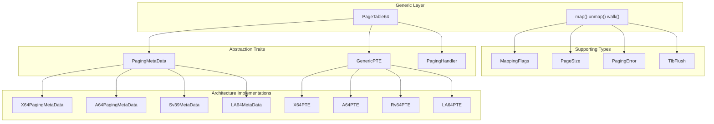
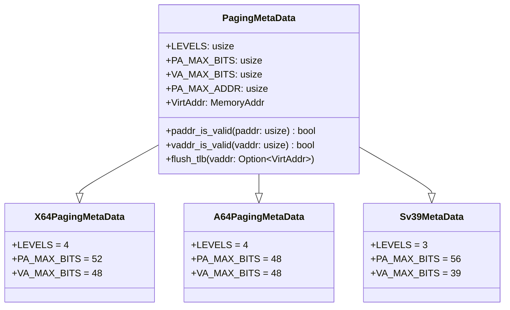
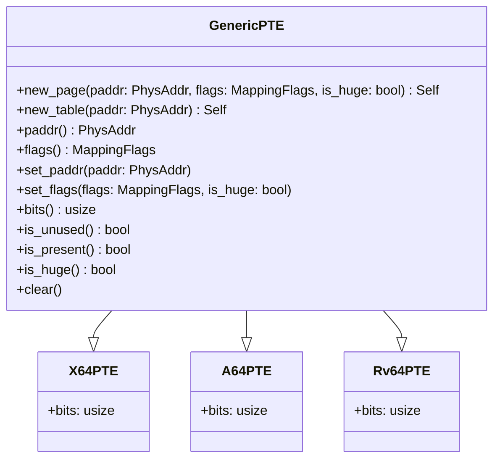
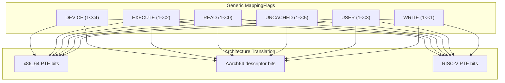
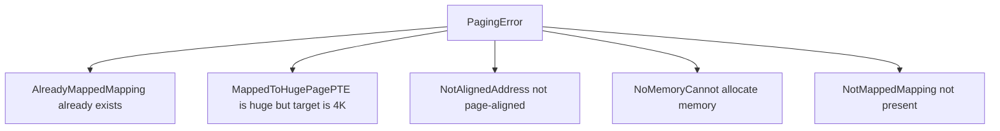

# Core Concepts

> **Relevant source files**
> * [page_table_entry/src/lib.rs](https://github.com/arceos-org/page_table_multiarch/blob/85fb75ef/page_table_entry/src/lib.rs)
> * [page_table_multiarch/src/lib.rs](https://github.com/arceos-org/page_table_multiarch/blob/85fb75ef/page_table_multiarch/src/lib.rs)

This document explains the fundamental abstractions that enable `page_table_multiarch` to provide a unified page table interface across multiple processor architectures. These core concepts form the foundation that allows the same high-level API to work with x86_64, AArch64, RISC-V, and LoongArch64 page tables.

For architecture-specific implementations of these concepts, see [Architecture Support](/arceos-org/page_table_multiarch/4-architecture-support). For the high-level PageTable64 API that builds on these concepts, see [PageTable64 Implementation](/arceos-org/page_table_multiarch/3.1-pagetable64-implementation).

## Abstraction Architecture

The system achieves architecture independence through a layered abstraction model built on three core traits and several supporting types. This design separates architecture-specific details from the generic page table logic.



Sources: [page_table_multiarch/src/lib.rs(L11 - L19)&emsp;](https://github.com/arceos-org/page_table_multiarch/blob/85fb75ef/page_table_multiarch/src/lib.rs#L11-L19) [page_table_multiarch/src/lib.rs(L42 - L92)&emsp;](https://github.com/arceos-org/page_table_multiarch/blob/85fb75ef/page_table_multiarch/src/lib.rs#L42-L92)

## Architecture Independence Traits

Three core traits provide the interface between generic page table logic and architecture-specific implementations.

### PagingMetaData Trait

The `PagingMetaData` trait encapsulates architecture-specific constants and behaviors that vary between processor families.



Key responsibilities include:

* **Page table structure**: `LEVELS` defines the number of translation levels
* **Address space limits**: `PA_MAX_BITS` and `VA_MAX_BITS` specify supported address ranges
* **Address validation**: `paddr_is_valid()` and `vaddr_is_valid()` enforce architecture constraints
* **TLB management**: `flush_tlb()` handles cache invalidation

Sources: [page_table_multiarch/src/lib.rs(L42 - L79)&emsp;](https://github.com/arceos-org/page_table_multiarch/blob/85fb75ef/page_table_multiarch/src/lib.rs#L42-L79)

### GenericPTE Trait

The `GenericPTE` trait provides a unified interface for manipulating page table entries across different architectures.



The trait supports two types of entries:

* **Page entries**: Created with `new_page()`, point to actual memory pages
* **Table entries**: Created with `new_table()`, point to next-level page tables

Sources: [page_table_entry/src/lib.rs(L38 - L68)&emsp;](https://github.com/arceos-org/page_table_multiarch/blob/85fb75ef/page_table_entry/src/lib.rs#L38-L68)

### PagingHandler Trait

The `PagingHandler` trait abstracts OS-dependent memory management operations.

|Method|Purpose|Return Type|
| --- | --- | --- |
|alloc_frame()|Allocate a 4K physical frame|Option<PhysAddr>|
|dealloc_frame(paddr)|Free an allocated frame|()|
|phys_to_virt(paddr)|Convert physical to virtual address|VirtAddr|

This trait allows the page table implementation to work with different memory allocators and virtual memory layouts without being tied to a specific operating system.

Sources: [page_table_multiarch/src/lib.rs(L83 - L92)&emsp;](https://github.com/arceos-org/page_table_multiarch/blob/85fb75ef/page_table_multiarch/src/lib.rs#L83-L92)

## Memory Management Types

### MappingFlags

The `MappingFlags` bitflags provide a generic representation of memory permissions and attributes that gets translated to architecture-specific page table entry bits.



Sources: [page_table_entry/src/lib.rs(L12 - L36)&emsp;](https://github.com/arceos-org/page_table_multiarch/blob/85fb75ef/page_table_entry/src/lib.rs#L12-L36)

### PageSize Enumeration

The `PageSize` enum defines supported page sizes across architectures:

|Size|Value|Usage|
| --- | --- | --- |
|Size4K|0x1000 (4 KB)|Standard page size|
|Size2M|0x20_0000 (2 MB)|Huge page (x86_64, AArch64)|
|Size1G|0x4000_0000 (1 GB)|Giant page (x86_64)|

The enum provides utility methods:

* `is_huge()`: Returns true for sizes larger than 4K
* `is_aligned(addr)`: Checks address alignment
* `align_offset(addr)`: Calculates alignment offset

Sources: [page_table_multiarch/src/lib.rs(L95 - L128)&emsp;](https://github.com/arceos-org/page_table_multiarch/blob/85fb75ef/page_table_multiarch/src/lib.rs#L95-L128)

### Error Handling

The `PagingError` enum defines standard error conditions:



Sources: [page_table_multiarch/src/lib.rs(L22 - L38)&emsp;](https://github.com/arceos-org/page_table_multiarch/blob/85fb75ef/page_table_multiarch/src/lib.rs#L22-L38)

## TLB Management

Translation Lookaside Buffer (TLB) management is handled through two RAII types that ensure proper cache invalidation.

### TlbFlush and TlbFlushAll

```

```

Both types are marked with `#[must_use]` to ensure TLB invalidation is explicitly handled. Callers must either:

* Call `.flush()` or `.flush_all()` to invalidate TLB entries
* Call `.ignore()` if TLB flushing will be handled elsewhere

Sources: [page_table_multiarch/src/lib.rs(L130 - L172)&emsp;](https://github.com/arceos-org/page_table_multiarch/blob/85fb75ef/page_table_multiarch/src/lib.rs#L130-L172)

## Integration Model

The abstractions work together to provide a cohesive system where generic logic operates through trait interfaces while architecture-specific implementations handle the details.

```mermaid
flowchart TD
subgraph Hardware/OS["Hardware/OS"]
    MEM_ALLOC["Memory allocator"]
    TLB_HW["TLB hardware"]
    PT_HW["Page table hardware"]
end
subgraph subGraph2["Trait Implementations"]
    MD_CHECK["M::vaddr_is_valid()"]
    PTE_NEW["PTE::new_page()"]
    FLAGS_CONV["flags → PTE bits"]
    TLB_FLUSH["M::flush_tlb()"]
end
subgraph PageTable64&lt;M,PTE,H&gt;["PageTable64<M,PTE,H>"]
    PT64_IMPL["Page table traversal logic"]
    ALLOC["H::alloc_frame()"]
    CONVERT["H::phys_to_virt()"]
end
subgraph subGraph0["Application Code"]
    APP["map(vaddr, paddr, flags)"]
end

ALLOC --> MEM_ALLOC
APP --> PT64_IMPL
FLAGS_CONV --> PT_HW
MD_CHECK --> TLB_FLUSH
PT64_IMPL --> ALLOC
PT64_IMPL --> CONVERT
PT64_IMPL --> MD_CHECK
PT64_IMPL --> PTE_NEW
PTE_NEW --> FLAGS_CONV
TLB_FLUSH --> TLB_HW
```

This design allows the same `PageTable64` implementation to work across all supported architectures by delegating architecture-specific operations to trait implementations while maintaining type safety and performance.

Sources: [page_table_multiarch/src/lib.rs(L11 - L19)&emsp;](https://github.com/arceos-org/page_table_multiarch/blob/85fb75ef/page_table_multiarch/src/lib.rs#L11-L19) [page_table_multiarch/src/bits64.rs](https://github.com/arceos-org/page_table_multiarch/blob/85fb75ef/page_table_multiarch/src/bits64.rs)