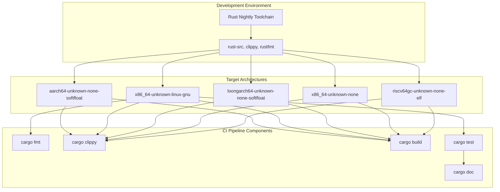
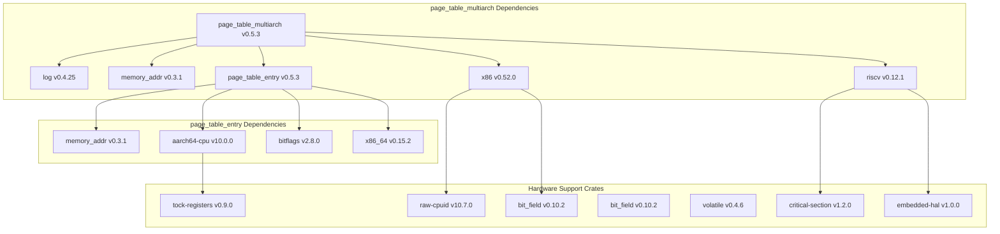
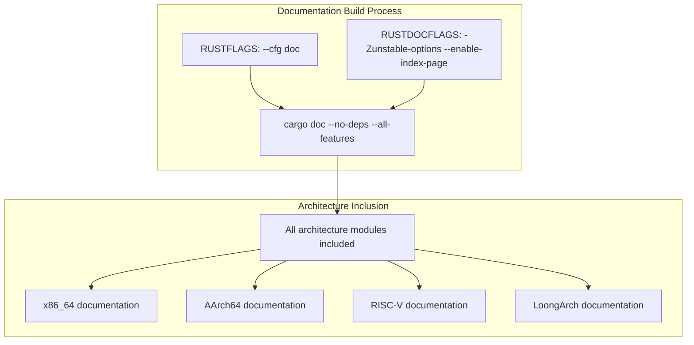
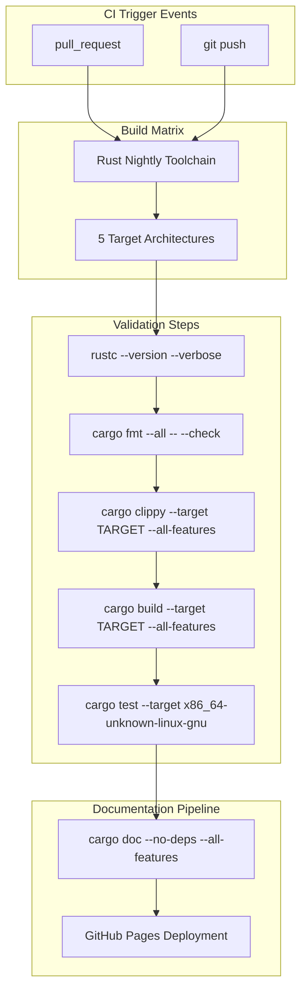
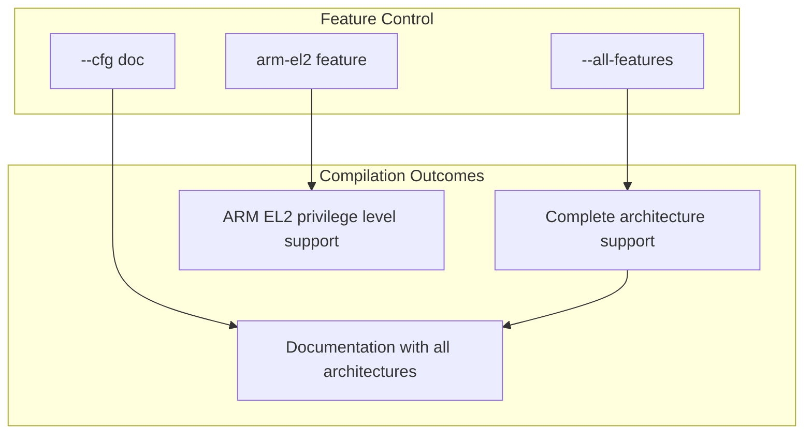

# Development Guide

> **Relevant source files**
> * [.github/workflows/ci.yml](https://github.com/arceos-org/page_table_multiarch/blob/85fb75ef/.github/workflows/ci.yml)
> * [Cargo.lock](https://github.com/arceos-org/page_table_multiarch/blob/85fb75ef/Cargo.lock)

This guide provides essential information for developers working with or contributing to the page_table_multiarch library. It covers the development environment setup, multi-architecture compilation strategy, testing approach, and documentation generation processes.

For detailed build instructions and testing procedures, see [Building and Testing](/arceos-org/page_table_multiarch/5.1-building-and-testing). For contribution guidelines and coding standards, see [Contributing](/arceos-org/page_table_multiarch/5.2-contributing).

## Development Environment Overview

The page_table_multiarch project uses a sophisticated multi-architecture development approach that requires specific toolchain configurations and conditional compilation strategies. The project is designed to work across five different target architectures while maintaining a unified development experience.

### Development Architecture Matrix

Sources: [.github/workflows/ci.yml(L10 - L32)&emsp;](https://github.com/arceos-org/page_table_multiarch/blob/85fb75ef/.github/workflows/ci.yml#L10-L32)

### Workspace Dependency Structure

The development environment manages dependencies through a two-crate workspace with architecture-specific conditional compilation. The dependency resolution varies based on the target platform to include only necessary architecture support crates.

Sources: [Cargo.lock(L57 - L75)&emsp;](https://github.com/arceos-org/page_table_multiarch/blob/85fb75ef/Cargo.lock#L57-L75) [Cargo.lock(L5 - L149)&emsp;](https://github.com/arceos-org/page_table_multiarch/blob/85fb75ef/Cargo.lock#L5-L149)

## Multi-Architecture Development Strategy

The project employs a conditional compilation strategy that allows development and testing across multiple architectures while maintaining code clarity and avoiding unnecessary dependencies for specific targets.

### Conditional Compilation System

The build system uses Cargo's target-specific dependencies and feature flags to include only the necessary architecture support:

|Target Architecture|Included Dependencies|Special Features|
| --- | --- | --- |
|x86_64-unknown-linux-gnu|x86,x86_64, full test suite|Unit testing enabled|
|x86_64-unknown-none|x86,x86_64|Bare metal support|
|riscv64gc-unknown-none-elf|riscv|RISC-V Sv39/Sv48 support|
|aarch64-unknown-none-softfloat|aarch64-cpu|ARM EL2 support available|
|loongarch64-unknown-none-softfloat|Basic LoongArch support|Custom PWC configuration|

### Documentation Build Configuration

Documentation generation requires special configuration to include all architecture-specific code regardless of the build target:

Sources: [.github/workflows/ci.yml(L40 - L49)&emsp;](https://github.com/arceos-org/page_table_multiarch/blob/85fb75ef/.github/workflows/ci.yml#L40-L49)

## CI/CD Pipeline Architecture

The continuous integration system validates code across all supported architectures using a matrix build strategy. This ensures that changes work correctly across the entire supported platform ecosystem.

### CI Matrix Strategy

Sources: [.github/workflows/ci.yml(L1 - L33)&emsp;](https://github.com/arceos-org/page_table_multiarch/blob/85fb75ef/.github/workflows/ci.yml#L1-L33) [.github/workflows/ci.yml(L34 - L56)&emsp;](https://github.com/arceos-org/page_table_multiarch/blob/85fb75ef/.github/workflows/ci.yml#L34-L56)

### Quality Gates

The CI pipeline enforces several quality gates that must pass before code integration:

|Check Type|Command|Scope|Failure Behavior|
| --- | --- | --- | --- |
|Format|cargo fmt --all -- --check|All files|Hard failure|
|Clippy|cargo clippy --target TARGET --all-features|Per target|Hard failure|
|Build|cargo build --target TARGET --all-features|Per target|Hard failure|
|Unit Tests|cargo test --target x86_64-unknown-linux-gnu|Linux only|Hard failure|
|Documentation|cargo doc --no-deps --all-features|All features|Soft failure on non-default branch|

## Development Workflow Integration

The development environment integrates multiple tools and processes to maintain code quality across architecture boundaries:

### Toolchain Requirements

* **Rust Toolchain**: Nightly required for unstable features and cross-compilation support
* **Components**: `rust-src` for cross-compilation, `clippy` for linting, `rustfmt` for formatting
* **Targets**: All five supported architectures must be installed for comprehensive testing

### Feature Flag Usage

The project uses Cargo feature flags to control compilation of architecture-specific code:

Sources: [.github/workflows/ci.yml(L25 - L27)&emsp;](https://github.com/arceos-org/page_table_multiarch/blob/85fb75ef/.github/workflows/ci.yml#L25-L27) [.github/workflows/ci.yml(L42)&emsp;](https://github.com/arceos-org/page_table_multiarch/blob/85fb75ef/.github/workflows/ci.yml#L42-L42)

The development environment is designed to handle the complexity of multi-architecture support while providing developers with clear feedback about compatibility and correctness across all supported platforms. The CI pipeline ensures that every change is validated against the complete matrix of supported architectures before integration.