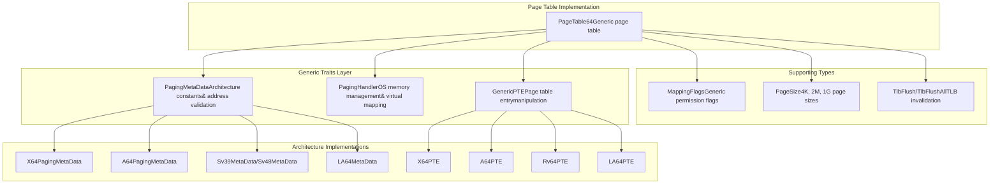
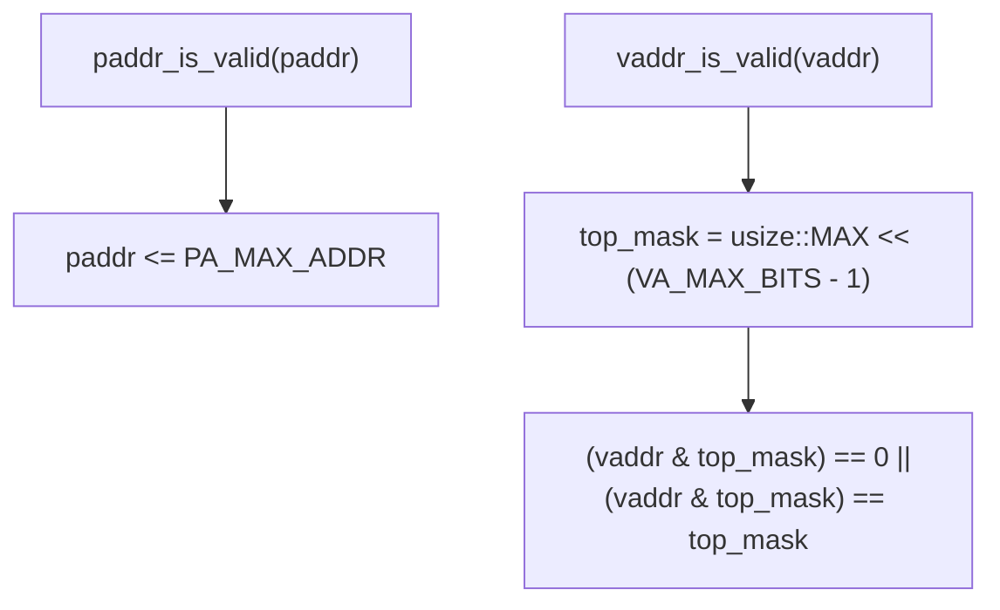
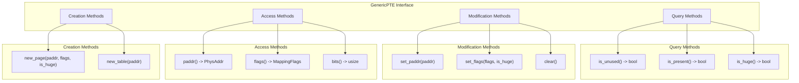
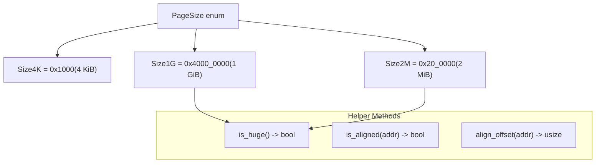
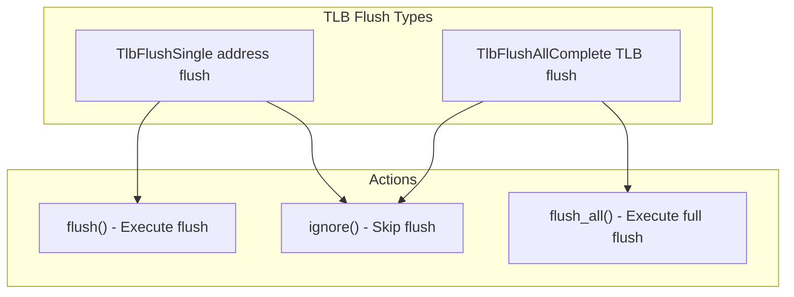

# Generic Traits System

> **Relevant source files**
> * [page_table_entry/src/lib.rs](https://github.com/arceos-org/page_table_multiarch/blob/85fb75ef/page_table_entry/src/lib.rs)
> * [page_table_multiarch/src/lib.rs](https://github.com/arceos-org/page_table_multiarch/blob/85fb75ef/page_table_multiarch/src/lib.rs)

This document describes the core trait system that enables architecture abstraction in the page_table_multiarch library. The traits define interfaces for architecture-specific metadata, OS-level memory management, and page table entry manipulation, allowing a single `PageTable64` implementation to work across multiple processor architectures.

For information about how these traits are implemented for specific architectures, see the Architecture Support section [4](/arceos-org/page_table_multiarch/4-architecture-support). For details about the main page table implementation that uses these traits, see [PageTable64 Implementation](/arceos-org/page_table_multiarch/3.1-pagetable64-implementation).

## Core Trait Architecture

The generic traits system consists of three primary traits that decouple architecture-specific behavior from the common page table logic:



*Sources: [page_table_multiarch/src/lib.rs(L42 - L92)&emsp;](https://github.com/arceos-org/page_table_multiarch/blob/85fb75ef/page_table_multiarch/src/lib.rs#L42-L92) [page_table_entry/src/lib.rs(L41 - L68)&emsp;](https://github.com/arceos-org/page_table_multiarch/blob/85fb75ef/page_table_entry/src/lib.rs#L41-L68)*

## PagingMetaData Trait

The `PagingMetaData` trait defines architecture-specific constants and validation logic for page table implementations:

|Method/Constant|Purpose|Type|
| --- | --- | --- |
|LEVELS|Number of page table levels|const usize|
|PA_MAX_BITS|Maximum physical address bits|const usize|
|VA_MAX_BITS|Maximum virtual address bits|const usize|
|VirtAddr|Virtual address type for this architecture|Associated type|
|paddr_is_valid()|Validates physical addresses|fn(usize) -> bool|
|vaddr_is_valid()|Validates virtual addresses|fn(usize) -> bool|
|flush_tlb()|Flushes Translation Lookaside Buffer|fn(Option<Self::VirtAddr>)|

### Address Validation Logic

The trait provides default implementations for address validation that work for most architectures:



*Sources: [page_table_multiarch/src/lib.rs(L61 - L72)&emsp;](https://github.com/arceos-org/page_table_multiarch/blob/85fb75ef/page_table_multiarch/src/lib.rs#L61-L72)*

## PagingHandler Trait

The `PagingHandler` trait abstracts OS-level memory management operations required by the page table implementation:

|Method|Purpose|Signature|
| --- | --- | --- |
|alloc_frame()|Allocate a 4K physical frame|fn() -> Option<PhysAddr>|
|dealloc_frame()|Free a physical frame|fn(PhysAddr)|
|phys_to_virt()|Get virtual address for physical memory access|fn(PhysAddr) -> VirtAddr|

This trait enables the page table implementation to work with different memory management systems by requiring the OS to provide these three fundamental operations.

*Sources: [page_table_multiarch/src/lib.rs(L83 - L92)&emsp;](https://github.com/arceos-org/page_table_multiarch/blob/85fb75ef/page_table_multiarch/src/lib.rs#L83-L92)*

## GenericPTE Trait

The `GenericPTE` trait provides a unified interface for manipulating page table entries across different architectures:



*Sources: [page_table_entry/src/lib.rs(L41 - L68)&emsp;](https://github.com/arceos-org/page_table_multiarch/blob/85fb75ef/page_table_entry/src/lib.rs#L41-L68)*

## MappingFlags System

The `MappingFlags` bitflags provide a generic representation of memory permissions and attributes:

|Flag|Value|Purpose|
| --- | --- | --- |
|READ|1 << 0|Memory is readable|
|WRITE|1 << 1|Memory is writable|
|EXECUTE|1 << 2|Memory is executable|
|USER|1 << 3|Memory is user-accessible|
|DEVICE|1 << 4|Memory is device memory|
|UNCACHED|1 << 5|Memory is uncached|

Architecture-specific implementations convert between these generic flags and their hardware-specific representations.

*Sources: [page_table_entry/src/lib.rs(L12 - L30)&emsp;](https://github.com/arceos-org/page_table_multiarch/blob/85fb75ef/page_table_entry/src/lib.rs#L12-L30)*

## Page Size Support

The `PageSize` enum defines supported page sizes across architectures:



*Sources: [page_table_multiarch/src/lib.rs(L95 - L128)&emsp;](https://github.com/arceos-org/page_table_multiarch/blob/85fb75ef/page_table_multiarch/src/lib.rs#L95-L128)*

## TLB Management Types

The system provides type-safe TLB invalidation through must-use wrapper types:



These types ensure that TLB flushes are not accidentally forgotten after page table modifications by using the `#[must_use]` attribute.

*Sources: [page_table_multiarch/src/lib.rs(L130 - L172)&emsp;](https://github.com/arceos-org/page_table_multiarch/blob/85fb75ef/page_table_multiarch/src/lib.rs#L130-L172)*

## Trait Integration Pattern

The three core traits work together to parameterize the `PageTable64` implementation:

```

```

This design allows compile-time specialization while maintaining a common interface, enabling zero-cost abstractions across different processor architectures.

*Sources: [page_table_multiarch/src/lib.rs(L42 - L92)&emsp;](https://github.com/arceos-org/page_table_multiarch/blob/85fb75ef/page_table_multiarch/src/lib.rs#L42-L92) [page_table_entry/src/lib.rs(L41 - L68)&emsp;](https://github.com/arceos-org/page_table_multiarch/blob/85fb75ef/page_table_entry/src/lib.rs#L41-L68)*