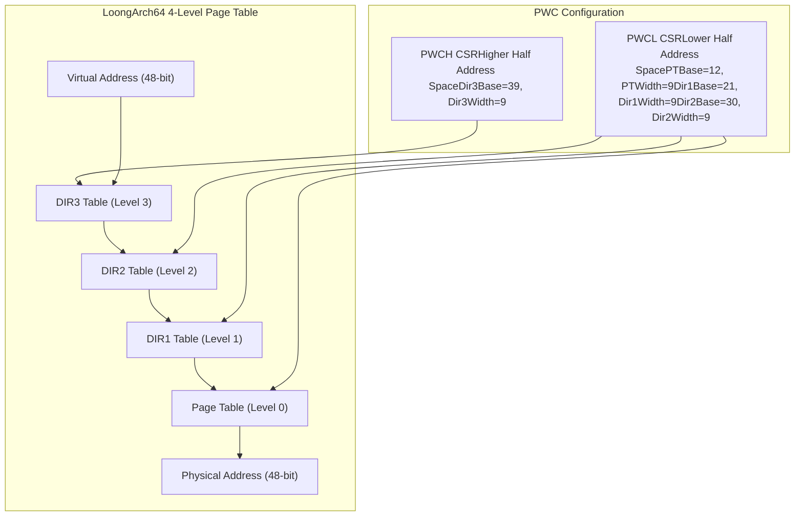
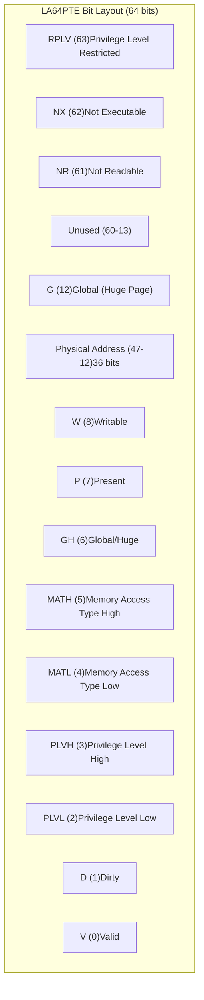
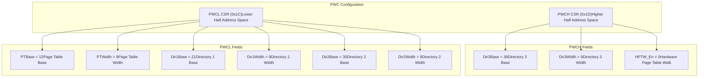
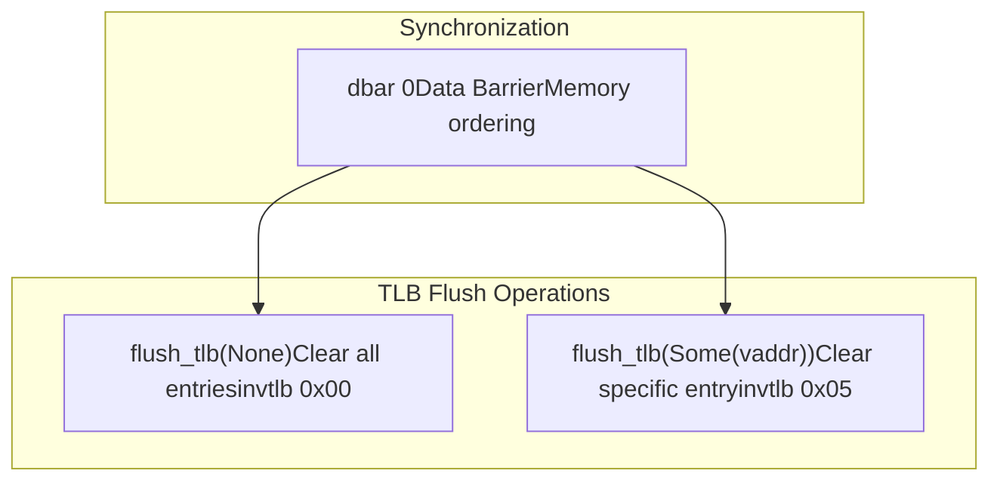
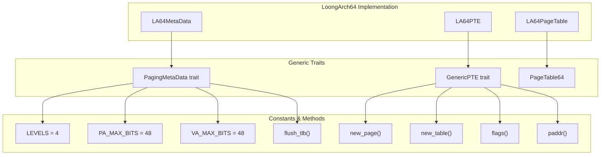

# LoongArch64 Support

> **Relevant source files**
> * [page_table_entry/src/arch/loongarch64.rs](https://github.com/arceos-org/page_table_multiarch/blob/85fb75ef/page_table_entry/src/arch/loongarch64.rs)
> * [page_table_multiarch/src/arch/loongarch64.rs](https://github.com/arceos-org/page_table_multiarch/blob/85fb75ef/page_table_multiarch/src/arch/loongarch64.rs)

This page documents the LoongArch64 architecture support within the `page_table_multiarch` library. LoongArch64 is implemented as one of the four supported architectures, providing 4-level page table management with architecture-specific features like Page Walk Controllers (PWC) and privilege level control.

For information about the overall multi-architecture design, see [Architecture Support](/arceos-org/page_table_multiarch/4-architecture-support). For implementation details of other architectures, see [x86_64 Support](/arceos-org/page_table_multiarch/4.1-x86_64-support), [AArch64 Support](/arceos-org/page_table_multiarch/4.2-aarch64-support), and [RISC-V Support](/arceos-org/page_table_multiarch/4.3-risc-v-support).

## Architecture Overview

LoongArch64 uses a 4-level page table structure with 48-bit physical and virtual addresses. The implementation leverages LoongArch64's Page Walk Controller (PWC) mechanism for hardware-assisted page table walking and provides comprehensive memory management capabilities including privilege level control and memory access type configuration.

### Page Table Structure

LoongArch64 employs a 4-level hierarchical page table structure consisting of DIR3, DIR2, DIR1, and PT levels. The DIR4 level is ignored in this implementation, focusing on the standard 4-level configuration.



Sources: [page_table_multiarch/src/arch/loongarch64.rs(L11 - L41)&emsp;](https://github.com/arceos-org/page_table_multiarch/blob/85fb75ef/page_table_multiarch/src/arch/loongarch64.rs#L11-L41) [page_table_multiarch/src/arch/loongarch64.rs(L43 - L46)&emsp;](https://github.com/arceos-org/page_table_multiarch/blob/85fb75ef/page_table_multiarch/src/arch/loongarch64.rs#L43-L46)

## Page Table Entry Implementation

The LoongArch64 page table entry is implemented through the `LA64PTE` struct, which provides a complete set of architecture-specific flags and integrates with the generic trait system.

### LA64PTE Structure

The `LA64PTE` struct wraps a 64-bit value containing both the physical address and control flags. The physical address occupies bits 12-47, providing support for 48-bit physical addressing.



Sources: [page_table_entry/src/arch/loongarch64.rs(L11 - L59)&emsp;](https://github.com/arceos-org/page_table_multiarch/blob/85fb75ef/page_table_entry/src/arch/loongarch64.rs#L11-L59) [page_table_entry/src/arch/loongarch64.rs(L121 - L133)&emsp;](https://github.com/arceos-org/page_table_multiarch/blob/85fb75ef/page_table_entry/src/arch/loongarch64.rs#L121-L133)

### LoongArch64-Specific Flags

The `PTEFlags` bitflags define comprehensive control over memory access and privilege levels:

|Flag|Bit|Purpose|
| --- | --- | --- |
|V|0|Page table entry is valid|
|D|1|Page has been written (dirty bit)|
|PLVL/PLVH|2-3|Privilege level control (4 levels)|
|MATL/MATH|4-5|Memory Access Type (SUC/CC/WUC)|
|GH|6|Global mapping or huge page indicator|
|P|7|Physical page exists|
|W|8|Page is writable|
|G|12|Global mapping for huge pages|
|NR|61|Page is not readable|
|NX|62|Page is not executable|
|RPLV|63|Privilege level restriction|

The Memory Access Type (MAT) field supports three modes:

* `00` (SUC): Strongly-ordered uncached
* `01` (CC): Coherent cached
* `10` (WUC): Weakly-ordered uncached
* `11`: Reserved

Sources: [page_table_entry/src/arch/loongarch64.rs(L16 - L58)&emsp;](https://github.com/arceos-org/page_table_multiarch/blob/85fb75ef/page_table_entry/src/arch/loongarch64.rs#L16-L58)

### Flag Conversion System

The LoongArch64 implementation provides bidirectional conversion between architecture-specific `PTEFlags` and generic `MappingFlags`:

```mermaid
flowchart TD
subgraph subGraph1["LoongArch64 to Generic"]
    PF["PTEFlags"]
    NR["!NR → READ"]
    W["W → WRITE"]
    NX["!NX → EXECUTE"]
    PLV["PLVL|PLVH → USER"]
    MAT["MAT bits → DEVICE/UNCACHED"]
    MF["MappingFlags"]
    READ["READ → !NR"]
    WRITE["WRITE → W"]
    EXECUTE["EXECUTE → !NX"]
    USER["USER → PLVH|PLVL"]
    DEVICE["DEVICE → MAT=00"]
end
subgraph subGraph0["Generic to LoongArch64"]
    PF["PTEFlags"]
    NR["!NR → READ"]
    W["W → WRITE"]
    NX["!NX → EXECUTE"]
    PLV["PLVL|PLVH → USER"]
    MAT["MAT bits → DEVICE/UNCACHED"]
    MF["MappingFlags"]
    READ["READ → !NR"]
    WRITE["WRITE → W"]
    EXECUTE["EXECUTE → !NX"]
    USER["USER → PLVH|PLVL"]
    DEVICE["DEVICE → MAT=00"]
    UNCACHED["UNCACHED → MAT=10"]
    CACHED["Default → MAT=01"]
end

MF --> CACHED
MF --> DEVICE
MF --> EXECUTE
MF --> READ
MF --> UNCACHED
MF --> USER
MF --> WRITE
PF --> MAT
PF --> NR
PF --> NX
PF --> PLV
PF --> W
```



Sources: [page_table_entry/src/arch/loongarch64.rs(L61 - L119)&emsp;](https://github.com/arceos-org/page_table_multiarch/blob/85fb75ef/page_table_entry/src/arch/loongarch64.rs#L61-L119)

## Page Table Metadata

The `LA64MetaData` struct implements the `PagingMetaData` trait, providing architecture-specific constants and TLB management functionality.

### Page Walk Controller Configuration

LoongArch64 uses Page Walk Controllers (PWC) to configure hardware page table walking. The implementation defines specific CSR values for both lower and upper address space translation:



Sources: [page_table_multiarch/src/arch/loongarch64.rs(L11 - L41)&emsp;](https://github.com/arceos-org/page_table_multiarch/blob/85fb75ef/page_table_multiarch/src/arch/loongarch64.rs#L11-L41)

### TLB Management

The LoongArch64 implementation provides sophisticated TLB (Translation Lookaside Buffer) management using the `invtlb` instruction with data barrier synchronization:



The implementation uses:

* `dbar 0`: Data barrier ensuring memory ordering
* `invtlb 0x00`: Clear all page table entries
* `invtlb 0x05`: Clear entries matching specific virtual address with G=0

Sources: [page_table_multiarch/src/arch/loongarch64.rs(L49 - L76)&emsp;](https://github.com/arceos-org/page_table_multiarch/blob/85fb75ef/page_table_multiarch/src/arch/loongarch64.rs#L49-L76)

## Integration with Generic System

The LoongArch64 implementation seamlessly integrates with the generic trait system, providing the type alias `LA64PageTable` and implementing all required traits.

### Trait Implementation Structure



Sources: [page_table_multiarch/src/arch/loongarch64.rs(L43 - L76)&emsp;](https://github.com/arceos-org/page_table_multiarch/blob/85fb75ef/page_table_multiarch/src/arch/loongarch64.rs#L43-L76) [page_table_entry/src/arch/loongarch64.rs(L135 - L177)&emsp;](https://github.com/arceos-org/page_table_multiarch/blob/85fb75ef/page_table_entry/src/arch/loongarch64.rs#L135-L177) [page_table_multiarch/src/arch/loongarch64.rs(L85)&emsp;](https://github.com/arceos-org/page_table_multiarch/blob/85fb75ef/page_table_multiarch/src/arch/loongarch64.rs#L85-L85)

### Type Aliases and Exports

The LoongArch64 support is exposed through a clean type alias that follows the library's naming conventions:

```
pub type LA64PageTable<I> = PageTable64<LA64MetaData, LA64PTE, I>;
```

This allows users to instantiate LoongArch64 page tables with their preferred `PagingHandler` implementation while maintaining full compatibility with the generic `PageTable64` interface.

Sources: [page_table_multiarch/src/arch/loongarch64.rs(L78 - L85)&emsp;](https://github.com/arceos-org/page_table_multiarch/blob/85fb75ef/page_table_multiarch/src/arch/loongarch64.rs#L78-L85)