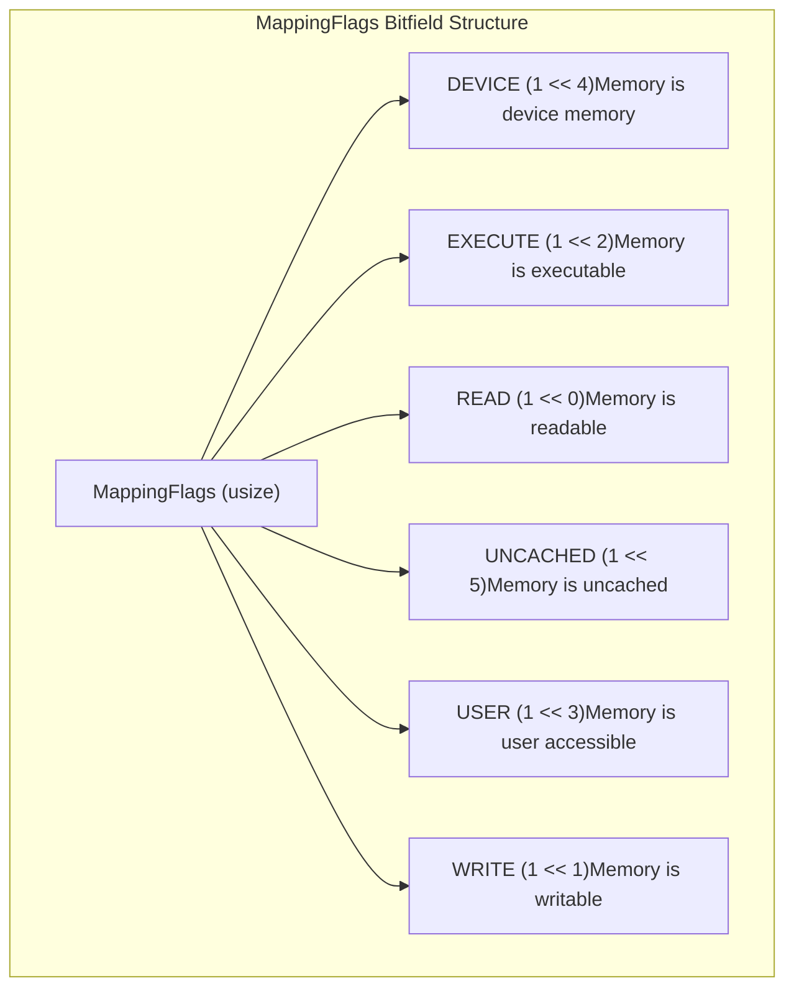
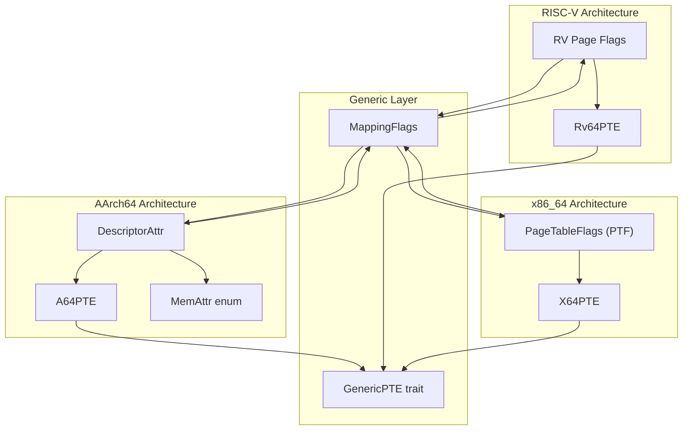
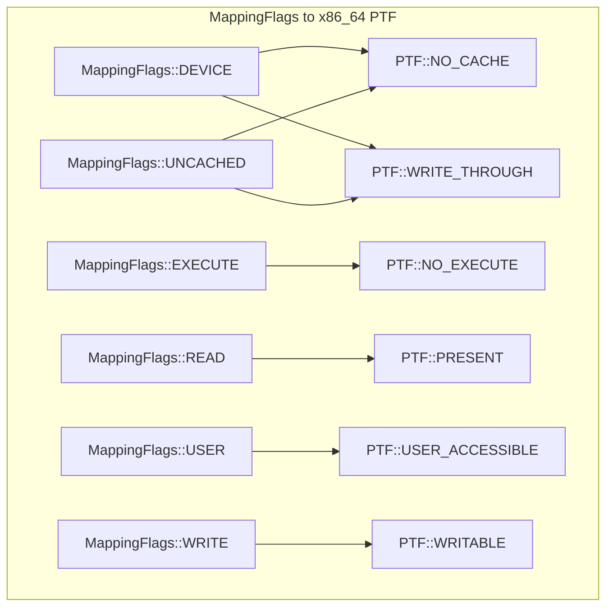
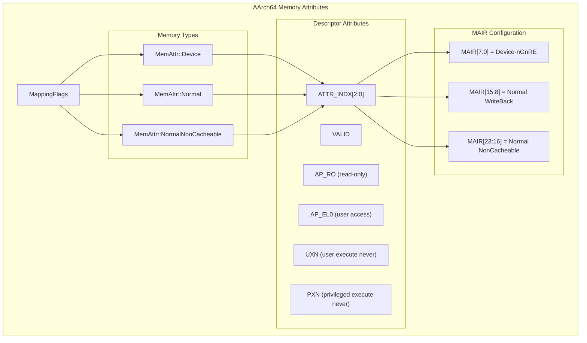
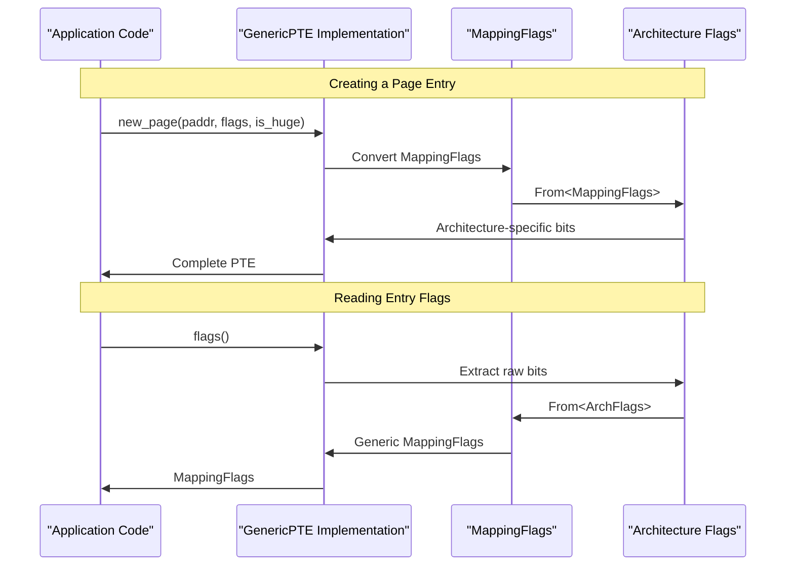

# Memory Mapping Flags

> **Relevant source files**
> * [page_table_entry/src/arch/aarch64.rs](https://github.com/arceos-org/page_table_multiarch/blob/85fb75ef/page_table_entry/src/arch/aarch64.rs)
> * [page_table_entry/src/arch/x86_64.rs](https://github.com/arceos-org/page_table_multiarch/blob/85fb75ef/page_table_entry/src/arch/x86_64.rs)
> * [page_table_entry/src/lib.rs](https://github.com/arceos-org/page_table_multiarch/blob/85fb75ef/page_table_entry/src/lib.rs)

This document explains the memory mapping flags system that provides a generic abstraction layer for page table entry permissions and attributes across different processor architectures. The `MappingFlags` type serves as the common interface that is converted to and from architecture-specific page table entry flags, enabling consistent memory management behavior regardless of the underlying hardware platform.

For information about the overall page table implementation, see [PageTable64 Implementation](/arceos-org/page_table_multiarch/3.1-pagetable64-implementation). For details about the trait system that enables this abstraction, see [Generic Traits System](/arceos-org/page_table_multiarch/3.2-generic-traits-system).

## MappingFlags Structure

The `MappingFlags` type is defined as a bitflags structure that represents generic memory permissions and attributes that are common across all supported architectures.

The flags are designed to capture the essential memory access properties that operating systems need to control:

|Flag|Purpose|Typical Usage|
| --- | --- | --- |
|READ|Memory can be read|All mapped pages typically have this|
|WRITE|Memory can be written|Data pages, stack, heap|
|EXECUTE|Memory can contain executable code|Code segments, shared libraries|
|USER|Memory accessible from user mode|User space mappings|
|DEVICE|Memory-mapped device registers|Hardware device interfaces|
|UNCACHED|Memory should not be cached|Performance-critical or coherency-sensitive regions|

*Sources: [page_table_entry/src/lib.rs(L12 - L30)&emsp;](https://github.com/arceos-org/page_table_multiarch/blob/85fb75ef/page_table_entry/src/lib.rs#L12-L30)*

## Architecture Conversion System

Each supported architecture implements bidirectional conversion between `MappingFlags` and its native page table entry flag representation through `From` trait implementations.

*Sources: [page_table_entry/src/arch/x86_64.rs(L10 - L52)&emsp;](https://github.com/arceos-org/page_table_multiarch/blob/85fb75ef/page_table_entry/src/arch/x86_64.rs#L10-L52) [page_table_entry/src/arch/aarch64.rs(L114 - L189)&emsp;](https://github.com/arceos-org/page_table_multiarch/blob/85fb75ef/page_table_entry/src/arch/aarch64.rs#L114-L189)*

## x86_64 Flag Mapping

The x86_64 implementation uses the `PageTableFlags` from the `x86_64` crate and maps generic flags to hardware-specific bits:

Key mapping behaviors:

* Any non-empty `MappingFlags` automatically gets `PTF::PRESENT`
* Execute permission is inverted: absence of `EXECUTE` sets `NO_EXECUTE`
* Both `DEVICE` and `UNCACHED` flags result in cache-disabled memory
* Table entries always get `PRESENT | WRITABLE | USER_ACCESSIBLE` regardless of flags

*Sources: [page_table_entry/src/arch/x86_64.rs(L32 - L52)&emsp;](https://github.com/arceos-org/page_table_multiarch/blob/85fb75ef/page_table_entry/src/arch/x86_64.rs#L32-L52) [page_table_entry/src/arch/x86_64.rs(L76 - L79)&emsp;](https://github.com/arceos-org/page_table_multiarch/blob/85fb75ef/page_table_entry/src/arch/x86_64.rs#L76-L79)*

## AArch64 Memory Attribute System

AArch64 implements a more sophisticated memory attribute system using the Memory Attribute Indirection Register (MAIR) approach:

The AArch64 system requires careful handling of execute permissions based on privilege level:

|MappingFlags State|EL0 (User) Access|EL1+ (Kernel) Access|
| --- | --- | --- |
|USER + EXECUTE|AP_EL0, noUXN|PXNset|
|USERonly|AP_EL0,UXNset|PXNset|
|EXECUTEonly|NoAP_EL0,UXNset|NoPXN|
|Neither|NoAP_EL0,UXNset|PXNset|

*Sources: [page_table_entry/src/arch/aarch64.rs(L99 - L112)&emsp;](https://github.com/arceos-org/page_table_multiarch/blob/85fb75ef/page_table_entry/src/arch/aarch64.rs#L99-L112) [page_table_entry/src/arch/aarch64.rs(L149 - L189)&emsp;](https://github.com/arceos-org/page_table_multiarch/blob/85fb75ef/page_table_entry/src/arch/aarch64.rs#L149-L189) [page_table_entry/src/arch/aarch64.rs(L167 - L186)&emsp;](https://github.com/arceos-org/page_table_multiarch/blob/85fb75ef/page_table_entry/src/arch/aarch64.rs#L167-L186)*

## GenericPTE Integration

The `GenericPTE` trait methods utilize `MappingFlags` to create and manipulate page table entries in an architecture-neutral way:

The trait provides these flag-related methods:

* `new_page(paddr, flags, is_huge)` - Creates page entries with specified permissions
* `flags()` - Extracts current permissions as `MappingFlags`
* `set_flags(flags, is_huge)` - Updates entry permissions

*Sources: [page_table_entry/src/lib.rs(L41 - L56)&emsp;](https://github.com/arceos-org/page_table_multiarch/blob/85fb75ef/page_table_entry/src/lib.rs#L41-L56) [page_table_entry/src/arch/x86_64.rs(L69 - L95)&emsp;](https://github.com/arceos-org/page_table_multiarch/blob/85fb75ef/page_table_entry/src/arch/x86_64.rs#L69-L95) [page_table_entry/src/arch/aarch64.rs(L210 - L236)&emsp;](https://github.com/arceos-org/page_table_multiarch/blob/85fb75ef/page_table_entry/src/arch/aarch64.rs#L210-L236)*

## Conditional Compilation Features

The flag conversion system supports conditional compilation for different execution environments:

|Feature|Effect|Usage|
| --- | --- | --- |
|arm-el2|Modifies AArch64 execute permission handling|Hypervisor/EL2 execution|
|Default|Standard EL0/EL1 permission model|Normal kernel/user operation|

When `arm-el2` is enabled, the execute permission logic is simplified to only use the `UXN` bit rather than the complex EL0/EL1+ distinction.

*Sources: [page_table_entry/src/arch/aarch64.rs(L123 - L139)&emsp;](https://github.com/arceos-org/page_table_multiarch/blob/85fb75ef/page_table_entry/src/arch/aarch64.rs#L123-L139) [page_table_entry/src/arch/aarch64.rs(L181 - L186)&emsp;](https://github.com/arceos-org/page_table_multiarch/blob/85fb75ef/page_table_entry/src/arch/aarch64.rs#L181-L186)*