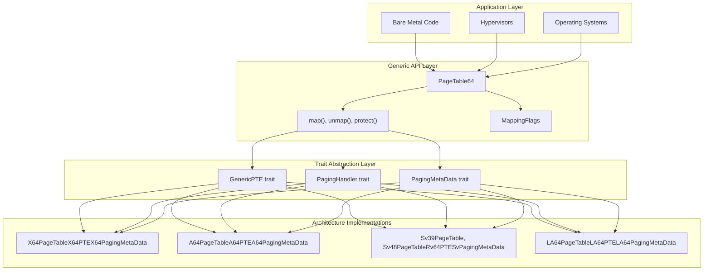
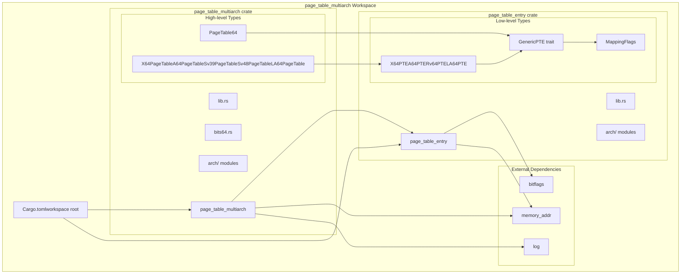
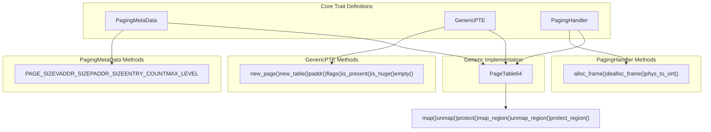

# Overview

> **Relevant source files**
> * [CHANGELOG.md](https://github.com/arceos-org/page_table_multiarch/blob/85fb75ef/CHANGELOG.md)
> * [Cargo.toml](https://github.com/arceos-org/page_table_multiarch/blob/85fb75ef/Cargo.toml)
> * [README.md](https://github.com/arceos-org/page_table_multiarch/blob/85fb75ef/README.md)

## Purpose and Scope

The `page_table_multiarch` repository provides a generic, unified, architecture-independent page table management library for Rust systems programming. This library enables operating systems, hypervisors, and bare-metal applications to manage virtual memory translation across multiple hardware architectures through a single, consistent API.

The repository implements hardware abstraction for page table operations on x86_64, AArch64, RISC-V, and LoongArch64 architectures, providing both low-level page table entry manipulation and high-level page table management functionality. For detailed information about individual architecture implementations, see [Architecture Support](/arceos-org/page_table_multiarch/4-architecture-support). For development and contribution guidelines, see [Development Guide](/arceos-org/page_table_multiarch/5-development-guide).

Sources: [README.md(L1 - L16)&emsp;](https://github.com/arceos-org/page_table_multiarch/blob/85fb75ef/README.md#L1-L16) [Cargo.toml(L17 - L18)&emsp;](https://github.com/arceos-org/page_table_multiarch/blob/85fb75ef/Cargo.toml#L17-L18)

## System Architecture

The library implements a layered architecture that separates generic page table operations from architecture-specific implementations through Rust's trait system.

### Core System Structure

Sources: [Cargo.toml(L4 - L7)&emsp;](https://github.com/arceos-org/page_table_multiarch/blob/85fb75ef/Cargo.toml#L4-L7) [README.md(L5 - L10)&emsp;](https://github.com/arceos-org/page_table_multiarch/blob/85fb75ef/README.md#L5-L10)

## Workspace Structure

The repository is organized as a Rust workspace containing two interdependent crates that together provide the complete page table management functionality.

### Crate Dependencies and Relationships

The `page_table_multiarch` crate provides high-level page table management through the `PageTable64` generic struct and architecture-specific type aliases. The `page_table_entry` crate provides low-level page table entry definitions and the `GenericPTE` trait that enables architecture abstraction.

Sources: [Cargo.toml(L4 - L7)&emsp;](https://github.com/arceos-org/page_table_multiarch/blob/85fb75ef/Cargo.toml#L4-L7) [README.md(L12 - L15)&emsp;](https://github.com/arceos-org/page_table_multiarch/blob/85fb75ef/README.md#L12-L15)

## Supported Architectures

The library supports four major processor architectures, each with specific paging characteristics and implementation details.

### Architecture Support Matrix

|Architecture|Page Table Levels|Virtual Address Width|Physical Address Width|Implementation Types|
| --- | --- | --- | --- | --- |
|x86_64|4 levels|48-bit|52-bit|X64PageTable,X64PTE|
|AArch64|4 levels|48-bit|48-bit|A64PageTable,A64PTE|
|RISC-V Sv39|3 levels|39-bit|56-bit|Sv39PageTable,Rv64PTE|
|RISC-V Sv48|4 levels|48-bit|56-bit|Sv48PageTable,Rv64PTE|
|LoongArch64|4 levels|48-bit|48-bit|LA64PageTable,LA64PTE|

Each architecture implementation provides the same generic interface through the trait system while handling architecture-specific page table formats, address translation mechanisms, and memory attribute encodings.

Sources: [README.md(L5 - L10)&emsp;](https://github.com/arceos-org/page_table_multiarch/blob/85fb75ef/README.md#L5-L10) [CHANGELOG.md(L21)&emsp;](https://github.com/arceos-org/page_table_multiarch/blob/85fb75ef/CHANGELOG.md#L21-L21)

## Key Abstractions

The library's architecture independence is achieved through three core traits that define the interface between generic and architecture-specific code.

### Trait System Overview

The `PagingMetaData` trait defines architecture constants, `GenericPTE` provides page table entry manipulation methods, and `PagingHandler` abstracts memory allocation and address translation for the operating system interface.

Sources: [README.md(L3)&emsp;](https://github.com/arceos-org/page_table_multiarch/blob/85fb75ef/README.md#L3-L3) [CHANGELOG.md(L7)&emsp;](https://github.com/arceos-org/page_table_multiarch/blob/85fb75ef/CHANGELOG.md#L7-L7) [CHANGELOG.md(L61 - L63)&emsp;](https://github.com/arceos-org/page_table_multiarch/blob/85fb75ef/CHANGELOG.md#L61-L63)