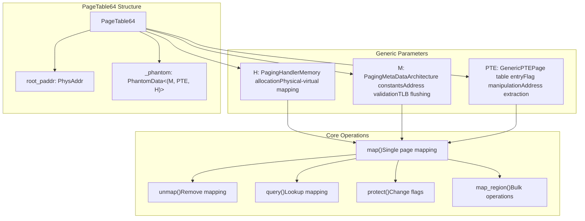
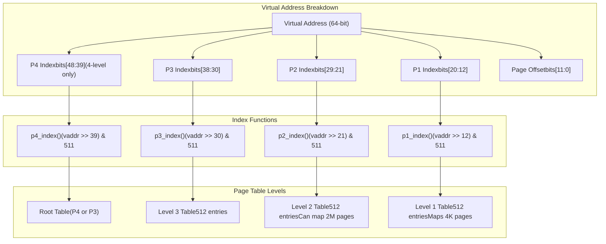
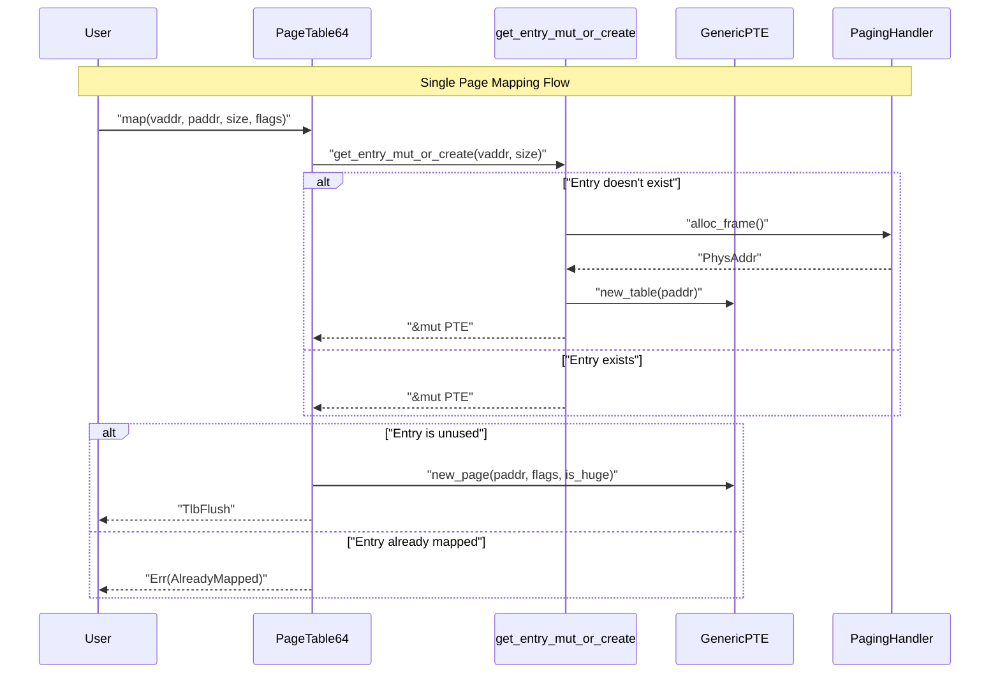
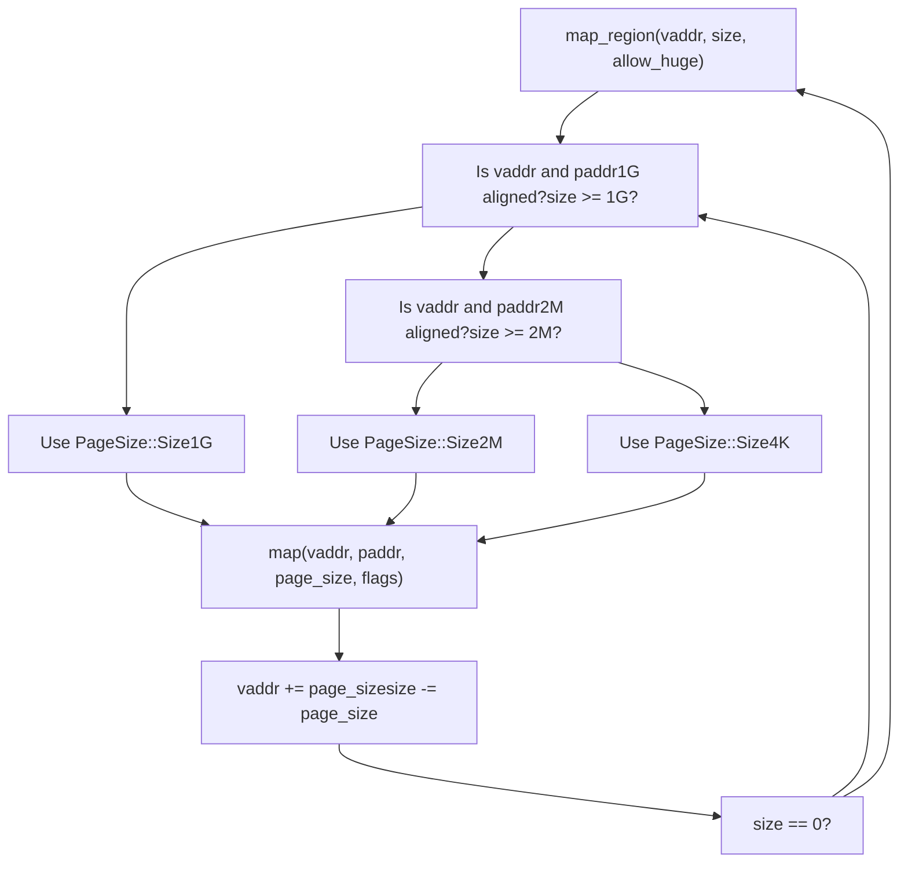
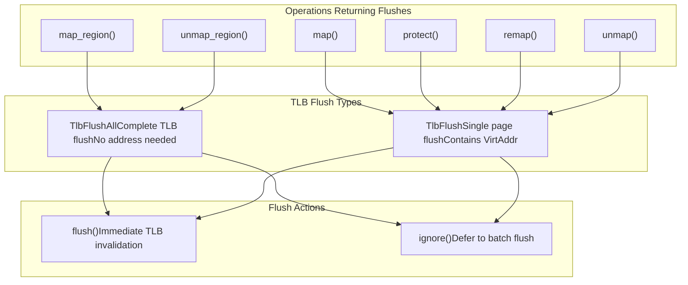
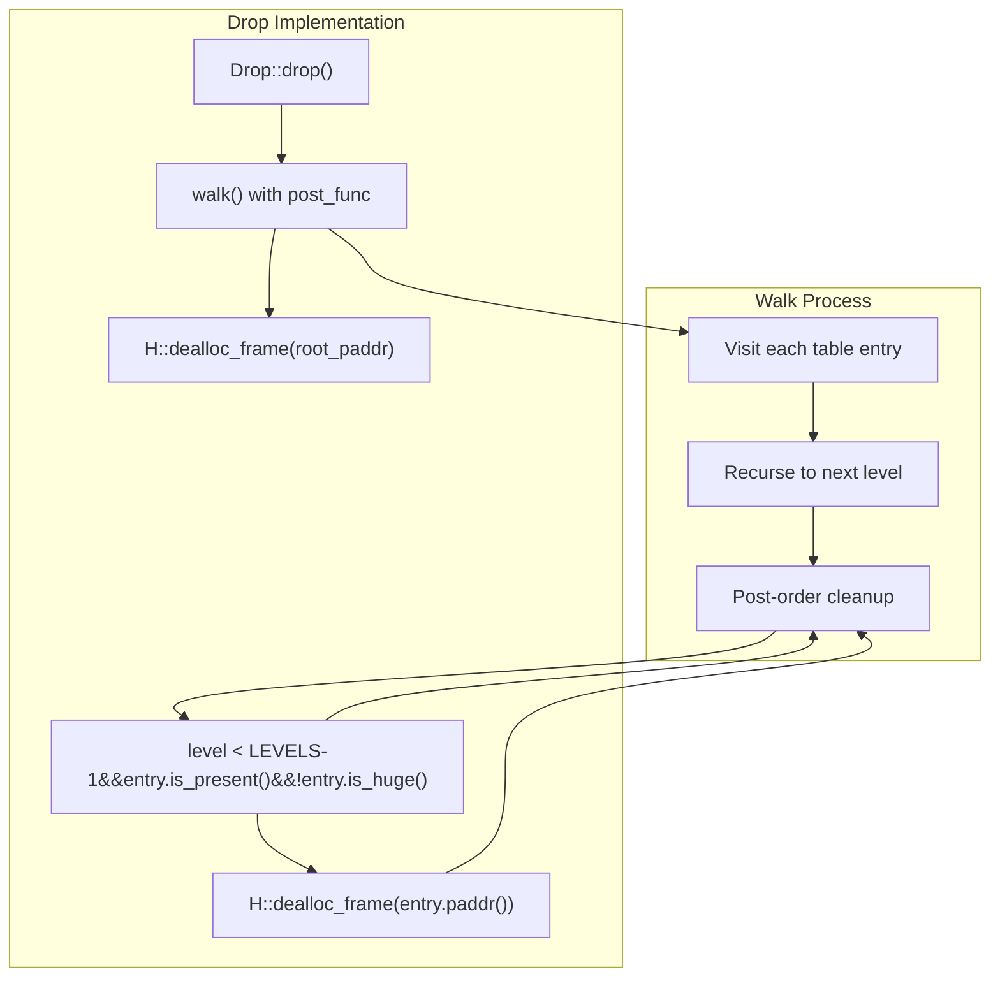

# PageTable64 Implementation

> **Relevant source files**
> * [page_table_multiarch/src/bits64.rs](https://github.com/arceos-org/page_table_multiarch/blob/85fb75ef/page_table_multiarch/src/bits64.rs)
> * [page_table_multiarch/src/lib.rs](https://github.com/arceos-org/page_table_multiarch/blob/85fb75ef/page_table_multiarch/src/lib.rs)

This document covers the core `PageTable64` struct that provides the main page table management functionality for 64-bit platforms in the page_table_multiarch library. It explains how the generic implementation handles multi-level page tables, memory mapping operations, and TLB management across different architectures.

For information about the trait system that enables architecture abstraction, see [Generic Traits System](/arceos-org/page_table_multiarch/3.2-generic-traits-system). For details about architecture-specific implementations, see [Architecture Support](/arceos-org/page_table_multiarch/4-architecture-support).

## Core Structure and Generic Parameters

The `PageTable64` struct serves as the primary interface for page table operations. It uses three generic parameters to achieve architecture independence while maintaining type safety.

The struct maintains only the physical address of the root page table, with all other state managed through the generic trait system. This design enables the same implementation to work across x86_64, AArch64, RISC-V, and LoongArch64 architectures.

*Sources: [page_table_multiarch/src/bits64.rs(L24 - L31)&emsp;](https://github.com/arceos-org/page_table_multiarch/blob/85fb75ef/page_table_multiarch/src/bits64.rs#L24-L31) [page_table_multiarch/src/lib.rs(L40 - L92)&emsp;](https://github.com/arceos-org/page_table_multiarch/blob/85fb75ef/page_table_multiarch/src/lib.rs#L40-L92)*

## Page Table Hierarchy and Indexing

`PageTable64` supports both 3-level and 4-level page table configurations through constant indexing functions. The implementation uses bit manipulation to extract page table indices from virtual addresses.

The system handles both 3-level configurations (like RISC-V Sv39) and 4-level configurations (like x86_64, AArch64) by checking `M::LEVELS` at compile time and selecting the appropriate starting table level.

*Sources: [page_table_multiarch/src/bits64.rs(L6 - L22)&emsp;](https://github.com/arceos-org/page_table_multiarch/blob/85fb75ef/page_table_multiarch/src/bits64.rs#L6-L22) [page_table_multiarch/src/bits64.rs(L401 - L426)&emsp;](https://github.com/arceos-org/page_table_multiarch/blob/85fb75ef/page_table_multiarch/src/bits64.rs#L401-L426)*

## Memory Mapping Operations

The core mapping functionality provides both single-page operations and bulk region operations. The implementation automatically handles huge page detection and creation of intermediate page tables.

The mapping process supports three page sizes through the `PageSize` enum:

* `Size4K` (0x1000): Standard 4KB pages mapped at level 1
* `Size2M` (0x200000): 2MB huge pages mapped at level 2
* `Size1G` (0x40000000): 1GB huge pages mapped at level 3

*Sources: [page_table_multiarch/src/bits64.rs(L59 - L72)&emsp;](https://github.com/arceos-org/page_table_multiarch/blob/85fb75ef/page_table_multiarch/src/bits64.rs#L59-L72) [page_table_multiarch/src/bits64.rs(L455 - L484)&emsp;](https://github.com/arceos-org/page_table_multiarch/blob/85fb75ef/page_table_multiarch/src/bits64.rs#L455-L484) [page_table_multiarch/src/lib.rs(L94 - L128)&emsp;](https://github.com/arceos-org/page_table_multiarch/blob/85fb75ef/page_table_multiarch/src/lib.rs#L94-L128)*

## Region Operations and Huge Page Optimization

The `map_region()` method provides optimized bulk mapping with automatic huge page selection when `allow_huge` is enabled. The implementation analyzes address alignment and region size to choose the largest possible page size.

|Page Size|Alignment Required|Minimum Size|Use Case|
| --- | --- | --- | --- |
|4K|4KB|4KB|General purpose mapping|
|2M|2MB|2MB|Large allocations, stack regions|
|1G|1GB|1GB|Kernel text, large data structures|

The algorithm prioritizes larger page sizes when possible, reducing TLB pressure and improving performance for large memory regions.

*Sources: [page_table_multiarch/src/bits64.rs(L157 - L217)&emsp;](https://github.com/arceos-org/page_table_multiarch/blob/85fb75ef/page_table_multiarch/src/bits64.rs#L157-L217) [page_table_multiarch/src/bits64.rs(L181 - L197)&emsp;](https://github.com/arceos-org/page_table_multiarch/blob/85fb75ef/page_table_multiarch/src/bits64.rs#L181-L197)*

## TLB Management and Flushing

The system provides fine-grained TLB management through the `TlbFlush` and `TlbFlushAll` types. These types enforce explicit handling of TLB invalidation to prevent stale translations.

The `#[must_use]` attribute on flush types ensures that TLB management is never accidentally ignored, preventing subtle bugs from stale page table entries.

*Sources: [page_table_multiarch/src/lib.rs(L130 - L172)&emsp;](https://github.com/arceos-org/page_table_multiarch/blob/85fb75ef/page_table_multiarch/src/lib.rs#L130-L172) [page_table_multiarch/src/bits64.rs(L65 - L91)&emsp;](https://github.com/arceos-org/page_table_multiarch/blob/85fb75ef/page_table_multiarch/src/bits64.rs#L65-L91)*

## Memory Management and Cleanup

`PageTable64` implements automatic memory management through the `Drop` trait, ensuring all allocated page tables are freed when the structure is destroyed. The cleanup process uses recursive walking to identify and deallocate intermediate tables.

The implementation carefully avoids freeing leaf-level entries, which point to actual data pages rather than page table structures that were allocated by the page table system itself.

*Sources: [page_table_multiarch/src/bits64.rs(L525 - L539)&emsp;](https://github.com/arceos-org/page_table_multiarch/blob/85fb75ef/page_table_multiarch/src/bits64.rs#L525-L539) [page_table_multiarch/src/bits64.rs(L313 - L325)&emsp;](https://github.com/arceos-org/page_table_multiarch/blob/85fb75ef/page_table_multiarch/src/bits64.rs#L313-L325)*

## Private Implementation Details

The `PageTable64` implementation uses several private helper methods to manage the complexity of multi-level page table traversal and memory allocation.

|Method|Purpose|Returns|
| --- | --- | --- |
|alloc_table()|Allocate and zero new page table|PagingResult<PhysAddr>|
|table_of()|Get immutable slice to table entries|&[PTE]|
|table_of_mut()|Get mutable slice to table entries|&mut [PTE]|
|next_table()|Follow entry to next level table|PagingResult<&[PTE]>|
|next_table_mut_or_create()|Get next level, creating if needed|PagingResult<&mut [PTE]>|
|get_entry()|Find entry for virtual address|PagingResult<(&PTE, PageSize)>|
|get_entry_mut()|Find mutable entry for virtual address|PagingResult<(&mut PTE, PageSize)>|

The helper methods handle error conditions like unmapped intermediate tables (`NotMapped`) and attempts to traverse through huge pages (`MappedToHugePage`), providing clear error semantics for page table operations.

*Sources: [page_table_multiarch/src/bits64.rs(L350 - L523)&emsp;](https://github.com/arceos-org/page_table_multiarch/blob/85fb75ef/page_table_multiarch/src/bits64.rs#L350-L523) [page_table_multiarch/src/lib.rs(L21 - L38)&emsp;](https://github.com/arceos-org/page_table_multiarch/blob/85fb75ef/page_table_multiarch/src/lib.rs#L21-L38)*