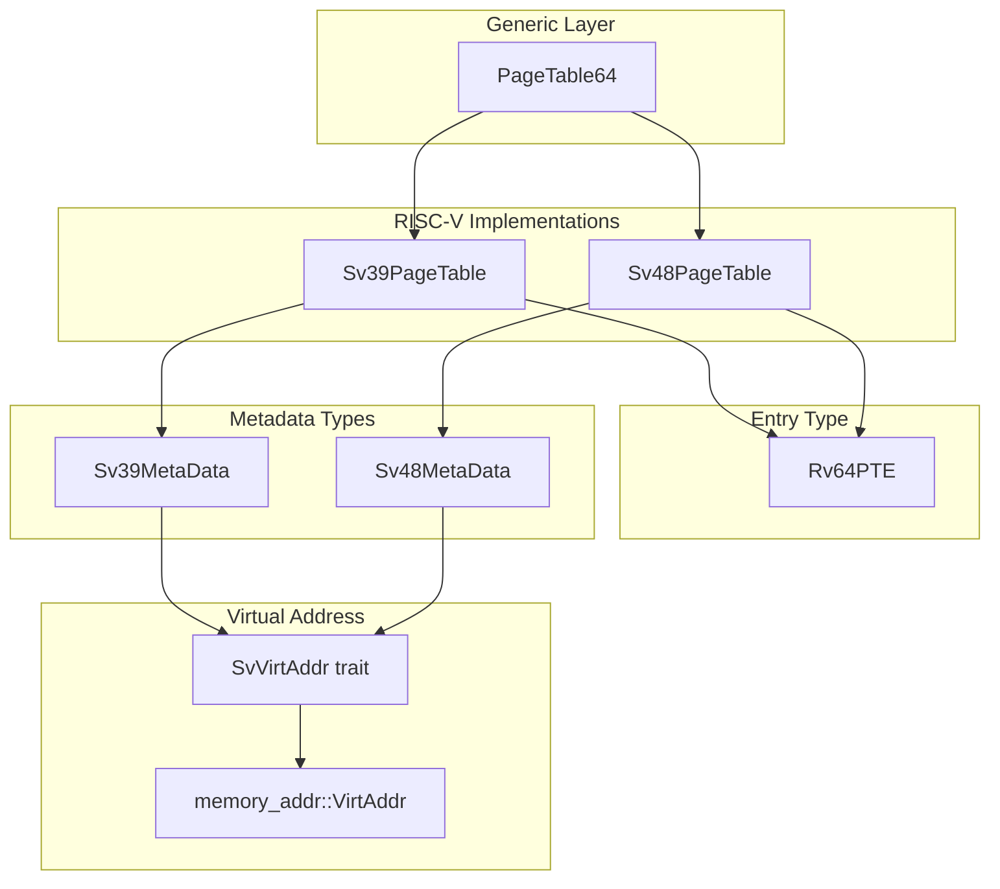
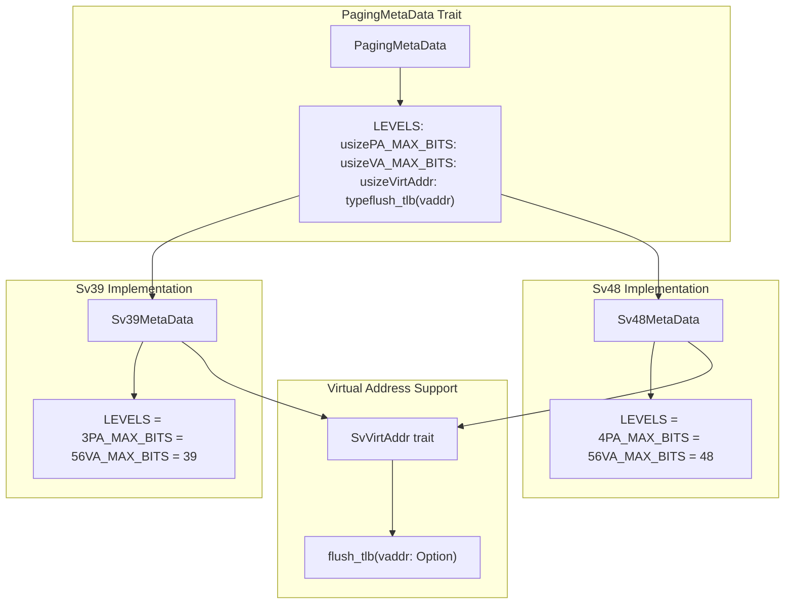
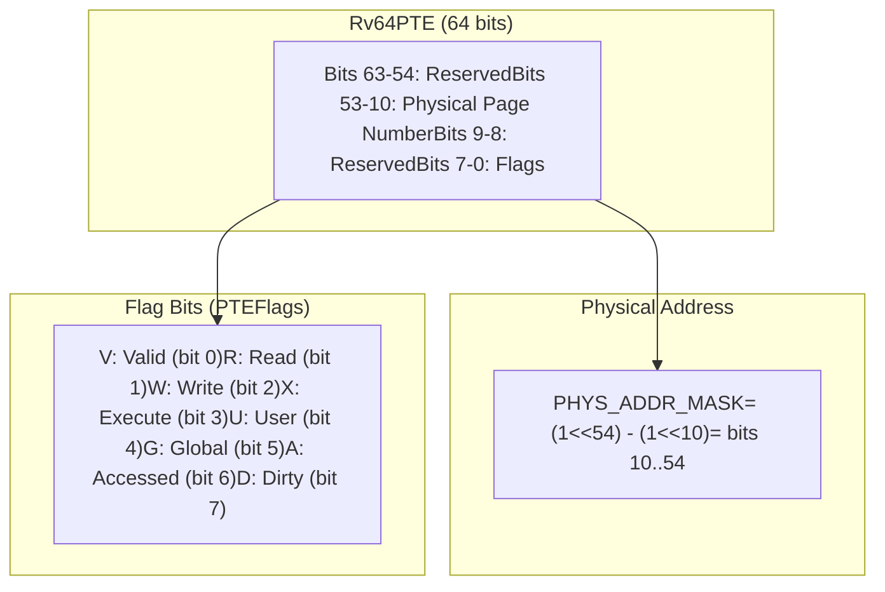
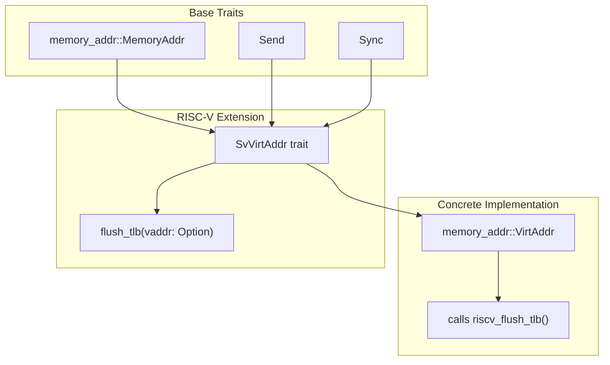

# RISC-V Support

> **Relevant source files**
> * [page_table_entry/src/arch/riscv.rs](https://github.com/arceos-org/page_table_multiarch/blob/85fb75ef/page_table_entry/src/arch/riscv.rs)
> * [page_table_multiarch/src/arch/riscv.rs](https://github.com/arceos-org/page_table_multiarch/blob/85fb75ef/page_table_multiarch/src/arch/riscv.rs)

This document covers RISC-V architecture support in the page_table_multiarch library, including both Sv39 (3-level) and Sv48 (4-level) page table configurations. The implementation provides a unified interface for RISC-V memory management that abstracts the differences between these two virtual memory systems while maintaining compatibility with the generic `PageTable64` interface.

For information about other processor architectures, see [x86_64 Support](/arceos-org/page_table_multiarch/4.1-x86_64-support), [AArch64 Support](/arceos-org/page_table_multiarch/4.2-aarch64-support), and [LoongArch64 Support](/arceos-org/page_table_multiarch/4.4-loongarch64-support). For details about the underlying generic abstractions, see [Generic Traits System](/arceos-org/page_table_multiarch/3.2-generic-traits-system).

## RISC-V Virtual Memory Systems

The RISC-V architecture defines multiple virtual memory systems. This library supports the two most common configurations used in 64-bit RISC-V systems.

### Sv39 vs Sv48 Comparison

|Feature|Sv39|Sv48|
| --- | --- | --- |
|Page Table Levels|3|4|
|Virtual Address Bits|39|48|
|Physical Address Bits|56|56|
|Virtual Address Space|512 GiB|256 TiB|
|Page Table Structure|Page Directory → Page Table → Page|Page Map Level 4 → Page Directory → Page Table → Page|

**RISC-V Page Table Type Hierarchy**



Sources: [page_table_multiarch/src/arch/riscv.rs(L30 - L68)&emsp;](https://github.com/arceos-org/page_table_multiarch/blob/85fb75ef/page_table_multiarch/src/arch/riscv.rs#L30-L68)

## Core Components

### Page Table Type Definitions

The RISC-V implementation provides two concrete page table types that specialize the generic `PageTable64` for RISC-V systems:

```
// Sv39: 3-level page table with 39-bit virtual addresses
pub type Sv39PageTable<H> = PageTable64<Sv39MetaData<memory_addr::VirtAddr>, Rv64PTE, H>;

// Sv48: 4-level page table with 48-bit virtual addresses  
pub type Sv48PageTable<H> = PageTable64<Sv48MetaData<memory_addr::VirtAddr>, Rv64PTE, H>;
```

Both types use:

* The same page table entry type (`Rv64PTE`)
* The same virtual address type (`memory_addr::VirtAddr`)
* Different metadata types that define the paging characteristics

### Metadata Implementations

The metadata structures implement the `PagingMetaData` trait to define architecture-specific constants:

|Metadata Type|Levels|PA Max Bits|VA Max Bits|
| --- | --- | --- | --- |
|Sv39MetaData<VA>|3|56|39|
|Sv48MetaData<VA>|4|56|48|

**RISC-V Metadata Structure**



Sources: [page_table_multiarch/src/arch/riscv.rs(L30 - L62)&emsp;](https://github.com/arceos-org/page_table_multiarch/blob/85fb75ef/page_table_multiarch/src/arch/riscv.rs#L30-L62)

## Page Table Entry Implementation

### Rv64PTE Structure

The `Rv64PTE` struct implements the `GenericPTE` trait and provides RISC-V-specific page table entry functionality. It uses a 64-bit representation with specific bit field layouts defined by the RISC-V specification.

**RISC-V PTE Bit Layout**



Sources: [page_table_entry/src/arch/riscv.rs(L77 - L89)&emsp;](https://github.com/arceos-org/page_table_multiarch/blob/85fb75ef/page_table_entry/src/arch/riscv.rs#L77-L89)

### Flag Conversion

The implementation provides bidirectional conversion between RISC-V-specific `PTEFlags` and generic `MappingFlags`:

|Generic Flag|RISC-V Flag|Description|
| --- | --- | --- |
|READ|R|Page is readable|
|WRITE|W|Page is writable|
|EXECUTE|X|Page is executable|
|USER|U|Page is accessible in user mode|

The conversion automatically sets additional RISC-V flags:

* `V` (Valid) flag is set for any non-empty mapping
* `A` (Accessed) and `D` (Dirty) flags are automatically set to avoid hardware page faults

Sources: [page_table_entry/src/arch/riscv.rs(L33 - L75)&emsp;](https://github.com/arceos-org/page_table_multiarch/blob/85fb75ef/page_table_entry/src/arch/riscv.rs#L33-L75)

### GenericPTE Implementation

The `Rv64PTE` implements key `GenericPTE` methods:

```python
// Create page entry with proper flag conversion
fn new_page(paddr: PhysAddr, flags: MappingFlags, _is_huge: bool) -> Self

// Create page table entry (only Valid flag set)
fn new_table(paddr: PhysAddr) -> Self

// Extract physical address from PTE
fn paddr(&self) -> PhysAddr

// Convert RISC-V flags to generic flags
fn flags(&self) -> MappingFlags

// Check if entry represents a huge page (has R or X flags)
fn is_huge(&self) -> bool
```

Sources: [page_table_entry/src/arch/riscv.rs(L91 - L131)&emsp;](https://github.com/arceos-org/page_table_multiarch/blob/85fb75ef/page_table_entry/src/arch/riscv.rs#L91-L131)

## Virtual Address Management

### SvVirtAddr Trait

The `SvVirtAddr` trait extends the generic `MemoryAddr` trait to add RISC-V-specific TLB management capabilities:

**Virtual Address Trait Hierarchy**



Sources: [page_table_multiarch/src/arch/riscv.rs(L17 - L28)&emsp;](https://github.com/arceos-org/page_table_multiarch/blob/85fb75ef/page_table_multiarch/src/arch/riscv.rs#L17-L28)

## TLB Management

### TLB Flushing Implementation

RISC-V TLB management uses the `sfence.vma` instruction through the `riscv` crate:

```javascript
fn riscv_flush_tlb(vaddr: Option<memory_addr::VirtAddr>) {
    unsafe {
        if let Some(vaddr) = vaddr {
            riscv::asm::sfence_vma(0, vaddr.as_usize())  // Flush specific address
        } else {
            riscv::asm::sfence_vma_all();                // Flush entire TLB
        }
    }
}
```

The TLB flush operation supports:

* **Selective flushing**: Flush TLB entries for a specific virtual address
* **Global flushing**: Flush all TLB entries when no address is specified

This functionality is integrated into the metadata types through the `PagingMetaData::flush_tlb` method, which delegates to the `SvVirtAddr::flush_tlb` implementation.

Sources: [page_table_multiarch/src/arch/riscv.rs(L6 - L15)&emsp;](https://github.com/arceos-org/page_table_multiarch/blob/85fb75ef/page_table_multiarch/src/arch/riscv.rs#L6-L15) [page_table_multiarch/src/arch/riscv.rs(L46 - L61)&emsp;](https://github.com/arceos-org/page_table_multiarch/blob/85fb75ef/page_table_multiarch/src/arch/riscv.rs#L46-L61)