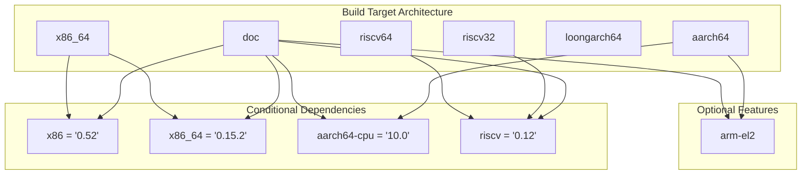

# Supported Platforms

> **Relevant source files**
> * [CHANGELOG.md](https://github.com/arceos-org/page_table_multiarch/blob/85fb75ef/CHANGELOG.md)
> * [page_table_entry/Cargo.toml](https://github.com/arceos-org/page_table_multiarch/blob/85fb75ef/page_table_entry/Cargo.toml)
> * [page_table_multiarch/Cargo.toml](https://github.com/arceos-org/page_table_multiarch/blob/85fb75ef/page_table_multiarch/Cargo.toml)

This document provides an overview of the hardware architectures supported by the `page_table_multiarch` library and their specific implementation characteristics. The library provides a unified interface for page table management across multiple processor architectures through architecture-specific implementations.

For detailed information about the implementation architecture, see [System Architecture](/arceos-org/page_table_multiarch/1.1-system-architecture). For information about building and testing across platforms, see [Building and Testing](/arceos-org/page_table_multiarch/5.1-building-and-testing).

## Architecture Support Matrix

The `page_table_multiarch` library supports four major processor architectures through conditional compilation and architecture-specific implementations. Each architecture provides different virtual address space configurations and page table structures.

### Supported Architecture Matrix

|Architecture|Virtual Address Bits|Physical Address Bits|Page Table Levels|Crate Dependencies|
| --- | --- | --- | --- | --- |
|x86_64|48-bit|52-bit|4 levels|x86|
|AArch64|48-bit|48-bit|4 levels|aarch64-cpu|
|RISC-V Sv39|39-bit|56-bit|3 levels|riscv|
|RISC-V Sv48|48-bit|56-bit|4 levels|riscv|
|LoongArch64|48-bit|48-bit|4 levels|Built-in|

**Sources:** [page_table_multiarch/Cargo.toml(L20 - L24)&emsp;](https://github.com/arceos-org/page_table_multiarch/blob/85fb75ef/page_table_multiarch/Cargo.toml#L20-L24) [page_table_entry/Cargo.toml(L22 - L26)&emsp;](https://github.com/arceos-org/page_table_multiarch/blob/85fb75ef/page_table_entry/Cargo.toml#L22-L26) [CHANGELOG.md(L21)&emsp;](https://github.com/arceos-org/page_table_multiarch/blob/85fb75ef/CHANGELOG.md#L21-L21)

## Platform Implementation Structure

### Architecture-Specific Type Mapping

```mermaid
flowchart TD
subgraph LoongArch_Impl["LoongArch64 Implementation"]
    LA64PT["LA64PageTable"]
    LA64PTE["LA64PTE"]
    LA64MD["LA64MetaData"]
end
subgraph RISC_V_Impl["RISC-V Implementation"]
    SV39PT["Sv39PageTable"]
    SV48PT["Sv48PageTable"]
    RV64PTE["Rv64PTE"]
    SV39MD["Sv39MetaData"]
    SV48MD["Sv48MetaData"]
end
subgraph AArch64_Impl["AArch64 Implementation"]
    A64PT["A64PageTable"]
    A64PTE["A64PTE"]
    A64MD["A64PagingMetaData"]
end
subgraph x86_64_Impl["x86_64 Implementation"]
    X64PT["X64PageTable"]
    X64PTE["X64PTE"]
    X64MD["X64PagingMetaData"]
end
subgraph Generic_Interface["Generic Interface Layer"]
    PT64["PageTable64<M, PTE, H>"]
    GPTE["GenericPTE trait"]
    PMD["PagingMetaData trait"]
end

GPTE --> A64PTE
GPTE --> LA64PTE
GPTE --> RV64PTE
GPTE --> X64PTE
PMD --> A64MD
PMD --> LA64MD
PMD --> SV39MD
PMD --> SV48MD
PMD --> X64MD
PT64 --> A64PT
PT64 --> LA64PT
PT64 --> SV39PT
PT64 --> SV48PT
PT64 --> X64PT
```



**Sources:** [page_table_multiarch/Cargo.toml(L1 - L28)&emsp;](https://github.com/arceos-org/page_table_multiarch/blob/85fb75ef/page_table_multiarch/Cargo.toml#L1-L28) [page_table_entry/Cargo.toml(L1 - L29)&emsp;](https://github.com/arceos-org/page_table_multiarch/blob/85fb75ef/page_table_entry/Cargo.toml#L1-L29)

### Conditional Compilation Dependencies



**Sources:** [page_table_multiarch/Cargo.toml(L20 - L27)&emsp;](https://github.com/arceos-org/page_table_multiarch/blob/85fb75ef/page_table_multiarch/Cargo.toml#L20-L27) [page_table_entry/Cargo.toml(L15 - L29)&emsp;](https://github.com/arceos-org/page_table_multiarch/blob/85fb75ef/page_table_entry/Cargo.toml#L15-L29)

## x86_64 Platform Support

The x86_64 implementation provides support for Intel and AMD 64-bit processors using 4-level page tables with 48-bit virtual addresses and up to 52-bit physical addresses.

### x86_64 Characteristics

* **Page Table Structure**: 4-level paging (PML4, PDPT, PD, PT)
* **Virtual Address Space**: 48 bits (256 TB)
* **Physical Address Space**: Up to 52 bits (4 PB)
* **Page Sizes**: 4 KB, 2 MB, 1 GB
* **Hardware Dependencies**: `x86` crate for low-level x86 functionality

**Sources:** [page_table_multiarch/Cargo.toml(L20 - L21)&emsp;](https://github.com/arceos-org/page_table_multiarch/blob/85fb75ef/page_table_multiarch/Cargo.toml#L20-L21) [page_table_entry/Cargo.toml(L25 - L26)&emsp;](https://github.com/arceos-org/page_table_multiarch/blob/85fb75ef/page_table_entry/Cargo.toml#L25-L26)

## AArch64 Platform Support

The AArch64 implementation supports ARM 64-bit processors using the VMSAv8-64 translation table format with 4-level page tables.

### AArch64 Characteristics

* **Page Table Structure**: 4-level translation tables (L0, L1, L2, L3)
* **Virtual Address Space**: 48 bits (256 TB)
* **Physical Address Space**: 48 bits (256 TB)
* **Page Sizes**: 4 KB, 2 MB, 1 GB
* **Hardware Dependencies**: `aarch64-cpu` crate for ARM-specific functionality
* **Special Features**: EL2 privilege level support via `arm-el2` feature

**Sources:** [page_table_entry/Cargo.toml(L15 - L23)&emsp;](https://github.com/arceos-org/page_table_multiarch/blob/85fb75ef/page_table_entry/Cargo.toml#L15-L23) [CHANGELOG.md(L47)&emsp;](https://github.com/arceos-org/page_table_multiarch/blob/85fb75ef/CHANGELOG.md#L47-L47)

## RISC-V Platform Support

The RISC-V implementation supports both Sv39 (3-level) and Sv48 (4-level) virtual memory configurations, providing flexibility for different RISC-V implementations.

### RISC-V Sv39 Characteristics

* **Page Table Structure**: 3-level page tables
* **Virtual Address Space**: 39 bits (512 GB)
* **Physical Address Space**: 56 bits (64 PB)
* **Page Sizes**: 4 KB, 2 MB, 1 GB

### RISC-V Sv48 Characteristics

* **Page Table Structure**: 4-level page tables
* **Virtual Address Space**: 48 bits (256 TB)
* **Physical Address Space**: 56 bits (64 PB)
* **Page Sizes**: 4 KB, 2 MB, 1 GB, 512 GB

### RISC-V Dependencies

* **Hardware Dependencies**: `riscv` crate v0.12 with default features disabled
* **Target Support**: Both `riscv32` and `riscv64` target architectures

**Sources:** [page_table_multiarch/Cargo.toml(L23 - L24)&emsp;](https://github.com/arceos-org/page_table_multiarch/blob/85fb75ef/page_table_multiarch/Cargo.toml#L23-L24) [CHANGELOG.md(L37)&emsp;](https://github.com/arceos-org/page_table_multiarch/blob/85fb75ef/CHANGELOG.md#L37-L37)

## LoongArch64 Platform Support

LoongArch64 support was added in version 0.5.1, providing page table management for LoongArch 64-bit processors with 4-level page tables by default.

### LoongArch64 Characteristics

* **Page Table Structure**: 4-level page tables (default configuration)
* **Virtual Address Space**: 48 bits (256 TB)
* **Physical Address Space**: 48 bits (256 TB)
* **Page Sizes**: 4 KB, 2 MB, 1 GB
* **Hardware Dependencies**: Built-in support, no external crate dependencies

**Sources:** [CHANGELOG.md(L13 - L21)&emsp;](https://github.com/arceos-org/page_table_multiarch/blob/85fb75ef/CHANGELOG.md#L13-L21)

## Build System Integration

The platform support is implemented through Cargo's conditional compilation features, ensuring that only the necessary architecture-specific dependencies are included in builds.

### Target-Specific Dependencies

```
[target.'cfg(any(target_arch = "x86_64", doc))'.dependencies]
x86 = "0.52"

[target.'cfg(any(target_arch = "aarch64", doc))'.dependencies]
aarch64-cpu = "10.0"

[target.'cfg(any(target_arch = "riscv32", target_arch = "riscv64", doc))'.dependencies]
riscv = { version = "0.12", default-features = false }
```

The `doc` target ensures all architecture-specific code is available when building documentation, providing complete API documentation across all supported platforms.

**Sources:** [page_table_multiarch/Cargo.toml(L20 - L27)&emsp;](https://github.com/arceos-org/page_table_multiarch/blob/85fb75ef/page_table_multiarch/Cargo.toml#L20-L27) [page_table_entry/Cargo.toml(L22 - L29)&emsp;](https://github.com/arceos-org/page_table_multiarch/blob/85fb75ef/page_table_entry/Cargo.toml#L22-L29)