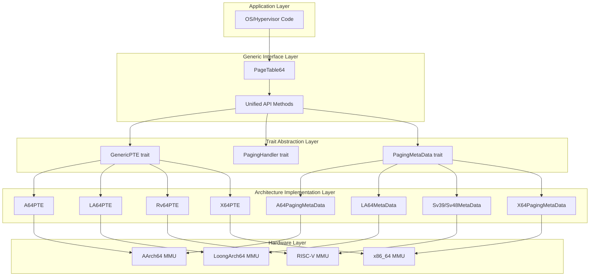
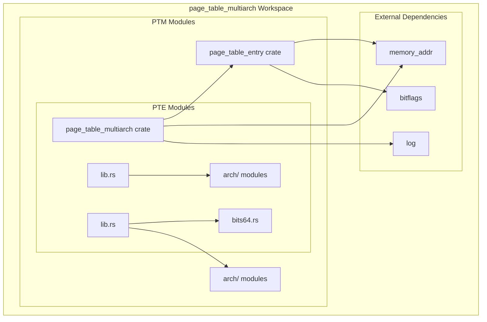
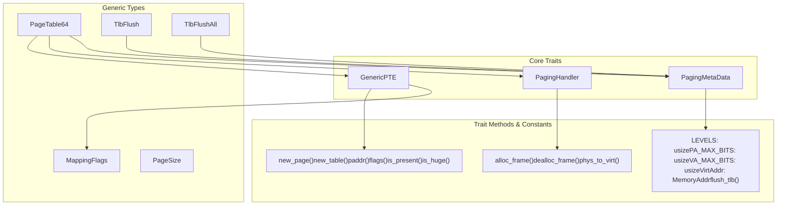
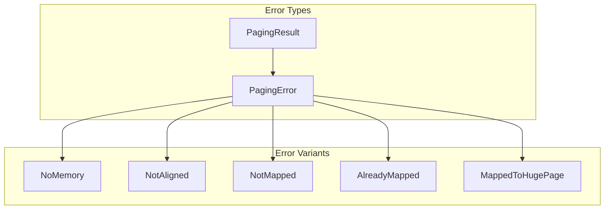
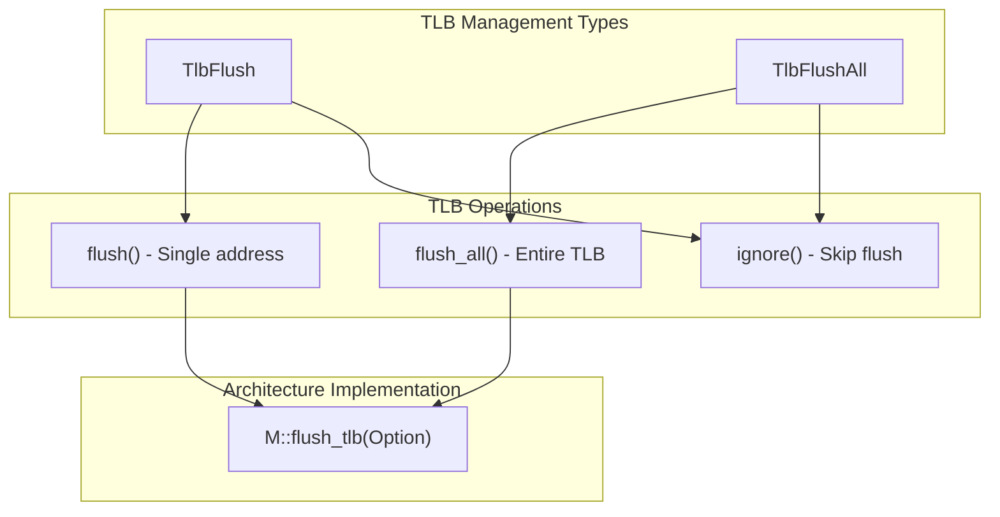

# System Architecture

> **Relevant source files**
> * [page_table_entry/src/lib.rs](https://github.com/arceos-org/page_table_multiarch/blob/85fb75ef/page_table_entry/src/lib.rs)
> * [page_table_multiarch/README.md](https://github.com/arceos-org/page_table_multiarch/blob/85fb75ef/page_table_multiarch/README.md)
> * [page_table_multiarch/src/lib.rs](https://github.com/arceos-org/page_table_multiarch/blob/85fb75ef/page_table_multiarch/src/lib.rs)

This document explains the overall design philosophy, abstraction layers, and architecture independence mechanisms of the `page_table_multiarch` library. The purpose is to provide a comprehensive understanding of how the system achieves unified page table management across multiple processor architectures through a layered abstraction approach.

For detailed information about specific processor architectures, see [Architecture Support](/arceos-org/page_table_multiarch/4-architecture-support). For implementation details of the core abstractions, see [Core Concepts](/arceos-org/page_table_multiarch/3-core-concepts).

## Design Philosophy

The `page_table_multiarch` library implements a generic, unified, architecture-independent approach to page table management. The system separates architecture-specific concerns from generic page table operations through a trait-based abstraction layer that allows the same high-level API to work across x86_64, AArch64, RISC-V, and LoongArch64 platforms.

### Core Abstraction Model



Sources: [page_table_multiarch/src/lib.rs(L9 - L19)&emsp;](https://github.com/arceos-org/page_table_multiarch/blob/85fb75ef/page_table_multiarch/src/lib.rs#L9-L19) [page_table_multiarch/README.md(L9 - L20)&emsp;](https://github.com/arceos-org/page_table_multiarch/blob/85fb75ef/page_table_multiarch/README.md#L9-L20)

## Workspace Architecture

The system is organized as a two-crate Cargo workspace that separates high-level page table management from low-level page table entry definitions:

### Crate Dependency Structure



|Crate|Purpose|Key Exports|
| --- | --- | --- |
|page_table_multiarch|High-level page table abstractions|PageTable64,PagingMetaData,PagingHandler|
|page_table_entry|Low-level page table entry definitions|GenericPTE,MappingFlags|

Sources: [page_table_multiarch/src/lib.rs(L15 - L19)&emsp;](https://github.com/arceos-org/page_table_multiarch/blob/85fb75ef/page_table_multiarch/src/lib.rs#L15-L19) [page_table_entry/src/lib.rs(L10)&emsp;](https://github.com/arceos-org/page_table_multiarch/blob/85fb75ef/page_table_entry/src/lib.rs#L10-L10)

## Core Trait System

The architecture independence is achieved through three primary traits that define contracts between generic and architecture-specific code:

### Trait Relationships and Responsibilities



### Trait Responsibilities

|Trait|Responsibility|Key Types|
| --- | --- | --- |
|PagingMetaData|Architecture constants and TLB operations|LEVELS,PA_MAX_BITS,VA_MAX_BITS,VirtAddr|
|GenericPTE|Page table entry manipulation|Entry creation, flag handling, address extraction|
|PagingHandler|OS-dependent memory operations|Frame allocation, virtual-physical address translation|

Sources: [page_table_multiarch/src/lib.rs(L40 - L92)&emsp;](https://github.com/arceos-org/page_table_multiarch/blob/85fb75ef/page_table_multiarch/src/lib.rs#L40-L92) [page_table_entry/src/lib.rs(L38 - L68)&emsp;](https://github.com/arceos-org/page_table_multiarch/blob/85fb75ef/page_table_entry/src/lib.rs#L38-L68)

## Architecture Independence Mechanisms

### Generic Parameter System

The `PageTable64<M, PTE, H>` struct uses three generic parameters to achieve architecture independence:

```
// From page_table_multiarch/src/lib.rs and bits64.rs
PageTable64<M: PagingMetaData, PTE: GenericPTE, H: PagingHandler>
```

* **`M: PagingMetaData`** - Provides architecture-specific constants and TLB operations
* **`PTE: GenericPTE`** - Handles architecture-specific page table entry formats
* **`H: PagingHandler`** - Abstracts OS-specific memory management operations

### Architecture-Specific Implementations

Each supported architecture provides concrete implementations of the core traits:

|Architecture|Metadata Type|PTE Type|Example Usage|
| --- | --- | --- | --- |
|x86_64|X64PagingMetaData|X64PTE|X64PageTable|
|AArch64|A64PagingMetaData|A64PTE|A64PageTable|
|RISC-V Sv39|Sv39MetaData|Rv64PTE|Sv39PageTable|
|RISC-V Sv48|Sv48MetaData|Rv64PTE|Sv48PageTable|
|LoongArch64|LA64MetaData|LA64PTE|LA64PageTable|

### Error Handling and Type Safety

The system defines a comprehensive error model through `PagingError` and `PagingResult` types:



Sources: [page_table_multiarch/src/lib.rs(L21 - L38)&emsp;](https://github.com/arceos-org/page_table_multiarch/blob/85fb75ef/page_table_multiarch/src/lib.rs#L21-L38)

## TLB Management Architecture

The system implements a type-safe TLB (Translation Lookaside Buffer) management mechanism through specialized wrapper types:

### TLB Flush Types



The `#[must_use]` attribute ensures that TLB flush operations are not accidentally ignored, promoting system correctness.

Sources: [page_table_multiarch/src/lib.rs(L130 - L172)&emsp;](https://github.com/arceos-org/page_table_multiarch/blob/85fb75ef/page_table_multiarch/src/lib.rs#L130-L172)

## Page Size Support

The system supports multiple page sizes through the `PageSize` enumeration:

|Page Size|Value|Usage|
| --- | --- | --- |
|Size4K|4 KiB (0x1000)|Standard pages|
|Size2M|2 MiB (0x200000)|Huge pages|
|Size1G|1 GiB (0x40000000)|Huge pages|

The `PageSize::is_huge()` method distinguishes between standard and huge pages, enabling architecture-specific optimizations for large memory mappings.

Sources: [page_table_multiarch/src/lib.rs(L94 - L128)&emsp;](https://github.com/arceos-org/page_table_multiarch/blob/85fb75ef/page_table_multiarch/src/lib.rs#L94-L128)