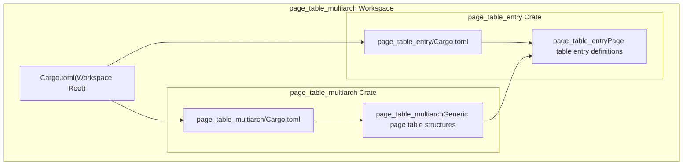
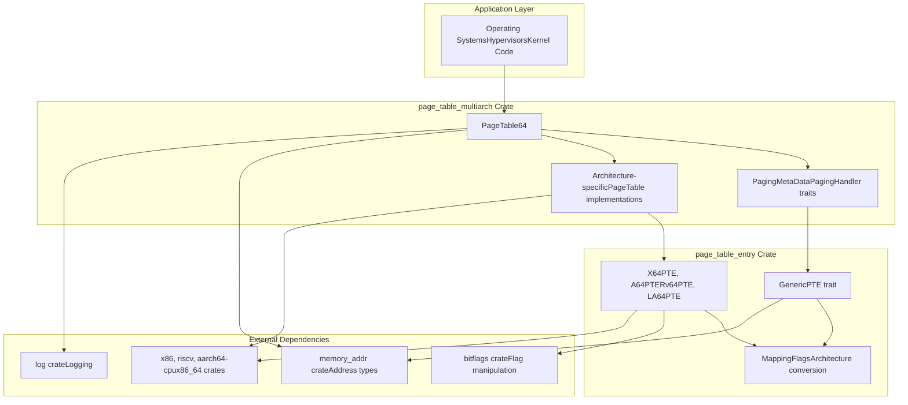
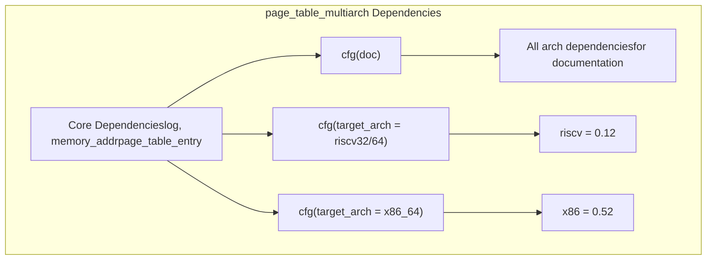
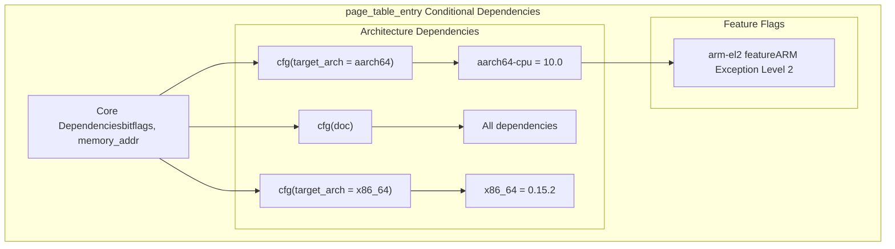

# Workspace Structure

> **Relevant source files**
> * [Cargo.toml](https://github.com/arceos-org/page_table_multiarch/blob/85fb75ef/Cargo.toml)
> * [page_table_entry/Cargo.toml](https://github.com/arceos-org/page_table_multiarch/blob/85fb75ef/page_table_entry/Cargo.toml)
> * [page_table_multiarch/Cargo.toml](https://github.com/arceos-org/page_table_multiarch/blob/85fb75ef/page_table_multiarch/Cargo.toml)

This document explains the two-crate workspace structure of the `page_table_multiarch` repository and how the crates interact to provide multi-architecture page table functionality. It covers the workspace configuration, crate responsibilities, dependency management, and conditional compilation strategy.

For detailed information about the individual crate implementations, see [page_table_multiarch Crate](/arceos-org/page_table_multiarch/2.1-page_table_multiarch-crate) and [page_table_entry Crate](/arceos-org/page_table_multiarch/2.2-page_table_entry-crate).

## Workspace Overview

The `page_table_multiarch` repository is organized as a Cargo workspace containing two complementary crates that provide a layered approach to page table management across multiple hardware architectures.

### Workspace Definition

The workspace is defined in the root [Cargo.toml(L1 - L7)&emsp;](https://github.com/arceos-org/page_table_multiarch/blob/85fb75ef/Cargo.toml#L1-L7) with two member crates:

|Crate|Purpose|Role|
| --- | --- | --- |
|page_table_multiarch|High-level page table abstractions|Main API providingPageTable64and unified interface|
|page_table_entry|Low-level page table entries|Architecture-specific PTE implementations andGenericPTEtrait|

**Workspace Structure Diagram**



*Sources: [Cargo.toml(L4 - L7)&emsp;](https://github.com/arceos-org/page_table_multiarch/blob/85fb75ef/Cargo.toml#L4-L7) [page_table_multiarch/Cargo.toml(L2 - L3)&emsp;](https://github.com/arceos-org/page_table_multiarch/blob/85fb75ef/page_table_multiarch/Cargo.toml#L2-L3) [page_table_entry/Cargo.toml(L2 - L3)&emsp;](https://github.com/arceos-org/page_table_multiarch/blob/85fb75ef/page_table_entry/Cargo.toml#L2-L3)*

### Shared Workspace Configuration

The workspace defines common package metadata in [Cargo.toml(L9 - L19)&emsp;](https://github.com/arceos-org/page_table_multiarch/blob/85fb75ef/Cargo.toml#L9-L19) that is inherited by both member crates:

* **Version**: `0.5.3` - synchronized across all crates
* **Edition**: `2024` - uses latest Rust edition
* **Categories**: `["os", "hardware-support", "memory-management", "no-std"]`
* **Keywords**: `["arceos", "paging", "page-table", "virtual-memory"]`
* **Rust Version**: `1.85` - minimum supported Rust version

*Sources: [Cargo.toml(L9 - L19)&emsp;](https://github.com/arceos-org/page_table_multiarch/blob/85fb75ef/Cargo.toml#L9-L19) [page_table_multiarch/Cargo.toml(L5 - L13)&emsp;](https://github.com/arceos-org/page_table_multiarch/blob/85fb75ef/page_table_multiarch/Cargo.toml#L5-L13) [page_table_entry/Cargo.toml(L5 - L13)&emsp;](https://github.com/arceos-org/page_table_multiarch/blob/85fb75ef/page_table_entry/Cargo.toml#L5-L13)*

## Crate Interaction Architecture

The two crates form a layered architecture where `page_table_multiarch` provides high-level abstractions while depending on `page_table_entry` for low-level functionality.

**Crate Dependency and Interaction Diagram**



*Sources: [page_table_multiarch/Cargo.toml(L15 - L18)&emsp;](https://github.com/arceos-org/page_table_multiarch/blob/85fb75ef/page_table_multiarch/Cargo.toml#L15-L18) [page_table_entry/Cargo.toml(L18 - L20)&emsp;](https://github.com/arceos-org/page_table_multiarch/blob/85fb75ef/page_table_entry/Cargo.toml#L18-L20)*

### Dependency Relationship

The `page_table_multiarch` crate explicitly depends on `page_table_entry` as defined in [page_table_multiarch/Cargo.toml(L18)&emsp;](https://github.com/arceos-org/page_table_multiarch/blob/85fb75ef/page_table_multiarch/Cargo.toml#L18-L18):

```
page_table_entry = { path = "../page_table_entry", version = "0.5.2" }
```

This creates a clear separation of concerns:

* **High-level operations** (page table walking, mapping, unmapping) in `page_table_multiarch`
* **Low-level PTE manipulation** (bit operations, flag conversions) in `page_table_entry`

*Sources: [page_table_multiarch/Cargo.toml(L18)&emsp;](https://github.com/arceos-org/page_table_multiarch/blob/85fb75ef/page_table_multiarch/Cargo.toml#L18-L18)*

## Architecture-Specific Dependencies

Both crates use conditional compilation to include only the necessary architecture-specific dependencies based on the target platform.

### page_table_multiarch Dependencies

**Conditional Dependencies Diagram**



*Sources: [page_table_multiarch/Cargo.toml(L20 - L24)&emsp;](https://github.com/arceos-org/page_table_multiarch/blob/85fb75ef/page_table_multiarch/Cargo.toml#L20-L24) [page_table_multiarch/Cargo.toml(L26 - L27)&emsp;](https://github.com/arceos-org/page_table_multiarch/blob/85fb75ef/page_table_multiarch/Cargo.toml#L26-L27)*

### page_table_entry Dependencies

The `page_table_entry` crate includes more architecture-specific dependencies:

|Target Architecture|Dependencies|Purpose|
| --- | --- | --- |
|x86_64|x86_64 = "0.15.2"|x86-64 specific register and instruction access|
|aarch64|aarch64-cpu = "10.0"|ARM64 system register and instruction access|
|riscv32/riscv64|None (built-in)|RISC-V support uses standard library features|
|loongarch64|None (built-in)|LoongArch support uses standard library features|

**page_table_entry Architecture Dependencies**



*Sources: [page_table_entry/Cargo.toml(L22 - L26)&emsp;](https://github.com/arceos-org/page_table_multiarch/blob/85fb75ef/page_table_entry/Cargo.toml#L22-L26) [page_table_entry/Cargo.toml(L15 - L16)&emsp;](https://github.com/arceos-org/page_table_multiarch/blob/85fb75ef/page_table_entry/Cargo.toml#L15-L16)*

## Documentation Configuration

Both crates include special configuration for documentation generation using `docs.rs`:

* **Documentation builds** include all architecture dependencies via `cfg(doc)`
* **Rustc arguments** add `--cfg doc` for conditional compilation during docs generation
* This ensures complete documentation coverage across all supported architectures

The configuration in [page_table_multiarch/Cargo.toml(L26 - L27)&emsp;](https://github.com/arceos-org/page_table_multiarch/blob/85fb75ef/page_table_multiarch/Cargo.toml#L26-L27) and [page_table_entry/Cargo.toml(L28 - L29)&emsp;](https://github.com/arceos-org/page_table_multiarch/blob/85fb75ef/page_table_entry/Cargo.toml#L28-L29) enables this behavior.

*Sources: [page_table_multiarch/Cargo.toml(L26 - L27)&emsp;](https://github.com/arceos-org/page_table_multiarch/blob/85fb75ef/page_table_multiarch/Cargo.toml#L26-L27) [page_table_entry/Cargo.toml(L28 - L29)&emsp;](https://github.com/arceos-org/page_table_multiarch/blob/85fb75ef/page_table_entry/Cargo.toml#L28-L29)*

## Workspace Benefits

The two-crate structure provides several architectural advantages:

1. **Separation of Concerns**: High-level page table operations vs. low-level PTE manipulation
2. **Conditional Compilation**: Architecture-specific dependencies are isolated and only included when needed
3. **Reusability**: The `page_table_entry` crate can be used independently for PTE operations
4. **Testing**: Each layer can be tested independently with appropriate mocking
5. **Documentation**: Clear API boundaries make the system easier to understand and document

*Sources: [Cargo.toml(L1 - L19)&emsp;](https://github.com/arceos-org/page_table_multiarch/blob/85fb75ef/Cargo.toml#L1-L19) [page_table_multiarch/Cargo.toml(L1 - L28)&emsp;](https://github.com/arceos-org/page_table_multiarch/blob/85fb75ef/page_table_multiarch/Cargo.toml#L1-L28) [page_table_entry/Cargo.toml(L1 - L29)&emsp;](https://github.com/arceos-org/page_table_multiarch/blob/85fb75ef/page_table_entry/Cargo.toml#L1-L29)*