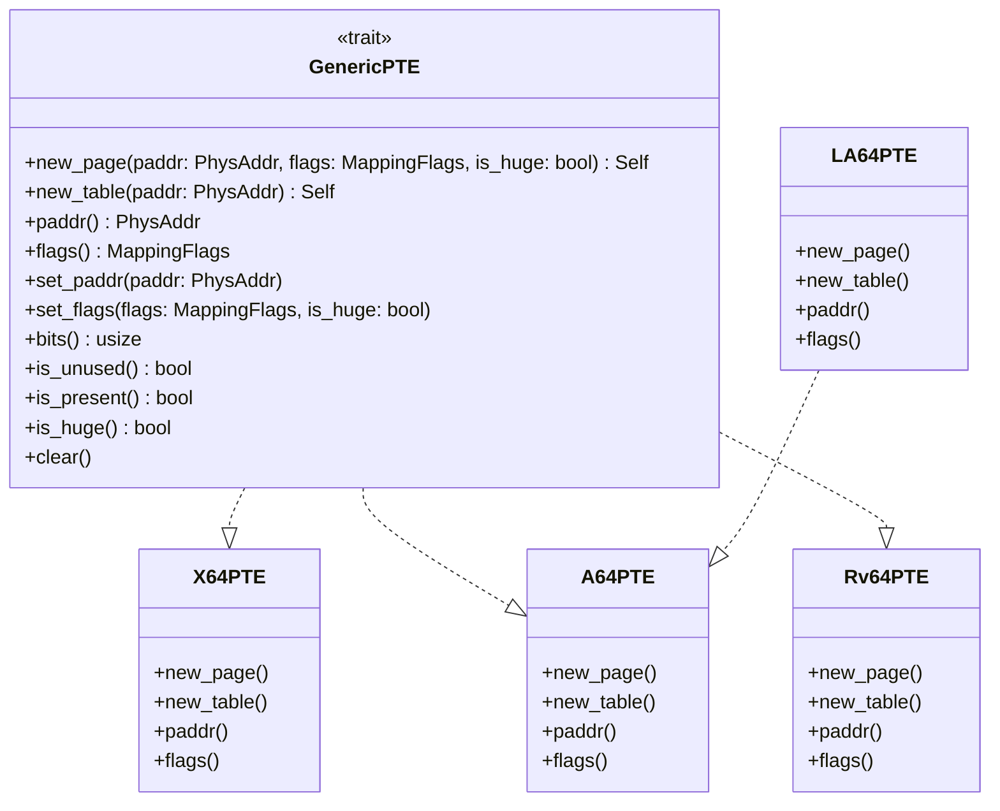
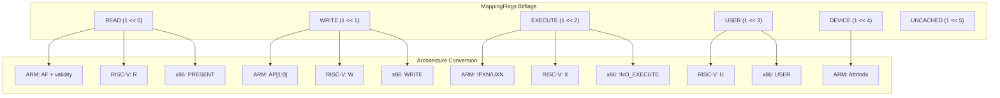
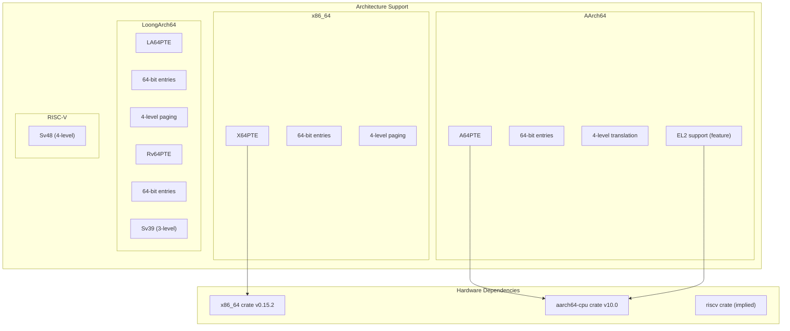
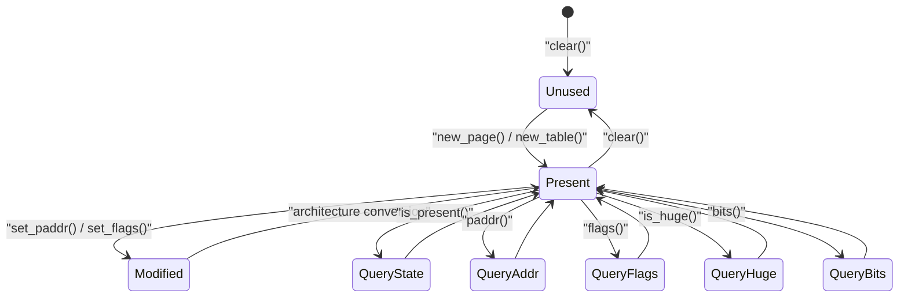

# page_table_entry Crate

> **Relevant source files**
> * [page_table_entry/Cargo.toml](https://github.com/arceos-org/page_table_multiarch/blob/85fb75ef/page_table_entry/Cargo.toml)
> * [page_table_entry/README.md](https://github.com/arceos-org/page_table_multiarch/blob/85fb75ef/page_table_entry/README.md)
> * [page_table_entry/src/lib.rs](https://github.com/arceos-org/page_table_multiarch/blob/85fb75ef/page_table_entry/src/lib.rs)

This document covers the `page_table_entry` crate, which provides low-level page table entry definitions and abstractions for multiple hardware architectures. This crate serves as the foundation layer that defines the `GenericPTE` trait and architecture-specific page table entry implementations.

For information about the high-level page table management abstractions that build upon this crate, see [page_table_multiarch Crate](/arceos-org/page_table_multiarch/2.1-page_table_multiarch-crate).

## Purpose and Core Functionality

The `page_table_entry` crate abstracts page table entry manipulation across different processor architectures through a unified trait-based interface. It provides architecture-specific implementations of page table entries while maintaining a common API for higher-level page table management code.

**Core Components:**

* `GenericPTE` trait defining unified page table entry operations
* `MappingFlags` bitflags for architecture-independent memory permissions
* Architecture-specific PTE implementations: `X64PTE`, `A64PTE`, `Rv64PTE`, `LA64PTE`

Sources: [page_table_entry/README.md(L7 - L18)&emsp;](https://github.com/arceos-org/page_table_multiarch/blob/85fb75ef/page_table_entry/README.md#L7-L18) [page_table_entry/src/lib.rs(L38 - L68)&emsp;](https://github.com/arceos-org/page_table_multiarch/blob/85fb75ef/page_table_entry/src/lib.rs#L38-L68)

## GenericPTE Trait Architecture

The `GenericPTE` trait provides the core abstraction that enables architecture-independent page table entry manipulation. All architecture-specific page table entry types implement this trait.

### GenericPTE Interface



### Key Methods

|Method|Purpose|Return Type|
| --- | --- | --- |
|new_page()|Create PTE for terminal page/block mapping|Self|
|new_table()|Create PTE pointing to next-level page table|Self|
|paddr()|Extract mapped physical address|PhysAddr|
|flags()|Get generic mapping flags|MappingFlags|
|set_paddr()|Modify mapped physical address|()|
|set_flags()|Update mapping permissions|()|
|bits()|Get raw PTE bits|usize|
|is_present()|Check if mapping is valid|bool|
|is_huge()|Check if PTE maps large page|bool|

Sources: [page_table_entry/src/lib.rs(L41 - L68)&emsp;](https://github.com/arceos-org/page_table_multiarch/blob/85fb75ef/page_table_entry/src/lib.rs#L41-L68)

## MappingFlags System

The `MappingFlags` bitflags provide architecture-independent representation of memory mapping permissions and attributes.



### Flag Definitions

|Flag|Bit Position|Purpose|
| --- | --- | --- |
|READ|0|Memory is readable|
|WRITE|1|Memory is writable|
|EXECUTE|2|Memory is executable|
|USER|3|User-mode accessible|
|DEVICE|4|Device memory type|
|UNCACHED|5|Uncached memory access|

Sources: [page_table_entry/src/lib.rs(L12 - L30)&emsp;](https://github.com/arceos-org/page_table_multiarch/blob/85fb75ef/page_table_entry/src/lib.rs#L12-L30)

## Architecture Implementation Matrix

The crate supports four major processor architectures through dedicated PTE implementations:



### Conditional Compilation

The crate uses target-specific conditional compilation to include only necessary dependencies:

|Target Architecture|Dependencies|Features|
| --- | --- | --- |
|x86_64|x86_64 = "0.15.2"|Standard x86_64 support|
|aarch64|aarch64-cpu = "10.0"|ARM64, optionalarm-el2|
|riscv32/riscv64|Architecture support built-in|Sv39/Sv48 modes|
|loongarch64|Built-in support|LA64 paging|
|doc|All dependencies|Documentation builds|

Sources: [page_table_entry/Cargo.toml(L22 - L27)&emsp;](https://github.com/arceos-org/page_table_multiarch/blob/85fb75ef/page_table_entry/Cargo.toml#L22-L27) [page_table_entry/Cargo.toml(L15 - L16)&emsp;](https://github.com/arceos-org/page_table_multiarch/blob/85fb75ef/page_table_entry/Cargo.toml#L15-L16)

## Usage Patterns

### Basic PTE Creation and Manipulation

The typical usage pattern involves creating PTEs through the `GenericPTE` trait methods:

```javascript
// Example from documentation
use memory_addr::PhysAddr;
use page_table_entry::{GenericPTE, MappingFlags, x86_64::X64PTE};

let paddr = PhysAddr::from(0x233000);
let pte = X64PTE::new_page(
    paddr,
    MappingFlags::READ | MappingFlags::WRITE,
    false, // not huge page
);
```

### PTE State Queries



Sources: [page_table_entry/README.md(L28 - L46)&emsp;](https://github.com/arceos-org/page_table_multiarch/blob/85fb75ef/page_table_entry/README.md#L28-L46) [page_table_entry/src/lib.rs(L41 - L68)&emsp;](https://github.com/arceos-org/page_table_multiarch/blob/85fb75ef/page_table_entry/src/lib.rs#L41-L68)

## Dependencies and Build Configuration

### Core Dependencies

|Dependency|Version|Purpose|
| --- | --- | --- |
|bitflags|2.6|MappingFlagsimplementation|
|memory_addr|0.3|PhysAddrtype for physical addresses|

### Architecture-Specific Dependencies

Architecture-specific crates are conditionally included based on compilation target:

* **x86_64**: Uses `x86_64` crate for hardware-specific page table flag definitions
* **AArch64**: Uses `aarch64-cpu` crate for ARM64 system register and memory attribute definitions
* **RISC-V**: Built-in support for RISC-V page table formats
* **LoongArch**: Built-in support for LoongArch64 page table formats

The `doc` configuration includes all architecture dependencies to enable complete documentation generation.

Sources: [page_table_entry/Cargo.toml(L18 - L29)&emsp;](https://github.com/arceos-org/page_table_multiarch/blob/85fb75ef/page_table_entry/Cargo.toml#L18-L29)