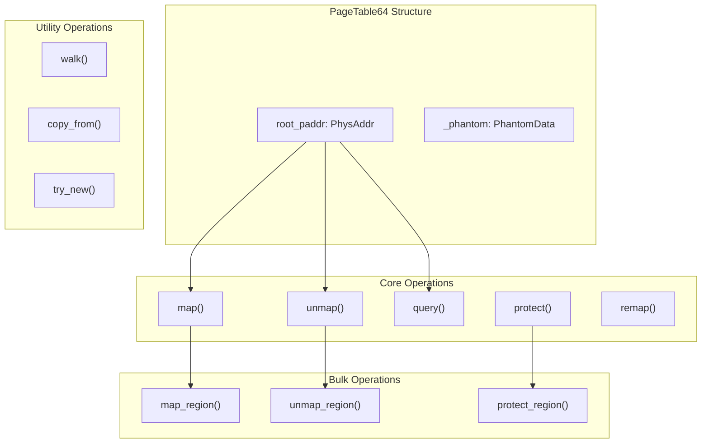
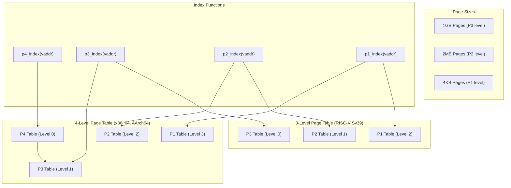
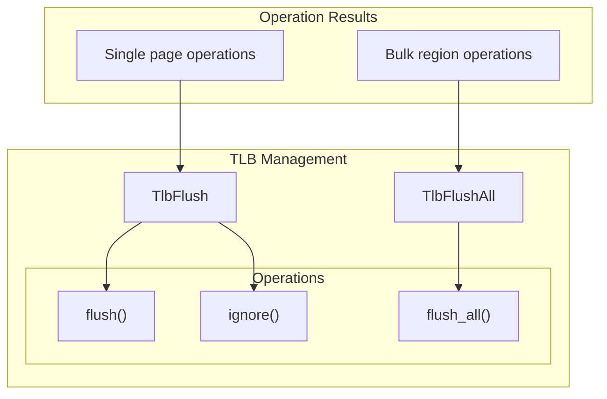

# page_table_multiarch Crate

> **Relevant source files**
> * [page_table_multiarch/Cargo.toml](https://github.com/arceos-org/page_table_multiarch/blob/85fb75ef/page_table_multiarch/Cargo.toml)
> * [page_table_multiarch/src/bits64.rs](https://github.com/arceos-org/page_table_multiarch/blob/85fb75ef/page_table_multiarch/src/bits64.rs)
> * [page_table_multiarch/src/lib.rs](https://github.com/arceos-org/page_table_multiarch/blob/85fb75ef/page_table_multiarch/src/lib.rs)

The `page_table_multiarch` crate provides high-level, architecture-independent page table management abstractions for 64-bit platforms. This crate implements the generic `PageTable64` structure and supporting traits that enable unified page table operations across multiple hardware architectures including x86_64, AArch64, RISC-V, and LoongArch64.

For low-level page table entry definitions and architecture-specific implementations, see [page_table_entry Crate](/arceos-org/page_table_multiarch/2.2-page_table_entry-crate). For detailed architecture-specific support information, see [Architecture Support](/arceos-org/page_table_multiarch/4-architecture-support).

## Core Components

The crate centers around three main abstractions that work together to provide architecture-independent page table management:

```

```

**Architecture Abstraction Through Generic Types**

Sources: [page_table_multiarch/src/bits64.rs(L28 - L31)&emsp;](https://github.com/arceos-org/page_table_multiarch/blob/85fb75ef/page_table_multiarch/src/bits64.rs#L28-L31) [page_table_multiarch/src/lib.rs(L40 - L92)&emsp;](https://github.com/arceos-org/page_table_multiarch/blob/85fb75ef/page_table_multiarch/src/lib.rs#L40-L92)

## PageTable64 Implementation

The `PageTable64` struct is the central component providing a unified interface for page table operations across all supported architectures:

|Component|Type Parameter|Purpose|
| --- | --- | --- |
|M|PagingMetaData|Architecture-specific constants and validation|
|PTE|GenericPTE|Page table entry manipulation|
|H|PagingHandler|OS-dependent memory management|



**Page Table Management Methods**

### Single Page Operations

The `PageTable64` provides methods for managing individual page mappings:

* **`map()`** - Maps a virtual page to a physical frame with specified size and flags [page_table_multiarch/src/bits64.rs(L59 - L72)&emsp;](https://github.com/arceos-org/page_table_multiarch/blob/85fb75ef/page_table_multiarch/src/bits64.rs#L59-L72)
* **`unmap()`** - Removes a mapping and returns the physical address [page_table_multiarch/src/bits64.rs(L116 - L125)&emsp;](https://github.com/arceos-org/page_table_multiarch/blob/85fb75ef/page_table_multiarch/src/bits64.rs#L116-L125)
* **`query()`** - Retrieves mapping information for a virtual address [page_table_multiarch/src/bits64.rs(L134 - L141)&emsp;](https://github.com/arceos-org/page_table_multiarch/blob/85fb75ef/page_table_multiarch/src/bits64.rs#L134-L141)
* **`protect()`** - Updates mapping flags without changing the physical address [page_table_multiarch/src/bits64.rs(L99 - L110)&emsp;](https://github.com/arceos-org/page_table_multiarch/blob/85fb75ef/page_table_multiarch/src/bits64.rs#L99-L110)
* **`remap()`** - Updates both physical address and flags [page_table_multiarch/src/bits64.rs(L81 - L91)&emsp;](https://github.com/arceos-org/page_table_multiarch/blob/85fb75ef/page_table_multiarch/src/bits64.rs#L81-L91)

### Bulk Region Operations

For efficient handling of large memory regions, bulk operations automatically detect and use huge pages when possible:

* **`map_region()`** - Maps contiguous virtual regions with automatic huge page detection [page_table_multiarch/src/bits64.rs(L157 - L217)&emsp;](https://github.com/arceos-org/page_table_multiarch/blob/85fb75ef/page_table_multiarch/src/bits64.rs#L157-L217)
* **`unmap_region()`** - Unmaps contiguous regions [page_table_multiarch/src/bits64.rs(L226 - L257)&emsp;](https://github.com/arceos-org/page_table_multiarch/blob/85fb75ef/page_table_multiarch/src/bits64.rs#L226-L257)
* **`protect_region()`** - Updates flags for entire regions [page_table_multiarch/src/bits64.rs(L266 - L299)&emsp;](https://github.com/arceos-org/page_table_multiarch/blob/85fb75ef/page_table_multiarch/src/bits64.rs#L266-L299)

Sources: [page_table_multiarch/src/bits64.rs(L33 - L347)&emsp;](https://github.com/arceos-org/page_table_multiarch/blob/85fb75ef/page_table_multiarch/src/bits64.rs#L33-L347)

## Architecture Abstraction System

The crate achieves architecture independence through a trait-based abstraction system:

```mermaid
flowchart TD
subgraph subGraph3["Entry Operations"]
    NEW_PAGE["new_page()"]
    NEW_TABLE["new_table()"]
    IS_PRESENT["is_present()"]
    IS_HUGE["is_huge()"]
    PADDR["paddr()"]
    FLAGS["flags()"]
end
subgraph subGraph2["OS Integration"]
    ALLOC["alloc_frame()"]
    DEALLOC["dealloc_frame()"]
    PHYS_TO_VIRT["phys_to_virt()"]
end
subgraph subGraph1["Architecture Constants"]
    LEVELS["LEVELS: usize"]
    PA_BITS["PA_MAX_BITS: usize"]
    VA_BITS["VA_MAX_BITS: usize"]
    VADDR_TYPE["VirtAddr: MemoryAddr"]
end
subgraph subGraph0["Trait System"]
    PMD_TRAIT["PagingMetaData trait"]
    PH_TRAIT["PagingHandler trait"]
    GPTE_TRAIT["GenericPTE trait"]
end

GPTE_TRAIT --> FLAGS
GPTE_TRAIT --> IS_HUGE
GPTE_TRAIT --> IS_PRESENT
GPTE_TRAIT --> NEW_PAGE
GPTE_TRAIT --> NEW_TABLE
GPTE_TRAIT --> PADDR
PH_TRAIT --> ALLOC
PH_TRAIT --> DEALLOC
PH_TRAIT --> PHYS_TO_VIRT
PMD_TRAIT --> LEVELS
PMD_TRAIT --> PA_BITS
PMD_TRAIT --> VADDR_TYPE
PMD_TRAIT --> VA_BITS
```



**Trait Responsibilities**

### PagingMetaData Trait

Defines architecture-specific constants and validation logic:

* **`LEVELS`** - Number of page table levels (3 or 4)
* **`PA_MAX_BITS`** / **`VA_MAX_BITS`** - Maximum address widths
* **`VirtAddr`** - Associated type for virtual addresses
* **`flush_tlb()`** - Architecture-specific TLB flushing

### PagingHandler Trait

Provides OS-dependent memory management operations:

* **`alloc_frame()`** - Allocates 4K physical frames
* **`dealloc_frame()`** - Deallocates physical frames
* **`phys_to_virt()`** - Converts physical to virtual addresses for direct access

Sources: [page_table_multiarch/src/lib.rs(L40 - L92)&emsp;](https://github.com/arceos-org/page_table_multiarch/blob/85fb75ef/page_table_multiarch/src/lib.rs#L40-L92)

## Page Table Navigation

The `PageTable64` implements multi-level page table navigation supporting both 3-level and 4-level configurations:



**Virtual Address Translation**

The implementation uses bit manipulation to extract table indices from virtual addresses:

* **P4 Index**: Bits 39-47 (4-level only) [page_table_multiarch/src/bits64.rs(L8 - L10)&emsp;](https://github.com/arceos-org/page_table_multiarch/blob/85fb75ef/page_table_multiarch/src/bits64.rs#L8-L10)
* **P3 Index**: Bits 30-38 [page_table_multiarch/src/bits64.rs(L12 - L14)&emsp;](https://github.com/arceos-org/page_table_multiarch/blob/85fb75ef/page_table_multiarch/src/bits64.rs#L12-L14)
* **P2 Index**: Bits 21-29 [page_table_multiarch/src/bits64.rs(L16 - L18)&emsp;](https://github.com/arceos-org/page_table_multiarch/blob/85fb75ef/page_table_multiarch/src/bits64.rs#L16-L18)
* **P1 Index**: Bits 12-20 [page_table_multiarch/src/bits64.rs(L20 - L22)&emsp;](https://github.com/arceos-org/page_table_multiarch/blob/85fb75ef/page_table_multiarch/src/bits64.rs#L20-L22)

Sources: [page_table_multiarch/src/bits64.rs(L8 - L22)&emsp;](https://github.com/arceos-org/page_table_multiarch/blob/85fb75ef/page_table_multiarch/src/bits64.rs#L8-L22) [page_table_multiarch/src/bits64.rs(L401 - L484)&emsp;](https://github.com/arceos-org/page_table_multiarch/blob/85fb75ef/page_table_multiarch/src/bits64.rs#L401-L484)

## Error Handling and TLB Management

The crate provides comprehensive error handling and TLB management:

|Error Type|Description|Usage|
| --- | --- | --- |
|NoMemory|Frame allocation failure|Memory exhaustion scenarios|
|NotAligned|Address alignment violation|Invalid page boundaries|
|NotMapped|Missing page table entry|Query/unmap operations|
|AlreadyMapped|Existing mapping conflict|Duplicate map operations|
|MappedToHugePage|Huge page access conflict|Table navigation errors|



**TLB Flush Types**

* **`TlbFlush<M>`** - Manages single page TLB invalidation [page_table_multiarch/src/lib.rs(L135 - L151)&emsp;](https://github.com/arceos-org/page_table_multiarch/blob/85fb75ef/page_table_multiarch/src/lib.rs#L135-L151)
* **`TlbFlushAll<M>`** - Manages complete TLB invalidation [page_table_multiarch/src/lib.rs(L157 - L172)&emsp;](https://github.com/arceos-org/page_table_multiarch/blob/85fb75ef/page_table_multiarch/src/lib.rs#L157-L172)

Sources: [page_table_multiarch/src/lib.rs(L21 - L38)&emsp;](https://github.com/arceos-org/page_table_multiarch/blob/85fb75ef/page_table_multiarch/src/lib.rs#L21-L38) [page_table_multiarch/src/lib.rs(L130 - L172)&emsp;](https://github.com/arceos-org/page_table_multiarch/blob/85fb75ef/page_table_multiarch/src/lib.rs#L130-L172)

## Dependencies and Integration

The crate integrates with the workspace through carefully managed dependencies:

```

```

**Conditional Compilation**

The build system includes architecture-specific dependencies only when targeting supported platforms or building documentation:

* **x86 dependency**: Included for `x86_64` targets and documentation builds [page_table_multiarch/Cargo.toml(L20 - L21)&emsp;](https://github.com/arceos-org/page_table_multiarch/blob/85fb75ef/page_table_multiarch/Cargo.toml#L20-L21)
* **riscv dependency**: Included for `riscv32`/`riscv64` targets and documentation builds [page_table_multiarch/Cargo.toml(L23 - L24)&emsp;](https://github.com/arceos-org/page_table_multiarch/blob/85fb75ef/page_table_multiarch/Cargo.toml#L23-L24)

Sources: [page_table_multiarch/Cargo.toml(L15 - L28)&emsp;](https://github.com/arceos-org/page_table_multiarch/blob/85fb75ef/page_table_multiarch/Cargo.toml#L15-L28) [page_table_multiarch/src/lib.rs(L15 - L19)&emsp;](https://github.com/arceos-org/page_table_multiarch/blob/85fb75ef/page_table_multiarch/src/lib.rs#L15-L19)