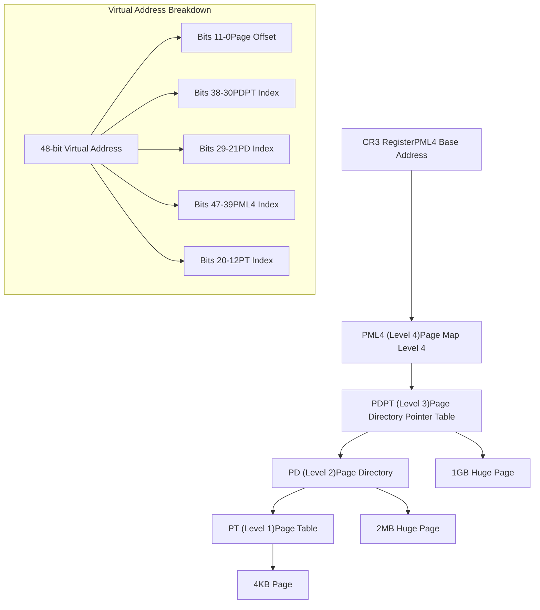
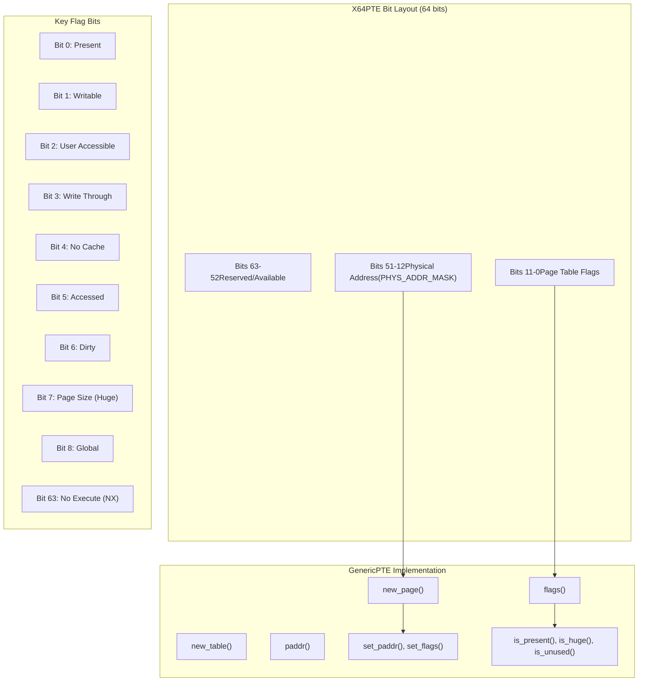
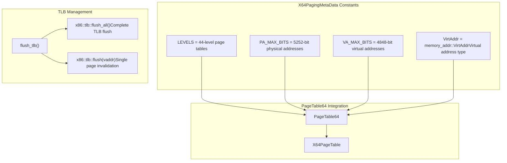
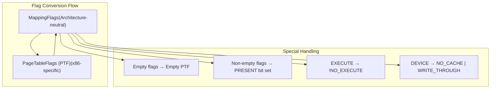
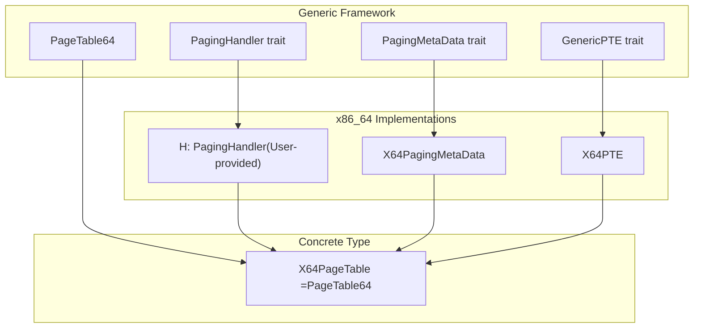

# x86_64 Support

> **Relevant source files**
> * [page_table_entry/src/arch/x86_64.rs](https://github.com/arceos-org/page_table_multiarch/blob/85fb75ef/page_table_entry/src/arch/x86_64.rs)
> * [page_table_multiarch/src/arch/x86_64.rs](https://github.com/arceos-org/page_table_multiarch/blob/85fb75ef/page_table_multiarch/src/arch/x86_64.rs)

This document covers the implementation of x86_64 architecture support in the page_table_multiarch library. It details how x86_64-specific page table entries, paging metadata, and memory management features are integrated with the generic multi-architecture abstraction layer.

For information about other supported architectures, see [AArch64 Support](/arceos-org/page_table_multiarch/4.2-aarch64-support), [RISC-V Support](/arceos-org/page_table_multiarch/4.3-risc-v-support), and [LoongArch64 Support](/arceos-org/page_table_multiarch/4.4-loongarch64-support). For details about the overall architecture abstraction system, see [Generic Traits System](/arceos-org/page_table_multiarch/3.2-generic-traits-system).

## x86_64 Architecture Overview

The x86_64 implementation supports Intel and AMD 64-bit processors using 4-level page translation with the following characteristics:

|Property|Value|Description|
| --- | --- | --- |
|Paging Levels|4|PML4, PDPT, PD, PT|
|Physical Address Space|52 bits|Up to 4 PB of physical memory|
|Virtual Address Space|48 bits|256 TB of virtual memory|
|Page Sizes|4KB, 2MB, 1GB|Standard and huge page support|

### x86_64 Paging Hierarchy

Sources: [page_table_multiarch/src/arch/x86_64.rs(L10 - L12)&emsp;](https://github.com/arceos-org/page_table_multiarch/blob/85fb75ef/page_table_multiarch/src/arch/x86_64.rs#L10-L12)

## Page Table Entry Implementation

The `X64PTE` struct implements x86_64-specific page table entries with a 64-bit representation that follows Intel's page table entry format.

### X64PTE Structure and Bit Layout

The `X64PTE` struct uses a transparent representation over a `u64` value and implements the `GenericPTE` trait to provide architecture-neutral page table entry operations.

Sources: [page_table_entry/src/arch/x86_64.rs(L54 - L66)&emsp;](https://github.com/arceos-org/page_table_multiarch/blob/85fb75ef/page_table_entry/src/arch/x86_64.rs#L54-L66) [page_table_entry/src/arch/x86_64.rs(L68 - L112)&emsp;](https://github.com/arceos-org/page_table_multiarch/blob/85fb75ef/page_table_entry/src/arch/x86_64.rs#L68-L112)

### GenericPTE Trait Implementation

The `X64PTE` implements all required methods of the `GenericPTE` trait:

|Method|Purpose|Implementation Detail|
| --- | --- | --- |
|new_page()|Create page mapping entry|Sets physical address and convertsMappingFlagstoPTF|
|new_table()|Create page table entry|SetsPRESENT,WRITABLE,USER_ACCESSIBLEflags|
|paddr()|Extract physical address|Masks bits 12-51 usingPHYS_ADDR_MASK|
|flags()|Get mapping flags|ConvertsPTFflags to genericMappingFlags|
|is_present()|Check if entry is valid|TestsPTF::PRESENTbit|
|is_huge()|Check if huge page|TestsPTF::HUGE_PAGEbit|

Sources: [page_table_entry/src/arch/x86_64.rs(L69 - L95)&emsp;](https://github.com/arceos-org/page_table_multiarch/blob/85fb75ef/page_table_entry/src/arch/x86_64.rs#L69-L95) [page_table_entry/src/arch/x86_64.rs(L97 - L112)&emsp;](https://github.com/arceos-org/page_table_multiarch/blob/85fb75ef/page_table_entry/src/arch/x86_64.rs#L97-L112)

## Paging Metadata Implementation

The `X64PagingMetaData` struct defines x86_64-specific constants and operations required by the `PagingMetaData` trait.

### Architecture Constants and TLB Management

The TLB flushing implementation uses the `x86` crate to perform architecture-specific translation lookaside buffer invalidation operations safely.

Sources: [page_table_multiarch/src/arch/x86_64.rs(L7 - L25)&emsp;](https://github.com/arceos-org/page_table_multiarch/blob/85fb75ef/page_table_multiarch/src/arch/x86_64.rs#L7-L25) [page_table_multiarch/src/arch/x86_64.rs(L28)&emsp;](https://github.com/arceos-org/page_table_multiarch/blob/85fb75ef/page_table_multiarch/src/arch/x86_64.rs#L28-L28)

## Flag Conversion System

The x86_64 implementation provides bidirectional conversion between generic `MappingFlags` and x86-specific `PageTableFlags` (PTF).

### MappingFlags to PTF Conversion

|Generic Flag|x86_64 PTF|Notes|
| --- | --- | --- |
|READ|PRESENT|Always set for readable pages|
|WRITE|WRITABLE|Write permission|
|EXECUTE|!NO_EXECUTE|Execute permission (inverted logic)|
|USER|USER_ACCESSIBLE|User-mode access|
|UNCACHED|NO_CACHE|Disable caching|
|DEVICE|NO_CACHE \| WRITE_THROUGH|Device memory attributes|

### PTF to MappingFlags Conversion

The reverse conversion extracts generic flags from x86-specific page table flags, handling the inverted execute permission logic and presence requirements.

Sources: [page_table_entry/src/arch/x86_64.rs(L10 - L30)&emsp;](https://github.com/arceos-org/page_table_multiarch/blob/85fb75ef/page_table_entry/src/arch/x86_64.rs#L10-L30) [page_table_entry/src/arch/x86_64.rs(L32 - L52)&emsp;](https://github.com/arceos-org/page_table_multiarch/blob/85fb75ef/page_table_entry/src/arch/x86_64.rs#L32-L52)

## Integration with Generic System

The x86_64 support integrates with the generic page table system through the `X64PageTable` type alias, which specializes the generic `PageTable64` struct with x86_64-specific types.

### Type Composition

The `X64PageTable<H>` provides a complete x86_64 page table implementation that maintains all the functionality of the generic `PageTable64` while using x86_64-specific page table entries and metadata.

Sources: [page_table_multiarch/src/arch/x86_64.rs(L28)&emsp;](https://github.com/arceos-org/page_table_multiarch/blob/85fb75ef/page_table_multiarch/src/arch/x86_64.rs#L28-L28)