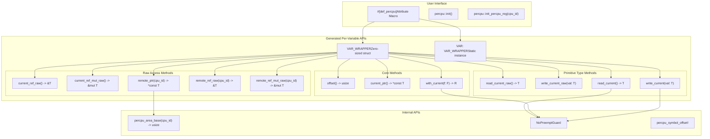
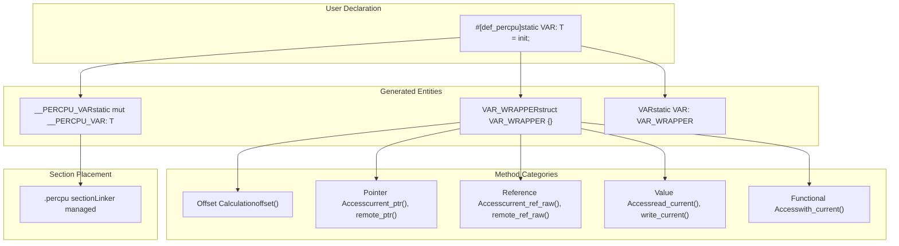
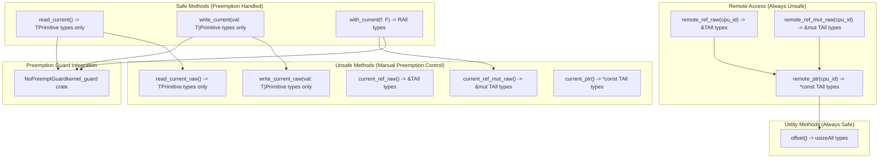

# API Reference

> **Relevant source files**
> * [README.md](https://github.com/arceos-org/percpu/blob/89c8a54c/README.md)
> * [percpu/src/lib.rs](https://github.com/arceos-org/percpu/blob/89c8a54c/percpu/src/lib.rs)
> * [percpu_macros/src/lib.rs](https://github.com/arceos-org/percpu/blob/89c8a54c/percpu_macros/src/lib.rs)

This document provides a comprehensive reference for all public APIs, macros, and functions in the percpu crate ecosystem. It covers the main user-facing interfaces for defining and accessing per-CPU data structures.

For detailed information about the `def_percpu` macro syntax and usage patterns, see [def_percpu Macro](/arceos-org/percpu/4.1-def_percpu-macro). For runtime initialization and management functions, see [Runtime Functions](/arceos-org/percpu/4.2-runtime-functions). For guidance on safe usage and preemption handling, see [Safety and Preemption](/arceos-org/percpu/4.3-safety-and-preemption).

## API Overview

The percpu crate provides a declarative interface for per-CPU data management through the `def_percpu` attribute macro and a set of runtime functions for system initialization.

### Complete API Surface

**Sources:** [percpu_macros/src/lib.rs(L66 - L252)&emsp;](https://github.com/arceos-org/percpu/blob/89c8a54c/percpu_macros/src/lib.rs#L66-L252) [percpu/src/lib.rs(L5 - L17)&emsp;](https://github.com/arceos-org/percpu/blob/89c8a54c/percpu/src/lib.rs#L5-L17) [README.md(L39 - L52)&emsp;](https://github.com/arceos-org/percpu/blob/89c8a54c/README.md#L39-L52)

## Core API Components

### Macro Definition Interface

The primary user interface is the `def_percpu` attribute macro that transforms static variable definitions into per-CPU data structures.

|Component|Type|Purpose|
| --- | --- | --- |
|#[def_percpu]|Attribute Macro|Transforms static variables into per-CPU data|
|percpu::init()|Function|Initializes per-CPU data areas|
|percpu::init_percpu_reg(cpu_id)|Function|Sets up per-CPU register for given CPU|

**Sources:** [percpu_macros/src/lib.rs(L66 - L78)&emsp;](https://github.com/arceos-org/percpu/blob/89c8a54c/percpu_macros/src/lib.rs#L66-L78) [percpu/src/lib.rs(L11)&emsp;](https://github.com/arceos-org/percpu/blob/89c8a54c/percpu/src/lib.rs#L11-L11) [README.md(L44 - L46)&emsp;](https://github.com/arceos-org/percpu/blob/89c8a54c/README.md#L44-L46)

### Generated Code Structure

For each variable defined with `#[def_percpu]`, the macro generates multiple code entities that work together to provide per-CPU access.

**Sources:** [percpu_macros/src/lib.rs(L88 - L159)&emsp;](https://github.com/arceos-org/percpu/blob/89c8a54c/percpu_macros/src/lib.rs#L88-L159) [percpu_macros/src/lib.rs(L33 - L51)&emsp;](https://github.com/arceos-org/percpu/blob/89c8a54c/percpu_macros/src/lib.rs#L33-L51)

## Method Categories and Safety

The generated wrapper struct provides methods organized into distinct categories based on their safety requirements and access patterns.

### Method Safety Hierarchy

**Sources:** [percpu_macros/src/lib.rs(L101 - L145)&emsp;](https://github.com/arceos-org/percpu/blob/89c8a54c/percpu_macros/src/lib.rs#L101-L145) [percpu_macros/src/lib.rs(L161 - L248)&emsp;](https://github.com/arceos-org/percpu/blob/89c8a54c/percpu_macros/src/lib.rs#L161-L248) [percpu/src/lib.rs(L14 - L17)&emsp;](https://github.com/arceos-org/percpu/blob/89c8a54c/percpu/src/lib.rs#L14-L17)

## Type-Specific API Variations

The generated API surface varies depending on the type of the per-CPU variable, with additional optimized methods for primitive integer types.

### API Method Availability Matrix

|Method Category|All Types|Primitive Integer Types Only|
| --- | --- | --- |
|offset()|✓|✓|
|current_ptr()|✓|✓|
|current_ref_raw()|✓|✓|
|current_ref_mut_raw()|✓|✓|
|with_current()|✓|✓|
|remote_ptr()|✓|✓|
|remote_ref_raw()|✓|✓|
|remote_ref_mut_raw()|✓|✓|
|read_current_raw()|✗|✓|
|write_current_raw()|✗|✓|
|read_current()|✗|✓|
|write_current()|✗|✓|

**Primitive integer types:** `bool`, `u8`, `u16`, `u32`, `u64`, `usize`

**Sources:** [percpu_macros/src/lib.rs(L91 - L93)&emsp;](https://github.com/arceos-org/percpu/blob/89c8a54c/percpu_macros/src/lib.rs#L91-L93) [percpu_macros/src/lib.rs(L100 - L145)&emsp;](https://github.com/arceos-org/percpu/blob/89c8a54c/percpu_macros/src/lib.rs#L100-L145)

## Feature-Dependent Behavior

The API behavior changes based on enabled Cargo features, affecting both code generation and runtime behavior.

### Feature Impact on API

|Feature|Impact on Generated Code|Runtime Behavior|
| --- | --- | --- |
|sp-naive|Uses global variables instead of per-CPU areas|No register setup required|
|preempt|AddsNoPreemptGuardto safe methods|Preemption disabled during access|
|arm-el2|Changes register selection for AArch64|UsesTPIDR_EL2instead ofTPIDR_EL1|

**Sources:** [percpu_macros/src/lib.rs(L94 - L98)&emsp;](https://github.com/arceos-org/percpu/blob/89c8a54c/percpu_macros/src/lib.rs#L94-L98) [percpu/src/lib.rs(L7 - L8)&emsp;](https://github.com/arceos-org/percpu/blob/89c8a54c/percpu/src/lib.rs#L7-L8) [README.md(L69 - L79)&emsp;](https://github.com/arceos-org/percpu/blob/89c8a54c/README.md#L69-L79)