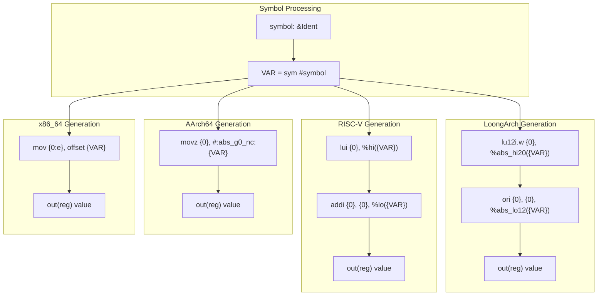
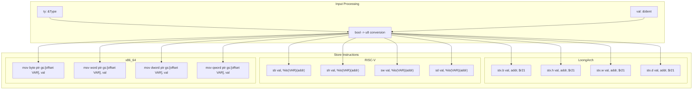

# Architecture-Specific Code Generation

> **Relevant source files**
> * [percpu_macros/src/arch.rs](https://github.com/arceos-org/percpu/blob/89c8a54c/percpu_macros/src/arch.rs)
> * [percpu_macros/src/lib.rs](https://github.com/arceos-org/percpu/blob/89c8a54c/percpu_macros/src/lib.rs)
> * [percpu_macros/src/naive.rs](https://github.com/arceos-org/percpu/blob/89c8a54c/percpu_macros/src/naive.rs)

This document covers the architecture-specific assembly code generation system used by the `percpu_macros` crate. The code generation pipeline transforms high-level per-CPU variable access patterns into optimized assembly instructions tailored for each supported CPU architecture.

For information about the macro expansion pipeline and user-facing API, see [Code Generation Pipeline](/arceos-org/percpu/3.3-code-generation-pipeline). For details about the naive single-CPU implementation, see [Naive Implementation](/arceos-org/percpu/5.2-naive-implementation).

## Overview

The architecture-specific code generation system consists of four main code generation functions that produce inline assembly blocks optimized for each target architecture. These functions are called during macro expansion to generate efficient per-CPU data access patterns.

```

```

Sources: [percpu_macros/src/arch.rs(L16 - L50)&emsp;](https://github.com/arceos-org/percpu/blob/89c8a54c/percpu_macros/src/arch.rs#L16-L50) [percpu_macros/src/arch.rs(L54 - L88)&emsp;](https://github.com/arceos-org/percpu/blob/89c8a54c/percpu_macros/src/arch.rs#L54-L88) [percpu_macros/src/arch.rs(L94 - L181)&emsp;](https://github.com/arceos-org/percpu/blob/89c8a54c/percpu_macros/src/arch.rs#L94-L181) [percpu_macros/src/arch.rs(L187 - L263)&emsp;](https://github.com/arceos-org/percpu/blob/89c8a54c/percpu_macros/src/arch.rs#L187-L263)

## Offset Calculation Generation

The `gen_offset` function generates architecture-specific assembly code to calculate the offset of a per-CPU variable within the `.percpu` section. This offset is used for both local and remote CPU access patterns.

|Architecture|Instruction Pattern|Offset Limit|Register Usage|
| --- | --- | --- | --- |
|x86_64|mov {0:e}, offset VAR|≤ 0xffff_ffff|32-bit register|
|AArch64|movz {0}, #:abs_g0_nc:VAR|≤ 0xffff|64-bit register|
|RISC-V|lui {0}, %hi(VAR)+addi {0}, {0}, %lo(VAR)|≤ 0xffff_ffff|64-bit register|
|LoongArch64|lu12i.w {0}, %abs_hi20(VAR)+ori {0}, {0}, %abs_lo12(VAR)|≤ 0xffff_ffff|64-bit register|



Sources: [percpu_macros/src/arch.rs(L16 - L50)&emsp;](https://github.com/arceos-org/percpu/blob/89c8a54c/percpu_macros/src/arch.rs#L16-L50)

## Current CPU Pointer Generation

The `gen_current_ptr` function generates code to obtain a pointer to a per-CPU variable on the currently executing CPU. Each architecture uses a different approach based on available per-CPU base pointer registers.

### Architecture-Specific Register Usage

```

```

The x86_64 architecture uses a special approach where the per-CPU base address is stored in the GS segment at a fixed offset (`__PERCPU_SELF_PTR`), allowing direct addressing with a single instruction that combines base retrieval and offset addition.

Sources: [percpu_macros/src/arch.rs(L54 - L88)&emsp;](https://github.com/arceos-org/percpu/blob/89c8a54c/percpu_macros/src/arch.rs#L54-L88) [percpu_macros/src/arch.rs(L55 - L62)&emsp;](https://github.com/arceos-org/percpu/blob/89c8a54c/percpu_macros/src/arch.rs#L55-L62)

## Optimized Read Operations

The `gen_read_current_raw` function generates type-specific optimized read operations for primitive integer types. This avoids the overhead of pointer dereferencing for simple data types.

### Type-Specific Assembly Generation

|Type|x86_64 Instruction|RISC-V Instruction|LoongArch Instruction|
| --- | --- | --- | --- |
|bool,u8|mov byte ptr gs:[offset VAR]|lbu|ldx.bu|
|u16|mov word ptr gs:[offset VAR]|lhu|ldx.hu|
|u32|mov dword ptr gs:[offset VAR]|lwu|ldx.wu|
|u64,usize|mov qword ptr gs:[offset VAR]|ld|ldx.d|

```

```

The boolean type receives special handling by reading as `u8` and converting the result to boolean through a `!= 0` comparison.

Sources: [percpu_macros/src/arch.rs(L94 - L181)&emsp;](https://github.com/arceos-org/percpu/blob/89c8a54c/percpu_macros/src/arch.rs#L94-L181) [percpu_macros/src/arch.rs(L96 - L102)&emsp;](https://github.com/arceos-org/percpu/blob/89c8a54c/percpu_macros/src/arch.rs#L96-L102) [percpu_macros/src/arch.rs(L114 - L129)&emsp;](https://github.com/arceos-org/percpu/blob/89c8a54c/percpu_macros/src/arch.rs#L114-L129) [percpu_macros/src/arch.rs(L131 - L150)&emsp;](https://github.com/arceos-org/percpu/blob/89c8a54c/percpu_macros/src/arch.rs#L131-L150)

## Optimized Write Operations

The `gen_write_current_raw` function generates type-specific optimized write operations that directly store values to per-CPU variables without intermediate pointer operations.

### Write Instruction Mapping



Sources: [percpu_macros/src/arch.rs(L187 - L263)&emsp;](https://github.com/arceos-org/percpu/blob/89c8a54c/percpu_macros/src/arch.rs#L187-L263) [percpu_macros/src/arch.rs(L195 - L211)&emsp;](https://github.com/arceos-org/percpu/blob/89c8a54c/percpu_macros/src/arch.rs#L195-L211) [percpu_macros/src/arch.rs(L214 - L230)&emsp;](https://github.com/arceos-org/percpu/blob/89c8a54c/percpu_macros/src/arch.rs#L214-L230) [percpu_macros/src/arch.rs(L232 - L251)&emsp;](https://github.com/arceos-org/percpu/blob/89c8a54c/percpu_macros/src/arch.rs#L232-L251)

## Platform Compatibility Layer

The code generation system includes a compatibility layer for platforms that don't support inline assembly or per-CPU mechanisms. The `macos_unimplemented` function wraps generated assembly with conditional compilation directives.

|Platform|Behavior|Fallback|
| --- | --- | --- |
|Non-macOS|Full assembly implementation|N/A|
|macOS|Compile-time unimplemented panic|Pointer-based access|
|Unsupported architectures|Fallback to pointer dereferencing|*self.current_ptr()|

```

```

Sources: [percpu_macros/src/arch.rs(L4 - L13)&emsp;](https://github.com/arceos-org/percpu/blob/89c8a54c/percpu_macros/src/arch.rs#L4-L13) [percpu_macros/src/arch.rs(L64)&emsp;](https://github.com/arceos-org/percpu/blob/89c8a54c/percpu_macros/src/arch.rs#L64-L64) [percpu_macros/src/arch.rs(L171)&emsp;](https://github.com/arceos-org/percpu/blob/89c8a54c/percpu_macros/src/arch.rs#L171-L171) [percpu_macros/src/arch.rs(L253)&emsp;](https://github.com/arceos-org/percpu/blob/89c8a54c/percpu_macros/src/arch.rs#L253-L253)

## Integration with Macro System

The architecture-specific code generation functions are called from the main `def_percpu` macro implementation, which determines whether to generate optimized assembly based on the variable type and enabled features.

```

```

Sources: [percpu_macros/src/lib.rs(L59 - L60)&emsp;](https://github.com/arceos-org/percpu/blob/89c8a54c/percpu_macros/src/lib.rs#L59-L60) [percpu_macros/src/lib.rs(L92)&emsp;](https://github.com/arceos-org/percpu/blob/89c8a54c/percpu_macros/src/lib.rs#L92-L92) [percpu_macros/src/lib.rs(L101 - L105)&emsp;](https://github.com/arceos-org/percpu/blob/89c8a54c/percpu_macros/src/lib.rs#L101-L105) [percpu_macros/src/lib.rs(L147 - L148)&emsp;](https://github.com/arceos-org/percpu/blob/89c8a54c/percpu_macros/src/lib.rs#L147-L148)