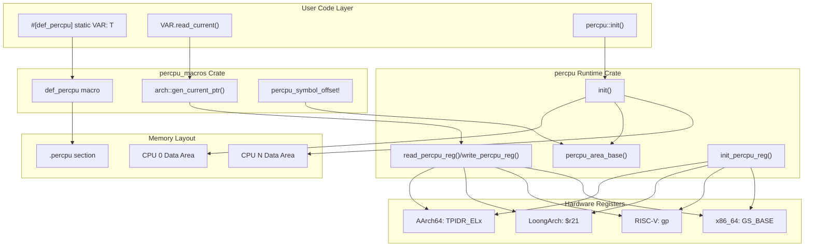
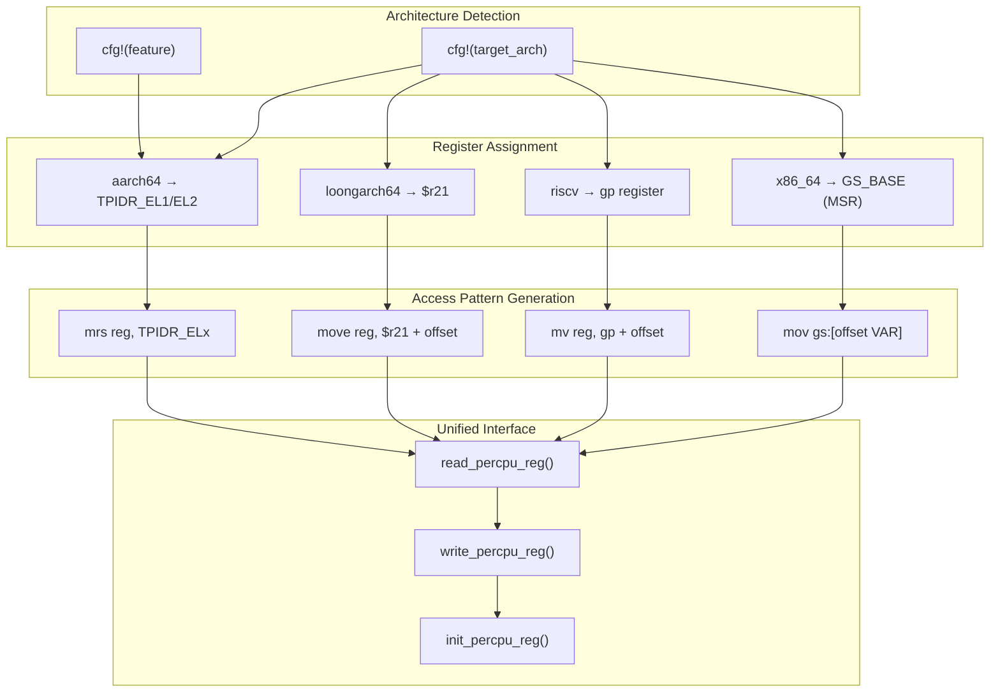
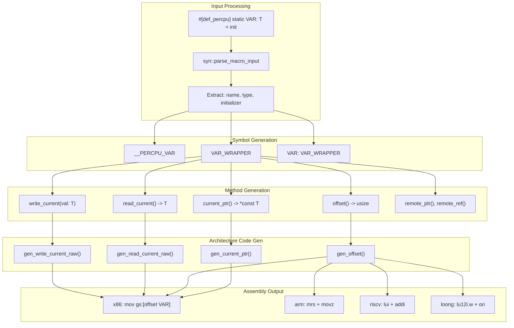

# Architecture and Design

> **Relevant source files**
> * [README.md](https://github.com/arceos-org/percpu/blob/89c8a54c/README.md)
> * [percpu/src/imp.rs](https://github.com/arceos-org/percpu/blob/89c8a54c/percpu/src/imp.rs)
> * [percpu_macros/src/arch.rs](https://github.com/arceos-org/percpu/blob/89c8a54c/percpu_macros/src/arch.rs)

This document provides a comprehensive overview of the percpu crate's system architecture, including memory layout strategies, cross-platform abstraction mechanisms, and the compile-time code generation pipeline. It focuses on the core design principles that enable efficient per-CPU data management across multiple architectures while maintaining a unified programming interface.

For implementation-specific details of individual architectures, see [Architecture-Specific Code Generation](/arceos-org/percpu/5.1-architecture-specific-code-generation). For basic usage patterns and examples, see [Getting Started](/arceos-org/percpu/2-getting-started).

## System Architecture Overview

The percpu system is built around a dual-crate architecture that separates compile-time code generation from runtime memory management. This design enables both high-performance per-CPU data access and flexible cross-platform support.

### Core Architecture



**Sources:** [README.md(L9 - L17)&emsp;](https://github.com/arceos-org/percpu/blob/89c8a54c/README.md#L9-L17) [percpu/src/imp.rs(L1 - L179)&emsp;](https://github.com/arceos-org/percpu/blob/89c8a54c/percpu/src/imp.rs#L1-L179) [percpu_macros/src/arch.rs(L1 - L264)&emsp;](https://github.com/arceos-org/percpu/blob/89c8a54c/percpu_macros/src/arch.rs#L1-L264)

### Component Responsibilities

|Component|Primary Responsibility|Key Functions|
| --- | --- | --- |
|percpu_macros|Compile-time code generation|def_percpu,gen_current_ptr,gen_read_current_raw|
|percpuruntime|Memory management and register access|init,percpu_area_base,read_percpu_reg|
|Linker integration|Memory layout definition|_percpu_start,_percpu_end,.percpusection|
|Architecture abstraction|Platform-specific register handling|write_percpu_reg,init_percpu_reg|

**Sources:** [percpu/src/imp.rs(L46 - L86)&emsp;](https://github.com/arceos-org/percpu/blob/89c8a54c/percpu/src/imp.rs#L46-L86) [percpu_macros/src/arch.rs(L54 - L88)&emsp;](https://github.com/arceos-org/percpu/blob/89c8a54c/percpu_macros/src/arch.rs#L54-L88)

## Memory Layout and Initialization Architecture

The percpu system implements a template-based memory layout where a single `.percpu` section in the binary serves as a template that gets replicated for each CPU at runtime.

### Memory Organization

```mermaid
flowchart TD
subgraph subGraph5["Initialization Process"]
    INIT_START["init()"]
    SIZE_CALC["percpu_area_size()"]
    NUM_CALC["percpu_area_num()"]
    COPY_LOOP["copy_nonoverlapping loop"]
end
subgraph subGraph4["Runtime Memory Areas"]
    BASE_CALC["percpu_area_base(cpu_id)"]
    subgraph subGraph3["CPU N Area"]
        CPUN_BASE["Base: _percpu_start + N * align_up_64(size)"]
        CPUN_VAR1["Variable 1 (copy)"]
        CPUN_VAR2["Variable 2 (copy)"]
    end
    subgraph subGraph2["CPU 1 Area"]
        CPU1_BASE["Base: _percpu_start + align_up_64(size)"]
        CPU1_VAR1["Variable 1 (copy)"]
        CPU1_VAR2["Variable 2 (copy)"]
    end
    subgraph subGraph1["CPU 0 Area"]
        CPU0_BASE["Base: _percpu_start"]
        CPU0_VAR1["Variable 1"]
        CPU0_VAR2["Variable 2"]
    end
end
subgraph subGraph0["Binary Layout"]
    PERCPU_TEMPLATE[".percpu Section Template"]
    LOAD_START["_percpu_load_start"]
    LOAD_END["_percpu_load_end"]
end

BASE_CALC --> CPU0_BASE
BASE_CALC --> CPU1_BASE
BASE_CALC --> CPUN_BASE
COPY_LOOP --> CPU1_VAR1
COPY_LOOP --> CPU1_VAR2
COPY_LOOP --> CPUN_VAR1
COPY_LOOP --> CPUN_VAR2
INIT_START --> COPY_LOOP
INIT_START --> NUM_CALC
INIT_START --> SIZE_CALC
PERCPU_TEMPLATE --> CPU0_VAR1
PERCPU_TEMPLATE --> CPU0_VAR2
```



**Sources:** [percpu/src/imp.rs(L46 - L86)&emsp;](https://github.com/arceos-org/percpu/blob/89c8a54c/percpu/src/imp.rs#L46-L86) [percpu/src/imp.rs(L21 - L44)&emsp;](https://github.com/arceos-org/percpu/blob/89c8a54c/percpu/src/imp.rs#L21-L44) [README.md(L54 - L67)&emsp;](https://github.com/arceos-org/percpu/blob/89c8a54c/README.md#L54-L67)

### Initialization Sequence

The initialization process follows a specific sequence to set up per-CPU memory areas:

1. **Size Calculation**: The `percpu_area_size()` function calculates the template size using linker symbols [percpu/src/imp.rs(L25 - L30)&emsp;](https://github.com/arceos-org/percpu/blob/89c8a54c/percpu/src/imp.rs#L25-L30)
2. **Area Allocation**: `percpu_area_num()` determines how many CPU areas can fit in the reserved space [percpu/src/imp.rs(L21 - L23)&emsp;](https://github.com/arceos-org/percpu/blob/89c8a54c/percpu/src/imp.rs#L21-L23)
3. **Template Copying**: The `init()` function copies the template data to each CPU's area [percpu/src/imp.rs(L76 - L84)&emsp;](https://github.com/arceos-org/percpu/blob/89c8a54c/percpu/src/imp.rs#L76-L84)
4. **Alignment**: Each area is aligned to 64-byte boundaries using `align_up_64()` [percpu/src/imp.rs(L5 - L8)&emsp;](https://github.com/arceos-org/percpu/blob/89c8a54c/percpu/src/imp.rs#L5-L8)

**Sources:** [percpu/src/imp.rs(L46 - L86)&emsp;](https://github.com/arceos-org/percpu/blob/89c8a54c/percpu/src/imp.rs#L46-L86)

## Cross-Platform Register Abstraction

The system abstracts different CPU architectures' per-CPU register mechanisms through a unified interface while generating architecture-specific assembly code.

### Register Mapping Strategy



**Sources:** [percpu/src/imp.rs(L91 - L168)&emsp;](https://github.com/arceos-org/percpu/blob/89c8a54c/percpu/src/imp.rs#L91-L168) [percpu_macros/src/arch.rs(L54 - L88)&emsp;](https://github.com/arceos-org/percpu/blob/89c8a54c/percpu_macros/src/arch.rs#L54-L88)

### Platform-Specific Implementation Details

|Architecture|Register|Assembly Pattern|Special Considerations|
| --- | --- | --- | --- |
|x86_64|GS_BASE|mov gs:[offset VAR]|MSR access,SELF_PTRindirection|
|AArch64|TPIDR_EL1/EL2|mrs reg, TPIDR_ELx|EL1/EL2 mode detection viaarm-el2feature|
|RISC-V|gp|mv reg, gp|Usesgpinstead oftpregister|
|LoongArch|$r21|move reg, $r21|Direct register access|

**Sources:** [README.md(L19 - L36)&emsp;](https://github.com/arceos-org/percpu/blob/89c8a54c/README.md#L19-L36) [percpu/src/imp.rs(L94 - L156)&emsp;](https://github.com/arceos-org/percpu/blob/89c8a54c/percpu/src/imp.rs#L94-L156)

## Code Generation Pipeline Architecture

The macro expansion system transforms high-level per-CPU variable definitions into optimized, architecture-specific access code through a multi-stage pipeline.

### Macro Expansion Workflow



**Sources:** [percpu_macros/src/arch.rs(L15 - L50)&emsp;](https://github.com/arceos-org/percpu/blob/89c8a54c/percpu_macros/src/arch.rs#L15-L50) [percpu_macros/src/arch.rs(L90 - L181)&emsp;](https://github.com/arceos-org/percpu/blob/89c8a54c/percpu_macros/src/arch.rs#L90-L181) [percpu_macros/src/arch.rs(L183 - L263)&emsp;](https://github.com/arceos-org/percpu/blob/89c8a54c/percpu_macros/src/arch.rs#L183-L263)

### Generated Code Structure

For each `#[def_percpu]` declaration, the macro generates a complete wrapper structure:

```typescript
// Generated inner symbol (placed in .percpu section)
#[link_section = ".percpu"]
static __PERCPU_VAR: T = init;

// Generated wrapper type with access methods
struct VAR_WRAPPER;

impl VAR_WRAPPER {
    fn offset(&self) -> usize { /* architecture-specific assembly */ }
    fn current_ptr(&self) -> *const T { /* architecture-specific assembly */ }
    fn read_current(&self) -> T { /* optimized direct access */ }
    fn write_current(&self, val: T) { /* optimized direct access */ }
    // ... additional methods
}

// Public interface
static VAR: VAR_WRAPPER = VAR_WRAPPER;
```

**Sources:** [percpu_macros/src/arch.rs(L54 - L88)&emsp;](https://github.com/arceos-org/percpu/blob/89c8a54c/percpu_macros/src/arch.rs#L54-L88) [percpu_macros/src/arch.rs(L90 - L181)&emsp;](https://github.com/arceos-org/percpu/blob/89c8a54c/percpu_macros/src/arch.rs#L90-L181)

### Optimization Strategies

The code generation pipeline implements several optimization strategies:

1. **Direct Assembly Generation**: For primitive types, direct assembly instructions bypass pointer indirection [percpu_macros/src/arch.rs(L90 - L181)&emsp;](https://github.com/arceos-org/percpu/blob/89c8a54c/percpu_macros/src/arch.rs#L90-L181)
2. **Architecture-Specific Instruction Selection**: Each platform uses optimal instruction sequences [percpu_macros/src/arch.rs(L94 - L181)&emsp;](https://github.com/arceos-org/percpu/blob/89c8a54c/percpu_macros/src/arch.rs#L94-L181)
3. **Register Constraint Optimization**: Assembly constraints are tailored to each architecture's capabilities [percpu_macros/src/arch.rs(L131 - L150)&emsp;](https://github.com/arceos-org/percpu/blob/89c8a54c/percpu_macros/src/arch.rs#L131-L150)
4. **Compile-Time Offset Calculation**: Variable offsets are resolved at compile time using linker symbols [percpu_macros/src/arch.rs(L15 - L50)&emsp;](https://github.com/arceos-org/percpu/blob/89c8a54c/percpu_macros/src/arch.rs#L15-L50)

**Sources:** [percpu_macros/src/arch.rs(L90 - L263)&emsp;](https://github.com/arceos-org/percpu/blob/89c8a54c/percpu_macros/src/arch.rs#L90-L263)

## Feature Configuration Architecture

The system supports multiple operational modes through Cargo feature flags that modify both compile-time code generation and runtime behavior.

### Feature Flag Impact Matrix

|Feature|Code Generation Changes|Runtime Changes|Use Case|
| --- | --- | --- | --- |
|sp-naive|Global variables instead of per-CPU|No register usage|Single-core systems|
|preempt|NoPreemptGuardintegration|Preemption disable/enable|Preemptible kernels|
|arm-el2|TPIDR_EL2instead ofTPIDR_EL1|Hypervisor register access|ARM hypervisors|

**Sources:** [README.md(L69 - L79)&emsp;](https://github.com/arceos-org/percpu/blob/89c8a54c/README.md#L69-L79) [percpu_macros/src/arch.rs(L55 - L61)&emsp;](https://github.com/arceos-org/percpu/blob/89c8a54c/percpu_macros/src/arch.rs#L55-L61)

This architecture enables the percpu system to maintain high performance across diverse deployment scenarios while providing a consistent programming interface that abstracts away platform-specific complexities.